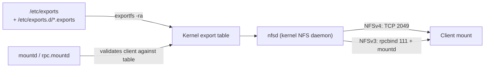
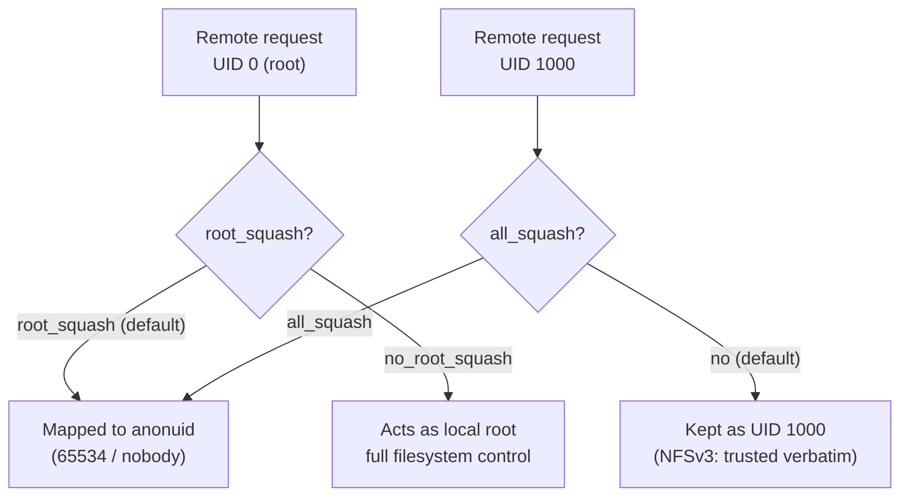

# NFS Exports Configuration

## Overview

The NFS server decides *what* to share, *with whom*, and *under which permissions* through its **export table**. On Linux this table is driven by the `/etc/exports` file (and the drop-in directory `/etc/exports.d/`), parsed by the `exportfs` utility and served by the kernel NFS daemon (`nfsd`). Getting exports right is the single most important step in running a correct and safe NFS deployment: an overly broad export (`rw` to `*` with `no_root_squash`) is a classic root-compromise vector, while an overly strict one breaks legitimate clients.

This note covers the syntax of `/etc/exports`, every commonly used export option, how to apply and reload exports without restarting the server, and how the same concepts map to both Debian/Ubuntu and RHEL-family systems. For installation and first-boot service enablement, see [Network-File-System-(NFS)-Server](Network-File-System-(NFS)-Server.md); for the client side, see [NFS-Client-Setup-and-Mounting](NFS-Client-Setup-and-Mounting.md).

> [!NOTE]
> NFS is stateless at the protocol level for NFSv3 and stateful for NFSv4. Exports are configured the same way for both, but NFSv4 introduces a single **pseudo-filesystem root** (`fsid=0`) that changes how paths appear to clients. Both are covered below.

## Concepts

### The export table

An *export* is a mapping of a local server directory to a set of clients plus a set of permission options. The kernel keeps an in-memory export table; user space (`/etc/exports`) is only the persistent source of truth. The `exportfs` command synchronizes the file into the kernel table.

| Component | Description |
| --- | --- |
| Export point | Absolute path of the directory on the server (e.g. `/srv/nfs/data`) |
| Client spec | Who may mount: single host, wildcard, IP/CIDR, netgroup, or `*` |
| Options | Comma-separated flags in parentheses controlling access and behavior |

### Client specification forms

| Form | Example | Meaning |
| --- | --- | --- |
| Single host | `nfsclient.example.com` | One FQDN or short hostname |
| IP address | `192.168.1.50` | One host by IP |
| IPv4 subnet | `192.168.1.0/24` | CIDR network |
| IPv6 subnet | `2001:db8::/64` | IPv6 CIDR network |
| Wildcard | `*.example.com` | DNS wildcard (matches one label) |
| Netgroup | `@trusted` | NIS/LDAP netgroup |
| Everyone | `*` | Any client (use with extreme caution) |

> [!WARNING]
> There must be **no space** between the client specification and the opening parenthesis of its options. `192.168.1.0/24(rw)` grants read-write to the subnet. `192.168.1.0/24 (rw)` is parsed as *two* clients: the subnet with default options, and **everyone** (`*`) with `rw`. This whitespace bug is one of the most dangerous NFS misconfigurations.

### The pseudo-filesystem (NFSv4)

NFSv4 presents all exports beneath a single virtual root identified by `fsid=0` (or `fsid=root`). Clients mount the pseudo-root and then traverse into exported subtrees. This removes the need for `rpcbind`/`portmapper` and simplifies firewalling to a single TCP port (2049).

## Architecture



## Configuration

### The `/etc/exports` file format

Each non-comment line defines one export point followed by one or more `client(options)` groups:

```conf
# /etc/exports  -  NFS export table
# Syntax:  <export-path>  <client1>(opt,opt)  <client2>(opt,opt)
#
# Share /srv/nfs/data read-write to the LAN, read-only to a DMZ host
/srv/nfs/data   192.168.1.0/24(rw,sync,no_subtree_check)   10.0.0.5(ro,sync,no_subtree_check)

# Read-only export to a single host, all users squashed to nobody
/srv/nfs/public   192.168.1.0/24(ro,sync,all_squash,no_subtree_check)
```

> [!IMPORTANT]
> Comments start with `#`. Lines and options inside this file are byte-sensitive; a stray comma or space changes the meaning of the export.

### Core export options

| Option | Default | Purpose |
| --- | --- | --- |
| `ro` | yes | Read-only access |
| `rw` | no | Read-write access |
| `sync` | yes (modern) | Reply to writes only after data is on stable storage (safe) |
| `async` | no | Reply before flush — faster but risks data loss on crash |
| `secure` | yes | Require requests from a privileged source port (<1024) |
| `insecure` | no | Allow requests from ports ≥1024 (needed by some clients/containers) |
| `subtree_check` | no (deprecated) | Verify a file is within the exported subtree |
| `no_subtree_check` | yes (recommended) | Skip subtree check — better performance & fewer rename bugs |
| `wdelay` | yes | Delay committing writes to batch them (default with `sync`) |
| `no_wdelay` | no | Commit writes immediately (only useful with `sync`) |
| `root_squash` | yes | Map remote UID/GID 0 to `nobody` (`anonuid`/`anongid`) |
| `no_root_squash` | no | Let remote root act as local root — **dangerous** |
| `all_squash` | no | Map *all* remote users to the anonymous user |
| `anonuid=N` | 65534 | UID the anonymous user maps to |
| `anongid=N` | 65534 | GID the anonymous user maps to |
| `fsid=N` | — | Filesystem identifier; `fsid=0` marks the NFSv4 pseudo-root |
| `crossmnt` | no | Allow clients to cross into mounted child filesystems |
| `nohide` | no | Reveal a filesystem mounted beneath an exported directory |

### User-ID squashing model



> [!WARNING]
> Under NFSv3, the server **trusts the UID/GID the client sends**. A user who controls a client machine can `su` to any UID and access files owned by that UID on the export. Use `all_squash` for untrusted networks, restrict exports by IP, and prefer Kerberos (`sec=krb5`) for real authentication — see [NFS-with-Kerberos](NFS-with-Kerberos.md).

### NFSv4 pseudo-root example

```conf
# /etc/exports  -  NFSv4 style with a pseudo-root
/srv/nfs            192.168.1.0/24(rw,sync,fsid=0,crossmnt,no_subtree_check)
/srv/nfs/home       192.168.1.0/24(rw,sync,no_subtree_check)
/srv/nfs/shared     192.168.1.0/24(rw,sync,no_subtree_check)
```

With `fsid=0` on `/srv/nfs`, a client mounts `server:/` and sees `home` and `shared` as subdirectories, rather than mounting each absolute server path.

### Drop-in export files

Instead of editing the monolithic `/etc/exports`, packages and configuration-management tools should place files under `/etc/exports.d/`. Any file matching `*.exports` in that directory is read after the main file:

```conf
# /etc/exports.d/webteam.exports
/srv/nfs/webteam   192.168.10.0/24(rw,sync,root_squash,no_subtree_check)
```

## Commands

### Applying and inspecting exports

```bash
# Re-read /etc/exports and refresh the kernel table (add/remove changes)
sudo exportfs -ra

# Export everything defined in /etc/exports
sudo exportfs -a

# Un-export everything
sudo exportfs -ua

# Show the current, active export table (what the kernel is serving)
sudo exportfs -v
```

```bash
# Export a directory on the fly WITHOUT editing /etc/exports (temporary)
sudo exportfs -o rw,sync,no_subtree_check 192.168.1.0/24:/srv/nfs/tmp

# Remove that temporary export
sudo exportfs -u 192.168.1.0/24:/srv/nfs/tmp
```

### Verifying from server and client

```bash
# List exports the local server is offering (NFSv3 / mountd)
showmount -e localhost

# From a client, list a remote server's exports
showmount -e 192.168.1.10

# Show which clients currently have mounts (NFSv3)
showmount -a 192.168.1.10
```

> [!NOTE]
> `showmount` relies on the MOUNT protocol used by NFSv3. On an NFSv4-only server (no `rpcbind`), `showmount` may return nothing even though exports are active — this is expected, not a failure.

### Debian/Ubuntu vs RHEL-family specifics

```bash
# Debian / Ubuntu: install and reload
sudo apt update && sudo apt install -y nfs-kernel-server
sudo systemctl enable --now nfs-kernel-server
sudo exportfs -ra

# RHEL / CentOS / Rocky / AlmaFedora: install and reload
sudo dnf install -y nfs-utils
sudo systemctl enable --now nfs-server
sudo exportfs -ra
```

## Examples

### Example 1 — Read-write home directories for a trusted subnet

```conf
# /etc/exports
/srv/nfs/home   192.168.20.0/24(rw,sync,root_squash,no_subtree_check)
```

```bash
sudo mkdir -p /srv/nfs/home
sudo exportfs -ra
sudo exportfs -v
```

Plausible output of `exportfs -v` (labelled example, not captured live):

```text
/srv/nfs/home   192.168.20.0/24(rw,wdelay,root_squash,no_subtree_check,sec=sys,rw,secure,root_squash,no_all_squash)
```

### Example 2 — Public read-only share with full squashing

```conf
# /etc/exports
/srv/nfs/iso   192.168.1.0/24(ro,sync,all_squash,anonuid=65534,anongid=65534,no_subtree_check)
```

Every client user — including root — is mapped to `nobody:nogroup`, and no writes are possible.

### Example 3 — Container/host with unprivileged source ports

```conf
# /etc/exports  -  allow clients that cannot bind privileged ports
/srv/nfs/ci   10.10.0.0/16(rw,sync,insecure,root_squash,no_subtree_check)
```

> [!TIP]
> Prefer `secure` (the default). Only add `insecure` when a specific client — such as an unprivileged container or macOS in some modes — genuinely cannot use a source port below 1024.

> [!NOTE]
> **📸 Screenshot**
> _Capture: Terminal showing sudo exportfs -v output listing three export points each with client subnet and resolved options such as rw, sync, root_squash, no_subtree_check_

## Best Practices

- Keep exports **narrow**: prefer specific IPs or tight CIDR ranges over `*`.
- Always include `no_subtree_check` — it is the modern default and avoids rename/permission edge cases.
- Keep `sync` unless you have measured, understood, and accepted the data-loss risk of `async`.
- Never place a space between the client and its `(options)`.
- Organize exports under a dedicated tree such as `/srv/nfs/...` rather than exporting system paths.
- Use `/etc/exports.d/*.exports` drop-ins for anything managed by automation.
- After every change, run `sudo exportfs -ra` and confirm with `sudo exportfs -v`.
- Document each export's purpose with a `#` comment on the line above it.

## Security Considerations

- **`no_root_squash` is a root-escalation primitive.** Any client (or attacker who reaches a client) with write access can create a `setuid-root` binary on the export and execute it. Avoid it except for controlled diskless-boot or backup scenarios on isolated networks.
- **NFSv3 has no real authentication** — access is by IP and the client-supplied UID. Combine IP restriction, `root_squash`/`all_squash`, and firewalling; for genuine identity use Kerberos (`sec=krb5`, `sec=krb5i`, `sec=krb5p`) — see [NFS-with-Kerberos](NFS-with-Kerberos.md).
- Restrict exports to management/storage VLANs; never expose NFS to the internet.
- Align this configuration with the broader hardening steps in [NFS-Security-Hardening](NFS-Security-Hardening.md) (protocol version pinning, firewalling, fixed ports).
- CIS Linux Benchmarks recommend disabling the NFS server entirely on hosts that do not need it, and, where required, ensuring shares are not exported world-writable with `no_root_squash`.

## Troubleshooting

| Symptom | Likely cause | Fix |
| --- | --- | --- |
| `exportfs: <path> does not support NFS export` | Path is not a real directory / filesystem not mountable | Verify the path exists and is on an exportable filesystem |
| Client sees no exports via `showmount` | NFSv4-only server (no MOUNT proto) | Normal; test with an actual `mount -t nfs4` instead |
| `access denied by server while mounting` | Client IP/hostname not in export spec, or DNS/PTR mismatch | Check `/etc/exports`, forward+reverse DNS, run `exportfs -v` |
| Writes fail with permission denied despite `rw` | Squashing maps user to `nobody`; underlying dir perms | Adjust `all_squash`/`anonuid` and on-disk ownership/permissions |
| Changes to `/etc/exports` not taking effect | Kernel table not reloaded | Run `sudo exportfs -ra` |
| Everyone can mount unexpectedly | Space before `(options)` created an implicit `*` export | Remove the whitespace, reload |

```bash
# Watch the server log while a client attempts to mount
sudo journalctl -u nfs-server -f        # RHEL family
sudo journalctl -u nfs-kernel-server -f # Debian/Ubuntu

# Confirm what the kernel is actually exporting
sudo exportfs -v
cat /proc/fs/nfsd/exports
```

## References

- `man 5 exports` — export table format and every option
- `man 8 exportfs` — maintaining the kernel export table
- Linux NFS project documentation — <https://linux-nfs.org/>
- Red Hat Enterprise Linux — *Managing file systems: Exporting NFS shares*
- Ubuntu Server Guide — *Network File System (NFS)*
- CIS Benchmarks (Linux) — NFS/RPC service recommendations

## Related

- [Network-File-System-(NFS)-Server](Network-File-System-(NFS)-Server.md) — installing and starting the NFS server this export table feeds
- [NFS-Client-Setup-and-Mounting](NFS-Client-Setup-and-Mounting.md) — mounting the exports defined here from clients
- [NFS-Mount-Options](NFS-Mount-Options.md) — the client-side options that pair with these server options
- [NFS-Security-Hardening](NFS-Security-Hardening.md) — locking down exports, ports, and protocol versions
- [NFS-with-Kerberos](NFS-with-Kerberos.md) — adding real authentication with `sec=krb5`
- [Linux Administration & Server Hardening](../Readme.md) — Linux administration & server hardening hub
