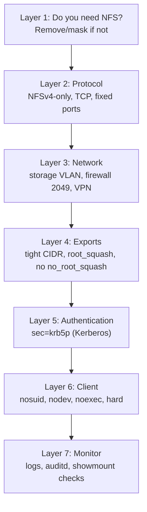

# NFS Security Hardening

## Overview

NFS was designed for trusted LANs, and its defaults reflect that: AUTH_SYS trusts the UID a client sends, NFSv3 sprays RPC services across dynamically assigned ports, and a single careless export option (`no_root_squash`, or a stray space before `(rw)`) can hand an attacker root on the server. This note is a hardening baseline that pulls together the export, mount, protocol, network, and monitoring controls needed to run NFS safely in an enterprise environment, aligned with CIS Benchmarks and NIST guidance.

It is the capstone of the module: it references [NFS-Exports-Configuration](NFS-Exports-Configuration.md) (export options), [NFS-Mount-Options](NFS-Mount-Options.md) (client options), and [NFS-with-Kerberos](NFS-with-Kerberos.md) (authentication), and assumes a working server from [Network-File-System-(NFS)-Server](Network-File-System-(NFS)-Server.md).

> [!IMPORTANT]
> The single most impactful decision is **whether you need NFS at all** on a given host. CIS Benchmarks recommend removing/masking the NFS server on any system that is not deliberately a file server. Hardening a service you do not need is wasted effort — disable it instead.

## Concepts

### The NFS threat model

| Threat | Mechanism | Primary mitigation |
| --- | --- | --- |
| Identity spoofing | AUTH_SYS trusts client-supplied UID/GID | Kerberos (`sec=krb5*`), IP restriction |
| Root escalation | `no_root_squash` lets remote root write setuid binaries | Keep `root_squash`; client `nosuid` |
| Eavesdropping | NFSv3/`sec=sys` sends data in cleartext | `sec=krb5p` or VPN/WireGuard segment |
| Tampering (on-path) | Unauthenticated writes | `sec=krb5i`/`krb5p` |
| Unauthorized mount | Weak/absent client restriction | Tight CIDR exports + firewall |
| Port/RPC exposure | NFSv3 dynamic ports enumerable via `rpcbind` | NFSv4-only + fixed ports + firewall |
| Denial of service | Open portmapper reachable from untrusted nets | Bind to storage VLAN, firewall port 111/2049 |

### Defense-in-depth layers



## Configuration

### Prefer NFSv4-only

NFSv4 uses a single TCP port (2049) and drops the MOUNT/`rpcbind`/`statd`/`lockd` sprawl of NFSv3, dramatically shrinking the attack surface.

```conf
# /etc/nfs.conf  -  disable NFSv3, keep only NFSv4.x
[nfsd]
vers3=n
vers4=y
vers4.0=y
vers4.1=y
vers4.2=y
# Bind nfsd to the storage interface only (example IP)
# host=192.168.50.10
```

```bash
# Apply and confirm which versions the server now offers
sudo systemctl restart nfs-server            # RHEL family
sudo systemctl restart nfs-kernel-server     # Debian/Ubuntu
cat /proc/fs/nfsd/versions
```

### If NFSv3 is unavoidable — pin RPC ports

Dynamic RPC ports are impossible to firewall cleanly. Pin them so a tight allowlist is possible.

```conf
# /etc/nfs.conf  -  fixed ports for the NFSv3 helper services
[mountd]
port=20048

[statd]
port=32765
outgoing-port=32766

[lockd]
port=32803
udp-port=32769
```

On Debian/Ubuntu the equivalent lives in `/etc/default/nfs-kernel-server` and `/etc/default/nfs-common`:

```conf
# /etc/default/nfs-kernel-server
RPCMOUNTDOPTS="--manage-gids --port 20048"

# /etc/default/nfs-common
STATDOPTS="--port 32765 --outgoing-port 32766"
```

### Firewalling

```bash
# firewalld (RHEL family) — allow only the storage subnet, NFSv4 single port
sudo firewall-cmd --permanent --new-zone=nfs-storage
sudo firewall-cmd --permanent --zone=nfs-storage --add-source=192.168.50.0/24
sudo firewall-cmd --permanent --zone=nfs-storage --add-service=nfs
sudo firewall-cmd --reload
```

```bash
# ufw (Debian/Ubuntu) — restrict NFSv4 (2049) to the storage subnet
sudo ufw allow from 192.168.50.0/24 to any port 2049 proto tcp
sudo ufw deny 2049
```

```bash
# nftables — explicit allowlist for NFSv4 from one subnet
sudo nft add table inet nfs
sudo nft add chain inet nfs input '{ type filter hook input priority 0; policy drop; }'
sudo nft add rule inet nfs input ip saddr 192.168.50.0/24 tcp dport 2049 accept
sudo nft add rule inet nfs input ct state established,related accept
```

> [!WARNING]
> Never expose port 111 (`rpcbind`/portmapper) or 2049 to the internet or to a general-purpose user VLAN. An open portmapper is trivially enumerable (`rpcinfo -p <host>`) and has been abused in reflection/amplification DDoS attacks.

### Hardened export baseline

```conf
# /etc/exports  -  hardened defaults
# - tight CIDR, never '*'
# - root_squash kept (never no_root_squash on shared data)
# - Kerberos privacy where available
/srv/nfs/data   192.168.50.0/24(rw,sync,root_squash,no_subtree_check,sec=krb5p)
/srv/nfs/public 192.168.50.0/24(ro,sync,all_squash,no_subtree_check)
```

### Hardened client mount baseline

```conf
# /etc/fstab  -  nosuid + nodev are mandatory; noexec where feasible
192.168.50.10:/srv/nfs/data /mnt/data nfs vers=4.2,sec=krb5p,rw,hard,nosuid,nodev,_netdev 0 0
```

## Commands

```bash
# Audit: what is this host actually exporting?
sudo exportfs -v
cat /proc/fs/nfsd/exports

# Audit: which NFS versions are enabled?
cat /proc/fs/nfsd/versions

# Audit: what RPC services/ports are registered (NFSv3)?
rpcinfo -p localhost

# Enumerate a server the way an attacker would (from another host)
showmount -e 192.168.50.10
rpcinfo -p 192.168.50.10

# Confirm no world-reachable listener beyond intended interfaces
sudo ss -tlnp | grep -E '2049|111|20048'
```

### Disabling NFS on hosts that do not need it

```bash
# RHEL family
sudo systemctl disable --now nfs-server rpcbind rpcbind.socket
sudo systemctl mask rpcbind rpcbind.socket

# Debian/Ubuntu
sudo systemctl disable --now nfs-kernel-server rpcbind rpcbind.socket
sudo systemctl mask rpcbind rpcbind.socket
```

## Examples

### Example — Hardening an existing NFSv3 server to NFSv4-only

```bash
# 1. Disable v3 in nfs.conf (see Configuration), restart
sudo systemctl restart nfs-server
cat /proc/fs/nfsd/versions        # expect -3 +4 +4.1 +4.2

# 2. Confirm rpcbind is no longer needed by v4 and mask it
sudo ss -tlnp | grep 111 || echo "portmapper not listening — good"
sudo systemctl mask rpcbind rpcbind.socket

# 3. Restrict the firewall to the storage subnet (single TCP 2049)
sudo firewall-cmd --permanent --zone=nfs-storage --add-source=192.168.50.0/24
sudo firewall-cmd --permanent --zone=nfs-storage --add-service=nfs
sudo firewall-cmd --reload

# 4. Verify from a client: v4 mount works, showmount reveals nothing
showmount -e 192.168.50.10 || echo "no MOUNT proto exposed — expected on v4-only"
sudo mount -t nfs -o vers=4.2,sec=krb5p 192.168.50.10:/srv/nfs/data /mnt/data
```

> [!NOTE]
> **📸 Screenshot**
> _Capture: Terminal showing cat /proc/fs/nfsd/versions output with -3 +4 +4.1 +4.2, followed by rpcinfo -p failing to reach a masked portmapper, confirming the NFSv4-only hardened state_

### Auditd rules for NFS config integrity

```conf
# /etc/audit/rules.d/nfs.rules  -  alert on changes to NFS config
-w /etc/exports -p wa -k nfs-exports
-w /etc/exports.d/ -p wa -k nfs-exports
-w /etc/nfs.conf -p wa -k nfs-config
-w /etc/krb5.keytab -p wa -k nfs-keytab
```

```bash
sudo augenrules --load
sudo systemctl restart auditd
# Later, review triggered events
sudo ausearch -k nfs-exports
```

## Best Practices

- Remove or mask NFS/`rpcbind` on every host that is not a deliberate file server.
- Run **NFSv4-only** wherever possible; it collapses the attack surface to one TCP port.
- Bind `nfsd` to the storage interface and firewall port 2049 to the storage subnet only.
- Never use `no_root_squash` on shared data; keep `root_squash` (or `all_squash`) everywhere.
- Enforce `nosuid,nodev` (and `noexec` where practical) on all client mounts.
- Authenticate with Kerberos (`sec=krb5p`) on any network that is not fully trusted — see [NFS-with-Kerberos](NFS-with-Kerberos.md).
- Pin RPC ports if NFSv3 must remain, so firewall rules are enforceable.
- Monitor `/etc/exports`, `/etc/exports.d/`, and keytabs with auditd; alert on change.
- Keep `nfs-utils` / `nfs-kernel-server` patched; subscribe to distro security advisories.
- Periodically self-scan with `showmount -e` and `rpcinfo -p` from outside the storage VLAN to confirm nothing leaks.

## Security Considerations

- **AUTH_SYS is not authentication.** Treat any `sec=sys` export on a shared or untrusted network as effectively open to any user who controls a permitted client. Kerberos is the only real fix.
- **`no_root_squash` is a documented privilege-escalation primitive** (write a setuid-root binary from a client, execute it). Client-side `nosuid` is the compensating control if you cannot remove it.
- **Cleartext by default:** `sec=sys`, `sec=krb5`, and `sec=krb5i` do not encrypt file contents. Use `sec=krb5p` or carry NFS over an encrypted transport (WireGuard/IPsec) for confidentiality.
- **Enumeration exposure:** `rpcbind` on port 111 lets attackers map your RPC services and has a history of DDoS-amplification abuse — firewall or eliminate it.
- Map controls to frameworks: CIS Linux Benchmark (NFS/`rpcbind` sections), NIST SP 800-53 (AC-3, SC-7, SC-8, SC-13, AU-2), and NIST SP 800-123 (server hardening).

## Troubleshooting

| Symptom | Likely cause | Fix |
| --- | --- | --- |
| Server still answers NFSv3 after disabling | `vers3=n` not applied / old service running | Set in `/etc/nfs.conf`, restart, check `/proc/fs/nfsd/versions` |
| Firewall rule blocks legitimate NFSv3 clients | Dynamic RPC ports not pinned | Pin `mountd`/`statd`/`lockd` ports, then allowlist them |
| `rpcinfo -p <host>` from outside succeeds | Portmapper exposed beyond storage VLAN | Firewall port 111; mask `rpcbind` if v4-only |
| Kerberos export unreachable but `sec=sys` works | Weaker flavor still offered | Remove the `sec=sys` fallback from the export |
| Audit rules not firing | `auditd` rules not loaded | `augenrules --load`; restart `auditd` |
| Legitimate client denied after hardening | Client IP outside allowed CIDR / DNS PTR mismatch | Adjust export CIDR and verify forward+reverse DNS |

```bash
# Verify the effective hardened posture end to end
cat /proc/fs/nfsd/versions
sudo exportfs -v
sudo ss -tlnp | grep -E '2049|111'
sudo journalctl -u nfs-server -n 50        # or nfs-kernel-server on Debian/Ubuntu
```

## References

- `man 5 exports`, `man 5 nfs`, `man 5 nfs.conf`
- CIS Benchmarks (Linux) — *Network File System (NFS)* and *rpcbind* sections
- NIST SP 800-123 — *Guide to General Server Security*
- NIST SP 800-53 Rev. 5 — AC-3, SC-7, SC-8, SC-13, AU-2
- Red Hat Enterprise Linux — *Securing NFS*
- Ubuntu Server Guide — *NFS security*
- Linux NFS project — <https://linux-nfs.org/>

## Related

- [NFS-Exports-Configuration](NFS-Exports-Configuration.md) — the hardened export options this baseline mandates
- [NFS-Mount-Options](NFS-Mount-Options.md) — client-side `nosuid`/`nodev`/`hard` and version pinning
- [NFS-with-Kerberos](NFS-with-Kerberos.md) — authentication and encryption layer of the baseline
- [Network-File-System-(NFS)-Server](Network-File-System-(NFS)-Server.md) — the base server install being hardened
- [Linux Administration & Server Hardening](../Readme.md) — Linux administration & server hardening hub
