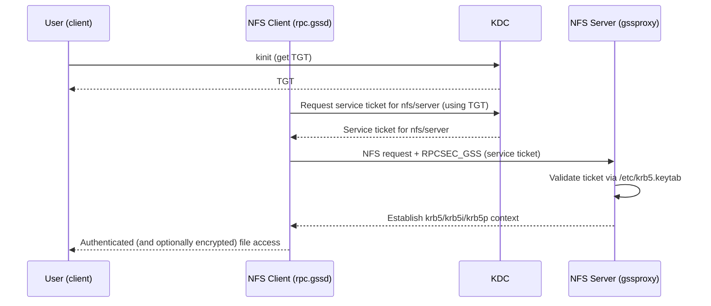

# NFS with Kerberos

## Overview

Plain NFS with `sec=sys` (AUTH_SYS) has no real authentication: the server trusts whatever UID/GID a client sends, so anyone with root on a client — or on the wire — can impersonate any user. **Kerberos-secured NFS** replaces this trust-the-client model with cryptographic authentication (RPCSEC_GSS), and can add integrity protection and full traffic encryption. This is the only way to run NFS safely on a network you do not fully control.

This note covers the three Kerberos security flavors, the KDC/keytab/principal prerequisites, and a working configuration for both an NFS server and client on Debian/Ubuntu and RHEL-family systems. It builds on [NFS-Exports-Configuration](NFS-Exports-Configuration.md) (the export must offer `sec=krb5*`) and [NFS-Mount-Options](NFS-Mount-Options.md) (the client must request it), and is a core control in [NFS-Security-Hardening](NFS-Security-Hardening.md).

> [!IMPORTANT]
> Kerberos authenticates *users and hosts*, not just IP addresses. It requires a working KDC (MIT Kerberos or Active Directory), synchronized clocks (Kerberos rejects tickets when clock skew exceeds ~5 minutes), and functioning forward/reverse DNS. Get those three right before touching NFS.

## Concepts

### RPCSEC_GSS security flavors

| Flavor | Authentication | Integrity (tamper-proof) | Privacy (encrypted) | Relative cost |
| --- | --- | --- | --- | --- |
| `sec=sys` | None (trusts UID) | No | No | Lowest |
| `sec=krb5` | Kerberos | No | No | Low |
| `sec=krb5i` | Kerberos | Yes (checksums) | No | Medium |
| `sec=krb5p` | Kerberos | Yes | Yes (encrypted) | Highest |

> [!TIP]
> Use `sec=krb5p` when file contents must stay confidential on the wire, `sec=krb5i` when you need tamper detection but not confidentiality, and `sec=krb5` only when you need authentication alone. `sec=krb5i` and `sec=krb5p` defeat on-path tampering and eavesdropping that plain NFS cannot.

### Principals and keytabs

Kerberos-secured NFS needs a **service principal** for each host that participates:

| Principal | Belongs to | Stored in |
| --- | --- | --- |
| `nfs/server.example.com@REALM` | NFS server | `/etc/krb5.keytab` on the server |
| `nfs/client.example.com@REALM` | NFS client | `/etc/krb5.keytab` on the client |
| `user@REALM` | Each end user | User's ticket cache (`kinit`) |

The `rpc.gssd` daemon (client) and `rpc.svcgssd`/`gssproxy` (server) use these keytabs to establish GSS contexts. User-level access requires the user to hold a valid TGT (`kinit`).

### Component roles

| Component | Side | Role |
| --- | --- | --- |
| KDC (`krb5-kdc` / AD DC) | Central | Issues tickets, holds the principal database |
| `rpc.gssd` | Client | Establishes GSS security contexts for users |
| `gssproxy` / `rpc.svcgssd` | Server | Handles the server end of GSS |
| `nfsidmap` / `rpc.idmapd` | Both | Maps NFSv4 `user@domain` names to local UIDs |
| `/etc/krb5.keytab` | Both | Host/service key material |

## Architecture



## Configuration

### Prerequisites (both hosts)

```bash
# Debian / Ubuntu
sudo apt update
sudo apt install -y nfs-kernel-server nfs-common krb5-user

# RHEL / CentOS / Rocky / Alma
sudo dnf install -y nfs-utils krb5-workstation sssd
```

Ensure time sync and DNS are correct:

```bash
# Synchronize clocks (Kerberos is intolerant of skew)
sudo timedatectl set-ntp true
timedatectl status

# Verify forward AND reverse DNS resolve consistently
getent hosts server.example.com
dig -x 192.168.1.10 +short
```

### `/etc/krb5.conf` (client and server)

```ini
# /etc/krb5.conf
[libdefaults]
    default_realm = EXAMPLE.COM
    dns_lookup_realm = false
    dns_lookup_kdc = true
    rdns = false
    forwardable = true
    # Tighten to modern ciphers only
    default_tgs_enctypes = aes256-cts-hmac-sha1-96 aes128-cts-hmac-sha1-96
    default_tkt_enctypes = aes256-cts-hmac-sha1-96 aes128-cts-hmac-sha1-96

[realms]
    EXAMPLE.COM = {
        kdc = kdc.example.com
        admin_server = kdc.example.com
    }

[domain_realm]
    .example.com = EXAMPLE.COM
    example.com = EXAMPLE.COM
```

### Creating and installing keytabs

```bash
# On the KDC (MIT Kerberos): create the NFS service principals
sudo kadmin.local -q "addprinc -randkey nfs/server.example.com@EXAMPLE.COM"
sudo kadmin.local -q "addprinc -randkey nfs/client.example.com@EXAMPLE.COM"

# Extract each host's key into ITS keytab (run for the matching host)
sudo kadmin.local -q "ktadd -k /etc/krb5.keytab nfs/server.example.com@EXAMPLE.COM"
sudo kadmin.local -q "ktadd -k /etc/krb5.keytab nfs/client.example.com@EXAMPLE.COM"

# Verify the keytab contents on each host
sudo klist -kte /etc/krb5.keytab
```

> [!WARNING]
> `/etc/krb5.keytab` is host key material equivalent to a password. It must be `root`-owned and mode `0600`. Never copy a keytab over an unencrypted channel or commit it to version control.

### NFSv4 ID mapping (`/etc/idmapd.conf`)

```ini
# /etc/idmapd.conf  -  must match on server and client
[General]
Verbosity = 0
Domain = example.com

[Mapping]
Nobody-User = nobody
Nobody-Group = nogroup
```

### Server export requiring Kerberos

```conf
# /etc/exports  -  require encrypted, authenticated access
/srv/nfs/secure   192.168.1.0/24(rw,sync,sec=krb5p,root_squash,no_subtree_check)
```

You may offer multiple flavors; the client picks one it can satisfy:

```conf
# /etc/exports  -  allow krb5i or krb5p, but NOT plain sys
/srv/nfs/secure   *.example.com(rw,sync,sec=krb5i:krb5p,root_squash,no_subtree_check)
```

### Enabling the GSS services

```bash
# Debian / Ubuntu: enable NFS + GSS client daemon
sudo systemctl enable --now nfs-kernel-server
sudo systemctl enable --now rpc-gssd.service
sudo exportfs -ra

# RHEL family: enable GSS proxy and NFS
sudo systemctl enable --now nfs-server
sudo systemctl enable --now nfs-secure-server  # or gssproxy.service on newer releases
sudo systemctl enable --now rpc-gssd.service
sudo exportfs -ra
```

## Commands

```bash
# A user obtains a ticket-granting ticket before accessing the share
kinit alice
klist                       # verify the TGT and its lifetime

# Mount requesting encrypted Kerberos (privacy) — see NFS-Mount-Options
sudo mount -t nfs -o vers=4.2,sec=krb5p,rw,hard 192.168.1.10:/srv/nfs/secure /mnt/secure

# Confirm the negotiated security flavor
nfsstat -m
mount | grep secure

# Inspect keytab principals and encryption types
sudo klist -kte /etc/krb5.keytab

# Destroy a user's tickets when done
kdestroy
```

## Examples

### Example 1 — End-to-end encrypted mount

```bash
# 1. Server offers krb5p only
echo '/srv/nfs/secure  192.168.1.0/24(rw,sync,sec=krb5p,root_squash,no_subtree_check)' | sudo tee -a /etc/exports
sudo exportfs -ra

# 2. Client user authenticates and mounts
kinit alice
sudo mount -t nfs -o vers=4.2,sec=krb5p 192.168.1.10:/srv/nfs/secure /mnt/secure

# 3. Files created are owned by alice (mapped via idmapd), traffic is encrypted
touch /mnt/secure/hello && ls -l /mnt/secure/hello
```

### Example 2 — Persistent Kerberos mount in `/etc/fstab`

```conf
# /etc/fstab
192.168.1.10:/srv/nfs/secure  /mnt/secure  nfs  vers=4.2,sec=krb5p,rw,hard,_netdev  0  0
```

> [!NOTE]
> For a boot-time or automount Kerberos mount, the *machine* principal in `/etc/krb5.keytab` authenticates the mount itself, but individual *users* still need their own TGT (`kinit`) to read/write files as themselves.

> [!NOTE]
> **📸 Screenshot**
> _Capture: Terminal showing klist output with a valid krbtgt ticket for alice@EXAMPLE.COM followed by nfsstat -m confirming the mount negotiated sec=krb5p_

## Best Practices

- Standardize on `sec=krb5p` for confidentiality; drop to `krb5i` only if encryption overhead is unacceptable and the network is otherwise protected.
- Never mix a Kerberos-required export with a `sec=sys` fallback for the same data — an attacker will simply request the weaker flavor.
- Keep NTP/chrony healthy on every host; monitor for clock drift.
- Restrict `krb5.conf` to modern AES enctypes; disable RC4/DES.
- Rotate keytabs periodically and after any suspected compromise (`ktadd` generates new keys, invalidating old ones).
- Ensure the `Domain` in `/etc/idmapd.conf` is identical on server and client, or files will appear owned by `nobody`.
- Combine Kerberos with the network and service hardening in [NFS-Security-Hardening](NFS-Security-Hardening.md).

## Security Considerations

- `sec=krb5` authenticates but does **not** encrypt or integrity-protect data — an on-path attacker can still tamper with or read file contents. Use `krb5i`/`krb5p` when the network is untrusted.
- Kerberos does not remove the need for `root_squash`, `nosuid`, and `nodev` — defense in depth still applies (see [NFS-Exports-Configuration](NFS-Exports-Configuration.md), [NFS-Mount-Options](NFS-Mount-Options.md)).
- A stolen keytab lets an attacker impersonate the host's NFS service. Protect `/etc/krb5.keytab` (mode `0600`, root-owned) and monitor access.
- Clock skew, DNS PTR mismatches, and enctype mismatches are the top three causes of silent Kerberos NFS failures — validate all three before deploying.
- Aligns with NIST SP 800-53 (IA-2, SC-8, SC-13) for authenticated, encrypted data-in-transit and CIS recommendations to avoid AUTH_SYS on shared storage.

## Troubleshooting

| Symptom | Likely cause | Fix |
| --- | --- | --- |
| `mount.nfs: access denied by server` with krb5 | No user TGT, or server lacks matching principal | Run `kinit`; verify `klist -kte /etc/krb5.keytab` on both hosts |
| `Clock skew too great` | Time out of sync with KDC | Fix NTP/chrony; check `timedatectl` |
| Files owned by `nobody:nogroup` | `idmapd` Domain mismatch or `rpc.idmapd` not running | Match `Domain=` in `/etc/idmapd.conf`; `nfsidmap -c` to clear cache |
| `rpc.gssd` errors in journal | Keytab missing/unreadable or wrong enctype | Recreate keytab; confirm enctypes in `krb5.conf` |
| `KDC has no support for encryption type` | RC4/DES-only principal vs AES-only config | Regenerate principal with AES; align enctypes |
| Mount works as root but not as a user | User has no Kerberos ticket | `kinit <user>` before accessing the share |

```bash
# Watch GSS negotiation live
sudo journalctl -u rpc-gssd -f
sudo journalctl -u gssproxy -f      # RHEL family

# Clear the NFSv4 idmap cache after config changes
sudo nfsidmap -c

# Manually test getting the NFS service ticket
kvno nfs/server.example.com@EXAMPLE.COM
```

## References

- `man 5 nfs` — the `sec=` mount option flavors
- `man 8 rpc.gssd`, `man 8 gssproxy`, `man 5 idmapd.conf`
- MIT Kerberos documentation — <https://web.mit.edu/kerberos/>
- Red Hat Enterprise Linux — *Securing NFS with Kerberos*
- Ubuntu Server Guide — *Kerberos and NFS*
- NIST SP 800-53 — IA-2, SC-8, SC-13 controls

## Related

- [NFS-Exports-Configuration](NFS-Exports-Configuration.md) — adding `sec=krb5*` to the export table
- [NFS-Mount-Options](NFS-Mount-Options.md) — client-side `sec=` flavors and mount syntax
- [NFS-Security-Hardening](NFS-Security-Hardening.md) — where Kerberos fits in the overall hardening baseline
- [Network-File-System-(NFS)-Server](Network-File-System-(NFS)-Server.md) — base server install this builds on
- [Linux Administration & Server Hardening](../Readme.md) — Linux administration & server hardening hub
