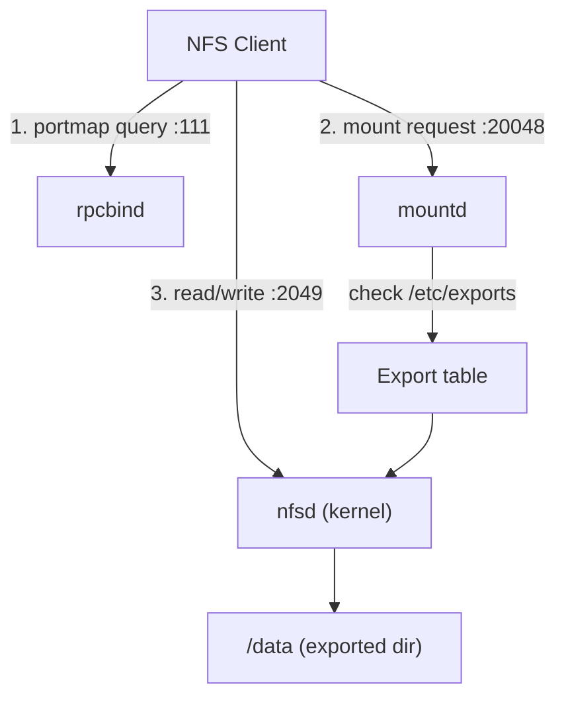

# Network File System (NFS) Server

## Overview

**NFS (Network File System)** lets a Linux server export directories over the network so that clients can mount and use them as if they were local filesystems. This note walks through building an NFS server end-to-end on the **RHEL/CentOS** family: installing the packages, enabling the RPC and NFS daemons, creating and exporting a shared directory, opening the required ports in `firewalld`, mounting from a client, and applying an SELinux context.

For the client-side workflow see [NFS-Client-Setup-and-Mounting](NFS-Client-Setup-and-Mounting.md); for a deeper reference on export syntax and mount tuning see [NFS-Exports-Configuration](NFS-Exports-Configuration.md) and [NFS-Mount-Options](NFS-Mount-Options.md).

> [!NOTE]
> The commands here use `yum`/`rpm` and `firewalld`, so they target RHEL, CentOS, Rocky, AlmaLinux and Fedora. On Debian/Ubuntu the equivalents are `apt install nfs-kernel-server` and `ufw`/`nftables`, but the `/etc/exports` syntax and `exportfs` workflow are identical.

## Concepts

An NFS server exposes local directories (**exports**) that clients mount over the network. Access is authorized by the **export table** (`/etc/exports`), which pairs each exported path with a **client specification** (a host, wildcard, or subnet) and a set of **options** (read-write vs read-only, sync semantics, and identity squashing). NFS itself performs no user authentication in its classic form — it trusts the UID/GID the client presents (AUTH_SYS), which is why network-level restrictions and squashing matter so much.

| Component | Role |
| --- | --- |
| `nfs-utils` | Userspace tools and daemons (`nfsd`, `mountd`, `exportfs`, `showmount`) |
| `rpcbind` | RPC port mapper on port `111` (needed for NFSv3) |
| `/etc/exports` | The export table — what is shared, to whom, with which options |
| Squashing | UID/GID remapping that maps client identities (e.g. root) to an unprivileged account |

## Architecture

An NFS server is not a single daemon but a small stack of cooperating RPC services. `rpcbind` (the port mapper) tells clients where to find `mountd` and `statd`; `mountd` handles the initial mount request and checks it against the export table; `nfsd` serves the actual file operations on port `2049`.



## Install NFS Packages

- Check if NFS-related packages are already installed on the system:

```bash
rpm -qa | grep nfs
```

- Install `nfs-utils` (the core NFS package) and `rpcbind` (used for port mapping):

```bash
yum install nfs-utils rpcbind
```

The remaining `rpm` queries are optional and help you inspect exactly what a package provides.

| Command | Purpose |
| --- | --- |
| `rpm -qi <pkg>` | Package information (version, summary, license) |
| `rpm -ql <pkg>` | List every file the package installs |
| `rpm -qc <pkg>` | List only the configuration files |
| `rpm -qd <pkg>` | List documentation/changelog files |

- Get package details for `nfs-utils`:

```bash
rpm -qi nfs-utils
```

- List all files installed by the `nfs-utils` package:

```bash
rpm -ql nfs-utils
```

- View configuration files from the package:

```bash
rpm -qc nfs-utils
```

- Display documentation/changelog files:

```bash
rpm -qd nfs-utils
```

- Repeat the same for the `rpcbind` package:

```bash
rpm -qi rpcbind
```

```bash
rpm -ql rpcbind
```

## Enable and Start NFS Services

- Enable all the essential NFS-related services so they start automatically on system boot:

```bash
systemctl enable rpcbind
```

```bash
systemctl enable nfs-server
```

```bash
systemctl enable nfs-lock
```

```bash
systemctl enable nfs-idmap
```

- Start the services immediately:

```bash
systemctl start rpcbind
```

```bash
systemctl start nfs-server
```

```bash
systemctl start nfs-lock
```

```bash
systemctl start nfs-idmap
```

> [!NOTE]
> On modern RHEL/CentOS releases `nfs-lock` and `nfs-idmap` may be provided by `rpc-statd` and `nfs-idmapd` and pulled in automatically by `nfs-server`. If a unit name is not found, enabling `nfs-server` alone is sufficient.

## Create a Shared Directory

- Create the directory to be shared over NFS:

```bash
mkdir -p /data
```

- Set the permissions to allow full access (use stricter permissions in production):

```bash
chmod 777 /data
```

> [!WARNING]
> `chmod 777` is used here only to remove permission friction while learning. In production, grant access through ownership and group membership (matching UIDs/GIDs across hosts) rather than world-writable mode bits. See the squashing options below to control how client identities map onto the server.

## Export Shared Directory

- Edit the NFS exports file to define what directories to share and how:

```bash
vim /etc/exports
```

```bash
# Export /data/ to subnet 192.168.1.0/24 with read-write and synchronous writes
/data/ 192.168.1.0/24(rw,sync)

# Export /data/ to all hosts (*) with read-write and synchronous writes
# /data/ *(rw,sync)

# Export /data/ to subnet 192.168.1.0/24 with read-only and synchronous writes
# /data/ 192.168.1.0/24(ro,sync)

# Export /data/ to subnet 192.168.1.0/24 read-write, sync, with no all user squashing (client user IDs are preserved instead of mapped to anonymous)
# /data/ 192.168.1.0/24(rw,sync,no_all_squash)

# Export /data/ to subnet 192.168.1.0/24 read-write, sync
# Root on client has root privileges on server (no_root_squash)
# and no user squashing for all users (no_all_squash)
# /data/ 192.168.1.0/24(rw,sync,no_root_squash,no_all_squash)
```

The individual export lines from the block above, shown one at a time:

> Export /data/ to subnet 192.168.1.0/24 with read-write and synchronous writes:

```bash
/data/ 192.168.1.0/24(rw,sync)
```

> Export /data/ to all hosts (*) with read-write and synchronous writes:

```bash
/data/ *(rw,sync)
```

> Export /data/ to subnet 192.168.1.0/24 with read-only and synchronous writes

```bash
/data/ 192.168.1.0/24(ro,sync)
```

> Export /data/ to subnet 192.168.1.0/24 read-write, sync, with no all user squashing (client user IDs are preserved instead of mapped to anonymous)

```bash
/data/ 192.168.1.0/24(rw,sync,no_all_squash)
```

> Root on client has root privileges on server (no_root_squash) and no user squashing for all users (no_all_squash)

```bash
/data/ 192.168.1.0/24(rw,sync,no_root_squash,no_all_squash)
```

- Apply the export rules:

```bash
exportfs -rav
```

- Verify active exports and their settings (Optional):

```bash
exportfs -v
```

- Restart the NFS service to apply changes:

```bash
systemctl restart nfs-server
```

```bash
vim /etc/exports
```

```bash
/data/ *(rw,sync)
```

### Export line anatomy

Breaking down `/data/ *(rw,sync)`:

| Field | Meaning |
| --- | --- |
| `/data/` | The **local directory on the NFS server** that you are exporting (sharing over the network). |
| `*` | A **wildcard** allowing **any client (any IP address)** to access the export. **Not recommended for production** — it is wide open and insecure. Restrict access to trusted IPs or subnets (e.g. `192.168.1.0/24`). |
| `rw` | Grants clients **read and write** access to the shared directory. |
| `sync` | Ensures all changes are written to disk **before** a response is sent to the client. Safer for data integrity than `async`, but potentially a little slower. |

## Open NFS Ports in firewalld

### Common NFS Service Ports

| Port | Service | Protocol | Purpose |
| --- | --- | --- | --- |
| `111` | Portmapper / `rpcbind` | TCP/UDP | Maps RPC program numbers to network ports; required by all RPC-based services including NFS, `mountd`, and `statd`. |
| `2049` | NFS Server (`nfsd`) | TCP/UDP | The main, well-known port used by NFS servers to handle file-sharing requests. |
| `20048` | `mountd` | TCP/UDP | Handles initial mount requests and negotiates which directories may be mounted. Port can vary unless fixed in configuration. |

- Enable the firewall service so rules persist after reboot:

```bash
systemctl enable firewalld
```

- Start the firewall service:

```bash
systemctl start firewalld
```

- Allow NFS through the firewall permanently:

```bash
firewall-cmd --permanent --add-service=nfs
```

- Allow the mount daemon through the firewall:

```bash
firewall-cmd --permanent --add-service=mountd
```

- Allow `rpcbind` service:

```bash
firewall-cmd --permanent --add-service=rpc-bind
```

- Reload the firewall to apply the new rules:

```bash
firewall-cmd --reload
```

- View the list of active firewall services and zones (Optional) :

```bash
firewall-cmd --list-all
```

### Optional: Fixing Ports for Firewalld

- Manually open individual ports:

```bash
firewall-cmd --permanent --add-port=111/tcp
firewall-cmd --permanent --add-port=111/udp
firewall-cmd --permanent --add-port=2049/tcp
firewall-cmd --permanent --add-port=2049/udp
firewall-cmd --permanent --add-port=20048/tcp
firewall-cmd --permanent --add-port=20048/udp
firewall-cmd --reload
firewall-cmd --list-all
```

## NFS Client (Mount)

- List exports on the server:

```bash
showmount -e localhost
```

- Check visibility of exports from the client:

```bash
showmount -e 192.168.1.33
```

- Mount the shared NFS directory from a client machine:

```bash
mount -t nfs 192.168.1.33:/data /mnt
```

> Replace `192.168.1.33` with your actual NFS server IP address. Ensure `/mnt` exists on the client.

```bash
df -h
```

- Make the mount persistent by adding it to `/etc/fstab`:

```bash
192.168.1.33:/data  /mnt  nfs  defaults  0  0
```

> [!NOTE]
> **📸 Screenshot**
> _Capture: Terminal showing showmount -e listing the /data export followed by a successful mount and df -h confirming the NFS filesystem mounted at /mnt_

## Export Options Reference

| Option | Effect |
| --- | --- |
| `rw` | Enables read-write access to the share. |
| `ro` | Restricts access to read-only. |
| `sync` | Forces changes to be committed to disk before replying to the client. |
| `no_root_squash` | Allows the root user from the client to act as root on the server. |
| `no_all_squash` | Maintains UID and GID from the client instead of mapping them. |

> [!WARNING]
> `no_root_squash` is dangerous: it lets a client's root write files as server root and is a classic privilege-escalation and root-compromise vector. Leave root squashing (`root_squash`, the default) enabled unless you have a specific, well-understood reason not to.

## Optional: SELinux Context

- Temporarily apply an SELinux label allowing NFS sharing:

```bash
chcon -Rt nfs_t /data
```

- To make the context permanent:

```bash
semanage fcontext -a -t nfs_t "/data(/.*)?"
restorecon -Rv /data
```

> [!TIP]
> The boolean `nfs_export_all_rw` (and `nfs_export_all_ro`) can also gate NFS sharing under SELinux. Check with `getsebool -a | grep nfs` if exports work with SELinux permissive but fail when enforcing.

## Best Practices

- Scope every export to a **specific host or subnet** (`192.168.1.0/24`), never `*`. A wildcard export is reachable by anything that can route to the server.
- Prefer **NFSv4** where possible: a single well-known port (`2049`), no `rpcbind` dependency, and a smaller firewall surface.
- Keep `sync` for data-integrity-sensitive shares; only use `async` when you understand the loss-on-crash tradeoff.
- Grant access through **matching UIDs/GIDs and group ownership** rather than world-writable `chmod 777` directories.
- Pin `mountd` and `statd` to fixed ports (via `/etc/nfs.conf` or `/etc/sysconfig/nfs`) so the firewall rules stay stable across reboots.
- Run `exportfs -v` after every change to confirm the effective export set matches intent.

## Security Considerations

> [!IMPORTANT]
> Classic NFS (AUTH_SYS) provides **no cryptographic authentication and no encryption**. It trusts the UID/GID the client asserts and sends data in clear text. Treat it as safe only on a trusted, segmented network.

- **Keep root squashing on.** `no_root_squash` lets a client root write files as server root — a direct privilege-escalation and root-compromise path. See NFS-Enumeration for how attackers abuse this.
- **Restrict at the network layer.** Limit exports to trusted subnets and firewall `111`, `2049`, and `20048` so only intended clients can reach the RPC stack.
- **Do not export sensitive filesystem roots** (`/`, `/etc`, `/home`) with `rw`. Export a dedicated data directory only.
- **Use Kerberos for real security.** `sec=krb5p` gives per-user authentication and on-the-wire encryption — see [NFS-with-Kerberos](NFS-with-Kerberos.md).
- **Harden the whole deployment** against the common NFS abuse paths — see [NFS-Security-Hardening](NFS-Security-Hardening.md).

## Troubleshooting

- Check the status of the NFS server:

```bash
systemctl status nfs-server
```

- View system log entries for errors:

```bash
journalctl -xe
```

- List exports on the server:

```bash
showmount -e localhost
```

- Check visibility of exports from the client:

```bash
showmount -e 192.168.1.33
```

| Symptom | Likely cause | First check |
| --- | --- | --- |
| `clnt_create: RPC: Program not registered` | `rpcbind`/`nfs-server` not running | `systemctl status nfs-server rpcbind` |
| Client mount hangs | Firewall blocking `111`/`2049`/`20048` | `firewall-cmd --list-all` |
| `access denied by server` | Client IP not matched by any export line | Review `/etc/exports`, run `exportfs -v` |
| `Permission denied` writing files | Squashing or SELinux label | `getsebool -a | grep nfs`, check mode/ownership |

## References

- `man 5 exports` — the `/etc/exports` export table format and every option.
- `man 8 exportfs` — maintaining the table of exported filesystems.
- Red Hat Enterprise Linux, *Configuring and Managing Networking* — Deploying an NFS server.
- CIS Benchmarks — NFS service hardening (squashing, network restriction, protocol version).

## Related

- [NFS-Client-Setup-and-Mounting](NFS-Client-Setup-and-Mounting.md) — mounting this server's exports from a client
- [NFS-Exports-Configuration](NFS-Exports-Configuration.md) — full reference for `/etc/exports` syntax and options
- [NFS-Mount-Options](NFS-Mount-Options.md) — client-side mount option reference
- [NFS-Security-Hardening](NFS-Security-Hardening.md) — hardening the NFS server and clients
- [NFS-with-Kerberos](NFS-with-Kerberos.md) — authenticated, encrypted NFSv4 exports
- NFS-Enumeration — attacker-side NFS reconnaissance
- [Samba-SMB-CIFS-Server](../Samba-SMB-CIFS-Server/Samba-SMB-CIFS-Server.md) — alternative file-sharing service
- [Linux Administration & Server Hardening](../Readme.md) — Linux administration & server hardening hub
