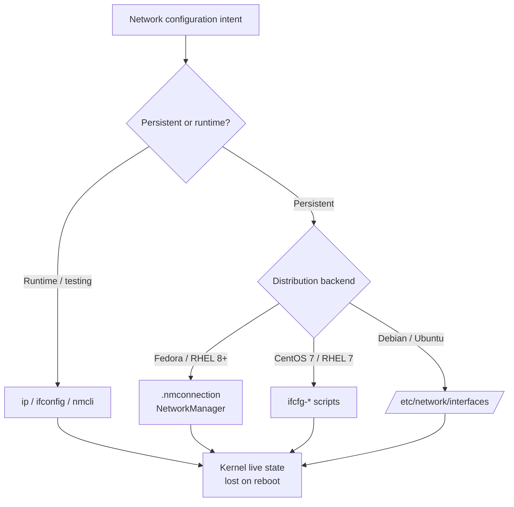

# Linux Network Configuration

Basic network configuration involves managing IP addresses, DNS, routing rules, and interface settings using both interactive commands and persistent configuration files.

## Overview

Every Linux server needs a correct, predictable network identity: an IP address, a subnet mask, a default gateway, and one or more DNS resolvers. On modern distributions this can be driven three different ways depending on the platform:

- **Runtime commands** (`ip`, `nmcli`, `ifconfig`) — change the live kernel state immediately but do **not** survive a reboot.
- **NetworkManager profiles** (`.nmconnection` files) — the default persistent backend on Fedora, RHEL/CentOS 8+, and many desktops.
- **Distribution config files** (`ifcfg-*` on legacy RHEL, `/etc/network/interfaces` on Debian/Ubuntu) — the traditional persistent backends.

This note covers the commands used to inspect the network, the file formats used to make configuration persistent, how to assign multiple IPs to one interface, and how to set DNS and routing.

## Concepts

| Backend | Config location | Applies with | Typical platform |
|---------|-----------------|--------------|------------------|
| Runtime `ip` command | Kernel (volatile) | immediate, lost on reboot | any Linux |
| NetworkManager | `/etc/NetworkManager/system-connections/*.nmconnection` | `nmcli` / `nmtui` | Fedora, RHEL/CentOS 8+ |
| Legacy ifcfg scripts | `/etc/sysconfig/network-scripts/ifcfg-*` | `systemctl restart network` | CentOS 7 / RHEL 7 |
| Debian interfaces | `/etc/network/interfaces` | `systemctl restart networking` | Debian / Ubuntu |

> [!IMPORTANT]
> Runtime changes made with `ip addr add` or `ifconfig` are **not persistent**. To keep a configuration across reboots you must edit the appropriate backend file (NetworkManager, ifcfg, or `interfaces`) and reload it.



## Commands

- Open a text-based interface for managing network settings:

```bash
nmtui
```

> [!NOTE]
> **📸 Screenshot**
> _Capture: nmtui text-user-interface showing the Edit a connection / Activate a connection / Set system hostname menu_

- Display or set the system hostname:

```bash
hostname
```

- Show IP address(es) linked to the hostname:

```bash
hostname -i
```

```bash
hostname -I
```

- Display all network interfaces and assigned IPs:

```bash
ip addr show
```

- or shorter

```bash
ip ad
```

- Legacy tool for network interface details (deprecated):

```bash
ifconfig
```

```bash
ifconfig -a
```

- Show DNS resolver configuration:

```bash
cat /etc/resolv.conf
```

- List current routing table and gateways:

```bash
route -n
```

```bash
ip route
```

- Retrieve the system’s public IPv4 address:

```bash
curl -4 ifconfig.me
```

```bash
curl -4 icanhazip.com
```

## Static IP Configuration

### 1. Using NetworkManager (`.nmconnection` files)

```bash
vim /etc/NetworkManager/system-connections/enp0s3.nmconnection
```

```ini
[connection]
id=enp0s3
uuid=858afbb5-a64a-3fd0-bc9b-3f9a533b6e07
type=ethernet
autoconnect-priority=-999
interface-name=enp0s3
timestamp=1758026556

[ethernet]

[ipv4]
address1=192.168.1.33/24
dns=8.8.8.8;8.8.4.4;
gateway=192.168.1.1
ignore-auto-dns=true
method=manual

[ipv6]
addr-gen-mode=eui64
method=disabled

[proxy]
```

```bash
vim /etc/NetworkManager/system-connections/enp0s3.nmconnection
```

```ini
[connection]
id=enp0s3
uuid=858afbb5-a64a-3fd0-bc9b-3f9a533b6e07
type=ethernet
autoconnect-priority=-999
interface-name=enp0s3
timestamp=1758027545

[ethernet]

[ipv4]
addresses=192.168.1.32/24;192.168.1.1;
dns=8.8.8.8;8.8.4.4;
ignore-auto-dns=true
method=manual

[ipv6]
addr-gen-mode=eui64
method=disabled

[proxy]

```

- Dynamic IP (DHCP) Configuration

```bash
vim /etc/NetworkManager/system-connections/enp0s3.nmconnection
```

```ini
[connection]
id=enp0s3
uuid=858afbb5-a64a-3fd0-bc9b-3f9a533b6e07
type=ethernet
autoconnect-priority=-999
interface-name=enp0s3
timestamp=1758027545

[ethernet]

[ipv4]
ignore-auto-dns=true
method=auto

[ipv6]
addr-gen-mode=eui64
method=disabled

[proxy]
```

### 2. Using ifcfg Files (CentOS 7 / RHEL 7)

```bash
vim /etc/sysconfig/network-scripts/ifcfg-enp0s3
```

```ini
TYPE=Ethernet  
BOOTPROTO=none  
DEFROUTE=yes  
IPV4_FAILURE_FATAL=no  
IPV6INIT=no  
IPV6_AUTOCONF=yes  
IPV6_DEFROUTE=yes  
IPV6_PEERDNS=yes  
IPV6_PEERROUTES=yes  
IPV6_FAILURE_FATAL=no  
IPV6_ADDR_GEN_MODE=stable-privacy  
NAME=enp0s3  
UUID=92a9be99-ddba-4e75-a601-a385f8dcb88f  
DEVICE=enp0s3  
ONBOOT=yes  
IPADDR=192.168.1.36  
PREFIX=24  
GATEWAY=192.168.1.1  
DNS1=8.8.8.8  
PROXY_METHOD=none  
BROWSER_ONLY=no
```

- Dynamic IP (DHCP) Configuration

```bash
vim /etc/sysconfig/network-scripts/ifcfg-enp0s3
```

```ini
TYPE=Ethernet  
BOOTPROTO=dhcp  
DEFROUTE=yes  
IPV4_FAILURE_FATAL=no  
IPV6INIT=no  
IPV6_AUTOCONF=yes  
IPV6_DEFROUTE=yes  
IPV6_PEERDNS=yes  
IPV6_PEERROUTES=yes  
IPV6_FAILURE_FATAL=no  
IPV6_ADDR_GEN_MODE=stable-privacy  
NAME=enp0s3  
UUID=92a9be99-ddba-4e75-a601-a385f8dcb88f  
DEVICE=enp0s3  
ONBOOT=yes  
PROXY_METHOD=none  
BROWSER_ONLY=no
```

### 3. Using `/etc/network/interfaces` (Debian/Ubuntu)

```bash
vim /etc/network/interfaces
```

```conf
# This file describes the network interfaces available on your system
# and how to activate them. For more information, see interfaces(5).

source /etc/network/interfaces.d/*

# The loopback network interface
auto lo
iface lo inet loopback

# The primary network interface
allow-hotplug enp0s3
#iface enp0s3 inet dhcp

iface enp0s3 inet static
    address 192.168.1.35
    netmask 255.255.255.0
    network 192.168.1.0
    broadcast 192.168.1.255
    gateway 192.168.1.1
    dns-nameservers 8.8.8.8
iface enp0s3 inet6 auto

# This is an autoconfigured IPv6 interface
#iface enp0s3 inet6 auto
```

- Dynamic IP (DHCP) Configuration

```bash
vim /etc/network/interfaces
```

```conf
# This file describes the network interfaces available on your system
# and how to activate them. For more information, see interfaces(5).

source /etc/network/interfaces.d/*

# The loopback network interface
auto lo
iface lo inet loopback

# The primary network interface
allow-hotplug enp0s3
iface enp0s3 inet dhcp
iface enp0s3 inet6 auto

# This is an autoconfigured IPv6 interface
#iface enp0s3 inet6 auto
```

## Assigning Multiple IP Addresses

- NetworkManager (.nmconnection file)  :  Add multiple addresses under `[ipv4]`:

```bash
vim /etc/NetworkManager/system-connections/enp0s3.nmconnection
```

```ini
[connection]
id=enp0s3
uuid=858afbb5-a64a-3fd0-bc9b-3f9a533b6e07
type=ethernet
autoconnect-priority=-999
interface-name=enp0s3
timestamp=1758027545

[ethernet]

[ipv4]
address1=192.168.1.32/24
address2=192.168.1.33/24
address3=192.168.1.34/24
dns=8.8.8.8;8.8.4.4;
gateway=192.168.1.1
ignore-auto-dns=true
method=manual

[ipv6]
addr-gen-mode=eui64
method=disabled

[proxy]
```

- CentOS 7 / RHEL 7 (ifcfg method)

```bash
cp -v /etc/sysconfig/network-scripts/ifcfg-enp0s3 /etc/sysconfig/network-scripts/ifcfg-enp0s3:1
```

  Create alias files like `/etc/sysconfig/network-scripts/ifcfg-enp0s3:1`:

```bash
vim /etc/sysconfig/network-scripts/ifcfg-enp0s3:1
```

```ini
TYPE=Ethernet  
BOOTPROTO=static  
DEFROUTE=yes  
IPV4_FAILURE_FATAL=no  
IPV6INIT=no  
IPV6_AUTOCONF=yes  
IPV6_DEFROUTE=yes  
IPV6_PEERDNS=yes  
IPV6_PEERROUTES=yes  
IPV6_FAILURE_FATAL=no  
IPV6_ADDR_GEN_MODE=stable-privacy  
NAME=enp0s3  
UUID=92a9be99-ddba-4e75-a601-a385f8dcb88f  
DEVICE=enp0s3:1  
ONBOOT=yes  
IPADDR=192.168.1.38  
PREFIX=24  
GATEWAY=192.168.1.1  
DNS1=8.8.8.8  
PROXY_METHOD=none  
BROWSER_ONLY=no
```

And `/etc/sysconfig/network-scripts/ifcfg-enp0s3:2`:

```bash
vim /etc/sysconfig/network-scripts/ifcfg-enp0s3:2
```

```ini
TYPE=Ethernet  
BOOTPROTO=static  
DEFROUTE=yes  
IPV4_FAILURE_FATAL=no  
IPV6INIT=no  
IPV6_AUTOCONF=yes  
IPV6_DEFROUTE=yes  
IPV6_PEERDNS=yes  
IPV6_PEERROUTES=yes  
IPV6_FAILURE_FATAL=no  
IPV6_ADDR_GEN_MODE=stable-privacy  
NAME=enp0s3  
UUID=92a9be99-ddba-4e75-a601-a385f8dcb88f  
DEVICE=enp0s3:2  
ONBOOT=yes  
IPADDR=192.168.1.39  
PREFIX=24  
GATEWAY=192.168.1.1  
DNS1=8.8.8.8  
PROXY_METHOD=none  
BROWSER_ONLY=no
```

- Debian/Ubuntu (/etc/network/interfaces)  :   Add multiple addresses under the same interface:

```bash
vim /etc/network/interfaces
```

```conf
# This file describes the network interfaces available on your system
# and how to activate them. For more information, see interfaces(5).

source /etc/network/interfaces.d/*

# The loopback network interface
auto lo
iface lo inet loopback

# The primary network interface
allow-hotplug enp0s3
#iface enp0s3 inet dhcp
iface enp0s3 inet static
    address 192.168.1.35
    netmask 255.255.255.0
    network 192.168.1.0
    broadcast 192.168.1.255
    gateway 192.168.1.1
    dns-nameservers 8.8.8.8
    up ip addr add 192.168.1.36/24 dev enp0s3
    up ip addr add 192.168.1.37/24 dev enp0s3

iface enp0s3 inet6 auto

# This is an autoconfigured IPv6 interface
#iface enp0s3 inet6 auto
```

## DNS and Routing Configuration

### DNS Configuration

#### 1. NetworkManager (Generic / Fedora / RHEL / CentOS / Ubuntu with NM)

Set DNS in the NetworkManager connection profile:

```ini
[connection]
id=enp0s3
uuid=1234-5678
type=ethernet

[ipv4]
method=manual
addresses=192.168.1.100/24
gateway=192.168.1.1
dns=8.8.8.8;8.8.4.4;
```

Apply changes:

```bash
nmcli connection reload
```

```bash
nmcli connection up enp0s3
```

#### 2. CentOS / RHEL (ifcfg files)

In `/etc/sysconfig/network-scripts/ifcfg-enp0s3`:

```ini
BOOTPROTO=static
IPADDR=192.168.1.100
PREFIX=24
GATEWAY=192.168.1.1
DNS1=8.8.8.8
DNS2=8.8.4.4
```

Restart network:

```bash
systemctl restart network
```

#### 3. Debian / Ubuntu (interfaces file)

In `/etc/network/interfaces`:

```conf
auto eth0
iface eth0 inet static
    address 192.168.1.100/24
    gateway 192.168.1.1
    dns-nameservers 8.8.8.8 8.8.4.4
```

Then restart networking:

```bash
systemctl restart networking
```


##### To configure a static IP for `enp0s3` interface:

**Replace your current config with this:**

```conf
# This file describes the network interfaces available on your system
# and how to activate them. For more information, see interfaces(5).

source /etc/network/interfaces.d/*

# The loopback network interface
auto lo
iface lo inet loopback

# The primary network interface
auto enp0s3
iface enp0s3 inet static
    address 192.168.1.100
    netmask 255.255.255.0
    gateway 192.168.1.1
    dns-nameservers 8.8.8.8 8.8.4.4
# This is an autoconfigured IPv6 interface
iface enp0s3 inet6 auto
```

**Key changes made:**

- `allow-hotplug` → `auto` (brings interface up at boot reliably)
- `inet dhcp` → `inet static`
- Added `address`, `netmask`, `gateway`, and `dns-nameservers`

**Apply the changes:**

```bash
systemctl restart networking
# or, more safely without losing SSH:
ifdown enp0s3 && ifup enp0s3
```

## Best Practices

- Prefer the **native persistent backend** for the distribution (NetworkManager on RHEL/Fedora, `interfaces` on Debian/Ubuntu) so configuration survives reboots and is captured by configuration management.
- Keep DNS, gateway, and address settings under **version control / configuration management** (Ansible, Kickstart, cloud-init) on production servers rather than editing them by hand.
- Use `nmcli con up <name>` (or restart the relevant service) to validate a change **before** logging out — a bad config can lock you out of a remote host.
- Document static-IP allocations in an IPAM system to avoid address collisions on the `192.168.1.0/24` segment.

> [!TIP]
> When editing a live remote server over SSH, apply networking changes inside a `tmux`/`screen` session and schedule an automatic rollback (for example a delayed `nmcli con up` of the last-known-good profile) so a mistake does not leave the box unreachable.

## Security Considerations

- After manually editing a NetworkManager `.nmconnection` file, ensure it is owned by `root` and mode `600` — NetworkManager refuses profiles that are world-readable because they can contain secrets (per CIS hardening guidance for connection profiles).
- Disable IPv6 (`method=disabled`) only when it is genuinely unused; leaving an unmanaged, auto-configured IPv6 stack is a common blind spot for firewalls and monitoring.
- Restrict `8.8.8.8`/`8.8.4.4` public resolvers to environments where an internal resolver is unavailable; internal DNS gives you logging, filtering, and split-horizon control.
- Bind services only to the specific address they require rather than every alias when an interface carries multiple IPs.

## Troubleshooting

| Symptom | Likely cause | Check |
|---------|--------------|-------|
| Change lost after reboot | Only runtime (`ip`/`ifconfig`) applied | Edit the persistent backend file |
| No internet, LAN works | Missing/incorrect default gateway | `ip route` |
| Name resolution fails | Bad `/etc/resolv.conf` or DNS entry | `cat /etc/resolv.conf` |
| Interface down after edit | Syntax error in config file | `systemctl status NetworkManager` / `journalctl` |

## References

- Red Hat Enterprise Linux — *Configuring and Managing Networking*
- Debian Reference — *Network configuration* (`interfaces(5)`)
- `man ip`, `man nmcli`, `man interfaces`, `man resolv.conf`

## Related
- [ifconfig-and-ip](ifconfig-and-ip.md) — configure interfaces and addresses
- [Network-Diagnostics-Commands](Network-Diagnostics-Commands.md) — test and troubleshoot connectivity
- [Network-Monitoring-netstat-and-ss-Commands](Network-Monitoring-netstat-and-ss-Commands.md) — inspect sockets and connections
- Network-Reconnaissance-Scanning — offensive networking hub
- [Linux Administration & Server Hardening](../Readme.md) — course hub.
