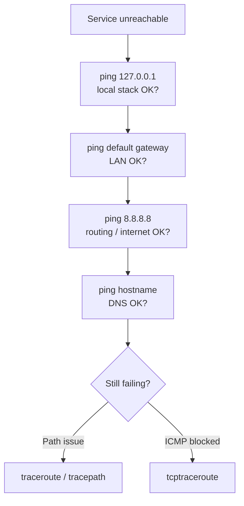

# Network Diagnostics Commands

Connectivity and path-analysis tools — `ping`, `traceroute`, `tracepath`, and their TCP variants — used to confirm reachability, measure latency, and locate where traffic is lost or blocked along a route.

## Overview

When a service is unreachable, the first job is to localise the fault: is the host down, is the path broken, is a firewall silently dropping packets, or is only name resolution failing? A small set of diagnostic tools answers these questions layer by layer:

- **`ping`** verifies end-to-end reachability and round-trip latency using ICMP Echo.
- **`traceroute` / `tracepath`** reveal the sequence of Layer-3 hops between you and the destination, exposing where latency spikes or loss begins.
- **TCP variants** (`tcptraceroute`) probe with real TCP segments, which pass through firewalls that drop ICMP and UDP.

Work outward: ping the loopback, then the default gateway, then an external IP (`8.8.8.8`), then an external hostname. The first step that fails tells you which layer to investigate.

## Concepts

| Tool | Protocol used | Root required | Best for |
|------|---------------|---------------|----------|
| `ping` | ICMP Echo Request/Reply | No | Reachability, latency, packet loss |
| `traceroute` | UDP (default), ICMP, or TCP | Yes (raw sockets) | Full hop-by-hop path, per-hop RTT |
| `tracepath` | UDP | No | Path + automatic PMTU discovery, unprivileged |
| `tcptraceroute` | TCP SYN | Yes | Tracing through ICMP/UDP-filtering firewalls |

> [!NOTE]
> A failed `ping` does **not** prove a host is down. Many hardened hosts and firewalls drop ICMP by policy while still serving TCP applications. Confirm with a TCP-based probe before concluding the target is offline.



## ping Command

`ping` sends **ICMP Echo Request** packets and reports the replies, their round-trip time, and any loss.

- Continuous ping (stop with `Ctrl+C`):

```bash
ping 8.8.8.8
```

- Send **2 packets** and exit:

```bash
ping 8.8.8.8 -c 2
```

- Send a **large packet** (65,500 bytes; default payload = 56 bytes):

```bash
ping 192.168.1.1 -s 65500
```

- Ping from a **specific interface**:

```bash
ping -I enp0s3 192.168.1.1 -s 65500 -c 4
```

- Add a **custom payload (hexadecimal 42)**:

```bash
ping 192.168.1.1 -c 2 -s 65500 -I enp0s3 -p 42
```

- Set **intervals** (2 packets, every 10s):

```bash
ping 192.168.1.1 -i 10 -c 2
```

```bash
ping 192.168.1.1 -i 10 -c 2 -p 42
```

- Resolve and ping a **hostname**:

```bash
ping armourinfosec.com
```

- **IPv6 ping**:

```bash
ping -6 armourinfosec.com
```

```bash
ping -6 2404:6800:4009:80e::200e -i 10 -c 2 -p 42
```

- Send **flood pings** (as fast as possible, max packet size):

```bash
ping 192.168.1.1 -f -s 65500
```

### Common ping options

| Option | Meaning |
|--------|---------|
| `-c <n>` | Stop after sending `n` packets |
| `-s <bytes>` | Payload size in bytes (default 56) |
| `-I <iface>` | Send from a specific interface or source address |
| `-i <sec>` | Interval between packets |
| `-p <hex>` | Pad the payload with a hex byte pattern |
| `-6` | Force IPv6 |
| `-f` | Flood mode (root only) |

> [!WARNING]
> `-f` (flood) and large `-s` values generate very high traffic and can be treated as a denial-of-service condition. Use them only against hosts you own or are explicitly authorised to test.

## traceroute Command

`traceroute` maps the Layer-3 path to a destination by sending packets with incrementing TTL values and recording the router that returns each "time exceeded" message.

- Installation on RHEL / CentOS:

```bash
yum install traceroute
```

- Installation on Debian / Ubuntu:

```bash
apt install traceroute
```

- Trace route to Google DNS:

```bash
traceroute 8.8.8.8
```

- Trace route to a hostname:

```bash
traceroute armourinfosec.io
```

### TCP Traceroute

Useful when **ICMP is blocked** by an intermediate firewall (requires the `tcptraceroute` package). Because it probes with TCP SYN segments to a real port, it follows the same path a genuine connection would take.

```bash
tcptraceroute 8.8.8.8
```

## tracepath Command

`tracepath` is similar to `traceroute` but does **not require root privileges** and additionally discovers the path MTU, making it useful for diagnosing MTU/fragmentation problems.

- Installation on RHEL / CentOS:

```bash
yum install iputils iputils-tracepath  
```

- Installation on Debian / Ubuntu:

```bash
apt install iputils-tracepath
```

- Trace path to Google DNS:

```bash
tracepath 8.8.8.8
```

## Examples

- Confirm the local stack, then the gateway, then the internet in sequence:

```bash
ping -c 2 127.0.0.1
ping -c 2 192.168.1.1
ping -c 2 8.8.8.8
```

- Distinguish a DNS failure from a routing failure — if the IP replies but the name does not, the fault is name resolution:

```bash
ping -c 2 8.8.8.8
ping -c 2 armourinfosec.com
```

## Best Practices

- Always bound `ping` with `-c` in scripts and automation so it terminates instead of running forever.
- Prefer `tracepath` on hosts where you lack root and only need the path plus MTU.
- When a route looks broken, run `traceroute` from **both** ends if possible — asymmetric routing often hides the real failure point.
- Trace to an IP first, then to the hostname, to separate DNS problems from path problems.

## Security Considerations

- ICMP is frequently filtered at the perimeter; treat "no ping reply" as inconclusive rather than proof a host is down.
- Large or flood pings are indistinguishable from a volumetric attack to an IDS/IPS — keep them inside authorised engagements.
- From a hardening standpoint, rate-limiting rather than fully blocking ICMP preserves useful PMTU/diagnostic behaviour while limiting abuse (per common CIS network guidance).

## Troubleshooting

| Symptom | Likely cause | Next step |
|---------|--------------|-----------|
| `ping` to IP works, to name fails | DNS misconfiguration | `cat /etc/resolv.conf`; test `ping 8.8.8.8` |
| 100% packet loss to gateway | Local link / interface down | `ip addr show`; `ip route` |
| Loss starts mid-path in `traceroute` | Congestion or filtering at that hop | Compare with `tcptraceroute` |
| `traceroute` all `* * *` but service works | ICMP/UDP filtered; TCP allowed | Use `tcptraceroute` to the service port |

## References

- `man ping`, `man traceroute`, `man tracepath`
- RFC 792 — *Internet Control Message Protocol (ICMP)*
- Red Hat Enterprise Linux — *Networking / diagnosing connectivity*

## Related
- [ifconfig-and-ip](ifconfig-and-ip.md) — interface and routing configuration
- [Network-Monitoring-netstat-and-ss-Commands](Network-Monitoring-netstat-and-ss-Commands.md) — view active sockets and listening ports
- [Linux-Network-Configuration](Linux-Network-Configuration.md) — overall network setup and persistence
- [TCPDump-Command](../Security-Firewall-and-Monitoring/TCPDump-Command.md) — capture packets for deeper diagnosis
- Network-Reconnaissance-Scanning — offensive networking hub
- [Linux Administration & Server Hardening](../Readme.md) — Linux administration & server hardening hub
