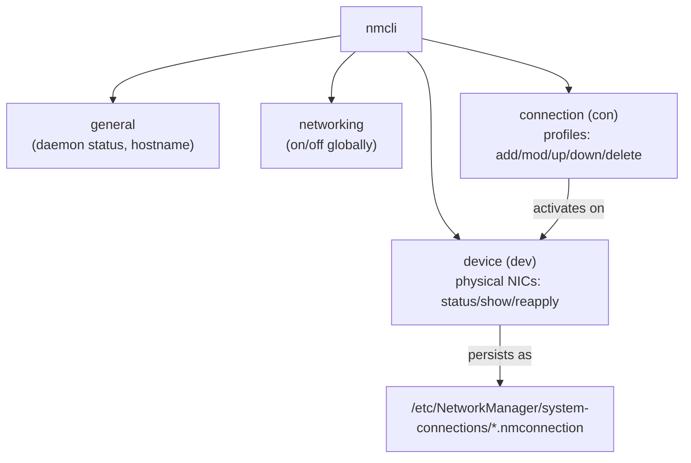

# NetworkManager and nmcli

**NetworkManager** is the default connection manager on most modern Linux distributions (Fedora, RHEL/CentOS Stream 8+, Ubuntu desktop, and — since Debian 10 — installable/default on Debian's GNOME netinst images); `nmcli` is its command-line client for creating, editing, and activating network connection profiles without hand-editing config files.

## Overview

| Item | Detail |
|---|---|
| Daemon | `NetworkManager.service` (systemd unit) |
| CLI client | `nmcli` |
| TUI client | `nmtui` |
| Persistent storage | Keyfile profiles under `/etc/NetworkManager/system-connections/*.nmconnection` |
| Default on | Fedora, RHEL/CentOS Stream 8+, Ubuntu Desktop |
| Common alternative | `systemd-networkd`, Debian's `/etc/network/interfaces`, Ubuntu Server's `netplan` |

> [!NOTE]
> NetworkManager manages **connections** (named configuration profiles) that are applied to **devices** (physical or virtual interfaces). A device can have multiple connections defined for it, but normally only one is active at a time. This separation is why `nmcli` has distinct `device` and `connection` object types.

## nmcli Command Structure

`nmcli` is organized around top-level **objects**, each with its own set of subcommands:

| Object | Alias | Purpose |
|---|---|---|
| `general` | `g` | Overall NetworkManager status, logging, hostname |
| `networking` | `n` | Enable/disable networking globally |
| `connection` | `con`, `c` | Manage connection **profiles** (add, modify, up, down, delete) |
| `device` | `dev`, `d` | Manage physical/virtual **devices** (status, show, reapply, disconnect) |
| `radio` | `r` | Wi-Fi / WWAN radio switches |



## Commands

### Step 1: Check General and Device Status

> Example:

```bash
nmcli general status
```

```bash
nmcli device status
```

`device status` lists every interface NetworkManager sees, its type, and its current state (`connected`, `disconnected`, `unmanaged`) alongside the connection profile currently active on it.

> Example:

```bash
nmcli connection show
```

```bash
nmcli connection show --active
```

`connection show` lists all saved profiles (`NAME`, `UUID`, `TYPE`, `DEVICE`); `--active` narrows the list to profiles currently applied to a device.

### Step 2: Inspect a Specific Device or Connection

```bash
nmcli device show enp0s3
```

```bash
nmcli connection show static-eth0
```

`device show` prints the full runtime state of the interface (IP, MAC, gateway, DNS, route table). `connection show <name>` dumps every configured property of the saved profile, active or not.

### Step 3: Create a Static Connection Profile

> Example:

```bash
nmcli con add type ethernet con-name static-eth0 ifname enp0s3 \
  ipv4.addresses 192.168.1.10/24 \
  ipv4.gateway 192.168.1.1 \
  ipv4.dns 1.1.1.1 \
  ipv4.method manual
```

| Property | Meaning |
|---|---|
| `type ethernet` | Connection type (also `wifi`, `bond`, `bridge`, `vlan`, ...) |
| `con-name static-eth0` | Friendly profile name used by `nmcli con` commands |
| `ifname enp0s3` | Physical device the profile binds to |
| `ipv4.addresses` | Static IP/prefix (CIDR notation) |
| `ipv4.gateway` | Default gateway |
| `ipv4.dns` | DNS resolver(s), space-separated for multiple |
| `ipv4.method manual` | Disables DHCP; required for static addressing to take effect |

> [!NOTE]
> `nmcli con add` writes the profile to `/etc/NetworkManager/system-connections/` but does **not** activate it automatically unless the device is currently disconnected and `autoconnect` is left at its default (`yes`). Bring it up explicitly with `nmcli con up`.

### Step 4: Activate the Profile

```bash
nmcli con up static-eth0
```

> [!WARNING]
> On a remote host, activating a new static profile can immediately drop your SSH session if the address or gateway is wrong. Keep a console/out-of-band session open, or test with `nmcli con up static-eth0 -- ipv4.may-fail no` style validation before relying on it unattended.

## Managing Existing Connections

### Modify a Property

```bash
nmcli con mod static-eth0 ipv4.dns "1.1.1.1 8.8.8.8"
```

```bash
nmcli con mod static-eth0 +ipv4.addresses 192.168.1.11/24
```

`con mod` edits one or more properties of a saved profile. The `+` prefix **appends** to a multi-value property (such as adding a second address) instead of replacing it.

### Apply, Bring Up, or Take Down

```bash
nmcli con up static-eth0
```

```bash
nmcli con down static-eth0
```

`con mod` only edits the saved profile on disk — it does not push the change to a running interface. Follow it with `nmcli con up <name>` to reactivate the profile (a full reconnect), or use `device reapply` (below) to apply changes without dropping the link.

### Delete a Profile

```bash
nmcli con delete static-eth0
```

## The nmtui Text UI

`nmtui` provides a menu-driven, ncurses-based front end to the same NetworkManager D-Bus API that `nmcli` talks to — useful over a serial/SSH console when you prefer a guided workflow to remembering flags.

```bash
nmtui
```

> [!NOTE]
> **📸 Screenshot**
> _Capture: nmtui main menu showing "Edit a connection", "Activate a connection", and "Set system hostname" options_

`nmtui` supports the same core tasks as `nmcli`: editing connection profiles (IPv4/IPv6 addressing, DNS), activating/deactivating them, and setting the hostname — but it cannot do everything `nmcli` can (for example, advanced bonding/team options), so complex setups still need `nmcli` or direct keyfile edits.

## Keyfile Profiles

Every NetworkManager connection is persisted as an INI-style **keyfile** under `/etc/NetworkManager/system-connections/`. `nmcli`, `nmtui`, and GUI tools are all just editors for these files.

```bash
cat /etc/NetworkManager/system-connections/static-eth0.nmconnection
```

```ini
[connection]
id=static-eth0
uuid=8f1c9b2e-4a3d-4e6a-9c1f-2b7d6e4a1234
type=ethernet
interface-name=enp0s3

[ethernet]

[ipv4]
address1=192.168.1.10/24,192.168.1.1
dns=1.1.1.1;
method=manual

[ipv6]
addr-gen-mode=eui64
method=disabled

[proxy]
```

> [!IMPORTANT]
> Keyfiles can contain secrets (Wi-Fi PSKs, VPN credentials). NetworkManager enforces mode `0600` owned by `root` on these files and will refuse to load a profile that is group- or world-readable. After hand-editing one, reload it with `nmcli con reload` (or `nmcli con reload <file>` for a single file) rather than restarting the whole daemon.

## Reapplying Configuration

`nmcli device reapply` pushes the **current saved profile** to a device that is already connected, applying changes (like a new DNS server or added address) without a full disconnect/reconnect cycle — avoiding the brief link-down that `con up` causes.

```bash
nmcli con mod static-eth0 ipv4.dns "1.1.1.1 9.9.9.9"
```

```bash
nmcli device reapply enp0s3
```

Not every property is reapply-able (changing the IP method or interface binding still requires a full `con up`); `nmcli` reports which changed properties required a reconnect.

## Debian /etc/network/interfaces and Netplan

Debian Server installs and Ubuntu Server both commonly configure networking **without** NetworkManager as the primary backend.

### Debian: /etc/network/interfaces

Debian's traditional `ifupdown` system reads a plain-text file processed by `ifup`/`ifdown` (or `systemctl restart networking`).

```bash
vim /etc/network/interfaces
```

```conf
auto enp0s3
iface enp0s3 inet static
    address 192.168.1.10/24
    gateway 192.168.1.1
    dns-nameservers 1.1.1.1
```

See [Linux-Network-Configuration](Linux-Network-Configuration.md) for full ifcfg/interfaces syntax and DNS/routing details.

### Ubuntu: Netplan

Ubuntu (Server and modern Desktop) uses **netplan**, a YAML abstraction layer that generates either NetworkManager or `systemd-networkd` configuration underneath, depending on the renderer.

```bash
vim /etc/netplan/01-netcfg.yaml
```

```conf
network:
  version: 2
  renderer: networkd
  ethernets:
    enp0s3:
      addresses: [192.168.1.10/24]
      routes:
        - to: default
          via: 192.168.1.1
      nameservers:
        addresses: [1.1.1.1]
```

```bash
netplan apply
```

| Backend | Config location | Apply command | Typical platform |
|---|---|---|---|
| NetworkManager | `/etc/NetworkManager/system-connections/*.nmconnection` | `nmcli con up` / `nmcli con reload` | Fedora, RHEL/CentOS Stream 8+, Ubuntu Desktop |
| Debian ifupdown | `/etc/network/interfaces` | `systemctl restart networking` or `ifup`/`ifdown` | Debian (server default) |
| Netplan | `/etc/netplan/*.yaml` | `netplan apply` | Ubuntu Server/Desktop |

## Best Practices

- Use `nmcli con show --active` before and after any change to confirm which profile is actually driving each device.
- Prefer `nmcli con mod` + `device reapply` over `con up`/`con down` for live edits on remote hosts to minimize connectivity gaps.
- Give profiles descriptive `con-name` values (`static-eth0`, `wan-dhcp`) rather than accepting the auto-generated ones, so `nmcli con show` output stays readable.
- On dual-stack hosts, explicitly set `ipv6.method` (`auto`, `disabled`, or `manual`) rather than leaving IPv6 unmanaged — an unconfigured IPv6 stack is a common firewall/monitoring blind spot.
- Keep NetworkManager as the single source of truth per host — mixing it with manual `ip addr` edits or a competing backend (`systemd-networkd`) on the same interface produces unpredictable state.

## Security Considerations

> [!WARNING]
> Any account able to write to `/etc/NetworkManager/system-connections/` or run `nmcli` as root can silently redirect traffic (rogue gateway/DNS) or exfiltrate stored Wi-Fi/VPN secrets. Treat that directory and the `nmcli`/`nmtui`/D-Bus interface as a privileged surface, and audit unexpected `.nmconnection` files the same way you would audit systemd units for persistence.

- Verify keyfile permissions are `600 root:root`; NetworkManager itself enforces this on write, but manually copied files can slip through with looser permissions.
- Avoid embedding secrets (PSKs, 802.1X credentials) directly on the `nmcli` command line — they land in shell history and the process table; edit the keyfile or use `nmcli` interactive prompts instead.
- Review `nmcli con show` and `/etc/NetworkManager/system-connections/` during incident response — an unexpected static profile with a foreign DNS/gateway is a plausible traffic-interception foothold.
- Restrict who can run `nmcli`/`nmtui` (typically root or the `netdev` group) via `polkit` rules if unprivileged users should not be able to reconfigure networking.

## Troubleshooting

| Symptom | Likely cause | Resolution |
|---|---|---|
| `con up` fails with "no suitable device found" | `ifname` in the profile does not match the actual device name | `nmcli device status` to confirm the real interface name |
| Static address never applies | Profile left at `ipv4.method=auto` (DHCP) | `nmcli con mod <name> ipv4.method manual` then `nmcli con up <name>` |
| Edited keyfile has no effect | NetworkManager still holds the old in-memory copy | `nmcli con reload` (or `nmcli con reload <file>`) |
| `device reapply` reports changes require reconnect | Edited a property that isn't hot-appliable (e.g. IP method) | `nmcli con down <name> && nmcli con up <name>` |
| Interface shows `unmanaged` in `device status` | Interface excluded via `NetworkManager.conf` or renderer set elsewhere (e.g. netplan → networkd) | Check `/etc/NetworkManager/NetworkManager.conf` `[keyfile] unmanaged-devices`, or the netplan `renderer` |
| Debian/Ubuntu server: `nmcli` shows no devices at all | NetworkManager not installed/active; box uses `ifupdown`/netplan instead | Confirm backend with `systemctl status NetworkManager`; edit `/etc/network/interfaces` or netplan YAML instead |

## References

- [NetworkManager documentation](https://networkmanager.dev/docs/)
- `man nmcli`, `man nmcli-examples`, `man nm-settings` — property reference for connection profiles
- `man netplan` — Ubuntu netplan YAML reference
- `man interfaces` — Debian `ifupdown` configuration syntax

## Related
- [Linux-Network-Configuration](Linux-Network-Configuration.md) — full persistent-config reference across NetworkManager, ifcfg, and interfaces backends
- [ifconfig-and-ip](ifconfig-and-ip.md) — runtime address/route commands that nmcli profiles make persistent
- [VLANs-and-Network-Bonding](VLANs-and-Network-Bonding.md) — bonding/VLAN connection types managed with nmcli
- [Static-Routing-and-IP-Forwarding](Static-Routing-and-IP-Forwarding.md) — route configuration alongside nmcli-managed addressing
- [Network-Diagnostics-Commands](Network-Diagnostics-Commands.md) — verify connectivity after activating a profile
- [Network Configuration](Readme.md) — module index
- [Linux Administration & Server Hardening](../Readme.md) — course hub
