# Static Routing and IP Forwarding

Static routes tell the kernel exactly which next hop to use for a given destination network, and IP forwarding is the kernel switch that turns a Linux host into a router capable of passing traffic between interfaces — together they are the foundation of every gateway, VPN concentrator, and multi-homed server.

## Overview

| Concept | Purpose |
|---|---|
| Routing table | Kernel's per-packet lookup of "which interface/next-hop gets this destination" |
| Static route | Manually configured route that does not change unless an admin edits it |
| Default route | The catch-all route (`0.0.0.0/0` / `default`) used when no more specific route matches |
| IP forwarding | Kernel sysctl that allows a host to relay packets between interfaces instead of only consuming/generating its own traffic |
| Policy routing | Routing decisions based on more than just destination (source address, mark, interface) via `ip rule` and multiple tables |

> [!NOTE]
> `iproute2` (the `ip` command) is the modern, canonical tool for routes on both RHEL-family and Debian-family systems. The legacy `route` command from `net-tools` is deprecated but may still appear in older scripts and exam material.

## How It Works

Every packet the kernel originates or forwards is matched against the routing table's entries from most-specific prefix to least-specific, falling back to the default route. `ip route get` performs this exact lookup for you without sending a packet, which makes it the fastest way to sanity-check a route before troubleshooting further.

```mermaid
flowchart TD
    A[Packet with destination IP] --> B{Match in routing table?}
    B -->|Most specific prefix wins| C[Route found: interface + next-hop]
    B -->|No match| D{Default route 0.0.0.0/0 exists?}
    D -->|Yes| C
    D -->|No| E[Destination unreachable]
    C --> F{Destination is local or\nhost has ip_forward=1?}
    F -->|Local process| G[Deliver to local socket]
    F -->|Forwarding enabled| H[Send out via next-hop dev]
    F -->|Forwarding disabled, not local| I[Packet dropped]
```



## Commands

### Step 1: Inspect the Current Routing Table

> Example:

```bash
ip route show
```

```text
default via 192.168.1.1 dev enp0s3 proto dhcp metric 100
192.168.1.0/24 dev enp0s3 proto kernel scope link src 192.168.1.40 metric 100
10.10.0.0/16 via 192.168.1.254 dev enp0s3 proto static metric 100
```

- `default via ... dev ...` — the default gateway route.
- `proto kernel scope link` — an automatically added route for the directly connected subnet.
- `proto static` — a route you (or config management) added manually.

### Step 2: Test a Route Lookup Without Sending Traffic

`ip route get` shows exactly which route the kernel would use for a given destination — invaluable when a host has multiple interfaces or routing tables.

> Example:

```bash
ip route get 10.10.5.20
```

```text
10.10.5.20 via 192.168.1.254 dev enp0s3 src 192.168.1.40 uid 0
    cache
```

### Step 3: Add a Runtime Default Gateway

> Example:

```bash
sudo ip route add default via 192.168.1.1 dev enp0s3
```

### Step 4: Add a Runtime Static Route

Route the `10.10.0.0/16` network through `192.168.1.254`, reachable via `enp0s3`.

> Example:

```bash
sudo ip route add 10.10.0.0/16 via 192.168.1.254 dev enp0s3
```

| Command | Effect |
|---|---|
| `ip route add <net> via <gw> dev <if>` | Add a static route (runtime only, lost on reboot) |
| `ip route del <net>` | Remove a route |
| `ip route replace <net> via <gw> dev <if>` | Add or overwrite a route idempotently — safe to re-run in scripts |
| `ip route flush cache` | Clear the kernel's cached route lookups after bulk changes |

> [!IMPORTANT]
> `ip route add` commands are **not persistent**. They vanish on reboot or when NetworkManager reconciles the interface. For anything that must survive a reboot, use the distro's persistent mechanism (Step 5).

### Step 5: Persist a Static Route with nmcli

On systems managed by NetworkManager (the default on current RHEL-family and Debian 12+ with the NetworkManager package), attach the route to the connection profile so it is re-applied every time the interface comes up.

> Example:

```bash
nmcli con show
```

```bash
sudo nmcli con mod "enp0s3" +ipv4.routes "10.10.0.0/16 192.168.1.254"
```

```bash
sudo nmcli con up "enp0s3"
```

Setting the default gateway persistently uses the dedicated `ipv4.gateway` property instead of a route entry:

```bash
sudo nmcli con mod "enp0s3" ipv4.gateway "192.168.1.1"
```

```bash
sudo nmcli con up "enp0s3"
```

Verify what NetworkManager will apply on the next activation:

```bash
nmcli con show "enp0s3" | grep -E 'ipv4.routes|ipv4.gateway'
```

### Alternative Persistence (No NetworkManager)

If a box runs `systemd-networkd` or classic `ifupdown` (Debian minimal/server installs without NetworkManager), persist the route in the matching config instead:

**Debian `/etc/network/interfaces` (ifupdown):**

```conf
iface enp0s3 inet static
    address 192.168.1.40/24
    gateway 192.168.1.1
    up ip route add 10.10.0.0/16 via 192.168.1.254 dev enp0s3
```

**RHEL-family route file (`/etc/sysconfig/network-scripts/route-enp0s3`, legacy `ifcfg` stack):**

```conf
10.10.0.0/16 via 192.168.1.254 dev enp0s3
```

> [!NOTE]
> CentOS Stream 10 ships NetworkManager as the default and only fully-supported network stack; the legacy `ifcfg`/`route-*` file format still works via the `NetworkManager-initscripts-updown` shim but `nmcli` is the exam-relevant, forward-compatible path.

## Enabling IP Forwarding

A host only relays traffic between interfaces when the kernel's `ip_forward` tunable is set — required for any Linux box acting as a router, VPN gateway, or NAT box.

### Step 1: Enable at Runtime

> Example:

```bash
sudo sysctl net.ipv4.ip_forward=1
```

Check the current value directly from the proc filesystem:

```bash
cat /proc/sys/net/ipv4/ip_forward
```

### Step 2: Persist Across Reboots

```bash
sudo tee /etc/sysctl.d/99-forward.conf >/dev/null <<'EOF'
net.ipv4.ip_forward = 1
EOF
```

```bash
sudo sysctl --system
```

For IPv6 forwarding, set the parallel key in the same file:

```conf
net.ipv6.conf.all.forwarding = 1
```

| Command | Purpose |
|---|---|
| `sysctl net.ipv4.ip_forward` | Show current runtime value |
| `sysctl -w net.ipv4.ip_forward=1` | Set at runtime (equivalent to `sysctl net.ipv4.ip_forward=1`) |
| `sysctl -p /etc/sysctl.d/99-forward.conf` | Load one file immediately without a full `--system` reload |
| `sysctl --system` | Reload all `/etc/sysctl.d/`, `/run/sysctl.d/`, `/usr/lib/sysctl.d/` drop-ins in priority order |

## Policy Routing (Brief)

Standard routing decides only by destination. **Policy routing** (`ip rule` + multiple routing tables) lets you route by source address, incoming interface, or firewall mark — common on multi-homed servers, dual-WAN gateways, and OpenWrt-style routers with several uplinks.

```bash
ip rule show
```

```text
0:      from all lookup local
32766:  from all lookup main
32767:  from all lookup default
```

Add a rule that sends traffic sourced from a specific subnet through a dedicated table:

```bash
# untested
sudo ip route add default via 192.168.2.1 dev enp0s8 table 100
sudo ip rule add from 192.168.2.0/24 table 100
```

> [!TIP]
> Policy routing is the same primitive OpenWrt's LuCI "Interfaces > Routes" and multi-WAN packages build on under the hood — if you have configured failover WAN or per-VLAN routing on an OpenWrt router, you have already used `ip rule` indirectly.

## Best Practices

- Use `ip route replace` instead of `ip route add` in automation — it is idempotent and won't fail with "File exists" on a re-run.
- Always pair a runtime `ip route add`/`sysctl -w` test with a persistent config change; never leave a production route or forwarding setting as runtime-only.
- Name sysctl drop-ins descriptively (`99-forward.conf`) and keep one concern per file so changes are easy to audit and roll back.
- Scope `ip_forward` to hosts that are actually acting as routers/gateways — leaving it enabled on a general-purpose server needlessly widens the attack surface (see Security Considerations).
- Prefer `nmcli` connection profiles over ad-hoc `ip` commands wherever NetworkManager manages the interface, so the config survives reboots and interface reconciliation.

## Security Considerations

> [!WARNING]
> Enabling `net.ipv4.ip_forward=1` on a host that also has firewall/NAT rules mis-scoped can silently turn it into an open relay between networks it was never meant to bridge — always pair forwarding with an explicit firewall policy (default-deny, then targeted `FORWARD` rules).

- Treat `ip_forward=1` as a role marker: only routers, VPN gateways, and container/NAT hosts should carry it. Audit for it unexpectedly enabled on servers during hardening reviews (`sysctl net.ipv4.ip_forward` across a fleet).
- A stray static route pointing internal traffic at an attacker-controlled next hop is a classic MITM/pivot technique after host compromise — during incident response, diff `ip route show` and `/etc/sysctl.d/*.conf` against known-good baselines.
- Combine forwarding with `net.ipv4.conf.all.rp_filter` (reverse-path filtering) and firewall `FORWARD` chain rules; forwarding alone has no access control of its own.
- Policy-routing rules (`ip rule`) are an equally viable persistence/redirection vector — include `ip rule show` in routine audits, not just the main table.

## Troubleshooting

| Symptom | Likely cause | Resolution |
|---|---|---|
| Can reach local subnet but not remote networks | No default route configured | `ip route show`, then add a default via `ip route add default via <gw> dev <if>` |
| Route added but lost after reboot | Added with `ip route add` only, never persisted | Persist via `nmcli con mod +ipv4.routes` or the distro's network config, then `nmcli con up` |
| Host should route between two NICs but traffic is dropped | `net.ipv4.ip_forward` is `0` | `sysctl -w net.ipv4.ip_forward=1`, persist in `/etc/sysctl.d/99-forward.conf`, then `sysctl --system` |
| `RTNETLINK answers: File exists` on `ip route add` | Route already present | Use `ip route replace` instead of `add` |
| `RTNETLINK answers: Network is unreachable` on route add | `via` gateway is not on a directly connected subnet, or wrong `dev` | Confirm the gateway is reachable via `ip route get <gw>` and the interface is up |
| `nmcli con mod +ipv4.routes` change has no effect | Connection not re-activated after modification | Run `nmcli con up "<con-name>"` (or reboot) to apply |
| Forwarding enabled but traffic still blocked between interfaces | Firewall `FORWARD` chain default-denies | Add explicit `firewalld`/`nftables`/`iptables` `FORWARD` rules for the relevant zones/interfaces |
| Wrong route wins between two similar prefixes | Longest-prefix-match rule misunderstood, or duplicate routes with different metrics | `ip route show` and compare prefix length/metric; more specific prefix always wins regardless of metric |

## References

- [ip-route(8) — man7.org](https://man7.org/linux/man-pages/man8/ip-route.8.html)
- [ip-rule(8) — man7.org](https://man7.org/linux/man-pages/man8/ip-rule.8.html)
- [nmcli(1) — man7.org](https://man7.org/linux/man-pages/man1/nmcli.1.html)
- `man sysctl.d` — persistent kernel parameter drop-in files
- [Red Hat: Configuring IP Networking with nmcli](https://access.redhat.com/documentation/en-us/red_hat_enterprise_linux/9/html/configuring_and_managing_networking/index)

## Related
- [NetworkManager-and-nmcli](NetworkManager-and-nmcli.md) — connection-profile management underlying persistent `nmcli` route/gateway configuration
- [Linux-Network-Configuration](Linux-Network-Configuration.md) — broader interface and address configuration this builds on
- [ifconfig-and-ip](ifconfig-and-ip.md) — the `ip` command suite this note's routing commands belong to
- [Network-Diagnostics-Commands](Network-Diagnostics-Commands.md) — verifying connectivity once routes and forwarding are in place
- [Network Configuration](Readme.md) — module index
- [Linux Administration & Server Hardening](../Readme.md)
