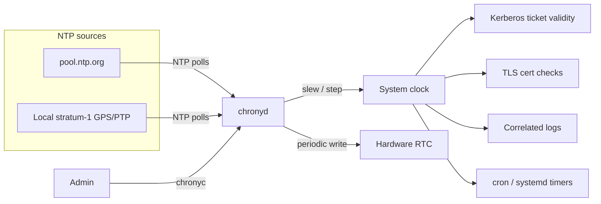

# Time Synchronization with chrony

Accurate, synchronized clocks are a prerequisite for correct authentication, valid TLS sessions, and trustworthy logs — **chrony** is the modern NTP client/server that keeps Linux systems on time.

## Overview

| Aspect | Detail |
| :-- | :-- |
| **Package / daemon** | `chrony` package, `chronyd` daemon |
| **Config file** | `/etc/chrony.conf` (RHEL) / `/etc/chrony/chrony.conf` (Debian) |
| **Control tool** | `chronyc` |
| **Protocol** | NTP (client and/or server), plus optional NTS/PPS/hardware refclocks |
| **Default on** | RHEL/CentOS/Fedora, Debian, Ubuntu (server images), most modern distros |

> [!NOTE]
> **Why time accuracy matters**
> - **Kerberos** tickets embed timestamps and are rejected if clock skew between client and KDC exceeds the configured tolerance (default 5 minutes) — this breaks AD authentication and `kinit`.
> - **TLS/X.509** certificate validity windows (`notBefore`/`notAfter`) are checked against the local clock; a skewed clock causes spurious certificate errors.
> - **Correlated logs** (SIEM timelines, `auditd`, `journalctl` across a fleet) are only useful if every host's clock agrees — forensic timelines fall apart otherwise.
> - **cron/systemd timers** that fire "in the past" after a clock jump can double-run or skip jobs entirely.

## How It Works

`chronyd` polls one or more upstream NTP sources (pool servers, local stratum-1 devices, or peers), statistically filters out noisy/asymmetric samples, and steers the system clock using small, continuous frequency adjustments rather than abrupt jumps — this keeps the clock monotonic and well-behaved for services that dislike sudden time changes.



### chrony vs. alternatives

| Tool | Role | Notes |
| :-- | :-- | :-- |
| **chrony (`chronyd`)** | Full NTP client **and** server | Handles intermittent connectivity, virtual machines, and laptops well; fast initial sync; default on RHEL and Debian/Ubuntu server. |
| **systemd-timesyncd** | Minimal SNTP **client only** | No server function, no `makestep`/complex filtering; fine for a desktop, insufficient for a server that must also *serve* time or handle a flaky WAN link. |
| **ntpd (legacy)** | Original reference NTP daemon | Still valid but largely superseded by chrony in RHEL 7+/Debian 9+; slower to converge after a large offset, weaker on intermittently-connected hosts. |

> [!NOTE]
> Only one time-sync client should manage the clock at a time. If `systemd-timesyncd` is active, stop/mask it (`systemctl disable --now systemd-timesyncd`) before enabling chrony to avoid the two daemons fighting over the clock.

## Installation

> Example (Debian 12):

```bash
apt update
apt install -y chrony
```

> Example (CentOS Stream 10 / RHEL family):

```bash
dnf install -y chrony
```

```bash
systemctl enable --now chronyd
```

## Configuration

### Step 1: Point at time sources

Edit the config file and define NTP servers/pools. `/etc/chrony.conf` on RHEL, `/etc/chrony/chrony.conf` on Debian.

> Example:

```bash
vim /etc/chrony.conf
```

```conf
# Public pool (RHEL default style)
pool 2.rhel.pool.ntp.org iburst

# Or explicit servers (Debian default style)
server 0.debian.pool.ntp.org iburst
server 1.debian.pool.ntp.org iburst
server 2.debian.pool.ntp.org iburst
server 3.debian.pool.ntp.org iburst

# Step the clock on the first few updates if the offset is large,
# instead of slewing it slowly into place
makestep 1.0 3

# Keep the RTC synchronized to the (usually more accurate) system clock
rtcsync

# Allow this host to serve time to a local subnet (server role only)
allow 192.168.1.0/24

# Record drift so restarts start close to the correct rate
driftfile /var/lib/chrony/drift
```

| Directive | Meaning |
| :-- | :-- |
| `iburst` | Sends a burst of initial requests for fast first sync instead of waiting out normal poll intervals. |
| `makestep 1.0 3` | If the offset exceeds 1.0s during the first 3 clock updates, step (jump) the clock instead of slowly slewing it — needed after long downtime or on first boot. |
| `rtcsync` | Periodically copies the system clock into the hardware RTC, keeping it accurate between reboots. |
| `allow <subnet>` | Permits NTP clients on that subnet to query this host — required to act as a server, not just a client. |

> [!WARNING]
> Without `makestep`, a clock that is hours off will only be corrected by tiny slew adjustments and can take a very long time to converge — services depending on correct time (Kerberos, TLS) will fail in the meantime. Set `makestep` generously for the first few updates after boot, then let chrony slew for steady-state accuracy.

### Step 2: Enable NTP via timedatectl

`timedatectl` is the systemd-level switch that enables/disables whichever NTP client is active (chronyd here).

```bash
timedatectl set-ntp true
```

```bash
timedatectl status
```

### Step 3: Restart and verify

```bash
systemctl restart chronyd
```

```bash
systemctl status chronyd
```

## Commands (chronyc)

### View sources

`chronyc sources -v` lists every configured NTP source with its state, stratum, and offset statistics.

```bash
chronyc sources -v
```

> Example output:

```text
MS Name/IP address         Stratum Poll Reach LastRx Last sample
===============================================================================
^* time.cloudflare.com           3   6   377    42  -1234ns[-  2us] +/-   14ms
^+ ntp.example.net                2   6   377    45   +102us[+ 105us] +/-   22ms
^-  198.51.100.10                 2   6   357    50   -890us[- 900us] +/-   35ms
```

| Column | Meaning |
| :-- | :-- |
| `M` | Mode: `^` server, `=` peer, `#` local reference clock. |
| `S` | State: `*` current best/synced source, `+` combined candidate, `-` excluded, `?` unreachable, `x` falseticker. |
| `Stratum` | Distance from a reference clock (stratum 0 = atomic/GPS, stratum 1 = directly attached, etc.). |
| `Reach` | Octal reachability register — `377` = last 8 polls all succeeded. |
| `Last sample` | Measured offset and estimated error for the most recent poll. |

### Check synchronization status

```bash
chronyc tracking
```

> Example output:

```text
Reference ID    : A29FC287 (time.cloudflare.com)
Stratum         : 4
Ref time (UTC)  : Wed Jul 22 05:12:03 2026
System time     : 0.000012456 seconds slow of NTP time
Last offset     : -0.000009123 seconds
RMS offset      : 0.000041002 seconds
Frequency       : 4.812 ppm slow
Residual freq   : +0.002 ppm
Skew            : 0.089 ppm
Root delay      : 0.023456789 seconds
Root dispersion : 0.001234567 seconds
Update interval : 64.5 seconds
Leap status     : Normal
```

Key fields: **System time** is the current measured offset from true time; **Frequency**/**Skew** describe how fast the local clock's oscillator drifts; **Leap status** should read `Normal` (not `Insert second pending` unless a leap second is imminent, and never `Not synchronised`).

### Force an immediate step

If the clock is badly off and you don't want to wait for the poll cycle:

```bash
chronyc makestep
```

### Other useful subcommands

```bash
chronyc activity
```

```bash
chronyc ntpdata
```

```bash
chronyc clients
```

`activity` summarizes how many sources are online/offline/unreachable; `ntpdata` shows low-level packet statistics for the current source; `clients` (server role) lists hosts that have queried this box for time.

## Hardware Clock (RTC) vs. System Clock

Linux maintains two clocks: the kernel's **system clock** (what every process sees, driven by chrony while running) and the motherboard's **hardware clock / RTC**, which only matters at boot (before `chronyd` starts) and holds time across power-offs.

```bash
timedatectl status
```

```bash
hwclock --show
```

- Set the RTC from the current (chrony-synced) system time:

```bash
hwclock --systohc
```

- Set the system clock from the RTC (rarely needed manually — happens at boot):

```bash
hwclock --hctosys
```

> [!NOTE]
> **Use UTC for the hardware clock**
> Keep the RTC in **UTC**, not local time (`timedatectl status` should show `RTC in local TZ: no`). Local-time RTCs are ambiguous across DST transitions and are a common source of one-hour clock jumps on dual-boot or misconfigured systems. Set it with:

```bash
timedatectl set-local-rtc 0
```

## Best Practices

- **Use `iburst` on every server/pool line** for fast convergence after boot or a network blip.
- **Tune `makestep`** to step (not slew) large initial offsets, but leave steady-state correction to chrony's slewing so time never jumps backward mid-session.
- **Restrict `allow`** to the specific subnets that should query this host as a server; don't leave it open by default.
- **Prefer chrony over `systemd-timesyncd`** on any server, VM, or intermittently-connected host — it converges faster and can also serve time.
- **Keep the RTC in UTC** with `timedatectl set-local-rtc 0` to avoid DST-related jumps.
- **Monitor `chronyc tracking` / `Leap status`** as part of routine health checks — "Not synchronised" is a silent failure mode with wide-reaching effects (auth, TLS, logging).

## Security Considerations

> [!WARNING]
> An attacker who can spoof or man-in-the-middle unauthenticated NTP traffic can shift a target's clock, which in turn can bypass certificate expiry checks, invalidate or forge Kerberos ticket lifetimes, and desynchronize log correlation used during incident response.

- Prefer authenticated time sources or **NTS (Network Time Security)** where supported, rather than plain unauthenticated NTP over the open internet.
- Restrict server mode (`allow`) to trusted subnets only; an open NTP server can be abused for **amplification DDoS** (`monlist`-style abuse is an ntpd-era issue, but misconfigured `allow`/`cmdallow` on chrony can still expose unnecessary attack surface).
- Firewall UDP/123 appropriately — allow outbound to trusted pools, and only allow inbound if this host is intentionally acting as an NTP server for other hosts.
- Large, unexplained clock jumps (visible via `journalctl -u chronyd` or `chronyc tracking`) can indicate a compromised or spoofed time source; treat them as an investigation trigger, not just an operational nuisance.

## Troubleshooting

| Symptom | Likely cause | Resolution |
| :-- | :-- | :-- |
| `chronyc tracking` shows "Not synchronised" | No reachable sources, firewall blocking UDP/123, or `chronyd` just started | Check `chronyc sources -v` for reachability; verify outbound UDP/123; wait for a few poll cycles or run `chronyc makestep` |
| Large, persistent offset | `makestep` not configured, or clock drifted for a long time | Increase the step threshold/limit in `makestep`, or force with `chronyc makestep` |
| Kerberos auth failing with clock-skew errors | Client and KDC clocks disagree beyond tolerance (default 5 min) | Confirm both hosts are chrony-synced (`chronyc tracking`) against the same or agreeing sources |
| Clock resets to wrong time after reboot | RTC not synced, or RTC set to local time instead of UTC | `hwclock --systohc` after sync; `timedatectl set-local-rtc 0` |
| `systemd-timesyncd` and `chronyd` both trying to manage the clock | Both services enabled simultaneously | `systemctl disable --now systemd-timesyncd` before enabling chronyd |
| Server won't answer client NTP requests | Missing/incorrect `allow` directive, or firewall blocking inbound UDP/123 | Add correct `allow <subnet>` in `chrony.conf` and open UDP/123 inbound |

## References

- [chrony official documentation](https://chrony-project.org/documentation.html)
- `man chrony.conf` — full configuration directive reference
- `man chronyc` — control utility subcommands
- `man timedatectl` — systemd time/date/NTP control
- `man hwclock` — hardware clock utility
- [Red Hat: Configuring time synchronization](https://access.redhat.com/documentation/en-us/red_hat_enterprise_linux/9/html/configuring_basic_system_settings/configuring-time-synchronization_configuring-basic-system-settings)

## Related

- [Linux-Network-Configuration](Linux-Network-Configuration.md) — interface and connectivity prerequisites for reaching NTP sources
- [Network-Diagnostics-Commands](Network-Diagnostics-Commands.md) — verifying UDP/123 reachability to upstream servers
- [Network Configuration](Readme.md) — module hub
- [Linux Administration & Server Hardening](../Readme.md)
