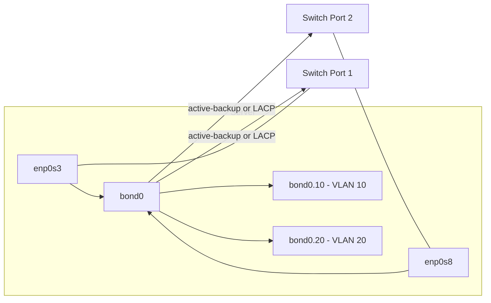

# VLANs and Network Bonding

VLANs (802.1Q tagging) let a single physical NIC carry multiple isolated broadcast domains, while network bonding (link aggregation) combines multiple physical NICs into one logical interface for redundancy and/or throughput — both are core building blocks for resilient, segmented Linux server networking.

## Overview

| Feature | Purpose | Kernel driver | Typical config tool |
|---|---|---|---|
| VLAN (802.1Q) | Tag frames so one NIC serves multiple logical networks | `8021q` | `nmcli`, `ip link` |
| Bonding | Aggregate NICs for failover and/or throughput | `bonding` | `nmcli`, `ip link` |
| Teaming | Alternative to bonding, userspace daemon (`teamd`) | `team` | `teamdctl`, `nmcli` |

> [!NOTE]
> Both features can be stacked: a bond of two NICs can itself carry tagged VLAN sub-interfaces (`bond0.10`, `bond0.20`), which is the standard pattern for hypervisor hosts and top-of-rack-connected servers.

## How It Works

A **VLAN interface** (`enp0s3.10`) inserts an 802.1Q tag into every outgoing frame and strips it on ingress, so the kernel sees a normal Ethernet interface bound to a single VLAN ID — the switch port must be configured as a trunk carrying that tag.

A **bond interface** (`bond0`) owns one or more physical "slave" (port) interfaces. Depending on the bonding **mode**, the bond either sends traffic out all slaves (load balancing) or keeps one slave active and fails over to another on link loss.



### Bonding Modes

| Mode # | Name | Behavior | Switch config required |
|---|---|---|---|
| 0 | `balance-rr` | Round-robin transmit across all slaves | No (works on unmanaged switches, but can cause out-of-order packets) |
| 1 | `active-backup` | One slave active, others standby; fails over on link loss | No — safest default |
| 2 | `balance-xor` | Hash-based transmit selection | Static EtherChannel |
| 3 | `broadcast` | Transmits everything on all slaves (fault tolerance testing) | No |
| 4 | `802.3ad` (LACP) | Dynamic link aggregation negotiated with the switch | Yes — switch must support LACP |
| 5 | `balance-tlb` | Adaptive transmit load balancing | No |
| 6 | `balance-alb` | Adaptive transmit **and** receive load balancing | No |

> [!IMPORTANT]
> Mode 1 (`active-backup`) requires no special switch configuration and is the safest choice for most servers. Mode 4 (`802.3ad`/LACP) gives real aggregate throughput but **only works if the connected switch ports are configured into a matching LACP port-channel** — plugging two NICs into unconfigured switch ports with mode 4 will not aggregate bandwidth and can cause connectivity issues.

## Configuration — VLAN Tagging

### Step 1: Create a Tagged VLAN Interface with `nmcli`

> Example:

```bash
nmcli con add type vlan con-name vlan10 dev enp0s3 id 10 ip4 192.168.10.5/24
```

```bash
nmcli con up vlan10
```

| Field | Meaning |
|---|---|
| `con-name vlan10` | Name of the new NetworkManager connection profile |
| `dev enp0s3` | Parent physical interface that will carry the tagged frames |
| `id 10` | 802.1Q VLAN ID (1-4094) |

### Step 2: The Equivalent `ip link` Command

For a transient, non-persistent VLAN interface (or scripting/troubleshooting without NetworkManager):

```bash
ip link add link enp0s3 name enp0s3.10 type vlan id 10
```

```bash
ip addr add 192.168.10.5/24 dev enp0s3.10
```

```bash
ip link set enp0s3.10 up
```

> [!NOTE]
> `ip link` changes are **not persistent** across reboots on their own. On Debian 12, persist them in `/etc/network/interfaces` (with `vlan` package installed) or a systemd-networkd `.netdev`/`.network` unit; on CentOS Stream 10 use `nmcli`/`nmconnection` files or an `ifcfg`-style NetworkManager keyfile so the interface survives a reboot.

### Step 3: Verify the VLAN Interface

```bash
ip -d link show enp0s3.10
```

> Example output showing the `8021q` link-type detail with `id 10` and the parent link:

```text
4: enp0s3.10@enp0s3: <BROADCAST,MULTICAST,UP,LOWER_UP> mtu 1500 qdisc noqueue state UP mode DEFAULT group default qlen 1000
    link/ether 08:00:27:aa:bb:cc brd ff:ff:ff:ff:ff:ff promiscuity 0
    vlan protocol 802.1Q id 10 <REORDER_HDR> addrgenmode eui64 numtxqueues 1 numrxqueues 1
```

The `@enp0s3` after the interface name shows the parent device, and `vlan protocol 802.1Q id 10` confirms the tag being applied.

## Configuration — Link Aggregation (Bonding)

### Step 1: Create the Bond Master

> Example:

```bash
nmcli con add type bond con-name bond0 ifname bond0 bond.options "mode=active-backup,miimon=100"
```

| Option | Meaning |
|---|---|
| `mode=active-backup` | Bonding mode (see table above) |
| `miimon=100` | Poll link state every 100 ms via MII to detect failures quickly |

### Step 2: Add Slave (Port) Interfaces

```bash
nmcli con add type bond-slave ifname enp0s3 master bond0
```

```bash
nmcli con add type bond-slave ifname enp0s8 master bond0
```

### Step 3: Assign an Address and Bring Everything Up

```bash
nmcli con mod bond0 ipv4.addresses 192.168.1.50/24 ipv4.method manual
```

```bash
nmcli con up bond0
```

### Step 4: The `ip link` Equivalent (non-persistent)

```bash
ip link add bond0 type bond mode active-backup miimon 100
```

```bash
ip link set enp0s3 down master bond0
```

```bash
ip link set enp0s8 down master bond0
```

```bash
ip link set bond0 up
```

### Step 5: Verify Bond Status

The kernel exposes live bond state via `/proc`:

```bash
cat /proc/net/bonding/bond0
```

> Example output for a two-NIC `active-backup` bond:

```text
Ethernet Channel Bonding Driver: v6.x.x

Bonding Mode: fault-tolerance (active-backup)
Primary Slave: None
Currently Active Slave: enp0s3
MII Status: up
MII Polling Interval (ms): 100
Up Delay (ms): 0
Down Delay (ms): 0

Slave Interface: enp0s3
MII Status: up
Speed: 1000 Mbps
Duplex: full
Link Failure Count: 0
Permanent HW addr: 08:00:27:aa:bb:cc

Slave Interface: enp0s8
MII Status: up
Speed: 1000 Mbps
Duplex: full
Link Failure Count: 0
Permanent HW addr: 08:00:27:dd:ee:ff
```

`Currently Active Slave` shows which NIC is carrying traffic, and per-slave `MII Status` / `Link Failure Count` confirm health. `ip -d link show bond0` also reports mode and `miimon` in its detail output.

### Distro Notes for Persistence

| Distro | Persistent bonding config location |
|---|---|
| CentOS Stream 10 (RHEL-family) | NetworkManager connection profiles under `/etc/NetworkManager/system-connections/` (created by the `nmcli con add` commands above) |
| Debian 12 | `/etc/network/interfaces` with `bond-mode`, `bond-miimon`, `bond-slaves` stanzas (`ifenslave` package), or systemd-networkd `.netdev` `[Bond]` sections, or NetworkManager if installed |

## Teaming as an Alternative

`teamd` is a userspace daemon that provides similar link-aggregation functionality to kernel bonding but with a pluggable, JSON-configured "runner" model (`activebackup`, `loadbalance`, `lacp`, `broadcast`, `roundrobin`) and richer D-Bus/`teamdctl` introspection.

```bash
nmcli con add type team con-name team0 ifname team0 config '{"runner":{"name":"activebackup"}}'
```

```bash
nmcli con add type team-slave ifname enp0s3 master team0
```

```bash
teamdctl team0 state
```

> [!NOTE]
> `teamd` was RHEL/CentOS's recommended aggregation approach for several release cycles but has since been **deprecated in favor of kernel bonding** in current RHEL/CentOS Stream releases. New deployments should default to `bonding` unless an existing environment already standardizes on `teamd`.

## Best Practices

- Prefer **`active-backup`** (mode 1) unless the upstream switch is confirmed to support LACP port-channels for mode 4.
- Set `miimon=100` (or lower) on every bond — the default carrier-detection interval is too slow for fast failover on some drivers.
- Always persist configuration through `nmcli`/NetworkManager keyfiles or the distro's native config (`/etc/network/interfaces`, systemd-networkd) — never rely on ad-hoc `ip link` commands surviving a reboot.
- Stack VLANs on top of a bond (`bond0.10`) rather than tagging each physical slave separately, so VLAN membership survives a NIC failover transparently.
- Name VLAN interfaces consistently (`<parent>.<vlan-id>`) to keep `ip -d link` output self-documenting.
- Verify switch-side trunk/port-channel configuration matches the Linux-side mode before relying on a bond or VLAN in production.

## Security Considerations

> [!WARNING]
> A VLAN tag alone provides **logical** traffic separation, not a security boundary equivalent to a physically isolated network. VLAN hopping attacks (double-tagging, DTP abuse on Cisco switches) can cross improperly configured trunks — always disable auto-trunking negotiation on access ports and explicitly prune unneeded VLANs from trunks.

- Do not treat VLAN segmentation as a substitute for firewall rules between segments — pair it with `firewalld`/`nftables` policy (see [ifconfig-and-ip](ifconfig-and-ip.md) and the firewall module) enforcing which VLANs may talk to which.
- Restrict which switch ports are trunks; an access port misconfigured as a trunk lets an attacker inject arbitrary 802.1Q tags and reach VLANs they should not see.
- For bonding, `active-backup` avoids the single-point-of-failure risk of one NIC while keeping the attack surface identical to a single interface; aggregation modes that spread traffic across links (mode 0/4) can complicate traffic capture and IDS placement — plan span/mirror ports accordingly.
- Audit `/proc/net/bonding/bond0` and `journalctl -u NetworkManager` after any unexplained failover — a flapping bond can indicate a failing NIC/cable or, in rarer cases, an active MITM/ARP-spoofing condition on one leg.

## Troubleshooting

| Symptom | Likely cause | Resolution |
|---|---|---|
| VLAN interface shows no tag in `ip -d link` | Wrong `id` or interface created without `type vlan` | Recreate with `ip link add link <parent> name <parent>.<id> type vlan id <id>` and confirm switch port is a trunk |
| Bond stays on one slave even after unplugging it | `miimon` not set (defaults to 0 = disabled) | Set `bond.options "miimon=100"` via `nmcli con mod bond0` |
| LACP bond (mode 4) shows slaves as "down" in `/proc/net/bonding/bond0` | Switch side not configured for LACP/port-channel | Coordinate with network team to enable `802.3ad`/LACP on the matching switch ports |
| Config lost after reboot | Change made only with `ip link`, not persisted | Recreate via `nmcli con add` or the distro's persistent config file |
| VLAN traffic not reaching the host | Switch port set to access mode instead of trunk, or VLAN not allowed on trunk | Verify trunk allowed-VLAN list on the switch |
| `nmcli con up bond0` fails with slave errors | Slave connections not attached to `master bond0` | Confirm each `nmcli con add type bond-slave ... master bond0` succeeded with `nmcli con show` |

## References

- [ip-link(8) man page — VLAN and bond link types](https://man7.org/linux/man-pages/man8/ip-link.8.html)
- [Linux kernel bonding documentation](https://www.kernel.org/doc/Documentation/networking/bonding.txt)
- [nmcli(1) man page](https://networkmanager.dev/docs/api/latest/nmcli.html)
- [Red Hat: Configuring network teaming](https://access.redhat.com/documentation/en-us/red_hat_enterprise_linux/9/html/configuring_and_managing_networking/configuring-network-teaming_configuring-and-managing-networking)

## Related
- [NetworkManager-and-nmcli](NetworkManager-and-nmcli.md) — `nmcli` connection profile management used throughout this note
- [Linux-Network-Configuration](Linux-Network-Configuration.md) — base interface/address/route configuration these features build on
- [ifconfig-and-ip](ifconfig-and-ip.md) — the `ip` command family used for VLAN and bond verification
- [Static-Routing-and-IP-Forwarding](Static-Routing-and-IP-Forwarding.md) — routing considerations once bonds/VLANs are in place
- [Network Configuration](Readme.md) — module index
- [Linux Administration & Server Hardening](../Readme.md) — course hub
