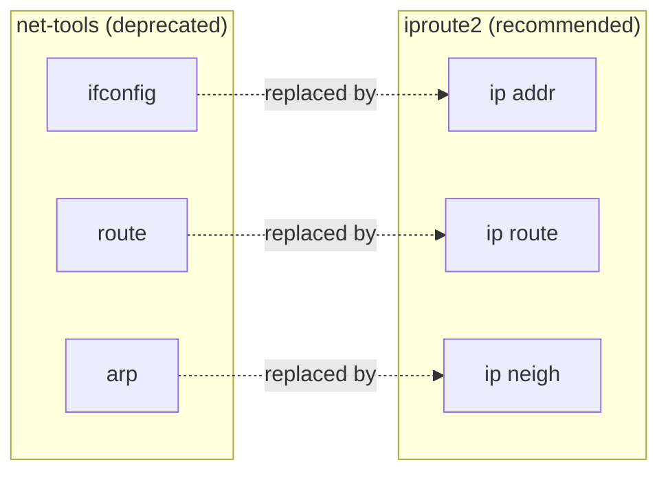

# ifconfig and ip

Managing network interfaces, addresses, and routes with the legacy `ifconfig` tool and its modern replacement, the `ip` command from the `iproute2` suite.

## Overview

The **`ifconfig`** command is a legacy tool used to configure network interfaces. It is **deprecated** on most current Linux distributions and replaced by the **`ip`** command from the `iproute2` suite. `ifconfig` still appears on older CentOS 7 / RHEL 7 systems and in long-standing documentation, so it remains worth recognising — but new work should use `ip` (and `nmcli` for persistence).

This note maps the common `ifconfig` operations to their `ip` equivalents, then covers routing and persistent configuration with NetworkManager.

> [!IMPORTANT]
> Changes made with `ifconfig` or `ip addr add` are **runtime only** — they modify live kernel state and are lost on reboot. To make an address or route persistent, configure NetworkManager (`nmcli`) or the distribution's config files. See [Linux-Network-Configuration](Linux-Network-Configuration.md).

## Concepts

`iproute2` consolidates what used to be several separate legacy utilities into one `ip` command with subcommands:

| Task | Legacy (`net-tools`) | Modern (`iproute2`) |
|------|----------------------|---------------------|
| Show / set addresses | `ifconfig` | `ip addr` |
| Bring interface up/down | `ifconfig <if> up/down`, `ifup`/`ifdown` | `ip link set <if> up/down` |
| Show / edit routes | `route` | `ip route` |
| Show ARP neighbours | `arp` | `ip neigh` |



## Using ifconfig (Legacy Systems)

- Display Interfaces

```bash
ifconfig
```

- Shows all **active** network interfaces; Shows **all interfaces**, including inactive ones.

```bash
ifconfig -a
```

- View a Specific Interface

```bash
ifconfig enp0s3
```

```bash
ifconfig lo
```

- Assign IP Addresses (CentOS 7 / RHEL 7)

```bash
ifconfig enp0s3 192.168.1.40
```

```bash
ifconfig enp0s3 192.168.1.41 netmask 255.255.255.0
```

```bash
ifconfig enp0s3 192.168.1.42/20
```

- Disable Interfaces

```bash
ifconfig enp0s3 down
```

- Enable Interfaces

```bash
ifconfig enp0s3 up
```

- Or using legacy scripts; Disable Interfaces

```bash
ifdown enp0s3
```

- Or using legacy scripts; Enable Interfaces

```bash
ifup enp0s3
```

- Multiple IPs on One Interface (CentOS 7 / RHEL 7)

```bash
ifconfig enp0s3:1 192.168.1.42
```

```bash
ifconfig enp0s3:2 192.168.1.43
```

## Using the ip Command (Recommended in CentOS 9)

- Display Interfaces

```bash
ip addr show
```

- Assign IP Address (Temporary)

```bash
ip addr add 192.168.1.40/24 dev enp0s3
```

- Another example with subnet mask:

```bash
ip addr add 192.168.1.41/24 dev enp0s3
```

```bash
ip addr add 192.168.1.42/20 dev enp0s3
```

- Check:

```bash
ip addr show dev enp0s3
```

```bash
ip addr show enp0s3
```

- Remove IP

```bash
ip addr del 192.168.1.40/24 dev enp0s3
```

```bash
ip addr del 192.168.1.41/24 dev enp0s3
```

> In **CentOS 9**, persistent network config is managed by **NetworkManager**.  
> Edit the connection with `nmcli` or by modifying the config file under `/etc/NetworkManager/system-connections/`.
> /etc/NetworkManager/system-connections/enp0s3.nmconnection

- Add IP Address (persistent with nmcli)

```bash
nmcli con mod enp0s3 +ipv4.addresses 192.168.1.40/24
```

```bash
nmcli con mod enp0s3 +ipv4.addresses 192.168.1.41/24
```

```bash
nmcli con mod enp0s3 +ipv4.addresses 192.168.1.42/20
```

```bash
nmcli con mod enp0s3 ipv4.method manual
```

```bash
nmcli con mod enp0s3 ipv4.gateway 192.168.1.1
```

```bash
nmcli con mod enp0s3 ipv4.dns "8.8.8.8 8.8.4.4"
```

```bash
nmcli con up enp0s3
```

- Disable Interface

```bash
ip link set enp0s3 down
```

- Enable Interface

```bash
ip link set enp0s3 up
```

### ifconfig → ip quick reference

| Intent | `ifconfig` | `ip` |
|--------|-----------|------|
| Show all interfaces | `ifconfig -a` | `ip addr show` |
| Show one interface | `ifconfig enp0s3` | `ip addr show enp0s3` |
| Add an address | `ifconfig enp0s3 192.168.1.40` | `ip addr add 192.168.1.40/24 dev enp0s3` |
| Remove an address | *(reassign)* | `ip addr del 192.168.1.40/24 dev enp0s3` |
| Bring up / down | `ifconfig enp0s3 up` / `down` | `ip link set enp0s3 up` / `down` |

## Routing with `ip`

- Show Routing Table

```bash
ip route
```

- Add a Route

```bash
ip route add 192.168.2.0/24 via 192.168.1.1 dev enp0s3
```

- Delete a Route

```bash
ip route del 192.168.2.0/24
```

- Set Default Gateway

```bash
ip route add default via 192.168.1.1 dev enp0s3
```

- Show Routes for a Specific Interface

```bash
ip route show dev enp0s3
```

- Flush All Routes

```bash
ip route flush table main
```

> [!WARNING]
> `ip route flush table main` removes **every** route in the main table, including the default gateway. On a remote host this will drop your SSH session immediately. Only run it at the console or with an out-of-band recovery path.

## Best Practices

- Standardise on `ip` / `nmcli` for all new configuration; treat `ifconfig` as read-only familiarity for legacy boxes.
- Remember that `ip addr add` and `ip route add` are volatile — persist the intended state through NetworkManager so it survives a reboot.
- Prefer CIDR notation (`/24`) over dotted netmasks for clarity and to avoid classful assumptions.
- Test connectivity changes from a second session before closing your working session, so a mistake does not lock you out.

## Security Considerations

- Keeping only `iproute2` (and removing `net-tools`) reduces the toolset an attacker can leverage post-compromise and aligns with minimising installed packages per CIS guidance.
- Interface aliases and secondary addresses expand the host's exposed surface — document each one and bind services only to the address they need.
- Unexpected routes or a changed default gateway can indicate tampering or a rogue DHCP server; baseline `ip route` output and alert on drift.

## Troubleshooting

| Symptom | Likely cause | Check |
|---------|--------------|-------|
| Address gone after reboot | Only `ip addr add` used (runtime) | Configure via `nmcli` / config files |
| `ifconfig: command not found` | `net-tools` not installed | Use `ip addr`, or install `net-tools` |
| No route to internet | Missing default gateway | `ip route` — confirm a `default via` entry |
| Interface will not come up | Link down or driver issue | `ip link show enp0s3`; `journalctl -u NetworkManager` |

## References

- `man ip`, `man ifconfig`, `man nmcli`
- iproute2 documentation — `ip(8)`
- Red Hat Enterprise Linux — *Configuring and Managing Networking*

## Related
- [Linux-Network-Configuration](Linux-Network-Configuration.md) — overall network setup and persistence
- [Network-Diagnostics-Commands](Network-Diagnostics-Commands.md) — test connectivity after configuring
- [Network-Monitoring-netstat-and-ss-Commands](Network-Monitoring-netstat-and-ss-Commands.md) — view sockets and connections
- Network-Reconnaissance-Scanning — offensive networking hub
- [Linux Administration & Server Hardening](../Readme.md) — Linux administration & server hardening hub
