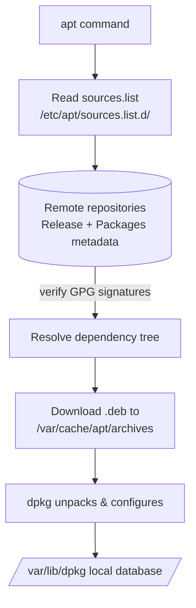

# Advanced Package Tool (APT)

## Overview

The **Advanced Package Tool (APT)** is the high-level package manager for Debian-based systems such as Ubuntu, Kali Linux, and Raspberry Pi OS. It works on top of [dpkg](Debian-Package-Manager(dpkg).md) to install, upgrade, and remove packages while automatically resolving dependencies and pulling from configured repositories.

Where `dpkg` operates on a single `.deb` file with no awareness of dependencies, APT talks to remote repositories, downloads everything a package needs, verifies signatures, and hands the individual `.deb` files down to `dpkg` for unpacking.

> [!NOTE]
> On modern Debian/Ubuntu, prefer the unified `apt` command for interactive use. The older `apt-get` / `apt-cache` tools remain valid and are preferred in scripts for their stable, machine-parseable output — see [apt-cache-and-apt-get](apt-cache-and-apt-get.md).

## Concepts

APT is a **front-end**: it does not itself write files to disk. Instead it orchestrates the full lifecycle around the low-level `dpkg` tool.

| Concept | Description |
| :-- | :-- |
| **Repository** | A signed, remote collection of packages plus `Release`/`Packages` metadata that APT reads to know what is available. |
| **Sources list** | The local declaration of which repositories to trust (`/etc/apt/sources.list` and `*.list` drop-ins). |
| **Dependency resolution** | APT computes the full set of packages required to satisfy a request and downloads them together. |
| **Local cache** | Downloaded `.deb` files kept under `/var/cache/apt/archives/` and metadata under `/var/lib/apt/lists/`. |
| **Package state** | The authoritative record of what is installed, owned by `dpkg` in `/var/lib/dpkg/`. |

> [!TIP]
> Think of APT as the network + dependency brain and `dpkg` as the hands that actually unpack and configure files. Almost every `apt` operation ends in one or more `dpkg` calls.

## Architecture



## Configuration

APT's behavior is driven primarily by its repository (source) definitions and its keyring:

| Path | Purpose |
| :-- | :-- |
| `/etc/apt/sources.list` | Primary list of package repositories. |
| `/etc/apt/sources.list.d/` | Drop-in directory for additional per-vendor repository files. |
| `/etc/apt/trusted.gpg.d/` | Trusted GPG signing keys for repository verification. |
| `/etc/apt/preferences` | Pinning rules that control which version/priority wins. |
| `/var/cache/apt/archives/` | Local cache of downloaded `.deb` files. |
| `/var/lib/dpkg/` | The dpkg package database APT updates. |

### System Information

- Check system release details:

```bash
cat /etc/os-release
```

- Check Debian/Ubuntu codename:

```bash
lsb_release -a
```

- Print system architecture:

```bash
dpkg --print-architecture
```

### Managing APT Repositories

- Repositories are listed in:

```bash
/etc/apt/sources.list
```

```bash
/etc/apt/sources.list.d/
```

- Edit repositories:

```bash
vim /etc/apt/sources.list
```

- Example Debian 12 (Bookworm) sources:

```bash
deb http://deb.debian.org/debian bookworm main contrib non-free non-free-firmware
deb http://security.debian.org/debian-security bookworm-security main contrib non-free non-free-firmware
deb http://deb.debian.org/debian bookworm-updates main contrib non-free non-free-firmware
```

- Add a new repository (example: Kali rolling):

```bash
echo "deb http://http.kali.org/kali kali-rolling main contrib non-free non-free-firmware" | tee /etc/apt/sources.list.d/kali.list
```

- Fix GPG signature errors (missing keys):

```bash
apt install debian-archive-keyring
```

- Manually add a GPG key:

```bash
curl -fsSL https://download.example.com/key.gpg | gpg --dearmor -o /etc/apt/trusted.gpg.d/example.gpg
```

> [!WARNING]
> Only add third-party repositories and keys you trust, and verify GPG fingerprints out-of-band. A malicious or spoofed repository can push arbitrary packages to your system with root privileges.

## Commands

### Basic Package Management

- Update package lists:

```bash
apt update
```

- List available upgrades:

```bash
apt list --upgradable
```

- Upgrade all installed packages:

```bash
apt upgrade -y
```

- Perform a full upgrade (handles dependencies, may remove packages):

```bash
apt full-upgrade -y
```

- Install a package:

```bash
apt install package_name -y
```

```bash
apt install apache2
```

- Install multiple packages:

```bash
apt install pkg1 pkg2 pkg3 -y
```

- Remove a package but keep config files:

```bash
apt remove package_name -y
```

```bash
apt remove apache2
```

```bash
dpkg -l | grep apache
```

- Remove a package and its config files:

```bash
apt purge package_name -y
```

```bash
apt purge apache2 -y
```

- Remove unused dependencies:

```bash
apt autoremove -y
```

- Reinstall a package:

```bash
apt reinstall package_name
```

```bash
apt reinstall apache2
```

- Download a `.deb` file without installing:

```bash
apt download package_name
```

```bash
apt download nmap
```

### Searching and Package Information

- Search for a package:

```bash
apt search package_name
```

```bash
apt search python3
```

- Show details about a package:

```bash
apt show package_name
```

```bash
apt show python3
```

- Show dependencies of a package:

```bash
apt depends package_name
```

```bash
apt depends python3
```

- Show reverse dependencies:

```bash
apt rdepends package_name
```

```bash
apt rdepends python3
```

- Show source package information:

```bash
apt showsrc package_name
```

```bash
apt showsrc python3
```

- Download package source code:

```bash
apt source package_name
```

```bash
apt source python3
```

- View package changelog:

```bash
apt changelog package_name
```

```bash
apt changelog python3
```

### Cache and Cleanup

- Clean the entire package cache:

```bash
apt clean
```

- Remove only outdated cached files:

```bash
apt autoclean
```

- Check cache size:

```bash
du -sh /var/cache/apt/archives
```

### Useful APT Tools

- List all packages:

```bash
apt list
```

```bash
apt list | wc -l
```

- List installed packages:

```bash
apt list --installed
```

```bash
apt list --installed | wc -l
```

- List upgradable packages:

```bash
apt list --upgradable
```

- Update the file search database:

```bash
apt-file update
```

- Find which package provides a specific file:

```bash
apt-file search /path/to/file
```

- Show the version of an installed package:

```bash
apt policy package_name
```

```bash
apt policy python3
```

## Advanced Usage

- Simulate an installation (dry-run):

```bash
apt install --simulate package_name
```

- Hold a package to prevent upgrades:

```bash
apt-mark hold package_name
```

- Unhold a package (allow upgrades again):

```bash
apt-mark unhold package_name
```

- List held packages:

```bash
apt-mark showhold
```

- Pin package versions (via `/etc/apt/preferences`):

```ini
Package: firefox
Pin: version 115.*
Pin-Priority: 1001
```

## Best Practices

- Always run `apt update` before installing or upgrading.
- Use `apt full-upgrade` when switching between releases (e.g., Debian 11 → 12).
- Clean the cache regularly with `apt clean` to free disk space.
- Combine `dpkg -l` with `apt` to troubleshoot dependency issues.
- Preview risky changes with `apt install --simulate` before committing them.

## Security Considerations

> [!IMPORTANT]
> APT enforces GPG signature verification on repository metadata and packages by default. This is a critical supply-chain control — keep it enabled.

- **Never bypass signature checks** (`--allow-unauthenticated`) on production hosts; unsigned packages defeat the trust model.
- **Scope third-party keys** to `/etc/apt/trusted.gpg.d/` per vendor rather than the global keyring, and confirm fingerprints from the vendor's official channel.
- **Prefer HTTPS mirrors** where offered to protect metadata in transit.
- **Automate security patching** with `unattended-upgrades` so critical fixes land promptly (NIST SP 800-40 patch management guidance).
- **Run `apt autoremove`** to prune orphaned packages and shrink the attack surface.

## Troubleshooting

- Fix broken dependencies:

```bash
apt --fix-broken install
```

- Reconfigure packages left in an interrupted state:

```bash
dpkg --configure -a
```

- Force reinstall missing dependencies:

```bash
apt-get install -f
```

- Remove apt locks if package manager is stuck:

```bash
rm /var/lib/dpkg/lock
```

```bash
rm /var/lib/dpkg/lock-frontend
```

- Clear partial downloads:

```bash
rm /var/cache/apt/archives/partial/*
```

> [!WARNING]
> Only remove the dpkg lock files after confirming no `apt`, `dpkg`, or unattended-upgrade process is actually running (`ps aux | grep -E 'apt|dpkg'`). Deleting the lock while a package operation is in progress can corrupt the package database.

## References

- [APT — Debian Wiki](https://wiki.debian.org/Apt)
- [Ubuntu Server Guide — Package Management](https://ubuntu.com/server/docs/package-management)
- [apt(8) manual page](https://manpages.debian.org/bookworm/apt/apt.8.en.html)

## Related

- [Package-Manager-in-Linux](Package-Manager-in-Linux.md) — package management overview across distros.
- [apt-cache-and-apt-get](apt-cache-and-apt-get.md) — lower-level APT front-ends (`apt-get`, `apt-cache`).
- [Debian-Package-Manager(dpkg)](Debian-Package-Manager(dpkg).md) — underlying low-level `.deb` package tool.
- [Linux Administration & Server Hardening](../Readme.md) — Linux administration & server hardening hub.
