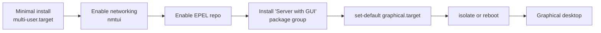

# CentOS 9 minimal to GUI Installation

## Overview

A **CentOS Stream 9** minimal install ships with no graphical desktop — only a text console. This note walks through promoting that minimal server into a full graphical (GUI) workstation using YUM package **groups**, then switching the default systemd target so the desktop starts at boot.

The workflow is: bring up networking, enable extra repositories, install the desktop package group, and change the boot target from multi-user (text) to graphical.

> [!NOTE]
> On CentOS Stream 9 the `yum` command is a compatibility symlink to [DNF](DNF-Package-Manager.md); the commands below work identically under `dnf`. See [Yum(Yellowdog-Updater-Modified)](Yum(Yellowdog-Updater-Modified).md) and [Yum-Command-Reference](Yum-Command-Reference.md).

## Boot Target Flow



## Prerequisites and Networking

- Enable the text-mode network management tool to configure interfaces and DNS:

```bash
nmtui
```

## Enabling Repositories

- List all repositories, including those currently disabled:

```bash
yum repolist all
```

- Install the EPEL (Extra Packages for Enterprise Linux) repository and others:

```bash
yum install epel-release.noarch
```

> [!TIP]
> EPEL provides many community packages (extra tools, utilities) that are not in the base CentOS repositories but are commonly needed on a workstation.

## Installing Base Tools

- Install a set of basic tools (shells, editor, networking utilities):

```bash
yum install bash* vim net-tools zsh*
```

## Working with Package Groups

Package **groups** bundle many related packages under a single name so an entire role — like a development toolchain or a desktop environment — can be installed in one command.

- List the groups available in YUM:

```bash
yum groups list
```

- Install the development tools group (compilers, `make`, build utilities):

```bash
yum groups install "Development Tools"
```

- Install the full desktop environment group:

```bash
yum groups install "Server with GUI"
```

> [!NOTE]
> **📸 Screenshot**
> _Capture: Terminal showing yum resolving and downloading the hundreds of packages that make up the "Server with GUI" group, with the transaction summary and total download size_

## Switching to the Graphical Target

systemd controls whether the system boots to a text console (`multi-user.target`) or a graphical desktop (`graphical.target`).

| Target | Description |
| :-- | :-- |
| `multi-user.target` | Multi-user text console, networking, no GUI (default on minimal install). |
| `graphical.target` | Everything in multi-user plus the graphical display manager and desktop. |

- Check the current default system target:

```bash
systemctl get-default
```

- Set the graphical target as the default (persists across reboots):

```bash
systemctl set-default graphical.target
```

- Switch to the graphical target immediately, without rebooting:

```bash
systemctl isolate graphical.target
```

- Or reboot the system to apply the change:

```bash
reboot
```

## Best Practices

- **Set the default before rebooting** so the GUI comes up automatically on the next boot: run `systemctl set-default graphical.target`, then `systemctl isolate graphical.target` to bring it up live.
- **Verify networking first** with `nmtui`; package group installs pull hundreds of packages and will fail without a working connection and DNS.
- **Install only the groups you need** — a GUI on a server increases the attack surface and resource footprint.

## Security Considerations

> [!WARNING]
> Adding a graphical desktop to a server installs a display manager, many client libraries, and extra listening services. On a hardened production server, keep the system at `multi-user.target` unless the GUI is genuinely required (CIS Benchmark guidance recommends minimizing installed software and disabling the GUI on servers).

- Prefer remote administration over a local desktop where possible; a headless server has a smaller attack surface.
- Only enable third-party repositories (like EPEL) that you trust, and keep GPG signature checking enabled.

## References

- [CentOS Stream Documentation](https://docs.centos.org/)
- [Red Hat Enterprise Linux 9 — Managing software with the DNF tool](https://docs.redhat.com/en/documentation/red_hat_enterprise_linux/9/html/managing_software_with_the_dnf_tool/index)
- [systemd targets — freedesktop.org](https://www.freedesktop.org/software/systemd/man/latest/systemd.target.html)

## Related

- [Yum(Yellowdog-Updater-Modified)](Yum(Yellowdog-Updater-Modified).md) — installs the GUI package groups.
- [Yum-Command-Reference](Yum-Command-Reference.md) — YUM command cheat sheet.
- [DNF-Package-Manager](DNF-Package-Manager.md) — modern replacement for YUM on CentOS 9.
- [Wine-Install-in-Centos-9](Wine-Install-in-Centos-9.md) — further CentOS 9 setup.
- [Package-Manager-in-Linux](Package-Manager-in-Linux.md) — package management overview.
- [Linux Administration & Server Hardening](../Readme.md) — Linux administration & server hardening hub.
