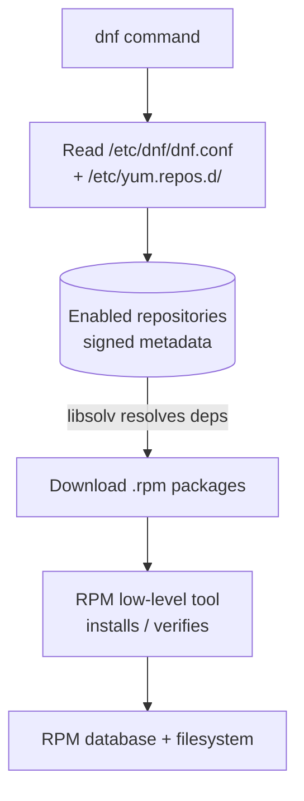

# DNF Package Manager

## Overview

**DNF (Dandified YUM)** is the next-generation package manager for RPM-based Linux distributions such as Fedora, RHEL 8+, CentOS Stream, Rocky Linux, and AlmaLinux. It replaces [YUM](Yum(Yellowdog-Updater-Modified).md) with improved speed, better dependency resolution (via `libsolv`), and a modern, Python 3-based architecture — while keeping command syntax largely compatible with YUM.

DNF is the high-level front-end that sits on top of [RPM](Red-Hat-Package-Manager(RPM).md), adding automatic dependency resolution and repository handling.

## Concepts

### Key Improvements Over YUM

| Improvement | Benefit |
| :-- | :-- |
| `libsolv` dependency solver | Faster, more accurate dependency resolution. |
| Parallel downloads | Multiple packages fetched simultaneously. |
| Transaction history & rollback | Undo or roll back past operations. |
| Plugin-based extensibility | Add capabilities without changing the core. |
| Python 3 codebase | Modern, maintainable, and secure. |
| YUM syntax compatibility | Minimal relearning for YUM users. |

### Core Functionalities and Recent Features

- Package installation, upgrades, and removals with automatic dependency handling.
- Parallel downloads for faster operations.
- Modular package support (streams and profiles).
- Security enhancements for package verification.
- Performance optimization.
- Extended API for automation.

## Architecture



## Configuration

| Path | Purpose |
| :-- | :-- |
| `/etc/dnf/dnf.conf` | Global DNF configuration. |
| `/etc/yum.repos.d/` | Repository definition files (`*.repo`). |

## Commands

### Command Reference

| Command | Description |
| :-- | :-- |
| `dnf update` | Update all installed packages to the latest version. |
| `dnf upgrade` | Upgrade all packages, removing obsolete ones if needed. |
| `dnf install <package>` | Install specified package(s). |
| `dnf remove <package>` | Remove specified package(s) and unnecessary dependencies. |
| `dnf search <keyword>` | Search for packages matching the keyword. |
| `dnf info <package>` | Show detailed info about a package. |
| `dnf list` | List all available and installed packages. |
| `dnf list installed` | List installed packages. |
| `dnf list available` | List packages available for installation. |
| `dnf list updates` | List packages with available updates. |
| `dnf list extras` | List installed packages not found in enabled repos. |
| `dnf check` | Perform a system check for dependency problems or errors. |
| `dnf clean all` | Clean all cached package data and metadata. |
| `dnf history` | Show history of package transactions. |
| `dnf history undo <transaction_id>` | Undo a specific transaction by its ID. |
| `dnf history rollback <transaction_id>` | Roll back system state to a specific transaction. |
| `dnf group list` | List all available package groups. |
| `dnf group info "<group>"` | Show information about a specific package group. |
| `dnf group install "<group>"` | Install a package group. |
| `dnf group remove "<group>"` | Remove a package group. |
| `dnf deplist <package>` | List dependencies for a specified package. |
| `dnf provides <file>` | Find which package provides a specified file. |
| `dnf repolist` | List enabled repositories. |
| `dnf repolist all` | List all repositories, including disabled ones. |
| `dnf config-manager --add-repo <url>` | Add a new repository. |
| `dnf config-manager --disable <repo>` | Disable a repository. |
| `dnf config-manager --enable <repo>` | Enable a repository. |
| `dnf autoremove` | Remove all orphaned packages no longer needed. |
| `dnf version` | Show DNF version information. |

### Basic DNF Usage

- Update all packages:

```bash
dnf update
```

- Upgrade all packages:

```bash
dnf upgrade
```

- Install a package:

```bash
dnf install <package>
```

```bash
dnf install netcat
```

- Remove a package:

```bash
dnf remove <package>
```

```bash
dnf remove netcat
```

- Search for packages:

```bash
dnf search <keyword>
```

```bash
dnf search netcat
```

- Show information about a package:

```bash
dnf info <package>
```

```bash
dnf info netcat
```

- List all packages:

```bash
dnf list
```

- List installed packages:

```bash
dnf list installed
```

- List packages available for installation:

```bash
dnf list available
```

- List packages with available updates:

```bash
dnf list updates
```

```bash
dnf list upgrades
```

```bash
dnf list recent
```

- List dependencies for a specified package:

```bash
dnf deplist <package>
```

- Find which package provides a specified file:

```bash
dnf provides <file>
```

- Clean cache:

```bash
dnf clean all
```

- View transaction history:

```bash
dnf history
```

- Manage package groups:

```bash
dnf group list
```

```bash
dnf group install "<group>"
```

```bash
dnf group remove "<group>"
```

- List enabled repositories:

```bash
dnf repolist
```

- List all repositories, including disabled ones:

```bash
dnf repolist all
```

- Remove all orphaned packages no longer needed:

```bash
dnf autoremove
```

- Undo a specific transaction by its ID:

```bash
dnf history undo <transaction_id>
```

- Roll back system state to a specific transaction:

```bash
dnf history rollback <transaction_id>
```

## Best Practices

- Run `dnf check-update` before large upgrade windows to preview what will change.
- Use `dnf history` and `dnf history undo` to recover from a bad transaction rather than manually reinstalling.
- Periodically run `dnf autoremove` to prune orphaned dependencies.
- Keep `dnf clean all` in mind when metadata appears stale or corrupted.

## Security Considerations

> [!IMPORTANT]
> DNF enforces GPG signature verification (`gpgcheck=1`) by default. Leave it enabled — it is the primary defense against tampered or spoofed packages.

- Never set `gpgcheck=0` on production repositories; CIS Benchmarks explicitly require GPG checking to remain enabled.
- Vet third-party repositories added with `dnf config-manager --add-repo`, and verify their signing key fingerprints out-of-band.
- Automate security patching with `dnf-automatic` to apply fixes promptly (NIST SP 800-40).
- Audit installed packages with `rpm -Va` to detect files modified since installation.

## Troubleshooting

- Diagnose dependency or database problems:

```bash
dnf check
```

- Clear a corrupted metadata cache and retry:

```bash
dnf clean all
```

- Roll back a problematic transaction after finding its ID with `dnf history`:

```bash
dnf history undo <transaction_id>
```

## References

- [Fedora DNF Documentation](https://docs.fedoraproject.org/en-US/quick-docs/dnf/)
- [DNF Command Reference](https://dnf.readthedocs.io/en/latest/command_ref.html)

## Related

- [Package-Manager-in-Linux](Package-Manager-in-Linux.md) — package management overview.
- [Yum(Yellowdog-Updater-Modified)](Yum(Yellowdog-Updater-Modified).md) — DNF's predecessor.
- [Yum-Command-Reference](Yum-Command-Reference.md) — YUM command cheat sheet.
- [Red-Hat-Package-Manager(RPM)](Red-Hat-Package-Manager(RPM).md) — underlying `.rpm` package tool.
- [CentOS-9-minimal-to-GUI-Installation](CentOS-9-minimal-to-GUI-Installation.md) — DNF/YUM groups in practice.
- [Linux Administration & Server Hardening](../Readme.md) — Linux administration & server hardening hub.
