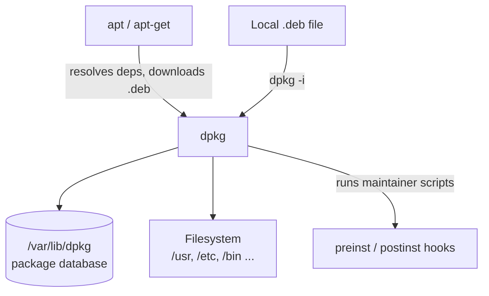

# Debian Package Manager (dpkg)

## Overview

The **Debian Package Manager (dpkg)** is the core low-level tool for handling `.deb` packages in Debian-based systems such as Debian, Ubuntu, Kali Linux, and Raspberry Pi OS. It installs, removes, and queries individual package files directly, but does **not** automatically resolve dependencies — which is why high-level front-ends like [apt](Advanced-Package-Tool(APT).md) and `apt-get` are used alongside it for repository-driven, dependency-aware operations.

Every `apt install` ultimately ends in one or more `dpkg` invocations; understanding `dpkg` is therefore essential for troubleshooting broken installs, auditing what a package owns, and inspecting `.deb` files by hand.

> [!NOTE]
> `dpkg` operates only on packages you already have on disk. If a `.deb` needs other packages, `dpkg -i` will report unmet dependencies and leave the package half-configured until you run `apt-get install -f`.

## Concepts

| Term | Meaning |
| :-- | :-- |
| `.deb` | The Debian binary package format — an `ar` archive containing metadata plus the file tree to install. |
| Low-level tool | `dpkg` acts on a single package file with no repository or dependency awareness. |
| High-level front-end | `apt` / `apt-get` fetch from repositories and resolve dependencies, then call `dpkg`. |
| Package database | `/var/lib/dpkg/` records installed packages, their versions, and the files each one owns. |
| Package state | Every package is in a state such as `installed`, `config-files` (removed but config kept), or `half-configured`. |

## Architecture

The following diagram shows where `dpkg` sits relative to APT and the system it modifies.



## System Information Commands

- View distribution release information:

```bash
ls -lh /etc/*-release
```

```bash
cat /etc/os-release
```

- Print system architecture:

```bash
dpkg --print-architecture
```

## Basic dpkg Commands

### Installing and Removing

- Install a `.deb` package:

```bash
dpkg -i package_name.deb
```

- Fix missing dependencies:

```bash
apt-get install -f
```

- Remove a package (keep config files):

```bash
dpkg -r package_name
```

- Remove a package and its config files (purge):

```bash
dpkg --purge package_name
```


### Querying Packages

- List all installed packages:

```bash
dpkg -l
```

- Count total installed packages:

```bash
dpkg -l | wc -l
```

- Search for a package in the list:

```bash
dpkg -l | grep package_name
```

- Check if a package is installed:

```bash
dpkg -s package_name
```

- Get details of an installed package:

```bash
dpkg -p package_name
```

- List files installed by a package:

```bash
dpkg -L package_name
```

- Find which package owns a file:

```bash
dpkg -S /path/to/file
```

```bash
dpkg -S /usr/bin/zip
```

```bash
dpkg-query --search '/path/to/file'
```

```bash
dpkg-query --search /usr/bin/zip
```

### Working with .deb Files

- Download a `.deb` file:

```bash
wget <package_url>.deb
```

- Show package contents without installing:

```bash
dpkg --contents package.deb
```

```bash
dpkg-deb -c package.deb
```

- Extract contents of a package:

```bash
dpkg -x package.deb /output_directory/
```

```bash
dpkg -x nmap_7.95+dfsg-3_amd64.deb /tmp/
```

```bash
dpkg-deb -xv package.deb /output_directory/
```

```bash
dpkg-deb -xv nmap_7.95+dfsg-3_amd64.deb /tmp/
```

### Fixing Issues

- Reconfigure an installed package:

```bash
dpkg-reconfigure package_name
```

- Repair a broken installation:

```bash
dpkg --configure -a
```

## Useful Tips for Package Discovery

- Find the binary path:

```bash
which command_name
```

```bash
which zsh
```

```bash
dpkg -S /usr/bin/zsh
```

```bash
dpkg -s zsh
```

- Locate all related files:

```bash
whereis command_name
```

## Command Reference

| Command | Purpose |
| :-- | :-- |
| `dpkg -i pkg.deb` | Install a `.deb` package. |
| `dpkg -r pkg` | Remove a package, keeping config files. |
| `dpkg --purge pkg` | Remove a package and its config files. |
| `dpkg -l` | List installed packages. |
| `dpkg -s pkg` | Show status/details of an installed package. |
| `dpkg -L pkg` | List files installed by a package. |
| `dpkg -S /path` | Show which package owns a file. |
| `dpkg -x pkg.deb dir/` | Extract package contents to a directory. |
| `dpkg --contents pkg.deb` | List contents of a `.deb` without installing. |
| `dpkg --configure -a` | Configure all half-installed packages. |
| `dpkg-reconfigure pkg` | Re-run a package's configuration. |

## Best Practices

- After a manual `dpkg -i`, always run `apt-get install -f` to satisfy any dependencies `dpkg` could not resolve on its own.
- Use `dpkg -L` and `dpkg -S` to audit exactly which files a package owns and which package owns a given file — invaluable during incident response.
- Prefer `apt` for everyday installs so dependencies and signatures are handled automatically; reserve raw `dpkg` for local `.deb` files and low-level inspection.
- Use `--purge` rather than `-r` when you want configuration removed too, to avoid stale config lingering under `/etc`.

## Security Considerations

> [!WARNING]
> `dpkg -i` installs a `.deb` **without verifying any GPG signature** — it trusts whatever file you hand it. Unlike `apt`, there is no repository trust check.

- **Only install `.deb` files from trusted sources.** Verify checksums/signatures out-of-band before running `dpkg -i` on a downloaded package.
- **Beware maintainer scripts.** `.deb` packages can run `preinst`/`postinst` scripts as root — inspect an untrusted package with `dpkg --contents` and `dpkg-deb -e` before installing.
- **Audit installed files** with `dpkg -V` to detect files that changed since installation (integrity checking aligned with CIS Benchmark guidance).
- **Prefer repository installs** via `apt`, which enforce GPG verification, over ad-hoc `dpkg -i`.

## Troubleshooting

- Repair packages left half-configured after a failed install:

```bash
dpkg --configure -a
```

- Resolve unmet dependencies reported by `dpkg -i`:

```bash
apt-get install -f
```

- Verify integrity of files owned by an installed package:

```bash
dpkg -V package_name
```

## References

- [dpkg(1) manual page](https://manpages.debian.org/bookworm/dpkg/dpkg.1.en.html)
- [Debian Wiki — Package Management](https://wiki.debian.org/PackageManagement)

## Related

- [Package-Manager-in-Linux](Package-Manager-in-Linux.md) — package management overview across distros.
- [Advanced-Package-Tool(APT)](Advanced-Package-Tool(APT).md) — high-level, dependency-aware front-end over dpkg.
- [apt-cache-and-apt-get](apt-cache-and-apt-get.md) — query and install `.deb` packages from repositories.
- [Linux Administration & Server Hardening](../Readme.md) — Linux administration & server hardening hub.
