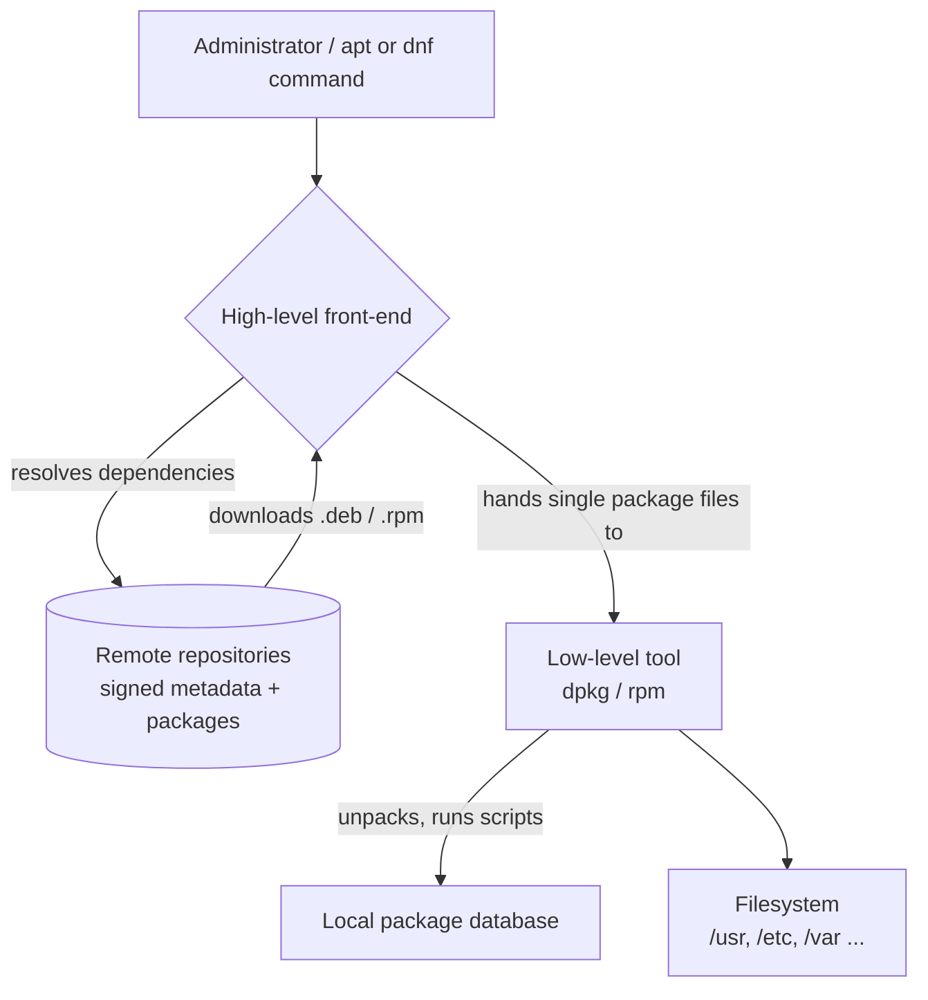

# Package Manager in Linux

## Overview

Linux **package managers** automate installing, updating, configuring, and removing software on a Linux system. They resolve dependencies, verify package authenticity, and pull software from trusted **repositories**, turning what would otherwise be error-prone manual compilation into a consistent, repeatable operation.

Each distribution family ships its own package manager, tailored to a package format (`.deb`, `.rpm`, source, or containerized) and repository layout. Choosing and understanding the right tool for a given distro is a core Linux administration skill and a prerequisite for secure, patch-current systems.

> [!NOTE]
> This note is the map for the Package-Management module. Each manager below has a dedicated deep-dive note linked in [Related Notes](#related-notes).

## Concepts

A package manager sits between the administrator and the raw software, providing four foundational guarantees:

| Concept | What it provides |
| :-- | :-- |
| **Dependency resolution** | Automatically installs the libraries and tools a package requires, in the correct order. |
| **Repositories** | Centralized, signed software sources that guarantee authenticity and integrity. |
| **Transaction tracking** | A database of what is installed, at which version, and which files each package owns. |
| **Atomic operations** | Install / upgrade / remove operations that can be queried, verified, and (in modern tools) rolled back. |

Most families separate the **low-level tool** (operates on a single package file, no dependency resolution) from the **high-level front-end** (talks to repositories and resolves dependencies):

| Family | Low-level tool | High-level front-end | Package format |
| :-- | :-- | :-- | :-- |
| Debian / Ubuntu | `dpkg` | `apt`, `apt-get` | `.deb` |
| Red Hat / Fedora | `rpm` | `dnf`, `yum` | `.rpm` |
| Arch | — | `pacman` | `.pkg.tar.zst` |
| openSUSE | `rpm` | `zypper` | `.rpm` |
| Gentoo | — | `portage` (`emerge`) | source |

## Architecture

The following diagram shows how the high-level front-end, low-level tool, and repositories relate on a typical Debian- or Red Hat-based system.



## Popular Linux Package Managers

### Red Hat Package Manager (RPM)

- **Used in:** Red Hat-based distributions like RHEL, CentOS, Fedora.
- **Package format:** `.rpm`
- **Front-end tools:** YUM (Yellowdog Updater Modified) and DNF (Dandified YUM) add dependency resolution on top of `rpm`.

Core `rpm` commands:

```bash
rpm -i package.rpm       # install a package
rpm -e package-name      # remove a package
rpm -q package-name      # query a package
rpm -V package-name      # verify an installed package
rpm -qa                  # list all installed packages
```

Front-end usage:

```bash
yum install package-name       # or: dnf install package-name
sudo yum update                # or: sudo dnf update
```

> [!NOTE]
> DNF has largely replaced YUM in newer Fedora and RHEL releases due to better performance, cleaner dependency solving, and stronger package verification.

### Debian Package Manager (dpkg)

- **Used in:** Debian-based distributions like Debian, Ubuntu, Linux Mint, Kali.
- **Package format:** `.deb`
- **Higher-level tool:** APT (Advanced Package Tool) adds dependency and repository handling.

Core `dpkg` commands:

```bash
dpkg -i package.deb      # install a package
dpkg -r package-name     # remove a package
dpkg -l                  # list installed packages
dpkg -s package-name     # query package details
apt-get install -f       # fix broken dependencies
```

APT usage:

```bash
sudo apt install package-name  # install
sudo apt update                # refresh package lists
sudo apt upgrade               # upgrade installed packages
```

### Pacman

- **Used in:** Arch Linux and derivatives (like Manjaro).
- **Notes:** Fast and lightweight; syntax can be less intuitive at first.

```bash
sudo pacman -Syu             # update the whole system
sudo pacman -S package-name  # install a package
sudo pacman -R package-name  # remove a package
sudo pacman -Ss search-term  # search packages
```

### Zypper

- **Used in:** openSUSE and SUSE Linux Enterprise.
- **Notes:** Robust package manager with both CLI and GUI support.

```bash
sudo zypper refresh              # refresh repositories
sudo zypper update               # update packages
sudo zypper install package-name # install a package
sudo zypper remove package-name  # remove a package
zypper search search-term        # search packages
```

### Portage

- **Used in:** Gentoo Linux.
- **Notes:** Compiles packages from source for maximum customization; has a steep learning curve.

```bash
sudo emerge --sync                 # sync the Portage tree
sudo emerge package-name           # install a package
sudo emerge --unmerge package-name # remove a package
emerge --search search-term        # search packages
```

### Universal Package Managers

- **Snap (Snapcraft)** and **Flatpak** provide distro-independent, sandboxed package formats.
- Useful for installing apps across different distros without worrying about the underlying package manager.
- May have larger package sizes because dependencies are bundled inside the package.

## Comparison Summary

| Package Manager | Usage | Package Format | Pros | Cons |
| :-- | :-- | :-- | :-- | :-- |
| APT | Debian/Ubuntu | `.deb` | Versatile, good dependency handling | Multiple similar tools cause confusion |
| RPM + DNF/YUM | Red Hat/Fedora | `.rpm` | Good dependency management | YUM is older and slower than DNF |
| Pacman | Arch Linux | `.pkg.tar.xz` | Fast, lightweight | Less intuitive CLI syntax |
| Zypper | openSUSE | `.rpm` | Robust, fast, supports GUI | Limited to SUSE-based distros |
| Portage | Gentoo | Source-based | Highly customizable | Slow installs, steep learning curve |
| Snap/Flatpak | Universal | Containerized | Distro independent, sandboxed | Larger packages, less customization |

## Commands

Everyday operations mapped across the three most common front-ends:

| Operation | APT (Debian/Ubuntu) | DNF (Fedora/Red Hat) | Pacman (Arch) |
| :-- | :-- | :-- | :-- |
| Update package list | `sudo apt update` | `sudo dnf check-update` | `sudo pacman -Sy` |
| Upgrade packages | `sudo apt upgrade` | `sudo dnf upgrade` | `sudo pacman -Syu` |
| Install a package | `sudo apt install pkg` | `sudo dnf install pkg` | `sudo pacman -S pkg` |
| Remove a package | `sudo apt remove pkg` | `sudo dnf remove pkg` | `sudo pacman -R pkg` |
| Search packages | `apt search keyword` | `dnf search keyword` | `pacman -Ss keyword` |
| List installed | `apt list --installed` | `dnf list installed` | `pacman -Q` |

## Why Package Managers Matter

- They **automate software maintenance**, reducing manual errors.
- **Dependency resolution** ensures all required components are installed.
- They keep the system **secure and up-to-date** by simplifying patching.
- They provide **centralized software sources (repositories)** ensuring software authenticity.

## Best Practices

- **Refresh metadata before installing** (`apt update`, `dnf check-update`) so you resolve against current versions.
- **Prefer distribution repositories** over ad-hoc third-party sources; every extra repo widens the trust boundary.
- **Patch on a schedule.** Unattended-upgrades (Debian) or `dnf-automatic` (RHEL) keep security fixes current.
- **Remove orphaned packages** (`apt autoremove`, `dnf autoremove`) to shrink the attack surface.
- **Standardize on one front-end per host** to avoid the confusion of mixing `apt`, `apt-get`, and `aptitude`.

## Security Considerations

> [!WARNING]
> Repositories and their signing keys are a supply-chain trust anchor. A compromised or spoofed repo can push malicious packages to every host that trusts it.

- **Verify package signatures.** APT and DNF enforce GPG signature checks by default — never disable them (`--allow-unauthenticated`, `gpgcheck=0`) on production systems. This aligns with CIS Benchmark guidance to keep `gpgcheck` enabled.
- **Pin trusted keys explicitly.** Import third-party GPG keys into the dedicated trusted keyring directories rather than the global keyring, and confirm fingerprints out-of-band.
- **Use HTTPS repository mirrors** where available to prevent metadata tampering in transit.
- **Audit installed packages** periodically (`rpm -Va`, `dpkg -V`) to detect files that have been modified since installation.
- **Keep the system patched.** Timely updates are one of the highest-value security controls (NIST SP 800-40 patch management).

## Conclusion

Linux package managers are the foundation for managing software across diverse Linux ecosystems. The right choice depends largely on the distribution and your familiarity with the tool. Modern front-ends like DNF and APT provide robust dependency management, Arch's Pacman is favored for speed and simplicity, and universal systems like Snap and Flatpak offer cross-distro support at the cost of package size.

## References

- Comparison of major Linux package management systems.
- Exploring Linux Package Managers (APT, YUM, DNF).
- Package management overview and commands.

## Related

- [Advanced-Package-Tool(APT)](Advanced-Package-Tool(APT).md) — Debian/Ubuntu high-level package front-end.
- [Debian-Package-Manager(dpkg)](Debian-Package-Manager(dpkg).md) — low-level `.deb` package handler.
- [apt-cache-and-apt-get](apt-cache-and-apt-get.md) — legacy APT query and install front-ends.
- [DNF-Package-Manager](DNF-Package-Manager.md) — modern Fedora/RHEL package manager.
- [Red-Hat-Package-Manager(RPM)](Red-Hat-Package-Manager(RPM).md) — low-level `.rpm` package handler.
- [Yum(Yellowdog-Updater-Modified)](Yum(Yellowdog-Updater-Modified).md) — legacy RHEL/CentOS manager.
- [Yum-Command-Reference](Yum-Command-Reference.md) — YUM command cheat sheet.
- [CentOS-9-minimal-to-GUI-Installation](CentOS-9-minimal-to-GUI-Installation.md) — package groups in practice.
- [Linux Administration & Server Hardening](../Readme.md) — Linux administration & server hardening hub.
