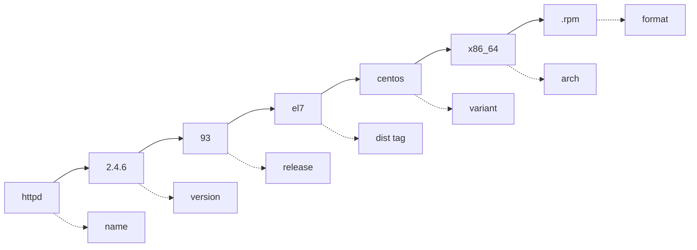

# Red Hat Package Manager (RPM)

## Overview

RPM (Red Hat Package Manager) is the low-level package management system used across Red Hat–based Linux distributions such as Red Hat Enterprise Linux (RHEL), CentOS, Fedora, Rocky Linux, and AlmaLinux. It is an open packaging format that has also been adopted by a range of other UNIX and Linux systems.

RPM operates directly on `.rpm` package files and the local RPM database. It does **not** resolve dependencies over the network — that is the job of higher-level front ends such as [Yum(Yellowdog-Updater-Modified)](Yum(Yellowdog-Updater-Modified).md) and [DNF-Package-Manager](DNF-Package-Manager.md). Understanding RPM is essential for querying, verifying, and auditing exactly what is installed on a system.

> [!NOTE]
> RPM is the *engine*; `yum`/`dnf` are the *drivers*. For day-to-day installs prefer the front ends, but use `rpm` directly for querying, verification, and forensic auditing.

## Concepts

### Key Features

- **File Extension:** `.rpm` is the standard file extension used for RPM packages.
- **Usage:** RPM handles installing, uninstalling, upgrading, querying, listing, and verifying packages on Linux systems. RPM packages may contain software, documentation, and source code.
- **RPM File Types:**
  - **Binary RPM:** Contains a precompiled software application or library.
  - **Source RPM (SRPM):** Contains the source code and build instructions to compile software locally.
- **Package Contents:**
  - Application binaries or libraries
  - Documentation like man pages
  - Configuration files
  - SPEC file (`.spec`) which contains metadata, build instructions, and scripts for packaging

### Architecture Types

| Architecture tag | Target system |
| :-- | :-- |
| `i386` | 32-bit systems |
| `x86_64` | 64-bit systems |
| `noarch` | Architecture-independent software |

## Architecture

### RPM Database

RPM maintains an internal database in `/var/lib/rpm` that tracks installed packages, their versions, and metadata. This database is critical for package verification, querying, and management. If it becomes corrupted, package operations fail until it is rebuilt (`rpm --rebuilddb`).

```bash
cd /var/lib/rpm
```

```bash
ls -lh
```

### Package Naming Convention

RPM filenames encode everything needed to identify a build. Reading them fluently is a core administration skill:

```bash
httpd-2.4.6-93.el7.centos.x86_64.rpm
```

- `httpd`: Package name (Apache HTTP Server)
- `2.4.6`: Package version
- `93`: Package release number (incremented for builds/updates)
- `el7`: Target distribution and version (Enterprise Linux 7)
- `centos`: Distribution variant (CentOS)
- `x86_64`: Architecture (64-bit)
- `.rpm`: File format



## Configuration

### Basic System Checks and Tools

- Check Linux distribution release

```bash
cat /etc/os-release
```

- Check kernel info

```bash
uname -a
```

- Verify rpm version

```bash
rpm --version
```

- Get help on rpm usage

```bash
rpm --help
```

## Commands

### Querying Installed Packages

- Query if a package is installed:

```bash
rpm -q package-name
```

- List all installed packages:

```bash
rpm -qa
```

```bash
rpm -qa --last
```

```bash
rpm -qa | grep ssh
```

- Check detailed package info:

```bash
rpm -qi package-name
```

- List files in a package:

```bash
rpm -ql package-name
```

- List configuration files of a package:

```bash
rpm -qc package-name
```

- List documentation files:

```bash
rpm -qd package-name
```

- Verify package integrity:

```bash
rpm -V package-name
```

- Query which package owns a file:

```bash
rpm -qf /path/to/file
```

### Querying an Uninstalled `.rpm` File

The `-p` flag lets you inspect a package file *before* installing it — invaluable for supply-chain review.

- Download Apache HTTPD RPM package

```bash
wget https://mirror.stream.centos.org/9-stream/AppStream/x86_64/os/Packages/httpd-2.4.62-7.el9.x86_64.rpm
```

- Show detailed package info (uninstalled package):

```bash
rpm -qpi httpd-2.4.62-7.el9.x86_64.rpm
```

- List all files in the package:

```bash
rpm -qpl httpd-2.4.62-7.el9.x86_64.rpm
```

- List configuration files in the package:

```bash
rpm -qpc httpd-2.4.62-7.el9.x86_64.rpm
```

- List documentation files in the package:

```bash
rpm -qpd httpd-2.4.62-7.el9.x86_64.rpm
```

- List package dependencies and required capabilities:

```bash
rpm -qpR httpd-2.4.62-7.el9.x86_64.rpm
```

- List license files included in the package:

```bash
rpm -qpL httpd-2.4.62-7.el9.x86_64.rpm
```

### Query Flag Reference

| Flag | Purpose |
| :-- | :-- |
| `-q` | Query an installed package |
| `-qa` | List all installed packages |
| `-qi` | Show package information (summary, version, license) |
| `-ql` | List files owned by the package |
| `-qc` | List configuration files |
| `-qd` | List documentation files |
| `-qf` | Show which package owns a given file |
| `-qp` | Operate on an uninstalled `.rpm` file (combine with `i/l/c/d/R/L`) |
| `-V` | Verify installed files against database |
| `-q --provides` | List capabilities the package provides |
| `-q --requires` | List capabilities the package requires |

### Installing Packages

- Install a package:

```bash
rpm -i package.rpm
```

- Install with verbose output and progress:

```bash
rpm -ivh package.rpm
```

- Upgrade an existing package or install if not present:

```bash
rpm -Uvh package.rpm
```

- Ignore dependencies (not generally recommended):

```bash
rpm --nodeps -ivh package.rpm
```

> [!WARNING]
> `--nodeps` forces installation while bypassing dependency checks. This can leave software non-functional or silently break other packages. Reserve it for controlled recovery scenarios, never routine installs.

### Removing Packages

- Remove a package:

```bash
rpm -e package-name
```

- Remove package with verbose output:

```bash
rpm -evh package-name
```

- Remove ignoring dependencies:

```bash
rpm --nodeps -evh package-name
```

## Examples

### Useful Package Query Examples

- Check if firefox is installed

```bash
rpm -q firefox
```

- List all packages with 'vim' in the name

```bash
rpm -qa | grep vim
```

- Show which package owns /usr/bin/python3

```bash
rpm -qf /usr/bin/python3
```

- Display all installed packages sorted by installation time

```bash
rpm -qa --last
```

- Show files in installed openssh-server package

```bash
rpm -ql openssh-server
```

- Verify integrity of nginx package

```bash
rpm -V nginx
```

- Query provides of a package (capabilities it offers)

```bash
rpm -q --provides nginx
```

- List capabilities this package provides.

```bash
rpm -q --provides openssh-server
```

- Path size mtime digest mode owner group isconfig isdoc rdev symlink

```bash
rpm -q --dump openssh-server
```

- Display the states of files in the package (implies -l). The state of each file is one of normal, not installed, or replaced.

```bash
rpm -qs openssh-server
```

### LibreOffice Installation and Management

- Download LibreOffice 7.1.3 RPM package for x86_64 Linux

```bash
wget https://mirrors.estointernet.in/tdf/libreoffice/stable/7.1.3/rpm/x86_64/LibreOffice_7.1.3_Linux_x86-64_rpm.tar.gz
```

- Extract the downloaded tarball

```bash
tar -xvf LibreOffice_7.1.3_Linux_x86-64_rpm.tar.gz
```

- Install all RPM packages in the extracted folder (method 1)

```bash
rpm -ivh *.rpm
```

- Install all RPM packages in the extracted folder (alternative method)

```bash
rpm -ivh *.*
```

- List installed LibreOffice and libobasis packages, output all on one line with spaces (method 1)

```bash
rpm -qa | grep -E "libreoffice|libobasis" | tr "\n" " "
```

- List installed LibreOffice and libobasis packages, output all on one line with spaces (method 2)

```bash
rpm -qa | grep -E "libreoffice|libobasis" | tr '\n' ' '
```

- Remove specific LibreOffice 7.1 packages by name

```bash
rpm -evh libreoffice7.1-ure-7.1.3.2-2.x86_64 libreoffice7.1-calc-7.1.3.2-2.x86_64 libreoffice7.1-en-US-7.1.3.2-2.x86_64 libreoffice7.1-7.1.3.2-2.x86_64 libreoffice7.1-math-7.1.3.2-2.x86_64 libreoffice7.1-dict-es-7.1.3.2-2.x86_64 libreoffice7.1-impress-7.1.3.2-2.x86_64 libreoffice7.1-base-7.1.3.2-2.x86_64 libreoffice7.1-dict-fr-7.1.3.2-2.x86_64 libreoffice7.1-writer-7.1.3.2-2.x86_64 libreoffice7.1-draw-7.1.3.2-2.x86_64 libobasis7.1-libreofficekit-data-7.1.3.2-2.x86_64 libreoffice7.1-dict-en-7.1.3.2-2.x86_64 libreoffice7.1-freedesktop-menus-7.1.3-2.noarch libobasis7.1-en-US-7.1.3.2-2.x86_64 libobasis7.1-ogltrans-7.1.3.2-2.x86_64 libobasis7.1-firebird-7.1.3.2-2.x86_64 libobasis7.1-xsltfilter-7.1.3.2-2.x86_64 libobasis7.1-writer-7.1.3.2-2.x86_64 libobasis7.1-librelogo-7.1.3.2-2.x86_64 libobasis7.1-extension-nlpsolver-7.1.3.2-2.x86_64 libobasis7.1-onlineupdate-7.1.3.2-2.x86_64 libobasis7.1-core-7.1.3.2-2.x86_64 libobasis7.1-calc-7.1.3.2-2.x86_64 libobasis7.1-extension-beanshell-script-provider-7.1.3.2-2.x86_64 libobasis7.1-extension-pdf-import-7.1.3.2-2.x86_64 libobasis7.1-graphicfilter-7.1.3.2-2.x86_64 libobasis7.1-ooolinguistic-7.1.3.2-2.x86_64 libobasis7.1-base-7.1.3.2-2.x86_64 libobasis7.1-draw-7.1.3.2-2.x86_64 libobasis7.1-math-7.1.3.2-2.x86_64 libobasis7.1-extension-javascript-script-provider-7.1.3.2-2.x86_64 libobasis7.1-extension-report-builder-7.1.3.2-2.x86_64 libobasis7.1-kde-integration-7.1.3.2-2.x86_64 libobasis7.1-python-script-provider-7.1.3.2-2.x86_64 libobasis7.1-impress-7.1.3.2-2.x86_64 libobasis7.1-pyuno-7.1.3.2-2.x86_64 libobasis7.1-extension-mediawiki-publisher-7.1.3.2-2.x86_64 libobasis7.1-libreofficekit-data-7.1.3.2-2.x86_64 libobasis7.1-ooofonts-7.1.3.2-2.x86_64 libobasis7.1-images-7.1.3.2-2.x86_64 libobasis7.1-postgresql-sdbc-7.1.3.2-2.x86_64 libobasis7.1-gnome-integration-7.1.3.2-2.x86_64
```

### Apache OpenOffice Installation and Management

- Download Apache OpenOffice 4.1.7 RPM package for x86_64 Linux

```bash
wget https://excellmedia.dl.sourceforge.net/project/openofficeorg.mirror/4.1.7/binaries/en-US/Apache_OpenOffice_4.1.7_Linux_x86-64_install-rpm_en-US.tar.gz
```

- Extract the downloaded tarball

```bash
tar -xvf Apache_OpenOffice_4.1.7_Linux_x86-64_install-rpm_en-US.tar.gz
```

- Change directory to RPMS folder

```bash
cd RPMS/
```

- Install all RPM packages in RPMS folder

```bash
rpm -ivh *.rpm
```

- Change directory to desktop-integration folder

```bash
cd desktop-integration/
```

- Install desktop integration RPM package

```bash
rpm -ivh openoffice4.1.7-redhat-menus-4.1.7-9800.noarch.rpm
```

- List all installed OpenOffice packages

```bash
rpm -qa | grep openoffice
```

- List installed OpenOffice packages on one line separated by spaces

```bash
rpm -qa | grep openoffice | tr '\n' ' '
```

- Remove another set of specific OpenOffice 4.1.7 packages by name

```bash
rpm -evh openoffice-en-US-draw-4.1.7-9800.x86_64 openoffice-core02-4.1.7-9800.x86_64 openoffice-4.1.7-9800.x86_64 openoffice-brand-en-US-4.1.7-9800.x86_64 openoffice-ooolinguistic-4.1.7-9800.x86_64 openoffice-impress-4.1.7-9800.x86_64 openoffice-en-US-writer-4.1.7-9800.x86_64 openoffice-core07-4.1.7-9800.x86_64 openoffice-brand-base-4.1.7-9800.x86_64 openoffice-javafilter-4.1.7-9800.x86_64 openoffice-ure-4.1.7-9800.x86_64 openoffice-en-US-base-4.1.7-9800.x86_64 openoffice-en-US-impress-4.1.7-9800.x86_64 openoffice-base-4.1.7-9800.x86_64 openoffice-core04-4.1.7-9800.x86_64 openoffice-draw-4.1.7-9800.x86_64 openoffice-writer-4.1.7-9800.x86_64 openoffice-brand-calc-4.1.7-9800.x86_64 openoffice-ogltrans-4.1.7-9800.x86_64 openoffice-onlineupdate-4.1.7-9800.x86_64 openoffice-xsltfilter-4.1.7-9800.x86_64 openoffice-core01-4.1.7-9800.x86_64 openoffice-en-US-calc-4.1.7-9800.x86_64 openoffice-en-US-math-4.1.7-9800.x86_64 openoffice-calc-4.1.7-9800.x86_64 openoffice-core05-4.1.7-9800.x86_64 openoffice-images-4.1.7-9800.x86_64 openoffice-brand-writer-4.1.7-9800.x86_64 openoffice-brand-draw-4.1.7-9800.x86_64 openoffice-gnome-integration-4.1.7-9800.x86_64 openoffice-ooofonts-4.1.7-9800.x86_64 openoffice4.1.7-redhat-menus-4.1.7-9800.noarch openoffice-en-US-4.1.7-9800.x86_64 openoffice-en-US-res-4.1.7-9800.x86_64 openoffice-core06-4.1.7-9800.x86_64 openoffice-brand-math-4.1.7-9800.x86_64 openoffice-graphicfilter-4.1.7-9800.x86_64 openoffice-en-US-help-4.1.7-9800.x86_64 openoffice-core03-4.1.7-9800.x86_64 openoffice-math-4.1.7-9800.x86_64 openoffice-brand-impress-4.1.7-9800.x86_64 openoffice-pyuno-4.1.7-9800.x86_64
```

### Extract an RPM Package's Files Without Installing

Extracting a package with `rpm2cpio` lets you inspect or recover individual files without touching the RPM database — handy for pulling a single binary or config out of a package.

- Download an RPM package

```bash
wget https://mirror.stream.centos.org/9-stream/AppStream/x86_64/os/Packages/httpd-2.4.62-7.el9.x86_64.rpm
```

- Convert RPM package to cpio archive

```bash
rpm2cpio httpd-2.4.62-7.el9.x86_64.rpm
```

- Extract files from RPM package using cpio

```bash
rpm2cpio httpd-2.4.62-7.el9.x86_64.rpm | cpio -idmv
```

### How to Mount an ISO Image

ISO images are commonly used as an offline package source (see the local-repo workflow in [Yum(Yellowdog-Updater-Modified)](Yum(Yellowdog-Updater-Modified).md)).

CentOS Stream ISO index: [https://mirror.stream.centos.org/9-stream/BaseOS/x86_64/iso/](https://mirror.stream.centos.org/9-stream/BaseOS/x86_64/iso/)

- Download a CentOS Stream ISO image

```bash
wget https://mirror.stream.centos.org/9-stream/BaseOS/x86_64/iso/CentOS-Stream-9-latest-x86_64-boot.iso
```

- Verify file type of the ISO image

```bash
file CentOS-Stream-9-latest-x86_64-boot.iso
```

- Mount the ISO image to /mnt mount point

```bash
mount -t iso9660 CentOS-Stream-9-latest-x86_64-boot.iso /mnt
```

- Unmount the ISO image

```bash
umount /mnt
```

- Copy ISO image to remote server via SCP

```bash
scp -v /d-data/Software/All-Iso/Linux/CentOS-Stream-9-latest-x86_64-dvd1.iso root@192.168.1.32:/root
```

- Mount ISO image from another directory

```bash
mount -t iso9660 CentOS-Stream-9-latest-x86_64-dvd1.iso /mnt
```

- Unmount the ISO image

```bash
umount /mnt/
```

```bash
mkdir -p /centos-9
```

```bash
cp -vr /mnt/* /centos-9/
```

## Best Practices

> [!TIP]
> - Prefer front-end tools like `yum` or `dnf` for automatic dependency resolution and easier package management, especially on RHEL-based distros.
> - Use `rpm` directly for querying, verification, extraction, and forensic auditing where low-level control matters.
> - Run `man rpm` for the full list of features and options.

## Security Considerations

> [!IMPORTANT]
> - **Always verify GPG signatures** before installing third-party RPMs: `rpm --checksig package.rpm` (or `rpm -K package.rpm`). An unsigned or failed-signature package should never be installed on a production host.
> - **Use `rpm -V` for integrity monitoring.** It compares installed files against the RPM database (size, permissions, digest, ownership). Unexpected changes to system binaries can indicate tampering — a core file-integrity control under CIS Benchmarks and NIST SP 800-53 (SI-7).
> - **Avoid `--nodeps` and `--force`** on production systems; they bypass safety checks that exist to prevent broken or malicious installs.
> - **Import trusted keys explicitly** with `rpm --import <key>` and audit `/etc/pki/rpm-gpg/` so packages are validated against known-good publishers only.
> - Download packages over HTTPS from official mirrors, and confirm checksums against the vendor's published values.

## Troubleshooting

| Symptom | Likely cause | Remedy |
| :-- | :-- | :-- |
| `error: rpmdb: BDB0113` / database errors | Corrupted RPM database | `rpm --rebuilddb` |
| `Failed dependencies:` on install | Missing required capabilities | Install deps, or use `yum`/`dnf` to resolve them automatically |
| `package is already installed` | Same version already present | Use `rpm -Uvh` to upgrade, or `rpm -e` first |
| Signature check fails | GPG key not imported or package tampered | Import the vendor key; re-download from an official mirror |
| Cannot remove — other packages depend on it | Reverse dependencies exist | Remove dependents first, or use the front-end tools |

## References

- `man rpm`, `man rpm2cpio`
- Red Hat: [RPM Packaging Guide](https://rpm-packaging-guide.github.io/)
- CentOS Stream package mirror: [https://mirror.stream.centos.org/9-stream/](https://mirror.stream.centos.org/9-stream/)

## Related
- [Package-Manager-in-Linux](Package-Manager-in-Linux.md) — package management overview
- [Yum(Yellowdog-Updater-Modified)](Yum(Yellowdog-Updater-Modified).md) — high-level front-end over RPM
- [Yum-Command-Reference](Yum-Command-Reference.md) — yum command cheat sheet
- [DNF-Package-Manager](DNF-Package-Manager.md) — modern RPM-based manager
- [Linux Administration & Server Hardening](../Readme.md) — course hub
