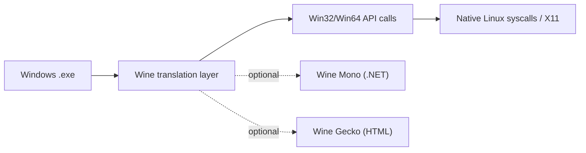

# Wine install in Centos 9

## Overview

**Wine** ("Wine Is Not an Emulator") is a compatibility layer that lets you run Windows applications on Linux without a Windows license or a virtual machine. Rather than emulating hardware, Wine translates Windows API calls into native POSIX calls on the fly, so applications execute with near-native performance.

This note covers two installation paths on **CentOS Stream 9**:

- **Package-manager install** — the fast, supported route via the [Yum](Yum(Yellowdog-Updater-Modified).md)/DNF front end and the EPEL repository.
- **Build from source** — compiling a specific upstream release (here, Wine 10.0) when you need a newer version than the repositories ship, or custom build flags.

> [!NOTE]
> Wine relies on the **EPEL** (Extra Packages for Enterprise Linux) repository on RHEL-family systems. Enable EPEL first, or the `wine` package will not be found.

## Concepts

| Term | Meaning |
| :-- | :-- |
| **Wine** | Compatibility layer translating Win32/Win64 API calls to native Linux calls. |
| **Wine Mono** | Open-source replacement for the Microsoft .NET runtime, used by managed Windows apps. |
| **Wine Gecko** | Open-source HTML rendering engine (Gecko) replacing Internet Explorer's engine for embedded browsers. |
| **WINEPREFIX** | A "bottle" — a self-contained directory (default `~/.wine`) holding a virtual Windows drive and registry. |
| **EPEL** | Community repository providing packages, including Wine, not shipped in the base RHEL/CentOS channels. |



## Install Wine Using Package Manager

1. Enable the EPEL repository:

```bash
yum install epel-release
```

2. Install Wine packages:

```bash
yum install wine
```

```bash
yum install wine*
```

```bash
yum install wine* --skip-broken
```

> [!TIP]
> The `wine*` glob pulls in every Wine-related sub-package (32-bit libraries, tools, docs). Pair it with `--skip-broken` so a single unresolved dependency does not abort the whole transaction.

3. Optionally install Wine Mono and Gecko for Windows compatibility layers:

```bash
yum install wine-mono wine-gecko
```

4. Run a Windows installer using Wine:

```bash
wine npp.8.5.8.Installer.x64.exe
```

> [!NOTE]
> **📸 Screenshot**
> _Capture: Notepad++ Windows installer wizard rendered by Wine on a CentOS 9 desktop_

## Install Wine from Source Code

Build from source when you need a version newer than EPEL provides, or specific build options. The steps below compile **Wine 10.0** for a 64-bit target.

1. Install development tools and dependencies:

```bash
yum groups install "Development Tools" -y
```

```bash
yum install wget libX11-devel freetype-devel zlib-devel libxcb-devel libxslt-devel libgcrypt-devel libxml2-devel gnutls-devel libpng-devel libjpeg-turbo-devel libtiff-devel gstreamer-devel dbus-devel fontconfig-devel
```

> [!IMPORTANT]
> The `-devel` packages ship the C headers the compiler needs. Missing a `-devel` dependency causes `./configure` to disable the corresponding feature (e.g. no audio, no fonts) rather than fail outright — review the `configure` summary before running `make`.

2. Download Wine source:

```bash
cd /opt/
```

```bash
wget https://dl.winehq.org/wine/source/10.0/wine-10.0.tar.xz
```

3. Extract source and change to directory:

```bash
tar -xvf wine-10.0.tar.xz
```

```bash
cd wine-10.0/
```

4. Check CPU architecture:

```bash
lscpu
```

5. Configure build for 64-bit:

```bash
./configure --enable-win64
```

6. Compile and install:

```bash
make
```

```bash
make install
```

7. Verify installation:

```bash
./wine64 --version
```

```bash
./wine --version
```

## Best Practices

> [!TIP]
> - Prefer the **package-manager install** for production and desktop use — it is patched and dependency-managed by the distribution and EPEL maintainers.
> - Reserve the **source build** for when you genuinely need a newer or custom Wine; source builds are unmanaged and must be rebuilt manually to pick up security fixes.
> - Run Wine as an **unprivileged user**, never `root`. Each user gets an isolated `~/.wine` prefix; running as root pollutes the system and increases risk.
> - Use separate `WINEPREFIX` bottles per application to keep incompatible dependencies isolated.

## Security Considerations

> [!WARNING]
> Wine executes **untrusted Windows binaries with your user's privileges**. Windows malware can still damage files your user can write and can reach the network. Treat every `.exe` as you would on Windows.
> - Never run Wine as `root`; a compromised app would then own the whole host.
> - Only fetch installers over **HTTPS from the vendor's official site**, and verify checksums/signatures where published.
> - Keep Wine updated (EPEL) so known CVEs in the compatibility layer are patched.
> - For risky binaries, run Wine inside a throwaway container or VM to contain the blast radius.

## Troubleshooting

| Symptom | Likely cause | Remedy |
| :-- | :-- | :-- |
| `No package wine available` | EPEL not enabled | `yum install epel-release`, then retry |
| Transaction aborts on one broken dep | Conflicting or missing sub-package | Reinstall with `yum install wine* --skip-broken` |
| .NET-based app fails to start | Wine Mono missing | `yum install wine-mono` |
| Embedded browser/HTML blank | Wine Gecko missing | `yum install wine-gecko` |
| `./configure` disables a feature | A `-devel` header package is missing | Install the matching `*-devel` package and re-run `./configure` |
| `wine64` runs but `wine` (32-bit) does not | Only the 64-bit build was configured | Rebuild with a WoW64/multilib configuration if 32-bit apps are needed |

## References

- WineHQ documentation: [https://wiki.winehq.org/](https://wiki.winehq.org/)
- Wine source downloads: [https://dl.winehq.org/wine/source/](https://dl.winehq.org/wine/source/)
- EPEL project: [https://docs.fedoraproject.org/en-US/epel/](https://docs.fedoraproject.org/en-US/epel/)

## Related
- [Yum(Yellowdog-Updater-Modified)](Yum(Yellowdog-Updater-Modified).md) — installs Wine and dependencies
- [Yum-Command-Reference](Yum-Command-Reference.md) — yum command cheat sheet
- [CentOS-9-minimal-to-GUI-Installation](CentOS-9-minimal-to-GUI-Installation.md) — base CentOS 9 GUI setup
- [Package-Manager-in-Linux](Package-Manager-in-Linux.md) — package management overview
- [Linux Administration & Server Hardening](../Readme.md) — Linux administration & server hardening hub
