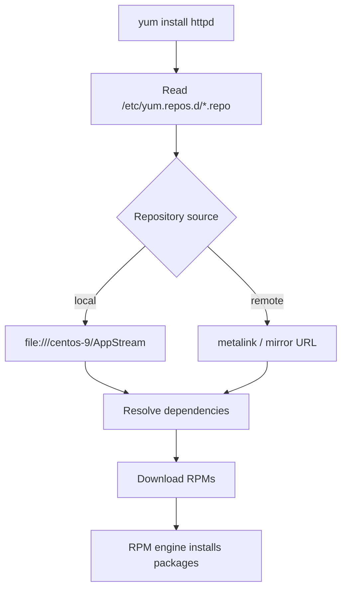

# Yum (Yellowdog Updater, Modified)

## Overview

**Yum** (Yellowdog Updater, Modified) is a high-level package management tool for RPM-based Linux distributions such as CentOS, RHEL, and Fedora. It sits on top of the low-level [RPM](Red-Hat-Package-Manager(RPM).md) engine and adds **automatic dependency resolution** and **repository management**, downloading packages and everything they require from local or remote repositories.

On modern RHEL-family systems Yum has been superseded by [DNF](DNF-Package-Manager.md), but the `yum` command persists as a symlink to `dnf`, so the syntax and workflow below remain valid.

> [!NOTE]
> RPM is the *engine* that installs a single `.rpm` file; Yum/DNF are the *drivers* that resolve dependencies and pull packages from repositories. Learn both — you install with `yum`, but you audit and verify with `rpm`.

## Concepts

### Key Features of Yum

| Feature | Description |
| :-- | :-- |
| **Automatic dependency resolution** | Installs all required dependencies automatically. |
| **Remote & local repository support** | Downloads from online mirrors or from local media/repositories. |
| **Group package management** | Install, remove, or query related package groups in one command. |
| **Rollback functionality** | Undo package transactions (`yum history undo`) where supported. |
| **Superseded by DNF** | Modern systems use DNF for faster, more reliable dependency handling. |



## Configuration

### Setting Up a Local Repository from DVD/ISO (CentOS 9)

A local repository lets you install packages on an air-gapped or offline host directly from the installation media.

#### Mount DVD or ISO to a local directory

```bash
mount /dev/sr0 /mnt
```

```bash
mkdir /centos-9
```

```bash
cp -vr /mnt/* /centos-9
```

#### Install `createrepo_c` (recommended for CentOS 9) or `createrepo` (CentOS 7)

```bash
rpm -ivh createrepo_c-libs-0.20.1-4.el9.x86_64.rpm
```

```bash
rpm -ivh python3-createrepo_c-0.20.1-4.el9.x86_64.rpm
```

```bash
rpm -ivh createrepo_c-0.20.1-4.el9.x86_64.rpm
```

#### Create repository metadata

```bash
ls -lh | grep repodata
```

```bash
createrepo -v --database /centos-9/AppStream/Packages/
```

To output repository metadata to another directory:

```bash
createrepo -v --database /centos-9/AppStream/Packages/ -o /tmp
```

#### Configure the Yum repo file

Create `/etc/yum.repos.d/centos-9.repo`:

```bash
vim /etc/yum.repos.d/centos-9.repo
```

```ini
[centos9]
name=Centos 9 DVD
baseurl=file:///centos-9/AppStream/Packages
gpgcheck=0
```

> [!WARNING]
> `gpgcheck=0` disables signature verification. It is acceptable for trusted, locally-copied installation media, but for any network-facing repository set `gpgcheck=1` and import the publisher's GPG key so tampered packages are rejected.

#### Clean the Yum cache and refresh repo lists

```bash
yum clean all
```

```bash
rm -rf /var/cache/yum
```

```bash
yum repolist all
```

#### Install packages from the local repo

```bash
yum install python3
```

```bash
yum install firefox
```

```bash
yum install httpd
```

### Managing Online Repositories

#### Official CentOS Base Repository

The repo file is located at `/etc/yum.repos.d/centos.repo` and includes:

```ini
[baseos]
name=CentOS Stream $releasever - BaseOS
metalink=https://mirrors.centos.org/metalink?repo=centos-baseos-$stream&arch=$basearch&protocol=https,http
gpgkey=file:///etc/pki/rpm-gpg/RPM-GPG-KEY-centosofficial
gpgcheck=1
repo_gpgcheck=0
metadata_expire=6h
countme=1
enabled=1
```

#### Repository Field Reference

| Field | Purpose |
| :-- | :-- |
| `[baseos]` | Repository ID used internally by Yum/DNF; must be unique across all repo files. |
| `name` | Human-readable repository name. `$releasever` expands to the OS release (e.g. `9`). |
| `metalink` | Dynamically generated list of mirror URLs. `$stream` → CentOS Stream version, `$basearch` → system architecture (e.g. `x86_64`); prefers `https` then `http`. |
| `gpgkey` | Location of the GPG public key used to verify package signatures (integrity + authenticity). |
| `gpgcheck=1` | Enables GPG signature verification for downloaded packages. `1` = enabled. |
| `repo_gpgcheck=0` | GPG check of repository metadata (`repomd.xml`). `1` would enable it. |
| `metadata_expire=6h` | How often Yum/DNF re-checks for updated metadata before reusing the cache. |
| `countme=1` | Optional repository usage-statistics reporting (counts hits to the repo). |
| `enabled=1` | Enables this repository; `0` makes Yum/DNF ignore it. |

## Popular Third-Party Repositories

| Repository | Description | Install Example |
| :-- | :-- | :-- |
| **EPEL** | Extra packages by Fedora project | `rpm -ivh https://dl.fedoraproject.org/pub/epel/epel-release-latest-9.noarch.rpm` |
| **Remi** | Updated PHP \& related packages | `rpm -ivh https://rpms.remirepo.net/enterprise/remi-release-9.rpm` |
| **RPM Fusion** | Multimedia packages | `yum install https://mirrors.ustc.edu.cn/rpmfusion/free/el/rpmfusion-free-release-9.noarch.rpm` |
| **ELRepo** | Kernel and hardware drivers | `rpm --import https://www.elrepo.org/RPM-GPG-KEY-elrepo.org`<br>`yum install https://www.elrepo.org/elrepo-release-9.el9.elrepo.noarch.rpm` |
| **IUS** | Updated popular packages | `rpm -ivh https://repo.ius.io/ius-release-el7.rpm`<br>`yum install https://repo.ius.io/ius-release-el7.rpm` |

## Best Practices

> [!TIP]
> - Keep the number of enabled third-party repositories minimal — overlapping repos cause version conflicts and unpredictable upgrades.
> - Prefer priorities/module streams over mixing raw third-party RPMs into the base system.
> - Run `yum clean all` after editing repo files so stale metadata does not mask changes.
> - Use `yum history` to review and, where needed, roll back transactions.

## Security Considerations

> [!IMPORTANT]
> - **Keep `gpgcheck=1`** for every network-facing repository and import only trusted publisher keys into `/etc/pki/rpm-gpg/`. This is a CIS Benchmark control for RHEL-family systems.
> - **Verify third-party repo release RPMs** (their GPG keys) before enabling them; a malicious repo can push trojaned packages during any subsequent `yum update`.
> - **Prefer HTTPS mirrors** in `baseurl`/`metalink` to prevent metadata and package tampering in transit.
> - Apply security updates promptly: `yum --security update` where the plugin is available.

## Troubleshooting

| Symptom | Likely cause | Remedy |
| :-- | :-- | :-- |
| `No more mirrors to try` / metadata errors | Stale or corrupt cache | `yum clean all` then `yum makecache` |
| `Repository ... does not have a name` | Malformed `.repo` file | Ensure `name=` is present and the `[id]` header is unique |
| Package not found from local repo | Missing `repodata` | Re-run `createrepo` on the package directory |
| GPG signature failures | Key not imported / wrong repo | `rpm --import <key>` or fix the `gpgkey=` path |
| Wrong version installed | Overlapping third-party repo | Disable the conflicting repo or set `priority=` |

## References

- `man yum`, `man yum.conf`, `man dnf`
- CentOS Stream package mirror: [https://mirror.stream.centos.org/9-stream/](https://mirror.stream.centos.org/9-stream/)
- EPEL: [https://docs.fedoraproject.org/en-US/epel/](https://docs.fedoraproject.org/en-US/epel/)

## Related
- [Yum-Command-Reference](Yum-Command-Reference.md) — yum command cheat sheet
- [DNF-Package-Manager](DNF-Package-Manager.md) — yum's modern replacement
- [Red-Hat-Package-Manager(RPM)](Red-Hat-Package-Manager(RPM).md) — underlying .rpm package tool
- [Package-Manager-in-Linux](Package-Manager-in-Linux.md) — package management overview
- [Linux Administration & Server Hardening](../Readme.md) — Linux administration & server hardening hub
