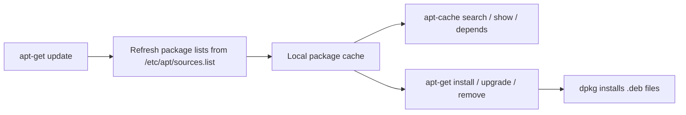

# apt-cache and apt-get

## Overview

**apt-cache** and **apt-get** are the classic low-level command-line tools for package management on Debian-based systems (Debian, Ubuntu, Kali, Linux Mint).

- **apt-cache** queries the local package cache — search, inspect metadata, and map dependency relationships. It is read-only and does not require root.
- **apt-get** performs the actual work — updating package lists and installing, upgrading, or removing packages.

While the newer unified [apt](Advanced-Package-Tool(APT).md) front end is recommended for interactive use, `apt-get` and `apt-cache` remain the preferred tools in **scripts and automation** because their output and behaviour are stable across releases.

> [!NOTE]
> `apt` is a friendlier wrapper aimed at humans (progress bars, colour). `apt-get`/`apt-cache` expose a stable, script-safe interface. Use `apt` at the keyboard; use `apt-get` in scripts.



## apt-cache: Query Package Cache

- Search for a package by keyword:

```bash
apt-cache search package_name
```

```bash
apt-cache search python3
```

- Show detailed info about a package:

```bash
apt-cache show package_name
```

```bash
apt-cache show nmap
```

- List dependencies of a package:

```bash
apt-cache depends package_name
```

```bash
apt-cache depends curl
```

- List reverse dependencies (packages depending on it):

```bash
apt-cache rdepends package_name
```

```bash
apt-cache rdepends libc6
```

- Show source package details:

```bash
apt-cache showsrc package_name
```

```bash
apt-cache showsrc openssh
```

- List all package names in the cache:

```bash
apt-cache pkgnames
```

- Show installed and available versions with priority:

```bash
apt-cache policy package_name
```

```bash
apt-cache policy nginx
```

### apt-cache Command Reference

| Command | Purpose |
| :-- | :-- |
| `apt-cache search <kw>` | Search package names and descriptions for a keyword |
| `apt-cache show <pkg>` | Display package metadata (version, size, description) |
| `apt-cache depends <pkg>` | List the package's dependencies |
| `apt-cache rdepends <pkg>` | List packages that depend on this one (reverse deps) |
| `apt-cache showsrc <pkg>` | Show the source-package record |
| `apt-cache pkgnames` | List every package name known to the cache |
| `apt-cache policy <pkg>` | Show installed vs. candidate version and repo priority |

## apt-get: Package Management

- Update package lists:

```bash
apt-get update
```

- Upgrade installed packages:

```bash
apt-get upgrade -y
```

- Perform a full upgrade (handles deps, may remove packages):

```bash
apt-get full-upgrade -y
```

- Install a package:

```bash
apt-get install package_name -y
```

```bash
apt-get install apache2
```

- Remove a package (keep config):

```bash
apt-get remove package_name -y
```

```bash
apt-get remove apache2
```

- Remove a package with config:

```bash
apt-get purge package_name -y
```

```bash
apt-get purge apache2
```

- Remove orphaned dependencies:

```bash
apt-get autoremove -y
```

- Download a `.deb` file without installing:

```bash
apt-get download package_name
```

```bash
apt-get download nmap
```

- Get package source code:

```bash
apt-get source package_name
```

```bash
apt-get source openssl
```

- Show changelog for a package:

```bash
apt-get changelog package_name
```

```bash
apt-get changelog bash
```

- Verify package database:

```bash
apt-get check
```

- Clear cached `.deb` files:

```bash
apt-get clean
```

### apt-get Command Reference

| Command | Purpose |
| :-- | :-- |
| `apt-get update` | Refresh the list of available packages from repositories |
| `apt-get upgrade` | Upgrade installed packages without removing any |
| `apt-get full-upgrade` | Upgrade, allowing removal of packages when needed to resolve deps |
| `apt-get install <pkg>` | Install a package and its dependencies |
| `apt-get remove <pkg>` | Uninstall a package but keep its configuration files |
| `apt-get purge <pkg>` | Uninstall a package **and** delete its configuration files |
| `apt-get autoremove` | Remove dependencies no longer needed by any package |
| `apt-get download <pkg>` | Fetch the `.deb` without installing it |
| `apt-get source <pkg>` | Fetch the upstream source package |
| `apt-get clean` | Empty the local `.deb` download cache |

> [!NOTE]
> **📸 Screenshot**
> _Capture: Terminal output of apt-get update refreshing package lists across multiple Debian repositories_

## Fixing Issues with apt-get

- Fix broken dependencies:

```bash
apt-get install -f
```

- Reconfigure packages:

```bash
dpkg --configure -a
```

- Remove lock files (if apt is stuck):

```bash
rm /var/lib/dpkg/lock
rm /var/lib/dpkg/lock-frontend
```

- Clear partial downloads:

```bash
rm /var/cache/apt/archives/partial/*
```

> [!WARNING]
> Only delete the `dpkg` lock files after confirming **no** `apt`, `apt-get`, `dpkg`, or `unattended-upgrades` process is actually running (`ps aux | grep -E 'apt|dpkg'`). Removing the lock while another package operation is in progress can corrupt the dpkg database.

## Best Practices

> [!TIP]
> - Always run `apt-get update` before installing or upgrading so the cache reflects current repository state.
> - `apt-get` is script-friendly — use it in automation and provisioning; prefer `apt` for interactive use.
> - Run `apt-get autoremove` after uninstalling large packages to reclaim disk space.
> - Use `purge` instead of `remove` when you want configuration files gone too (e.g. before reinstalling cleanly).

## Security Considerations

> [!IMPORTANT]
> - Keep systems patched: schedule `apt-get update && apt-get upgrade` (or `unattended-upgrades` for security fixes). Timely patching is a core CIS/NIST control.
> - APT verifies repository signatures via GPG keys in `/etc/apt/trusted.gpg.d/`. Never bypass signature checks (`--allow-unauthenticated`) on production hosts.
> - Add only trusted third-party repositories, and pin their keys explicitly — a malicious source can push trojaned packages during any later upgrade.
> - Prefer HTTPS (`https://`) mirrors in `/etc/apt/sources.list` to protect metadata and packages in transit.

## Troubleshooting

| Symptom | Likely cause | Remedy |
| :-- | :-- | :-- |
| `Could not get lock /var/lib/dpkg/lock` | Another apt/dpkg process is running | Wait for it, or remove stale locks (see above) |
| `dpkg was interrupted` | Aborted previous install | `dpkg --configure -a` |
| `Unmet dependencies` / broken install | Partial or conflicting install | `apt-get install -f` |
| `Failed to fetch ... 404` | Stale package lists | `apt-get update` then retry |
| Package upgraded unexpectedly | Overlapping third-party repo | Check `apt-cache policy <pkg>` and pin priorities |

## Quick Tips

- `apt-get` is script-friendly; use it when writing automation.
- Always run `apt-get update` before installing or upgrading.
- Use `apt-get autoremove` after uninstalling large packages to free space.
- For human-friendly usage, prefer `apt`, but for precise scripting, use `apt-get`.

## References

- `man apt-get`, `man apt-cache`, `man apt`
- Debian APT documentation: [https://wiki.debian.org/Apt](https://wiki.debian.org/Apt)
- Ubuntu Server Guide — package management: [https://ubuntu.com/server/docs/package-management](https://ubuntu.com/server/docs/package-management)

## Related
- [Advanced-Package-Tool(APT)](Advanced-Package-Tool(APT).md) — unified modern APT front-end
- [Debian-Package-Manager(dpkg)](Debian-Package-Manager(dpkg).md) — underlying .deb package tool
- [Package-Manager-in-Linux](Package-Manager-in-Linux.md) — package management overview
- [Linux Administration & Server Hardening](../Readme.md) — Linux command reference hub
