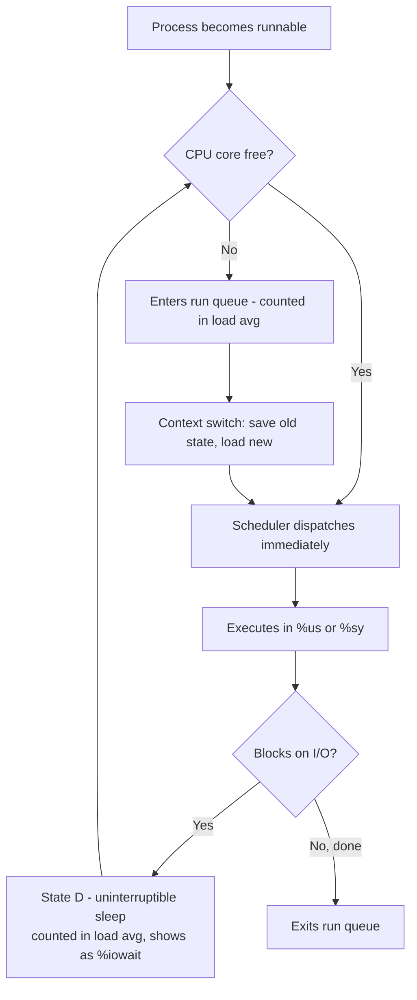

# CPU Performance Analysis

## Overview

CPU bottlenecks rarely announce themselves — a box can be "slow" while the CPU sits idle, waiting on I/O, or genuinely pegged with a deep run queue. This note builds on [Performance-Analysis-Overview](Performance-Analysis-Overview.md) and focuses specifically on reading CPU signals correctly with `top`, `htop`, and `mpstat`, distinguishing load average from actual utilization, interpreting the run queue and context-switch rate, and tuning CPU frequency governors. For flame-graph-level root-causing once you've confirmed CPU is the bottleneck, see [perf-and-Profiling](perf-and-Profiling.md).

> [!IMPORTANT]
> Load average and CPU utilization are **not the same metric**. Load average counts processes in `R` (running) *and* `D` (uninterruptible sleep, usually I/O wait) state. A server with load average 8 on a 4-core box could be CPU-bound, I/O-bound, or both — you must cross-check with `mpstat`/`vmstat` before concluding "CPU problem."

## Concepts

| Term | Definition |
|---|---|
| **Load average** | Exponentially-decayed average of the number of processes in the run queue (`R`) plus uninterruptible sleep (`D`), over 1/5/15 minutes |
| **Utilization** | Percentage of time the CPU spent executing (non-idle) over a sampling interval |
| **Run queue (`r` in vmstat)** | Number of processes currently runnable and waiting for a CPU core right now |
| **Context switch** | The kernel saving one process/thread's CPU state and loading another's — expensive due to cache/TLB flushing |
| **`%us` / `%sy`** | User-space vs kernel-space (syscalls, interrupts, scheduling) CPU time |
| **`%iowait`** | CPU idle *while* at least one I/O request is outstanding — a CPU-idle-but-not-free state |
| **`%steal`** | Time a VM's vCPU wanted to run but the hypervisor gave the physical CPU to another tenant — critical on cloud/virtualized hosts |
| **CPU governor** | Kernel policy (via `cpufreq`) deciding how aggressively to scale CPU clock speed vs power draw |

**Rule of thumb**: load average should be read relative to core count. `nproc` tells you how many logical CPUs you have; a load average persistently above that count means work is queuing.

## Architecture



## Commands

### `top` — interactive baseline

```bash
top
```

Key fields in the header:

```text
top - 14:32:01 up 21 days,  3:12,  2 users,  load average: 2.15, 1.98, 1.72
%Cpu(s): 45.2 us, 12.1 sy,  0.0 ni, 38.0 id,  4.5 wa,  0.0 hi,  0.2 si,  0.0 st
```

| Field | Meaning |
|---|---|
| `us` | User-space CPU |
| `sy` | System/kernel CPU |
| `ni` | Niced (user-adjusted priority) processes |
| `id` | Idle |
| `wa` | I/O wait — CPU idle, waiting on disk/network I/O |
| `hi` / `si` | Hardware / software interrupts |
| `st` | Stolen by hypervisor (VMs only) |

Useful `top` interactions: press `1` to show per-core breakdown, `H` to toggle thread view, `Shift+P` to sort by CPU%.

### `htop` — visual, per-core

```bash
htop
```

- Per-core meter bars at the top (color-coded: blue=low priority, green=user, red=kernel, orange=IRQ, blue-gray=iowait).
- `F6` to sort by any column (e.g., `PERCENT_CPU`); `F2` → Display Options → "Detailed CPU time" for the `us/sy/ni/wa/hi/si/st` split per core.
- Tree view (`F5`) to see which parent spawned CPU-heavy children.

### `mpstat` — per-CPU, scriptable

```bash
# Install (RHEL/Fedora family)
sudo dnf install sysstat

# Install (Debian/Ubuntu family)
sudo apt install sysstat

# All CPUs, 5 samples, 2-second interval
mpstat -P ALL 2 5
```

```text
14:35:10     CPU    %usr   %nice    %sys %iowait    %irq   %soft  %steal   %idle
14:35:12     all   38.21    0.00   14.55    2.10    0.00    0.30    0.00   44.84
14:35:12       0   62.00    0.00   20.10    1.00    0.00    0.50    0.00   16.40
14:35:12       1   14.42    0.00    9.00    3.20    0.00    0.10    0.00   73.28
```

A single core pinned near 100% while others idle indicates a **single-threaded bottleneck** — no amount of horizontal scaling on that box will fix it; the process needs to be threaded/parallelized or the workload sharded.

### Run queue and context switches — `vmstat`

```bash
vmstat 2 5
```

```text
procs -----------memory---------- ---swap-- -----io---- -system-- ------cpu-----
 r  b   swpd   free   buff  cache   si   so    bi    bo   in   cs us sy id wa st
 4  1  10240 512000  98000 2048000    0    0    12    45  850 3200 40 15 40  5  0
```

| Column | Meaning | Watch for |
|---|---|---|
| `r` | Run queue length | Sustained `r` > core count = CPU contention |
| `b` | Processes blocked (uninterruptible I/O) | Sustained `b` > 0 = I/O-bound, not CPU-bound |
| `in` | Interrupts/sec | Sudden spikes = driver/hardware issue or NIC storm |
| `cs` | Context switches/sec | Very high `cs` relative to workload = excessive thread contention, lock thrashing, or too many small processes |

```bash
# Live context-switch/interrupt rate, human-friendly
sar -w 2 5

# Per-process voluntary/involuntary context switches
pidstat -w -p <PID> 2 5
```

High **involuntary** context switches for a process means it's being preempted by the scheduler because too many other runnable processes are competing for the core — a strong signal of CPU oversubscription.

### CPU frequency governors

```bash
# List available governors and current one, per core
cpupower frequency-info

# Or read directly from sysfs
cat /sys/devices/system/cpu/cpu0/cpufreq/scaling_governor
cat /sys/devices/system/cpu/cpu0/cpufreq/scaling_available_governors

# Set a governor for all cores (RHEL/Fedora + Debian/Ubuntu, cpupower installed)
sudo cpupower frequency-set -g performance

# Persistent, per-core via sysfs (survives until reboot)
for cpu in /sys/devices/system/cpu/cpu[0-9]*/cpufreq/scaling_governor; do
  echo performance | sudo tee "$cpu"
done
```

| Governor | Behavior | Use case |
|---|---|---|
| `performance` | Locks CPU at max frequency | Latency-sensitive servers (databases, hypervisors) |
| `powersave` | Locks CPU at min frequency | Rarely correct for servers; power-constrained edge devices |
| `ondemand` | Scales up aggressively on load, decays down | Older kernels' general-purpose default |
| `schedutil` | Frequency scaling driven by the CFS scheduler's own utilization data | Modern kernel default (RHEL 8+/9, current Debian/Ubuntu); usually the right choice |
| `conservative` | Like `ondemand` but ramps more gradually | Power-sensitive general workloads |

```bash
# RHEL/Fedora persistent config via tuned (preferred over manual cpupower on RHEL)
sudo dnf install tuned
sudo systemctl enable --now tuned
sudo tuned-adm profile throughput-performance
tuned-adm active

# Debian/Ubuntu: persist via /etc/default/cpufrequtils or a systemd unit
sudo apt install cpufrequtils
echo 'GOVERNOR="performance"' | sudo tee -a /etc/default/cpufrequtils
sudo systemctl restart cpufrequtils
```

> [!TIP]
> On RHEL-family systems prefer `tuned` profiles (`throughput-performance`, `latency-performance`, `virtual-guest`) over hand-editing governors — `tuned` also adjusts I/O scheduler, dirty-page ratios, and transparent hugepages consistently as a bundle.

## Examples

**Scenario: high load average, low CPU utilization**

```bash
uptime
# load average: 12.40, 11.80, 9.50   (on a 4-core box)

mpstat 1 3
# %idle sits around 70-80%
```

Diagnosis: load is inflated by processes in `D` state, not CPU contention. Confirm with:

```bash
vmstat 1 5
# watch the 'b' column — nonzero means blocked on I/O

ps -eo pid,stat,comm | awk '$2 ~ /D/'
```

This points to storage/NFS latency, not a CPU problem — pivot to `iostat`/`iotop`, not CPU tuning.

**Scenario: run queue exceeds core count with high `%sy`**

```bash
mpstat -P ALL 1 5
# %sys consistently 30%+ across all cores

pidstat -w 1 5
# a handful of PIDs show very high nonvoluntary context switches
```

Diagnosis: real CPU contention, likely from over-threaded application pools or excessive lock contention. Action: reduce worker/thread pool size, pin critical processes with `taskset`/cgroup `cpuset`, or scale horizontally.

## Best Practices

- Always correlate `load average` against `nproc` — never read it as an absolute number.
- Sample over multiple intervals (`mpstat 2 5`, not a single snapshot) — CPU spikes can be transient and misleading as single readings.
- Check `%steal` first on any cloud/VM instance; a CPU tuning effort is wasted if the hypervisor is starving you.
- Prefer `schedutil`/`tuned` profiles over manually forcing `performance` everywhere — max-frequency-always wastes power and can thermal-throttle on dense hosts.
- Use `pidstat -w` (not just `vmstat`) to attribute context switches to specific processes before blaming "the kernel."
- Baseline CPU behavior during known-good periods so anomalies are recognizable later — feed `mpstat`/`sar` history into your [Performance-Analysis-Overview](Performance-Analysis-Overview.md) baselining process.

## Security Considerations

- **CIS-aligned resource limits**: unbounded process/thread creation (fork bombs, runaway cron jobs) can drive run queue and context switches to pathological levels — enforce `nproc` limits via `/etc/security/limits.conf` and cgroup `pids.max`.
- **`%steal` as a tenancy-isolation signal**: sustained nonzero `%steal` on a supposedly dedicated VM can indicate noisy-neighbor or, in adversarial cloud environments, a misconfigured/compromised hypervisor allocation — worth escalating, not just tuning around.
- **CPU-bound processes as a DoS vector**: a single unauthenticated endpoint that triggers expensive computation (regex backtracking, unbounded loops) shows up first as one core pinned in `mpstat -P ALL` — treat sustained single-core saturation from a network-facing process as a potential application-layer DoS, not just "needs more cores."
- Restrict who can change CPU governors (`cpupower`, sysfs writes require root) — an attacker forcing `powersave` on a latency-sensitive auth/logging service is a low-noise availability attack.
- Log and alert on abnormal context-switch rates (`sar -w`) as part of intrusion detection — cryptomining malware and brute-force loops often manifest as sustained high `%usr` plus elevated `cs` before other signals appear.

> [!NOTE]
> **📸 Screenshot**
> _Capture: `htop` per-core meter bars alongside `mpstat -P ALL 2 5` output in a split terminal, showing one core near 100% while others idle — illustrating a single-threaded bottleneck._

## Troubleshooting

| Symptom | Likely Cause | Investigate With |
|---|---|---|
| High load average, low `%us`/`%sy` | Processes blocked on I/O, not CPU | `vmstat` (`b` column), `iostat -x`, `ps -eo pid,stat,comm \| awk '$2~/D/'` |
| High `%sy`, low `%us` | Excessive syscalls, interrupts, or context switching | `pidstat -w`, `mpstat -P ALL`, `perf stat` |
| One core at 100%, others idle | Single-threaded application bottleneck | `mpstat -P ALL`, `htop` tree view, `taskset -p <PID>` |
| Nonzero `%steal` | Hypervisor CPU contention (noisy neighbor) | `mpstat`, cloud provider CPU credit/throttling dashboards |
| Slow response despite low utilization | CPU frequency capped by governor or thermal throttling | `cpupower frequency-info`, `dmesg \| grep -i throttle` |
| High `%si` (softirq) | Network interrupt storm, NIC misconfiguration | `mpstat -I SCPU`, `/proc/interrupts`, check IRQ affinity/`irqbalance` |

## References

- `man top`, `man htop`, `man mpstat`, `man vmstat`, `man pidstat`
- `man cpupower-frequency-set`, `man cpupower-frequency-info`
- Red Hat Documentation — *Monitoring and Managing System Status and Performance* (RHEL 9)
- `sysstat` package documentation — https://github.com/sysstat/sysstat
- `man tuned`, `man tuned-adm`

## Related Notes

- [Performance-Analysis-Overview](Performance-Analysis-Overview.md) — baselining methodology and where CPU analysis fits in the wider triage workflow
- [perf-and-Profiling](perf-and-Profiling.md) — deeper root-cause profiling (flame graphs, `perf top`, syscall tracing) once CPU is confirmed as the bottleneck
- [Linux Administration & Server Hardening](../Readme.md) — course hub and map of content
