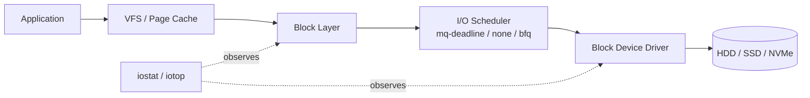

# Disk I/O Performance

## Overview

Disk I/O is the most common silent bottleneck on Linux servers — CPU and memory graphs look fine while database commits, log writes, or backup jobs stall waiting on storage. This note covers measuring I/O with `iostat` and `iotop`, interpreting `%util` and `await`, choosing the right I/O scheduler for the underlying media, and running controlled benchmarks with `fio` before and after tuning. It complements [Performance-Analysis-Overview](Performance-Analysis-Overview.md) (the general USE-method triage flow) and [Readme](../File-System-and-Disk-Management/Readme.md) (partitioning, LVM, and filesystem choice).

> [!TIP]
> **Measure before you tune**
> Never change an I/O scheduler or queue depth based on intuition. Capture a baseline with `iostat -xz 1` and `fio` under representative load, make one change at a time, and re-measure. Disk tuning that "feels faster" but isn't measured is not tuning — it's guessing.

## Concepts

| Term | Meaning |
|---|---|
| **IOPS** | I/O operations per second — dominant metric for random-access workloads (databases, VMs). |
| **Throughput (MB/s)** | Data moved per second — dominant metric for sequential workloads (backups, streaming reads). |
| **Latency (await)** | Time from I/O submission to completion, in milliseconds. The metric users actually feel. |
| **Queue depth** | Number of I/O requests in flight to a device simultaneously. Higher depth can raise throughput on SSD/NVMe but adds latency per request. |
| **%util** | Percentage of time the device had at least one I/O in flight. Near 100% on a single spinning disk means saturation; on NVMe with multiple queues it can be misleading (see Troubleshooting). |
| **I/O scheduler** | Kernel policy for ordering and merging block I/O requests before dispatch to the device. |

## Architecture



The scheduler sits in the block layer between the generic request queue and the device driver. Its job differs sharply by media type: a spinning disk benefits from request merging and elevator-style reordering to minimize seek time; an SSD/NVMe device has no seek penalty and often does better with minimal scheduler overhead, letting the device's internal controller and deep hardware queues do the work.

## Commands

### iostat — device-level throughput, utilization, latency

```bash
# Debian/RHEL family — part of sysstat
sudo apt install sysstat        # Debian/Ubuntu
sudo dnf install sysstat        # RHEL/Fedora/Alma

# Extended stats, in MB, every 2 seconds, 5 samples
iostat -xm 2 5

# Continuous, skip the first (boot-average) report
iostat -xz 1
```

Key columns in `iostat -x` output:

| Column | Meaning |
|---|---|
| `r/s`, `w/s` | Reads/writes completed per second |
| `rkB/s`, `wkB/s` | Throughput in kB/s |
| `r_await`, `w_await` | Average latency (ms) for reads/writes — **the primary health signal** |
| `aqu-sz` | Average queue length (requests waiting + in service) |
| `%util` | Percent of time device was busy |

```text
Device            r/s     w/s   rkB/s   wkB/s r_await w_await  aqu-sz  %util
nvme0n1          12.00  340.00   96.00 8704.00    0.42    1.18    0.62  38.50
sda               2.00  180.00   64.00 5120.00    8.90   42.30    3.10  97.80
```

Reading this: `sda` shows `w_await` of 42ms and `%util` near 100% — it is saturated and writes are queuing. `nvme0n1` is healthy at sub-millisecond latency with headroom.

### iotop — per-process I/O attribution

```bash
sudo apt install iotop     # Debian/Ubuntu
sudo dnf install iotop     # RHEL/Fedora

sudo iotop -oPa            # only active processes, accumulated totals
sudo iotop -b -n 5 -d 2    # batch mode for logging: 5 samples, 2s apart
```

Use `iotop` once `iostat` confirms a device is busy, to identify *which* process (mysqld, rsync, a runaway log writer) is generating the load.

### Scheduler inspection and selection

```bash
# List available and active scheduler per device (brackets = active)
cat /sys/block/sda/queue/scheduler
# mq-deadline [bfq] none

# Set scheduler at runtime (non-persistent)
echo mq-deadline | sudo tee /sys/block/sda/queue/scheduler

# Check rotational flag to identify media type (1 = HDD, 0 = SSD/NVMe)
cat /sys/block/sda/queue/rotational
```

Persist the setting with a udev rule so it survives reboots:

```conf
# /etc/udev/rules.d/60-io-scheduler.rules
# Spinning disks: mq-deadline (low overhead, latency-bounded ordering)
ACTION=="add|change", KERNEL=="sd[a-z]", ATTR{queue/rotational}=="1", ATTR{queue/scheduler}="mq-deadline"

# NVMe / SSD: none (let the device queue handle it — lowest CPU overhead)
ACTION=="add|change", KERNEL=="nvme[0-9]n[0-9]", ATTR{queue/rotational}=="0", ATTR{queue/scheduler}="none"
```

```bash
sudo udevadm control --reload-rules
sudo udevadm trigger --subsystem-match=block
```

## Scheduler Reference

| Scheduler | Best for | Notes |
|---|---|---|
| `mq-deadline` | Spinning HDDs, single-queue SATA SSDs | Bounds worst-case latency per request; default on many distros for rotational media. |
| `none` (noop) | NVMe, high-end SSDs with deep internal queues | Minimal CPU overhead; lets the device controller reorder. Recommended default for NVMe. |
| `bfq` | Desktops, interactive workloads, shared low-end storage | Fair-queuing, prioritizes interactive I/O; higher CPU cost, not ideal for high-IOPS servers. |
| `kyber` | Fast SSD/NVMe, latency-target-based | Alternative to `none` when you want target-latency tuning rather than a fully passive scheduler. |

> [!NOTE]
> **Default varies by kernel and distro**
> RHEL 8/9 and recent Debian/Ubuntu kernels use multi-queue block I/O (`blk-mq`) exclusively; the legacy single-queue `cfq`/`deadline` schedulers no longer exist. Always check `/sys/block/<dev>/queue/scheduler` rather than assuming.

## Examples — Benchmarking with fio

`fio` is the standard tool for controlled, repeatable storage benchmarks — synthetic `dd` timing tests are not representative of real random-I/O workloads.

```bash
sudo apt install fio     # Debian/Ubuntu
sudo dnf install fio     # RHEL/Fedora
```

Random read/write IOPS test (simulates database-style access):

```bash
fio --name=randrw-test --directory=/data/testfio --size=2G \
    --rw=randrw --rwmixread=70 --bs=4k --iodepth=32 \
    --numjobs=4 --runtime=60 --time_based --group_reporting \
    --ioengine=libaio --direct=1
```

Sequential throughput test (simulates backups/streaming):

```bash
fio --name=seqwrite-test --directory=/data/testfio --size=4G \
    --rw=write --bs=1M --iodepth=8 --numjobs=1 \
    --runtime=60 --time_based --group_reporting \
    --ioengine=libaio --direct=1
```

| fio flag | Purpose |
|---|---|
| `--rw` | Pattern: `read`, `write`, `randread`, `randwrite`, `randrw` |
| `--bs` | Block size — `4k` for OLTP-like random I/O, `1M`+ for sequential |
| `--iodepth` | Queue depth — raise to stress NVMe parallelism |
| `--direct=1` | Bypass page cache — measures real device performance, not RAM |
| `--ioengine=libaio` | Async I/O engine, standard for Linux benchmarking |
| `--group_reporting` | Combine per-job stats into one summary |

Always run `fio` against a scratch file/volume, never a production data directory, and delete the test file afterward:

```bash
rm -f /data/testfio/*
```

## Best Practices

- Baseline every host with `iostat -xz 1` and a short `fio` run before deploying a new service so you have a "normal" reference point.
- Separate write-heavy workloads (databases, logs) onto dedicated volumes/LVs so one noisy consumer doesn't starve others — see [Readme](../File-System-and-Disk-Management/Readme.md) for LVM layout guidance.
- Mount data volumes with `noatime` (or `relatime`, often default) to eliminate needless metadata writes on every read.
- For database volumes, disable the filesystem barrier/journal double-write only if the storage has a battery-backed or power-loss-protected write cache — otherwise you trade performance for crash-consistency risk.
- Set the scheduler based on `rotational` flag via udev rules, not manually per boot.
- Re-run `fio` after any storage, RAID, or virtualization layer change (e.g., moving a VM to different backing storage) — device characteristics change even when the OS-level config doesn't.

## Security Considerations

- I/O saturation is a viable local denial-of-service vector: an unprivileged process performing sustained heavy I/O can degrade service for the whole host. Use `ionice` and cgroup v2 `io.max`/`io.weight` to cap per-service or per-user I/O bandwidth (aligns with CIS resource-limiting guidance).
- `iotop` requires root/`CAP_SYS_ADMIN` and reveals filenames/paths being accessed by other users' processes — restrict who can run it on shared/multi-tenant systems.
- `fio` benchmarks that fill a disk to near-capacity can trigger application failures elsewhere on a shared host; run benchmarks on isolated storage or during maintenance windows, and always clean up test files (they may otherwise be readable by other local users depending on permissions/umask).
- Persistently pegged `%util` with rising `await` can be an early indicator of a runaway or malicious process (e.g., cryptomining scratch writes, log-flooding); correlate `iotop` findings with process auditing during incident response.

> [!NOTE]
> **📸 Screenshot**
> _Capture: `iostat -xz 1` output showing a device under load next to `iotop -oPa` attributing that load to a specific process, side-by-side in one terminal session._

## Troubleshooting

| Symptom | Likely cause | Check |
|---|---|---|
| High `%util`, low IOPS/throughput | Single-queue HDD saturated by seeks | `iostat -x`; consider RAID/striping or migrating hot data to SSD |
| High `await`, `%util` under 100% on NVMe | `%util` is unreliable on multi-queue devices — it only reflects one queue's busy time | Trust `aqu-sz` and `await` over `%util` for NVMe |
| `iotop` shows no obvious culprit but `iostat` shows saturation | Kernel-side I/O (writeback, journal flush) not attributed to a user process | Check `dstat`/`sar` or look at `/proc/vmstat` for `nr_dirty`/writeback activity |
| Sudden latency spike after a config change | Scheduler mismatch (e.g., `bfq` on high-IOPS NVMe) | `cat /sys/block/<dev>/queue/scheduler`; revert and re-test with `fio` |
| Application timeouts but disk looks idle | I/O wait misattributed — check for network-backed storage (NFS/iSCSI) latency instead | `iostat` on the client shows low local disk activity; check network-storage-specific tools |

## References

- `man iostat`, `man iotop`, `man fio`
- Linux kernel documentation: `Documentation/block/` (multi-queue block layer, I/O schedulers)
- Red Hat Performance Tuning Guide — storage and file systems chapter
- sysstat project documentation (iostat, sar)

## Related Notes

- [Performance-Analysis-Overview](Performance-Analysis-Overview.md) — USE-method triage and where disk I/O fits in the broader diagnostic flow
- [Readme](../File-System-and-Disk-Management/Readme.md) — partitioning, LVM, and filesystem selection that underpin I/O behavior
- [Linux Administration & Server Hardening](../Readme.md) — course hub and map of content
