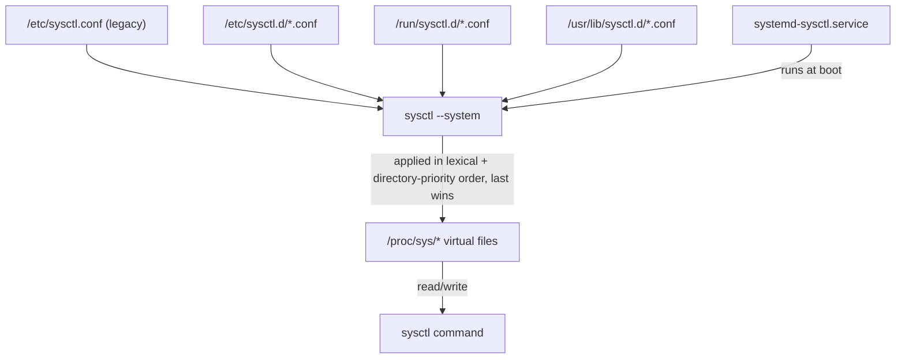

# Kernel Tuning with sysctl

## Overview

`sysctl` reads and writes Linux kernel runtime parameters exposed under `/proc/sys`, letting an administrator tune networking, virtual memory, and security behavior without recompiling or rebooting the kernel. It sits alongside [Memory-Performance-Analysis](Memory-Performance-Analysis.md) as a lever for memory-subsystem tuning (swappiness, overcommit, dirty-page ratios) and is one of the baseline hardening controls referenced by [Readme](../Security-Firewall-and-Monitoring/Readme.md) when locking down network stack behavior. Every parameter is a file under `/proc/sys/`, and `sysctl` is simply a friendlier interface to read and persist those values.

> [!NOTE]
> **Naming convention**
> A `/proc/sys/net/ipv4/ip_forward` path corresponds to the sysctl key `net.ipv4.ip_forward` — slashes become dots. This mapping holds for every tunable, so you can always find a key by locating its file.

## Concepts

- **Runtime vs. persistent state** — values set with `sysctl -w` or by writing directly to `/proc/sys/...` apply immediately but are lost on reboot. Persistence requires a config file under `/etc/sysctl.d/`.
- **Namespaces of tunables** — the parameter tree is organized by subsystem: `kernel.*` (core kernel behavior), `vm.*` (virtual memory), `net.*` (networking, further split into `ipv4`/`ipv6`/`core`), `fs.*` (filesystem limits), and `user.*` (unprivileged user namespace limits).
- **Precedence** — `sysctl --system` loads files in a defined order, and later files override earlier ones with the same key. Understanding load order prevents a distro default from silently winning over your custom setting.
- **Live vs. boot-time application** — some tunables (e.g., certain `vm.nr_hugepages` settings) behave differently depending on whether they're applied at boot or at runtime after allocations have already occurred.

## Architecture



## Installation

`sysctl` ships as part of `procps` (RHEL/CentOS/Fedora) or `procps-ng` (Debian/Ubuntu) and is present on virtually every Linux install by default.

```bash
# RHEL / CentOS / Fedora
sudo dnf install -y procps-ng

# Debian / Ubuntu
sudo apt install -y procps

# Verify
sysctl --version
```

## Configuration

Persistent tunables live in drop-in files under `/etc/sysctl.d/`, loaded in addition to (and typically instead of) the legacy monolithic `/etc/sysctl.conf`.

| Location | Purpose | Priority |
|---|---|---|
| `/etc/sysctl.d/*.conf` | Local admin overrides | Highest (loaded last among the three dirs on most distros) |
| `/run/sysctl.d/*.conf` | Runtime-generated (e.g., by services at boot) | Middle |
| `/usr/lib/sysctl.d/*.conf` | Vendor/package defaults | Lowest |
| `/etc/sysctl.conf` | Legacy single file | Read by `sysctl --system` after `/etc/sysctl.d` on most modern distros |

Files are processed in lexical order within each directory, and a file with the same basename in a higher-priority directory masks one in a lower-priority directory entirely (not merged, replaced).

```bash
# Create a dedicated, numbered drop-in file — numeric prefixes control load order
sudo tee /etc/sysctl.d/99-hardening.conf >/dev/null <<'EOF'
# --- Network hardening ---
net.ipv4.ip_forward = 0
net.ipv4.conf.all.accept_redirects = 0
net.ipv4.conf.all.send_redirects = 0
net.ipv4.conf.all.accept_source_route = 0
net.ipv4.conf.all.rp_filter = 1
net.ipv4.icmp_echo_ignore_broadcasts = 1
net.ipv4.tcp_syncookies = 1

# --- Memory tuning ---
vm.swappiness = 10
vm.overcommit_memory = 0
vm.dirty_ratio = 20
vm.dirty_background_ratio = 10
EOF

# Apply every config file, respecting priority
sudo sysctl --system
```

> [!IMPORTANT]
> **Test before you persist**
> Always validate a tunable with `sysctl -w key=value` on a live (non-production) system first. A wrong `net.ipv4.ip_forward` or `net.ipv4.conf.all.rp_filter` value can silently break routing or drop legitimate traffic — confirm behavior, then write it to a drop-in file.

## Commands

| Command | Purpose |
|---|---|
| `sysctl -a` | List all currently active kernel parameters and values |
| `sysctl <key>` | Show the value of one parameter, e.g. `sysctl net.ipv4.ip_forward` |
| `sysctl -w key=value` | Set a parameter at runtime (non-persistent) |
| `sysctl -p [file]` | Load settings from a file (default `/etc/sysctl.conf`) |
| `sysctl --system` | Load all config files from `/etc/sysctl.d/`, `/run/sysctl.d/`, `/usr/lib/sysctl.d/`, in priority order |
| `sysctl -e -p` | Load a file, ignoring errors for keys not present on this kernel |
| `sysctl -n key` | Print only the value, no key name (useful in scripts) |
| `sysctl -N` | List only parameter names, no values |
| `cat /proc/sys/net/ipv4/ip_forward` | Read a value directly from the proc filesystem |
| `echo 1 > /proc/sys/net/ipv4/ip_forward` | Write a value directly (runtime only, requires root) |

## Examples

```bash
# View every active tunable (long output — pipe to less/grep)
sysctl -a | less

# Check current swappiness
sysctl vm.swappiness

# Temporarily disable IPv4 forwarding for testing
sudo sysctl -w net.ipv4.ip_forward=0

# Reload persisted settings after editing a drop-in file
sudo sysctl -p /etc/sysctl.d/99-hardening.conf

# Confirm the value took effect
sysctl net.ipv4.ip_forward

# Increase max file descriptors system-wide (common perf tunable)
sudo sysctl -w fs.file-max=2097152
echo 'fs.file-max = 2097152' | sudo tee -a /etc/sysctl.d/99-hardening.conf

# Grep for all IPv4-related settings currently loaded
sysctl -a 2>/dev/null | grep '^net.ipv4'
```

## Best Practices

- Never edit `/etc/sysctl.conf` directly on modern distros — use a purpose-named file in `/etc/sysctl.d/` (e.g., `99-hardening.conf`, `60-network-tuning.conf`) so changes survive package upgrades and stay auditable in version control.
- Use a numeric prefix (e.g., `60-`, `99-`) to make load order explicit and predictable.
- Comment every non-obvious tunable with *why* it was set, not just what — future you (or a teammate) needs the rationale during an incident.
- Group related tunables into separate files (`network.conf`, `memory.conf`, `security.conf`) rather than one giant file, for easier review and rollback.
- Run `sysctl --system` (not `sysctl -p`) after changes so you validate the *entire* effective configuration, catching conflicts between drop-in files.
- Keep a "known-good" baseline exported via `sysctl -a > /var/backups/sysctl-baseline-$(date +%F).txt` before large changes, so you can diff after.

## Security Considerations

CIS Benchmarks (RHEL/Ubuntu) and NIST 800-53 (SC-7, SC-5) map directly to a core set of network and kernel sysctl controls. Baseline hardening set:

| Parameter | Recommended | Rationale (CIS/NIST alignment) |
|---|---|---|
| `net.ipv4.ip_forward` | `0` (unless the host is a router) | Prevents the host acting as an unintended network relay |
| `net.ipv4.conf.all.send_redirects` | `0` | Blocks ICMP redirect spoofing outbound |
| `net.ipv4.conf.all.accept_redirects` | `0` | Prevents malicious redirect-based route poisoning |
| `net.ipv4.conf.all.accept_source_route` | `0` | Disables source-routed packets, an old spoofing vector |
| `net.ipv4.conf.all.rp_filter` | `1` | Enables reverse-path filtering (anti-spoofing, CIS 3.2) |
| `net.ipv4.icmp_echo_ignore_broadcasts` | `1` | Mitigates Smurf-style ICMP broadcast amplification |
| `net.ipv4.tcp_syncookies` | `1` | Mitigates SYN-flood DoS by using stateless cookies |
| `kernel.randomize_va_space` | `2` | Full ASLR — mitigates memory-corruption exploitation |
| `kernel.dmesg_restrict` | `1` | Restricts kernel log info-leak to unprivileged users |
| `kernel.kptr_restrict` | `2` | Hides kernel pointers from `/proc`, reduces exploit primitives |
| `fs.suid_dumpable` | `0` | Prevents core dumps of setuid binaries from leaking credentials |
| `net.ipv4.conf.all.log_martians` | `1` | Logs packets with impossible source addresses for detection |

> [!WARNING]
> **Forwarding and routers**
> Do **not** blanket-set `net.ipv4.ip_forward = 0` on a system intentionally acting as a router, VPN gateway, or container host doing NAT — this breaks its core function. Scope hardening to the actual role of the box, and validate against tools covered in [Readme](../Security-Firewall-and-Monitoring/Readme.md) after applying.

Automate compliance checking rather than relying on memory — tools like `oscap` (OpenSCAP) or a configuration-management run (Ansible `sysctl` module, Puppet `sysctl` type) can enforce and audit this table continuously.

> [!NOTE]
> **📸 Screenshot**
> _Capture: terminal output of `sysctl --system` showing the ordered list of config files being applied, followed by `sysctl net.ipv4.ip_forward` confirming the persisted value._

## Troubleshooting

| Symptom | Likely Cause | Fix |
|---|---|---|
| Change doesn't survive reboot | Set with `sysctl -w` only, never persisted | Add the key to a file in `/etc/sysctl.d/` and rerun `sysctl --system` |
| `sysctl: cannot stat /proc/sys/...: No such file or directory` | Parameter doesn't exist on this kernel (module not loaded, or kernel version lacks it) | `modprobe` the relevant module, or use `sysctl -e -p` to skip missing keys gracefully |
| Setting in `/etc/sysctl.d/` seems ignored | A higher-priority file (later in load order, or same basename in a higher-priority dir) overrides it | Run `sysctl --system` to see the exact load order and which file wins |
| `Permission denied` writing to `/proc/sys/...` | Not running as root, or parameter is read-only in current namespace (common in containers) | Use `sudo`; if in a container, the sysctl may need to be set on the host or via `--sysctl` at container runtime |
| Network breaks after hardening | Overzealous `rp_filter`, `accept_redirects=0`, or `ip_forward=0` applied to a router/multi-homed host | Scope tunables per-interface (`net.ipv4.conf.<iface>.*`) instead of `all`, and re-test connectivity |
| Values reset after a package upgrade | Vendor drop-in in `/usr/lib/sysctl.d/` reasserts a default | Keep your override in `/etc/sysctl.d/` with a higher-priority filename so it always wins |

## References

- `man 8 sysctl`
- `man 5 sysctl.conf`
- Red Hat Enterprise Linux Documentation — Configuring Kernel Parameters at Runtime
- CIS Benchmarks — Red Hat Enterprise Linux / Ubuntu Linux, Section 3 (Network Configuration)
- Kernel documentation: `Documentation/admin-guide/sysctl/` in the Linux kernel source tree

## Related Notes

- [Memory-Performance-Analysis](Memory-Performance-Analysis.md) — vm.* tunables and memory subsystem behavior
- [Readme](../Security-Firewall-and-Monitoring/Readme.md) — network hardening and monitoring controls this complements
- [Linux Administration & Server Hardening](../Readme.md) — course hub and map of content
