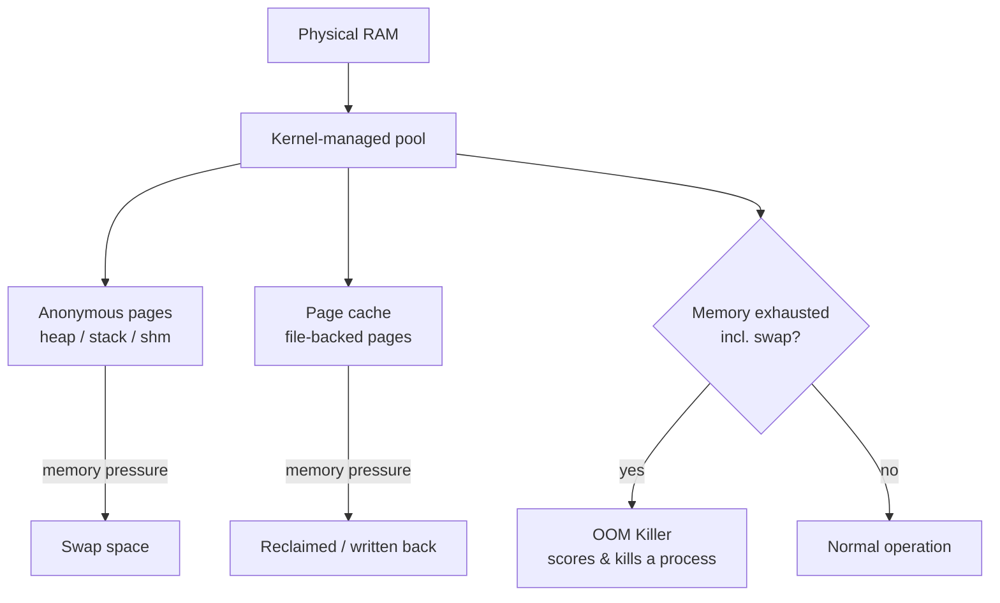

# Memory Performance Analysis

## Overview

Linux memory management is deceptively hard to read: "free" memory is almost always low by design because the kernel aggressively uses spare RAM as page cache to speed up disk I/O. This note builds on [Performance-Analysis-Overview](Performance-Analysis-Overview.md) and drills into `free`/`vmstat` output, the page cache/buffer split, `swappiness`, the Out-Of-Memory (OOM) killer, and huge pages — the levers you tune alongside [Kernel-Tuning-with-sysctl](Kernel-Tuning-with-sysctl.md) when a box is thrashing, swapping, or getting processes reaped unexpectedly.

> [!NOTE]
> **A "low free memory" reading is rarely a problem by itself — check `available` in `free -h` and watch `si`/`so` in `vmstat` before concluding you have a real memory shortage.**

## Concepts

| Term | Meaning |
|---|---|
| Page cache | RAM holding recently read/written file blocks; reclaimed on demand, not "used" in a bad sense |
| Buffers | RAM caching raw block-device metadata (small, distinct from page cache) |
| Available | Estimate of RAM usable by new applications without swapping (accounts for reclaimable cache) |
| Anonymous memory | Process memory not backed by a file (heap, stack) — can only go to swap, not be dropped |
| Swappiness | Kernel knob (0-100) controlling how aggressively anonymous pages are swapped out vs. reclaiming cache |
| OOM killer | Kernel mechanism that kills a process when memory (incl. swap) is exhausted, scored via `oom_score` |
| Huge pages | Larger-than-4KB memory pages (2MB/1GB) reducing TLB misses for large-memory workloads (DBs, JVMs) |

## Architecture



## Commands

### free — the first look

```bash
free -h          # human-readable snapshot
free -h -s 2      # refresh every 2 seconds
free -h -w        # separate buffers from cache columns
```

```text
               total        used        free      shared  buff/cache   available
Mem:            15Gi       4.2Gi       1.1Gi       312Mi       9.9Gi        10Gi
Swap:          2.0Gi          0B       2.0Gi
```

Reading it correctly:

| Column | Meaning |
|---|---|
| `used` | Memory NOT available for other processes (excludes reclaimable cache) |
| `free` | Truly unused RAM — often small and not a cause for concern |
| `buff/cache` | Page cache + buffers — reclaimable under pressure |
| `available` | The number that actually matters — estimated RAM for new processes |
| `Swap used` | Non-zero and climbing is a real signal; a small static value is not |

### vmstat — trends over time

```bash
vmstat 2 10        # sample every 2s, 10 times
vmstat -a 2         # show active/inactive memory instead of buff/cache
vmstat -s           # one-shot detailed memory event summary
```

```text
procs -----------memory---------- ---swap-- -----io---- -system-- ------cpu-----
 r  b   swpd   free   buff  cache   si   so    bi    bo   in   cs us sy id wa st
 2  0      0 112340  20544 812200    0    0    45   120  620 1400 12  3 84  1  0
```

Key columns:

| Field | Interpretation |
|---|---|
| `r` | Runnable processes waiting for CPU — sustained high value = CPU pressure |
| `b` | Processes blocked on I/O (often disk or swap) |
| `si` / `so` | Swap-in / swap-out KB/s — **any sustained non-zero value is a red flag** |
| `wa` | % CPU time waiting on I/O — high with high `bi`/`bo` points to disk-bound swapping |

### Page cache and reclaimable memory

```bash
cat /proc/meminfo | grep -Ei 'MemTotal|MemFree|MemAvailable|Cached|Buffers|SwapTotal|SwapFree'
sync; echo 1 > /proc/sys/vm/drop_caches   # drop page cache only (safe, for testing)
sync; echo 2 > /proc/sys/vm/drop_caches   # drop dentries/inodes
sync; echo 3 > /proc/sys/vm/drop_caches   # drop everything reclaimable
```

> [!WARNING]
> **`drop_caches` is a diagnostic/benchmarking tool, not a "fix". Dropping cache in production forces the next reads back to disk and will temporarily hurt performance — never cron this as a "memory cleanup" hack.**

### Swappiness

```bash
cat /proc/sys/vm/swappiness          # current value (default 60 on most distros)
sudo sysctl vm.swappiness=10         # runtime change, lost on reboot
```

```ini
# /etc/sysctl.d/99-memory.conf
# Lower = prefer reclaiming page cache over swapping anonymous memory.
# Database/latency-sensitive hosts commonly run 1-10; desktops keep 60.
vm.swappiness = 10
```

```bash
sudo sysctl -p /etc/sysctl.d/99-memory.conf
```

| swappiness value | Behavior |
|---|---|
| 0 | Kernel avoids swap unless absolutely necessary (may still swap under extreme pressure since Linux 3.5+) |
| 1-10 | Strongly prefer page cache reclaim — typical for DB/latency-sensitive servers |
| 60 | Default balance |
| 100 | Aggressively swap anonymous pages as soon as possible |

### OOM killer investigation

```bash
dmesg -T | grep -i -A2 'killed process'
journalctl -k | grep -i oom
cat /proc/<pid>/oom_score        # higher = more likely to be killed
cat /proc/<pid>/oom_score_adj    # -1000 to 1000, admin-adjustable bias
```

```bash
# Protect a critical process (e.g. database) from being an early OOM target
echo -500 > /proc/$(pgrep -f postgres | head -1)/oom_score_adj

# Fully exempt a process from the OOM killer (use sparingly — can cause deadlock-style hangs)
echo -1000 > /proc/<pid>/oom_score_adj
```

```conf
# systemd unit drop-in — persistent OOM adjustment
[Service]
OOMScoreAdjust=-500
```

### Huge pages

```bash
grep -i huge /proc/meminfo
cat /sys/kernel/mm/transparent_hugepage/enabled
```

```text
AnonHugePages:    204800 kB
HugePages_Total:       0
HugePages_Free:        0
Hugepagesize:       2048 kB
```

```bash
# Reserve 1024 static 2MB huge pages (2GB) at boot — for DBs (PostgreSQL, Oracle) that request them explicitly
sudo sysctl vm.nr_hugepages=1024
echo 'vm.nr_hugepages = 1024' | sudo tee -a /etc/sysctl.d/99-hugepages.conf
```

```bash
# Disable Transparent Huge Pages (THP) — recommended for Redis/MongoDB, which see latency spikes from THP compaction
echo never | sudo tee /sys/kernel/mm/transparent_hugepage/enabled
echo never | sudo tee /sys/kernel/mm/transparent_hugepage/defrag
```

## Examples

```bash
# Quick triage script: is this host memory-pressured right now?
echo "--- free ---"; free -h
echo "--- swap activity (5s sample) ---"; vmstat 1 5 | tail -n +3
echo "--- top memory consumers ---"; ps -eo pid,ppid,cmd,%mem,rss --sort=-%mem | head -10
echo "--- recent OOM events ---"; dmesg -T | grep -i 'killed process' | tail -5
```

## Best Practices

- Judge memory pressure by `available` (free) and `si`/`so` (vmstat), never by the raw `free` column alone.
- Tune `vm.swappiness` per workload role: low (1-10) for DB/cache servers, default (60) for general-purpose hosts.
- Set `OOMScoreAdjust` on systemd units for services that must survive OOM events longer than the noisiest process on the box.
- Disable Transparent Huge Pages for Redis/MongoDB/most JVM workloads; use explicit static huge pages only for engines that request them (PostgreSQL `huge_pages=on`, Oracle).
- Persist sysctl changes under `/etc/sysctl.d/*.conf` — see [Kernel-Tuning-with-sysctl](Kernel-Tuning-with-sysctl.md) for the full workflow, ordering rules, and validation steps.
- Alert on `si`/`so` sustained > 0 and on OOM-killer log entries, not on raw "used memory %".

## Security Considerations

- Uncontrolled memory exhaustion is a denial-of-service vector (CWE-400); apply `cgroups` (`MemoryMax=` in systemd, or `memory.max` under cgroup v2) to cap per-service/per-user memory as defense-in-depth, aligned with CIS "resource control" guidance.
- Never leave `drop_caches` writable to non-root or automated by unprivileged cron — it can be abused for local DoS against I/O latency.
- OOM-killer immunity (`oom_score_adj=-1000`) on an attacker-influenced process can be leveraged to starve legitimate services of memory in a compromise scenario — restrict this to trusted system services only.
- Audit swap encryption: unencrypted swap can leak sensitive in-memory data (credentials, keys) to disk; use encrypted swap (`cryptsetup` swap mapping) on hosts handling secrets, per NIST SP 800-111 guidance on storage encryption.
- Review `/proc/<pid>/oom_score_adj` grants as part of privilege audits — a low score plus elevated privileges is a stealthy persistence indicator worth checking during incident response.

## Troubleshooting

| Symptom | Likely cause | Action |
|---|---|---|
| High `si`/`so` in `vmstat`, sluggish system | Anonymous memory pressure, swappiness too high | Lower `vm.swappiness`, add RAM, or find the memory-hungry process (`ps --sort=-%mem`) |
| `available` in `free -h` near zero | Genuine memory shortage (cache alone can't cover it) | Investigate top consumers; check for leaks with `smem`/`ps_mem` |
| Process killed unexpectedly, `dmesg` shows "Killed process" | OOM killer fired | Check `oom_score`, raise `OOMScoreAdjust` for critical services, or add swap/RAM |
| Latency spikes on Redis/Mongo under load | THP compaction stalls | Disable THP (`transparent_hugepage/enabled` = `never`) |
| DB fails to start with huge pages configured | `vm.nr_hugepages` not reserved or reserved too late (fragmentation) | Set `nr_hugepages` early at boot via sysctl.d, verify with `HugePages_Free` |
| `buff/cache` very high, `free` low, system still responsive | Normal — kernel using spare RAM for cache | No action; this is expected behavior, not a leak |

> [!NOTE]
> **📸 Screenshot**
> _Capture: terminal showing `free -h` next to `vmstat 2 5` output side by side, annotated to highlight `available` vs `free` and the `si`/`so` columns_

## References

- `man 1 free`, `man 8 vmstat`, `man 5 proc`
- Linux kernel documentation: `Documentation/admin-guide/mm/transhuge.rst`, `Documentation/admin-guide/mm/concepts.rst`
- Linux kernel documentation: `Documentation/admin-guide/sysctl/vm.rst` (swappiness, overcommit, huge pages)
- NIST SP 800-111 — Guide to Storage Encryption Technologies for End User Devices

## Related Notes

- [Performance-Analysis-Overview](Performance-Analysis-Overview.md) — top-level triage framework this note plugs into
- [Kernel-Tuning-with-sysctl](Kernel-Tuning-with-sysctl.md) — persisting and validating sysctl changes like `vm.swappiness`
- [Linux Administration & Server Hardening](../Readme.md) — course hub and map of content
