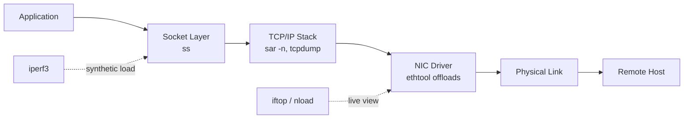

# Network Performance Analysis

## Overview

Network performance problems hide behind vague symptoms — "the app feels slow" — and the job of the administrator is to turn that vagueness into numbers: throughput, latency, retransmit rate, queue depth. This note walks through the socket-level, real-time, and historical tools used to isolate whether a bottleneck is on the wire, in the NIC, in the kernel's network stack, or in the application itself, complementing the broader methodology in [Performance-Analysis-Overview](Performance-Analysis-Overview.md) and the interface/routing setup covered in [Readme](../Network-Configuration/Readme.md).

> [!TIP]
> **Layered diagnosis**
> Work outward from the socket: `ss` (who's connected, queue state) → `sar -n` (historical throughput/errors) → `iftop`/`nload` (live bandwidth by connection) → `iperf3` (synthetic throughput ceiling) → `tcpdump`/`ping` (packet-level latency) → NIC offload settings (is the kernel doing work the hardware could do). Each layer rules out or confirms a class of problem before you go deeper.

## Concepts

| Term | Meaning |
|---|---|
| Throughput | Bits/bytes per second actually moved — measured with `iperf3`, `sar -n DEV` |
| Latency | Round-trip time for a single packet — measured with `ping`, `tcpdump` timestamps |
| Jitter | Variance in latency between packets — matters for VoIP/streaming |
| Retransmits | TCP segments resent due to loss — visible in `ss -i`, `sar -n ETCP` |
| Congestion window (cwnd) | TCP's self-limiting send window — shown in `ss -i` |
| Offload | NIC hardware performing checksum/segmentation work instead of the CPU |
| Bufferbloat | Excess queuing causing latency spikes under load despite available bandwidth |

## Architecture



## Installation

```bash
# Debian/Ubuntu
sudo apt update
sudo apt install -y iproute2 sysstat iftop nload iperf3 tcpdump ethtool

# RHEL/CentOS/Rocky/Alma
sudo dnf install -y iproute sysstat iftop nload iperf3 tcpdump ethtool

# Enable sysstat's historical collector (sar) on both families
sudo systemctl enable --now sysstat   # Debian: sysstat cron job in /etc/cron.d/sysstat
```

> [!NOTE]
> **sysstat data collection**
> `sar` only has history if the `sysstat` collection service/cron job is running. On RHEL, edit `/etc/sysconfig/sysstat` to change retention (`HISTORY=28`); on Debian, edit `/etc/default/sysstat` and set `ENABLED="true"`.

## Configuration

`/etc/sysconfig/sysstat` (RHEL) or `/etc/default/sysstat` (Debian) — retain enough history for trend analysis:

```ini
# RHEL: /etc/sysconfig/sysstat
HISTORY=28
COMPRESSAFTER=10
SADC_OPTIONS="-S DISK"
```

Collection interval lives in cron (`/etc/cron.d/sysstat` on Debian) or the systemd timer `sysstat-collect.timer` (RHEL), default every 10 minutes:

```ini
# /etc/cron.d/sysstat (Debian)
*/10 * * * * root command -v debian-sa1 > /dev/null && debian-sa1 1 1
```

## Commands

### `ss` — socket statistics (replaces `netstat`)

```bash
ss -tunap                 # all TCP/UDP sockets, numeric, with process
ss -tin                   # TCP sockets with internal info: rtt, cwnd, retransmits
ss -o state established '( dport = :443 or sport = :443 )'
ss -s                     # summary counts by protocol/state
```

Sample `ss -ti` output line to read:

```text
ESTAB 0 0 10.0.0.5:22 10.0.0.9:51234
    cubic wscale:7,7 rto:204 rtt:2.4/1.1 mss:1448 cwnd:10 bytes_acked:48213 retrans:0/3
```

`rtt` = smoothed round-trip time (ms); `retrans:0/3` = 0 currently in flight, 3 total lifetime retransmits — a red flag if climbing under normal load.

### `iftop` / `nload` — live bandwidth

```bash
sudo iftop -i eth0 -n -N          # per-connection bandwidth, no DNS/port resolution
sudo iftop -i eth0 -f "port 443"  # filter with pcap-style expression

sudo nload eth0                   # simple in/out gauge, good for a quick glance
```

### `iperf3` — synthetic throughput test

```bash
# On the server (listener)
iperf3 -s

# On the client — TCP throughput, 30s
iperf3 -c 10.0.0.5 -t 30

# UDP test with target bandwidth, to measure jitter/loss
iperf3 -c 10.0.0.5 -u -b 100M -t 30

# Parallel streams to saturate a fast link
iperf3 -c 10.0.0.5 -P 8 -t 20 -J > result.json   # JSON output for scripting
```

### `sar -n` — historical network stats

```bash
sar -n DEV 1 5        # per-interface throughput, 5 samples 1s apart
sar -n EDEV 1 5       # interface errors (rxerr, txerr, coll, drops)
sar -n TCP,ETCP 1 5   # active/passive TCP opens, retransmit segments
sar -n DEV -f /var/log/sysstat/sa22   # historical from today's log (RHEL path)
```

### `tcpdump` — packet-level latency and captures

```bash
sudo tcpdump -i eth0 -n host 10.0.0.5 and port 443 -w capture.pcap
sudo tcpdump -i eth0 -n -tttt icmp                 # timestamped pings, human-readable
sudo tcpdump -i eth0 -n 'tcp[tcpflags] & (tcp-syn|tcp-ack) != 0'  # handshake only

# Measure app-level RTT: time between SYN and SYN-ACK
sudo tcpdump -i eth0 -n -tttt 'tcp[tcpflags] & tcp-syn != 0'
```

Analyze latency from a capture with `tshark`:

```bash
tshark -r capture.pcap -q -z io,stat,1
tshark -r capture.pcap -Y "tcp.analysis.retransmission"
```

### NIC offloads — `ethtool`

```bash
ethtool -k eth0                       # list all offload features and state
ethtool -K eth0 tso off gso off gro off   # disable segmentation offloads (debugging)
ethtool -K eth0 tx off rx off             # disable checksum offloads
ethtool -g eth0                       # ring buffer sizes
ethtool -G eth0 rx 4096 tx 4096       # increase ring buffers (reduce drops under burst)
ethtool -S eth0 | grep -i drop        # driver-level drop counters
```

| Offload | Purpose | When to disable |
|---|---|---|
| TSO (TCP Segmentation Offload) | NIC splits large TCP sends into MTU-sized frames | Packet capture accuracy, some virtio/driver bugs |
| GSO (Generic Segmentation Offload) | Software equivalent of TSO for unsupported NICs | Debugging fragmented/odd captures |
| GRO (Generic Receive Offload) | Coalesces incoming packets before handing to stack | Latency-sensitive apps needing per-packet visibility |
| RX/TX checksum offload | NIC computes checksums instead of CPU | Rare NIC firmware bugs corrupting checksums |
| LRO (Large Receive Offload) | Similar to GRO, done in hardware | Routers/bridges (breaks forwarding semantics) |

## Examples

Diagnose a suspected bufferbloat/latency issue under load:

```bash
# Terminal 1: baseline latency
ping -i 0.2 10.0.0.5 &

# Terminal 2: saturate the link
iperf3 -c 10.0.0.5 -t 20

# Watch ping RTT spike during the iperf3 run — if avg RTT goes from 1ms to 50ms+,
# you likely have oversized queues (bufferbloat), not a bandwidth problem.
```

Find which connection is chewing bandwidth right now:

```bash
sudo iftop -i eth0 -n -N -B     # -B shows bytes instead of bits, easier to eyeball
```

Correlate historical retransmits with a known incident window:

```bash
sar -n ETCP -f /var/log/sysstat/sa15 -s 14:00:00 -e 15:00:00
```

## Best Practices

- Establish a baseline (`iperf3`, `sar -n DEV`) during known-good periods so anomalies are obvious later.
- Prefer `ss` over `netstat` — `netstat` is deprecated on modern distros and reads `/proc` less efficiently.
- Run `iperf3` tests in both directions (`-R` for reverse) — asymmetric links (common on cloud/VPN) hide problems in one direction.
- Keep `sysstat` history at least 28 days to have data available after an incident is reported late.
- Capture with `tcpdump -w` and analyze offline with `tshark`/Wireshark rather than eyeballing live output for anything beyond a quick check.
- Test offload changes on a maintenance window — disabling TSO/GRO can measurably increase CPU usage under load.

## Security Considerations

- `tcpdump` and `iftop` require root or `CAP_NET_RAW`/`CAP_NET_ADMIN` — restrict via `sudo` rules (CIS: minimize direct root packet-capture access; prefer `setcap cap_net_raw,cap_net_admin=eip $(which tcpdump)` for a dedicated non-root capture user).
- Packet captures (`.pcap` files) may contain credentials or PII in cleartext protocols — treat them as sensitive data, store under restrictive permissions (`chmod 600`), and delete after analysis.
- `iperf3 -s` with no `-p`/auth binds an open, unauthenticated listener — never leave a server instance running on an internet-facing host; bind to a management interface or firewall the port (default TCP 5201).
- NIC offload state is not a security control by itself, but disabling GRO/LRO on inline security appliances (IDS/IPS) is often required for accurate packet inspection — verify vendor guidance before deploying tools like Suricata/Zeek.
- Restrict `ethtool` (device reconfiguration) to root/sudo; ring-buffer and offload changes can be used to degrade a host's own network performance (self-DoS) if left to unprivileged users.

## Troubleshooting

| Symptom | Likely Cause | Check |
|---|---|---|
| High `retrans` in `ss -ti` | Packet loss on the path or congested link | `sar -n ETCP`, `mtr`/`traceroute` |
| `iperf3` throughput far below link speed | Duplex/speed mismatch, single-stream TCP window limit | `ethtool eth0` (speed/duplex), retest with `-P 4` |
| Ping latency fine, app still slow | Application-layer delay, not network | `tcpdump` timestamps around the request, check app logs |
| Latency spikes only under load | Bufferbloat (oversized queues) | `ping` during `iperf3` saturation test |
| Interface drops in `ethtool -S` | Ring buffer too small, driver issue | `ethtool -g`/`-G` to increase, check `dmesg` for driver errors |
| `sar -n DEV` shows errors climbing | Physical layer issue (cable, duplex mismatch) | `ethtool eth0`, check switch port counters |

> [!NOTE]
> **📸 Screenshot**
> _Capture: `iftop` live view during an `iperf3` saturation test, showing per-connection bandwidth alongside the terminal running `ping` with visible RTT increase (bufferbloat demonstration)._

## References

- `man ss`, `man tcpdump`, `man iperf3`, `man ethtool`, `man sar`
- [iperf3 documentation](https://iperf.fr/iperf-doc.php)
- Red Hat: *Monitoring and managing system status and performance* (Performance Tuning Guide, networking chapter)
- sysstat project documentation (`sar`, `sadc`, `sadf`)

## Related Notes

- [Performance-Analysis-Overview](Performance-Analysis-Overview.md) — layered methodology this note plugs into
- [Readme](../Network-Configuration/Readme.md) — interface, routing, and addressing setup
- [Linux Administration & Server Hardening](../Readme.md) — course hub and map of content
