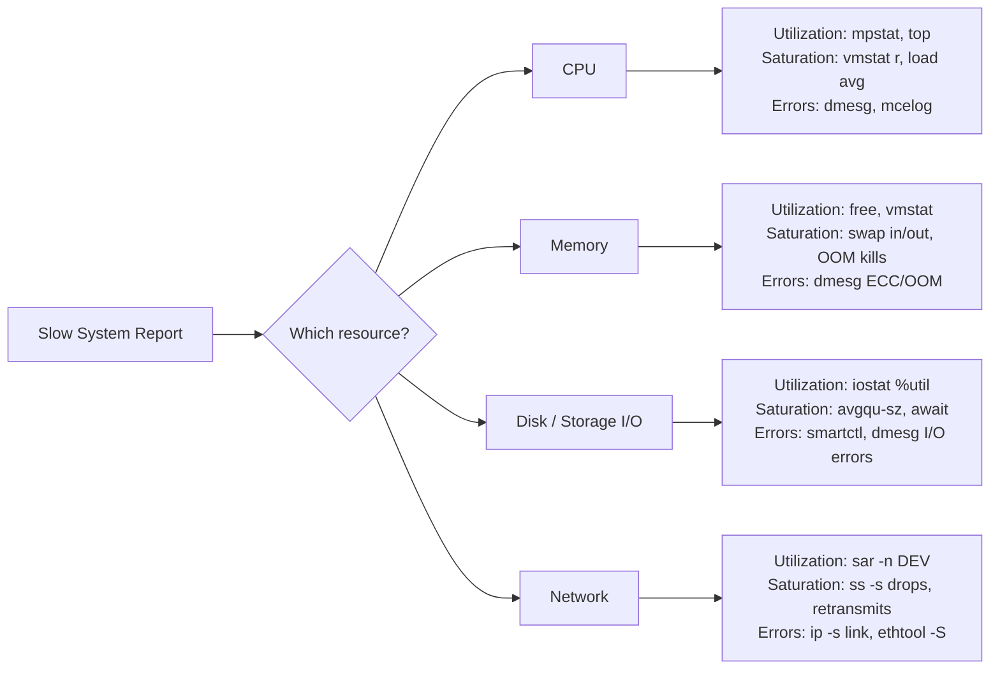
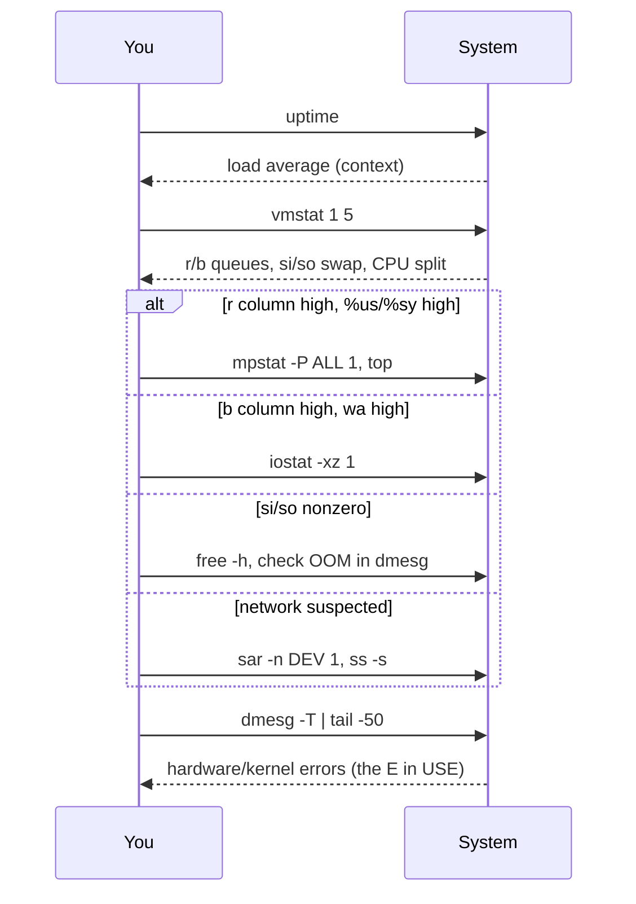

# Performance Analysis Overview

## Overview

Performance troubleshooting on Linux is a discipline, not a reflex — jumping straight to `top` when users complain "the server is slow" wastes time and often fixes the wrong thing. This note establishes the mental model and triage workflow used across the rest of the [Performance-and-Tuning](../Readme.md) module, before drilling into individual resources in [CPU-Performance-Analysis](CPU-Performance-Analysis.md) and [Memory-Performance-Analysis](Memory-Performance-Analysis.md). The core idea is Brendan Gregg's **USE Method**: for every resource, check **Utilization**, **Saturation**, and **Errors**, systematically, instead of guessing.

> [!TIP]
> **Read this note first**
> Every other note in `Performance-and-Tuning/` assumes you understand USE and the triage workflow below. If you only have five minutes before an incident call, read the [Commands](#commands) table and the [Triage Workflow](#triage-workflow).

## Concepts

### The USE Method

For each of the four core resources (CPU, memory, disk/storage I/O, network), ask three questions:

| Term | Definition | Example (CPU) |
|---|---|---|
| **Utilization** | % of time the resource was busy servicing work | `%user + %system` from `mpstat` |
| **Saturation** | Degree of queued/waiting work the resource can't service immediately | Run-queue length (`r` column in `vmstat`) |
| **Errors** | Count of error events (may not directly cause slowness but signals a failing component) | Machine check exceptions, `dmesg` CPU errors |

A resource can be 100% utilized without being saturated (fully busy but no queue), or saturated well before 100% utilization (e.g., disk I/O queuing at 60% busy due to seek contention). Both utilization and saturation matter — checking only one gives an incomplete picture.

### The Four Resources



### Load Average vs. Uptime

`uptime` reports **load average** over 1, 5, and 15 minutes — the average number of processes in the **run queue** (`R` state) plus, on Linux, **uninterruptible sleep** (`D` state, typically blocked on I/O). This is a key Linux-specific gotcha: a load average of 8 on a 4-core box could mean CPU saturation, disk-wait saturation, or both — you cannot tell from load average alone.

```bash
uptime
# 14:32:01 up 21 days,  3:12,  2 users,  load average: 8.42, 6.15, 3.88
```

| Load vs. core count | Interpretation |
|---|---|
| load ≈ core count | System fully utilized, roughly balanced |
| load < core count | Headroom available |
| load > core count | Queueing — could be CPU-bound or I/O-bound (check `vmstat` `r` vs `b` columns) |
| Rising 1-min but falling 15-min | Load spike resolving |
| Rising across all three windows | Sustained degradation — escalate |

> [!WARNING]
> **Load average includes uninterruptible I/O wait**
> Unlike BSD/Solaris, Linux load average counts processes stuck in `D` state (e.g., waiting on NFS or a failing disk). A high load average with idle CPUs almost always points at storage or network-mount saturation, not CPU. Confirm with `vmstat 1` — look at the `b` (blocked) column.

## Triage Workflow

A repeatable, resource-by-resource sweep for the "server is slow" call. Each step is a single low-overhead command; escalate to deeper tools (`perf`, `strace`, `iotop`) only after narrowing the culprit resource.



1. **Establish context** — `uptime`, `nproc`, `free -h`. What's the load relative to core count and installed RAM?
2. **One-shot overview** — `vmstat 1 5`. This single tool touches all four resources at once: `r`/`b` (CPU run/block queues), `si`/`so` (swap), `us`/`sy`/`id`/`wa`/`st` (CPU time breakdown).
3. **Branch by symptom** — high `r` and `us`/`sy` → go to [CPU-Performance-Analysis](CPU-Performance-Analysis.md); high `b`/`wa` → go to disk I/O (`iostat -xz 1`); nonzero `si`/`so` → go to [Memory-Performance-Analysis](Memory-Performance-Analysis.md); none of the above → check network (`sar -n DEV 1`, `ss -s`).
4. **Check for errors** — `dmesg -T | tail -50`, `journalctl -p err -b`. Errors can explain slowness that utilization/saturation alone can't (failing disk retries, NIC link flaps, ECC memory errors).
5. **Confirm with a longer sample** — one-off spikes vs. sustained trends matter. Re-run key commands with a longer interval/count, or pull historical data from `sar` (`sysstat` package) if enabled.
6. **Drill down** — once the resource is identified, move to the resource-specific note ([CPU-Performance-Analysis](CPU-Performance-Analysis.md), [Memory-Performance-Analysis](Memory-Performance-Analysis.md)) for deeper tooling (`perf top`, `strace -c`, `iotop`, `pidstat`).

> [!IMPORTANT]
> **Don't skip the "context" step**
> Runbooks that jump straight to `top` on a fresh SSH session miss the load-average trend and swap state that `uptime` + `free` give in two seconds. Always establish baseline context before drilling into a single resource — it prevents chasing the wrong lead.

## Commands

Quick-reference toolkit for the first five minutes of any performance incident.

| Command | Resource | What it shows |
|---|---|---|
| `uptime` | Overview | Load average (1/5/15 min) |
| `vmstat 1 5` | CPU + Mem + I/O | Run/block queues, swap, CPU time split |
| `mpstat -P ALL 1` | CPU | Per-core utilization breakdown |
| `top` / `htop` | CPU + Mem | Per-process resource consumers |
| `free -h` | Memory | Used/free/cache/available, swap |
| `iostat -xz 1` | Disk | `%util`, `await`, `avgqu-sz` per device |
| `iotop` | Disk | Per-process disk I/O (needs root) |
| `sar -n DEV 1` | Network | Per-interface throughput |
| `ss -s` | Network | Socket summary, TCP state counts |
| `dmesg -T \| tail` | Errors | Kernel/hardware error messages |
| `pidstat 1` | CPU + Mem + I/O | Per-process resource usage over time (sysstat) |
| `nproc` | Context | Number of usable CPU cores |

```bash
# RHEL/Fedora — sysstat provides mpstat, iostat, sar, pidstat
sudo dnf install sysstat
sudo systemctl enable --now sysstat

# Debian/Ubuntu — same package name
sudo apt install sysstat
sudo systemctl enable --now sysstat
```

## Examples

```bash
# Establish baseline in under 10 seconds
uptime; nproc; free -h

# One-shot overview — watch r, b, wa columns
vmstat 1 5

# Is it CPU-bound? Check per-core split (avoid averaging away a hot core)
mpstat -P ALL 1 3

# Is it I/O-bound? %util near 100 + high await = saturated disk
iostat -xz 1 3

# Pull the last hour of historical CPU data (sysstat must be enabled)
sar -u -s 09:00:00 -e 10:00:00
```

## Best Practices

- Run the USE method top-down: **utilization → saturation → errors**, in that order, per resource, before switching resources.
- Prefer commands that sample over an interval (`vmstat 1 5`, `mpstat -P ALL 1`) over single-shot snapshots — a single `top` refresh can be misleading.
- Enable `sysstat`'s cron-driven historical collection (`/etc/cron.d/sysstat`) on every production host *before* an incident — you cannot retroactively capture "what was load doing an hour ago."
- Correlate with `dmesg`/`journalctl` timestamps — a performance dip that lines up with a kernel OOM kill or NIC reset has a root cause, not just a symptom.
- Document the resource identified and the command output in the incident ticket — it feeds the resource-specific runbooks ([CPU-Performance-Analysis](CPU-Performance-Analysis.md), [Memory-Performance-Analysis](Memory-Performance-Analysis.md)).

## Security Considerations

- Tools like `iotop`, `strace`, and `perf` typically require root or `CAP_SYS_PTRACE`/`CAP_SYS_ADMIN` — restrict their use via `sudo` policy and audit who runs them (CIS control on privileged command auditing).
- `perf` can expose kernel addresses and process memory contents; on hardened/multi-tenant systems set `kernel.perf_event_paranoid` conservatively (`sysctl kernel.perf_event_paranoid`) rather than `-1`.
- Historical performance data (`sar` archives in `/var/log/sa/`) can reveal usage patterns; treat it like any other operational log under your data-retention policy.
- Never run ad-hoc diagnostic scripts from untrusted sources during an incident — a "performance analysis" script is a common social-engineering vector for credential harvesting during a high-stress outage.

> [!NOTE]
> **📸 Screenshot**
> _Capture: terminal output of `vmstat 1 5` alongside `uptime` and `mpstat -P ALL 1`, showing the r/b queue columns and per-core CPU split used for triage branching._

## Troubleshooting

| Symptom | Likely cause | Next step |
|---|---|---|
| High load, low CPU `us`/`sy`, high `wa` | Disk I/O saturation | `iostat -xz 1`, then [CPU-Performance-Analysis](CPU-Performance-Analysis.md) disk section or `iotop` |
| High load, `b` column high, `free` shows swap in use | Memory pressure → swapping | Go to [Memory-Performance-Analysis](Memory-Performance-Analysis.md) |
| `sar`/`sysstat` shows no historical data | `sysstat` collection cron not enabled | `systemctl enable --now sysstat`, check `/etc/cron.d/sysstat` |
| Load high but all resources look idle | NFS/network mount hung (`D` state processes) | `ps aux | awk '$8=="D"'`, check `dmesg` for mount timeouts |
| `top` shows low CPU% but system feels slow | Steal time (`st` in `vmstat`) on a VM — noisy neighbor | Check hypervisor/host-level metrics, not just guest |

## References

- Brendan Gregg — *Systems Performance: Enterprise and the Cloud*, 2nd Edition (USE Method chapter)
- [Brendan Gregg's USE Method reference](http://www.brendangregg.com/usemethod.html)
- `man 1 vmstat`, `man 1 mpstat`, `man 1 iostat`, `man 1 sar`
- Red Hat Performance Tuning Guide — RHEL 9 Documentation

## Related Notes

- [CPU-Performance-Analysis](CPU-Performance-Analysis.md) — CPU-specific USE drill-down and tooling
- [Memory-Performance-Analysis](Memory-Performance-Analysis.md) — Memory-specific USE drill-down and tooling
- [Linux Administration & Server Hardening](../Readme.md) — course hub and map of content
