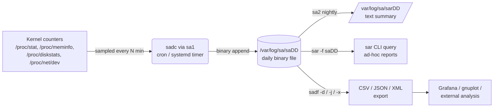

# System Statistics with sar

## Overview

`sar` (System Activity Reporter) is the historical-data workhorse of the [sysstat](https://github.com/sysstat/sysstat) package, collecting CPU, memory, I/O, network, and paging statistics at regular intervals via a background collector (`sadc`) and letting you query any past interval later — unlike live tools such as `top` or [top/htop](../Process-Service-and-Job-Management/Process-Management-in-Linux.md) that only show the present moment. It is the standard first stop for "what happened at 3 AM last Tuesday" post-mortems and capacity-planning trend analysis, and pairs with [Performance-Analysis-Overview](Performance-Analysis-Overview.md) as the tool that fills the "historical data" gap in that overview's toolkit map. Data is stored in daily binary files under `/var/log/sa/` (RHEL) or `/var/log/sysstat/` (Debian) and can be exported to CSV/JSON/XML with `sadf` for graphing or ingestion into other systems.

> [!TIP]
> **sar is enabled by default on most enterprise distros**
> RHEL/CentOS ship `sysstat` with a cron/systemd timer already collecting data every 10 minutes out of the box. Debian/Ubuntu require enabling data collection explicitly (`ENABLED="true"` in `/etc/default/sysstat`). Always verify collection is actually running before relying on historical reports during an incident.

## Concepts

| Component | Role |
|---|---|
| `sadc` | System Activity Data Collector — the binary that samples kernel counters and writes them to the daily data file. Rarely invoked directly; called by cron/systemd. |
| `sa1` | Wrapper script that invokes `sadc` for one sample and appends it to today's `saDD` file. |
| `sa2` | Wrapper script that generates the daily human-readable summary report (`sarDD`) from the binary data. |
| `sar` | The query/report command — reads live kernel stats (no args) or historical binary files (`-f`). |
| `sadf` | Converts `sar`'s binary data files to CSV, JSON, XML, or a format ready for `gnuplot`/`Grafana`. |
| `/var/log/sa/saDD` | Binary data file for day `DD` of the current month (RHEL path). |
| `/var/log/sysstat/saDD` | Same, Debian/Ubuntu path. |

## Architecture



## Installation

```bash
# RHEL / CentOS / Fedora / Rocky / Alma
sudo dnf install sysstat
sudo systemctl enable --now sysstat

# Debian / Ubuntu
sudo apt update
sudo apt install sysstat
# Enable data collection (disabled by default on Debian family)
sudo sed -i 's/ENABLED="false"/ENABLED="true"/' /etc/default/sysstat
sudo systemctl restart sysstat
```

Verify the collector is scheduled:

```bash
# RHEL: systemd timer drives sa1/sa2
systemctl list-timers | grep sysstat

# Debian: cron drives it
cat /etc/cron.d/sysstat
```

## Configuration

Default collection interval and retention live in different places per distro.

**RHEL/CentOS** — `/etc/cron.d/sysstat` (or a systemd timer unit on newer releases):

```conf
# Run system activity accounting tool every 10 minutes
*/10 * * * * root /usr/lib64/sa/sa1 1 1
# Generate a daily summary at 23:53
53 23 * * * root /usr/lib64/sa/sa2 -A
```

**Debian/Ubuntu** — `/etc/cron.d/sysstat`:

```conf
# Activity reports every 10 minutes
*/10 * * * * root command -v debian-sa1 >/dev/null && debian-sa1 1 1
# Additional report of yesterday (at 6:00am)
55 23 * * * root command -v debian-sa1 >/dev/null && debian-sa1 60 2
```

Global settings — `/etc/sysstat/sysstat` (RHEL) or `/etc/default/sysstat` (Debian):

```ini
# History (in days) sysstat files are kept
HISTORY=28

# Compress (using xz) sa and sar files older than (in days)
COMPRESSAFTER=10

# Directory where sa and sar files are kept
SADIR=/var/log/sa

# Compression program used
ZIP="xz"
```

Increase `HISTORY` for longer retention if you need month-over-month capacity trends; each daily binary file is typically a few hundred KB to a few MB depending on interval and system size.

## Commands

| Command | Purpose |
|---|---|
| `sar 1 5` | Live CPU report, 5 samples, 1 second apart (like `sar` with no history). |
| `sar -u` | CPU utilization (default metric if no flag given). |
| `sar -r` | Memory (RAM) utilization: `kbmemfree`, `kbmemused`, `%memused`, buffers/cache. |
| `sar -S` | Swap space utilization. |
| `sar -b` | I/O and transfer rate (tps, read/write per second). |
| `sar -d -p` | Per-block-device I/O stats with human-readable device names (`-p`). |
| `sar -n DEV` | Network interface throughput (rxkB/s, txkB/s, packets). |
| `sar -n EDEV` | Network interface errors (rxerr/s, txerr/s, collisions). |
| `sar -q` | Load average and run-queue length. |
| `sar -W` | Swapping (pages swapped in/out per second). |
| `sar -B` | Paging statistics (pgpgin/s, pgpgout/s, majflt/s). |
| `sar -f /var/log/sa/sa15` | Read a specific historical binary file (day 15 of current month). |
| `sar -s 09:00:00 -e 12:00:00` | Restrict output to a time window (combine with `-f` for history). |
| `sar -A` | Dump every metric sar knows about — useful for a full snapshot during an incident. |

## Examples

Check yesterday's CPU usage between 08:00 and 10:00 (business-hours incident window):

```bash
sar -u -f /var/log/sa/sa$(date -d yesterday +%d) -s 08:00:00 -e 10:00:00
```

Sample output:

```text
Linux 6.1.0-x86_64 (webapp01)   07/21/2026      _x86_64_        (4 CPU)

08:00:01 AM     CPU     %user     %nice   %system   %iowait    %steal     %idle
08:10:01 AM     all      12.44      0.00      3.10      1.02      0.00     83.44
08:20:01 AM     all      68.91      0.00     11.30     22.05      0.00      -2.26
08:30:01 AM     all      15.02      0.00      3.44      0.88      0.00     80.66
Average:        all      32.12      0.00      5.95      7.98      0.00     53.95
```

The `%iowait` spike at 08:20 combined with elevated `%system` points at a storage bottleneck — cross-check with `sar -d -p` for the same window.

Find which disk was saturated at that time:

```bash
sar -d -p -f /var/log/sa/sa21 -s 08:15:00 -e 08:25:00
```

Export a full day of memory stats to CSV for spreadsheet/Grafana ingestion:

```bash
sadf -d -- -r /var/log/sa/sa21 > mem_report_20260721.csv
```

Export to JSON:

```bash
sadf -j -- -u /var/log/sa/sa21 > cpu_report_20260721.json
```

List all data files currently retained:

```bash
ls -lh /var/log/sa/sa[0-9]* 2>/dev/null || ls -lh /var/log/sysstat/sa[0-9]*
```

Force an immediate collection sample (useful for testing after install):

```bash
sudo /usr/lib64/sa/sa1 1 1        # RHEL path
sudo /usr/lib/sysstat/debian-sa1 1 1   # Debian path
```

## Best Practices

- Leave the default 10-minute interval for general use; drop to 1–5 minutes only on hosts under active investigation, since finer intervals grow the binary files faster.
- Bump `HISTORY` to 60–90 days on production hosts that feed capacity-planning reviews; 28 days (the default) is too short for monthly trend analysis.
- Use `sadf -j` or `-x` to feed sar data into Grafana/Prometheus pipelines rather than parsing `sar` text output with regex — the structured export is stable across sysstat versions.
- Combine `sar -u`, `sar -r`, `sar -d -p`, and `sar -n DEV` for the same time window during an incident review — CPU-only analysis misses I/O- or network-bound root causes.
- Set `COMPRESSAFTER` sensibly (default 10 days) so old data doesn't consume disk indefinitely; compressed files are still readable by `sar -f` after decompression, or via `sar` invoked with `xz`-aware wrappers on newer sysstat.
- Document which `sar` flags correspond to which subsystem (see Commands table) in your runbook — under incident pressure, `-u` vs `-U` vs `-P` typos waste time.

## Security Considerations

- `sar`/`sadc` read from `/proc` and require no special privileges beyond the `sys` or `adm` group on most distros for reading `/var/log/sa/*`; avoid running collection as root unnecessarily where the distro package allows a dedicated service account.
- Historical performance data can reveal operational patterns (peak-hour traffic, batch-job timing, backup windows) — treat `/var/log/sa/` with the same access controls as other operational logs (CIS Benchmark: restrict log directory permissions, e.g. `chmod 750 /var/log/sa`).
- If exporting `sar` data off-host (via `sadf` to a monitoring pipeline), ensure the transport is encrypted (TLS to Grafana/Prometheus, not plaintext HTTP) — the data itself is low-sensitivity but still reveals infrastructure sizing.
- Audit that `sysstat` cron/systemd timers run with the package-provided unit files rather than a hand-rolled root cron entry, per CIS guidance on minimizing custom root cron jobs (CIS Distribution Independent Linux Benchmark §2 – "Special Purpose Services").
- Rotate and archive `/var/log/sa/*` consistent with your log-retention policy (NIST SP 800-92 log management guidance) — sysstat's own `COMPRESSAFTER`/`HISTORY` settings are not a substitute for centralized log retention if compliance requires longer windows.

> [!NOTE]
> **📸 Screenshot**
> _Capture: terminal output of `sar -u -f /var/log/sa/saDD -s 08:00:00 -e 10:00:00` showing a CPU utilization table with a visible `%iowait` or `%system` spike._

## Troubleshooting

| Symptom | Cause | Fix |
|---|---|---|
| `Cannot open /var/log/sa/saDD: No such file or directory` | No data collected for that day, or wrong path for distro | Check `/etc/cron.d/sysstat` ran; confirm RHEL (`/var/log/sa/`) vs Debian (`/var/log/sysstat/`) path |
| `sar` shows only current data, no history | `sysstat` service not enabled / cron not installed | `systemctl enable --now sysstat` (RHEL) or verify `/etc/cron.d/sysstat` exists and `ENABLED="true"` (Debian) |
| Empty or truncated report for a window | Host was down, or interval sample missed | Cross-check `sar -A -f saDD` for full-file dump; verify uptime logs for the window |
| `sadf` output format unrecognized by downstream tool | Wrong export flag | Use `-d` for CSV/semicolon, `-j` for JSON, `-x` for XML; check tool's expected schema |
| Data files growing too large | Interval too short or `HISTORY`/`COMPRESSAFTER` misconfigured | Lower sample frequency in cron, tune `COMPRESSAFTER` in `/etc/sysstat/sysstat` |
| Old `.xz` files unreadable by `sar -f` directly | Compressed file not decompressed first | `xz -dk saDD.xz` then `sar -f saDD`, or rely on `sar`'s built-in decompression support in recent sysstat versions |

## References

- sysstat project documentation and man pages: `man sar`, `man sadc`, `man sadf`, `man sa1`, `man sa2`
- Red Hat: Monitoring Performance with sar (System Administrator's Guide)
- CIS Distribution Independent Linux Benchmark
- NIST SP 800-92: Guide to Computer Security Log Management

## Related Notes

- [Performance-Analysis-Overview](Performance-Analysis-Overview.md) — toolkit map this note fills the historical-data gap for
- [Process-Management-in-Linux](../Process-Service-and-Job-Management/Process-Management-in-Linux.md) — live counterpart to sar's historical view
- [Linux Administration & Server Hardening](../Readme.md) — course hub and map of content
