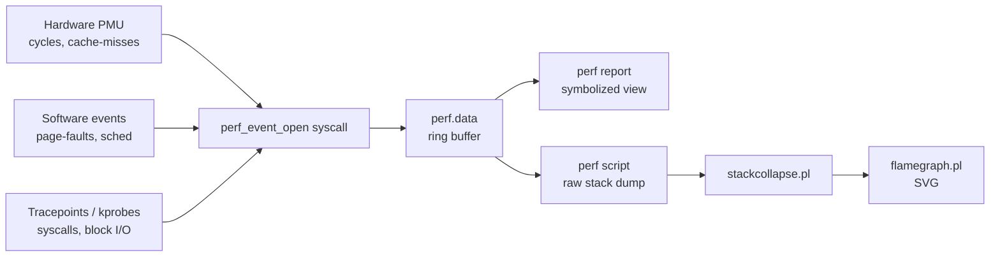

# perf and Profiling

## Overview

`perf` is the Linux kernel's built-in profiling and tracing toolkit, exposing hardware performance counters (PMU events), software events, and tracepoints through a single `perf_event_open()` interface. It answers the question [CPU-Performance-Analysis](CPU-Performance-Analysis.md) can only hint at: not just *that* a CPU is busy, but *which function, in which binary, on which line* is burning the cycles. This note covers `perf top` for live sampling, `perf record`/`perf report` for offline analysis, flame graphs for visualizing call stacks, and the tracing primitives (`perf trace`, tracepoints, `perf stat`) that round out kernel-level observability.

> [!TIP]
> **Profile before you tune**
> Never hand-tune based on intuition. Run `perf top` or a 30-second `perf record` first — the hottest function is almost always somewhere you didn't expect (a logging call, a lock, a memcpy). Profiling data turns guesswork into evidence.

## Concepts

| Term | Meaning |
|---|---|
| **Event** | A countable/sampleable occurrence — hardware (`cycles`, `cache-misses`, `branch-misses`) or software (`page-faults`, `context-switches`) or a kernel tracepoint (`sched:sched_switch`) |
| **Sampling** | perf interrupts execution every N events (or every N ms) and records the instruction pointer + call stack — statistical, low overhead |
| **Counting** | perf sums raw event occurrences over a run with no sampling — exact, near-zero overhead (`perf stat`) |
| **Symbol resolution** | Mapping addresses back to function names via ELF symbol tables / debuginfo; requires unstripped binaries or a `-dbg`/`-debuginfo` package |
| **Call graph (`-g`)** | The stack trace captured at each sample, used to attribute cost to callers, not just the leaf function |
| **PMU** | Performance Monitoring Unit — CPU hardware registers that count microarchitectural events; perf is the userspace front end to it |

## Architecture



## Installation

**RHEL-family (RHEL/CentOS/Rocky/Alma/Fedora)**

```bash
sudo dnf install perf
# debuginfo for accurate symbols (optional but recommended)
sudo dnf install kernel-debuginfo kernel-debuginfo-common-$(uname -m)
```

**Debian-family (Debian/Ubuntu/Kali)**

```bash
sudo apt update
sudo apt install linux-tools-common linux-tools-generic linux-tools-$(uname -r)
```

Verify:

```bash
perf --version
# Kernel restricts unprivileged profiling by default; check/relax if needed:
cat /proc/sys/kernel/perf_event_paranoid
sudo sysctl kernel.perf_event_paranoid=1   # 1 = allow CPU-wide sampling for non-root in this session
```

## Configuration

| `perf_event_paranoid` value | Effect |
|---|---|
| `-1` | No restrictions (most permissive; lab/dev only) |
| `0` | Allow CPU-wide + kernel measurements for unprivileged users |
| `1` | Allow CPU-wide measurements, restrict kernel measurements (default on many distros) |
| `2` | Only per-process measurements, no CPU-wide (common hardened default) |

Persist a relaxed value for a trusted dev/lab host in `/etc/sysctl.d/99-perf.conf`:

```ini
# /etc/sysctl.d/99-perf.conf
kernel.perf_event_paranoid = 1
kernel.kptr_restrict = 0
```

```bash
sudo sysctl --system
```

> [!WARNING]
> **Don't relax this on production/multi-tenant hosts**
> `perf_event_paranoid = -1` combined with `kptr_restrict = 0` lets unprivileged users read kernel pointers and profile arbitrary processes — a known info-leak and side-channel primitive (e.g. cache-timing attacks). Keep production at `1`/`2` and require `sudo`/`CAP_PERFMON` instead.

## Commands

| Command | Purpose |
|---|---|
| `perf top` | Live, `top`-style view of the hottest functions system-wide |
| `perf stat -- <cmd>` | Count hardware/software events for a command run (IPC, cache misses, etc.) |
| `perf record -g -- <cmd>` | Sample a command with call-graph capture into `perf.data` |
| `perf record -g -p <pid> -- sleep 30` | Sample a running process for 30 seconds |
| `perf report` | Interactive, symbolized view of a `perf.data` capture |
| `perf report --stdio` | Non-interactive text report (good for piping/logging) |
| `perf script` | Dump raw per-sample stack traces (input to flame-graph tooling) |
| `perf list` | List all available events on this kernel/CPU |
| `perf trace` | `strace`-like live syscall tracer built on perf (lower overhead than strace) |
| `perf annotate` | Source/assembly-line-level hotspot annotation |
| `perf sched` | Scheduler latency analysis (`perf sched record` / `perf sched latency`) |

## Examples

**1. Live system-wide hotspot view**

```bash
sudo perf top
# press 'a' to annotate the selected symbol, 'q' to quit
```

**2. Count key hardware events for a workload**

```bash
sudo perf stat -e cycles,instructions,cache-misses,branch-misses -- ./my_app
```

```text
 Performance counter stats for './my_app':

     8,432,110,552      cycles
     6,102,884,331      instructions              #    0.72  insn per cycle
        41,220,981      cache-misses
        18,552,110      branch-misses

       3.201829123 seconds time elapsed
```

An IPC (instructions per cycle) well below 1.0 on a modern x86 core usually points to memory stalls or branch mispredicts, not raw CPU-bound work.

**3. Record and report a CPU hog process**

```bash
sudo perf record -F 99 -g -p $(pgrep -f my_app) -- sleep 30
sudo perf report --stdio | head -40
```

`-F 99` samples at 99 Hz (odd number avoids lockstep aliasing with periodic kernel activity); `-g` captures call graphs.

**4. Generate a flame graph**

```bash
git clone https://github.com/brendangregg/FlameGraph.git
cd FlameGraph

sudo perf record -F 99 -g -- ./my_app
sudo perf script > out.perf
./stackcollapse-perf.pl out.perf > out.folded
./flamegraph.pl out.folded > flame.svg
```

Open `flame.svg` in a browser: x-axis width = relative time spent in that stack frame (not chronological order), y-axis = call-stack depth. Wide plateaus at the top are your optimization targets.

**5. Trace syscalls live without full strace overhead**

```bash
sudo perf trace -p $(pgrep -f my_app)
```

**6. On-CPU vs off-CPU (why is the process *not* running)**

```bash
# On-CPU: standard perf record above
# Off-CPU (waiting on I/O, locks, sleep) needs the scheduler tracepoints
sudo perf record -e sched:sched_switch -g -a -- sleep 10
```

> [!NOTE]
> **📸 Screenshot**
> _Capture: a flame graph SVG opened in a browser, with the widest stack frame highlighted/hovered showing its function name and percentage._

## Best Practices

- Start broad (`perf stat`) before you go deep (`perf record` + flame graph) — counting tells you *if* there's a problem before you spend time attributing it.
- Sample at 49/99/999 Hz, not round numbers like 100/1000 Hz, to avoid coinciding with periodic kernel timers and skewing results.
- Install matching debuginfo/`-dbg` packages; without symbols you get hex addresses and `[unknown]` frames that are useless for analysis.
- Keep capture windows short (10-30s) on production — `perf.data` files grow fast and sampling has non-zero overhead under heavy `-g` call-graph capture.
- Prefer `perf record -p <pid>` (attach) over wrapping the command when the process is already running and you can't restart it.
- Use `perf diff` to compare two `perf.data` captures (before/after a code change) instead of eyeballing two separate reports.
- For containerized workloads, run perf on the host with `--pid` targeting, or grant the container `CAP_PERFMON`/`CAP_SYS_ADMIN` plus a matched kernel — symbol resolution across namespaces is fragile.

## When to Profile

| Signal from [CPU-Performance-Analysis](CPU-Performance-Analysis.md) | Reach for perf? |
|---|---|
| `%usr` high, single process dominates | Yes — `perf record -g -p <pid>` to find the hot function |
| `%sys` high | Yes — check syscall/tracepoint activity with `perf trace` or `sched:` tracepoints |
| Load average high but CPU idle | No — that's I/O or lock contention; profile off-CPU time or check `iostat`/`vmstat` first |
| Low IPC despite high `%usr` | Yes — `perf stat` to confirm cache-miss/branch-miss theory, then `perf annotate` |
| Intermittent spikes you can't reproduce on demand | Consider always-on low-overhead counting (`perf stat` in a loop) or a longer low-frequency `perf record` window rather than tight manual sampling |

## Security Considerations

- Treat `perf_event_paranoid` as a security boundary (CIS-aligned hardening control): unprivileged CPU-wide profiling and kernel pointer exposure (`kptr_restrict=0`) together enable side-channel and KASLR-defeat techniques — keep both restricted (`paranoid ≥ 2`, `kptr_restrict ≥ 1`) outside trusted dev hosts.
- `perf record` captures process memory/stack contents in samples; `perf.data` files can leak secrets (env vars, buffer contents) if a sampled process handles sensitive data — restrict file permissions (`chmod 600 perf.data`) and avoid profiling production auth/crypto services with `-g` unless necessary.
- Grant `CAP_PERFMON` (Linux 5.8+) instead of full root/`CAP_SYS_ADMIN` to operators who only need profiling access — narrows the blast radius per least-privilege.
- Audit who can run `perf` on multi-tenant or PCI-scoped hosts; profiling is a legitimate but under-monitored path to information disclosure and should appear in your `sudoers`/audit review alongside other privileged tooling.

## Troubleshooting

| Symptom | Cause | Fix |
|---|---|---|
| `Permission denied` / no samples | `perf_event_paranoid` too restrictive | Run with `sudo`, or grant `CAP_PERFMON`, or relax the sysctl on trusted hosts |
| Mostly `[unknown]` symbols | Missing debuginfo or stripped binary | Install `-dbg`/`debuginfo` package; compile with `-g` and without `-fomit-frame-pointer` |
| `perf record` shows no kernel symbols | `kptr_restrict=1` and non-root | Run as root/sudo, or accept userspace-only symbols |
| Broken/truncated call graphs | Frame-pointer omission or missing `.eh_frame` | Rebuild with `-fno-omit-frame-pointer`, or use `--call-graph dwarf` / `--call-graph lbr` (Intel) instead of `fp` |
| `perf.data` huge, capture slow to process | Too high a sample rate or too long a window | Lower `-F`, shorten capture window, filter to `-e cycles` only |
| Flame graph looks flat/empty | `stackcollapse-perf.pl` fed unsymbolized `perf script` output | Confirm debuginfo installed before recording, not after |

## References

- `man perf`, `man perf-record`, `man perf-report`, `man perf-stat`
- Brendan Gregg — [Flame Graphs](https://www.brendangregg.com/flamegraphs.html) and [Linux perf Examples](https://www.brendangregg.com/perf.html)
- Linux kernel documentation: `tools/perf/Documentation/` in the kernel source tree
- Red Hat: *Monitoring and managing system status and performance* (RHEL Performance Tuning Guide, perf chapter)

## Related Notes

- [CPU Performance Analysis](CPU-Performance-Analysis.md) — mpstat/top/vmstat-level triage that tells you *when* to reach for perf
- [Linux Administration & Server Hardening](../Readme.md) — course hub and map of content
