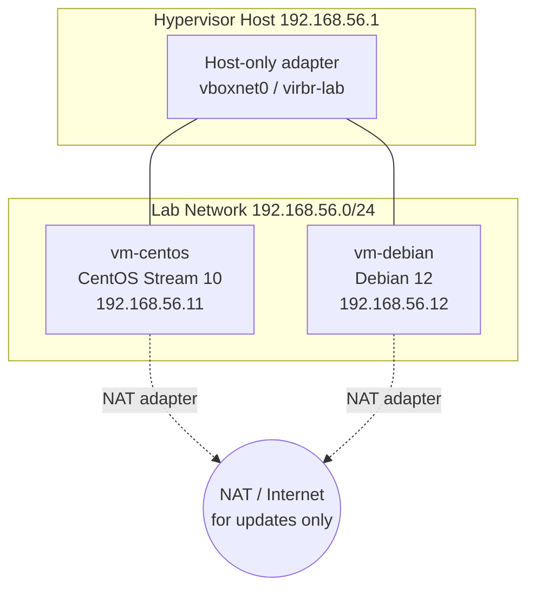

# Lab 01 — Linux Installation

## Objective

Build the two base VMs that every later lab in this course reuses: a **CentOS Stream 10** host (RHEL-family) and a **Debian 12 "Bookworm"** host (Debian-family), installed side by side on the same hypervisor network. By the end you will have hand-partitioned disks, configured static networking at install time, completed first-boot setup, and taken a clean "golden" snapshot of each VM so every subsequent lab can revert to a known-good state instead of reinstalling. This lab operationalizes the theory in [Introduction to Linux](../Introduction-to-Linux/Readme.md) and specifically [Linux and Unix](../Introduction-to-Linux/Linux-and-Unix.md).

## Requirements

| VM | Role | Distro / Version | Hostname | IP (static) | CPU / RAM / Disk |
|---|---|---|---|---|---|
| vm-centos | RHEL-family base | CentOS Stream 10 (minimal ISO) | `centos-lab.internal.lan` | `192.168.56.11/24` | 2 vCPU / 2 GB / 20 GB |
| vm-debian | Debian-family base | Debian 12.x netinst | `debian-lab.internal.lan` | `192.168.56.12/24` | 2 vCPU / 2 GB / 20 GB |
| Hypervisor host | VirtualBox / KVM | any recent build | — | `192.168.56.1/24` (host-only) | 4+ vCPU / 8+ GB free |

> [!NOTE]
> Any type-2 hypervisor works (VirtualBox, VMware Workstation, KVM/virt-manager). Examples below use VirtualBox host-only networking (`vboxnet0` / `192.168.56.0/24`); substitute your hypervisor's isolated/internal network equivalent.

## Topology



Each VM gets **two virtual NICs**: NIC1 = NAT (internet access for package updates), NIC2 = host-only (`192.168.56.0/24`, used for all inter-VM lab traffic in later labs).

## Setup

### 1. Create the VM shells (both distros)

```bash
# VirtualBox CLI example — repeat with vm-debian / debian-lab values
VBoxManage createvm --name "vm-centos" --ostype "RedHat_64" --register
VBoxManage modifyvm "vm-centos" --memory 2048 --cpus 2 --vram 16
VBoxManage modifyvm "vm-centos" --nic1 nat --nic2 hostonly --hostonlyadapter2 vboxnet0
VBoxManage createhd --filename "vm-centos.vdi" --size 20480
VBoxManage storagectl "vm-centos" --name "SATA" --add sata --controller IntelAhci
VBoxManage storageattach "vm-centos" --storagectl "SATA" --port 0 --device 0 --type hdd --medium "vm-centos.vdi"
VBoxManage storageattach "vm-centos" --storagectl "SATA" --port 1 --device 0 --type dvddrive --medium /path/to/CentOS-Stream-10-x86_64-dvd1.iso
```

### 2. CentOS Stream 10 — installer walkthrough (Anaconda)

1. Boot the ISO, choose **Install CentOS Stream 10**.
2. **Language**: English (or your choice).
3. **Installation Destination** → select the 20 GB disk → **Custom** partitioning:

   | Mount point | Size | FS |
   |---|---|---|
   | `/boot` | 1 GiB | xfs |
   | `/boot/efi` | 512 MiB | efi (UEFI only) |
   | `/` (root, LVM) | remaining | xfs |
   | swap | 2 GiB | swap |

   Use **LVM** (default) so `/` can be grown later — required for the [File System and Disk Management](../File-System-and-Disk-Management/Readme.md) labs.
4. **Network & Hostname**:
   - Set hostname `centos-lab.internal.lan`.
   - Configure NIC2 (host-only) manually: IPv4 → Manual → Address `192.168.56.11`, Netmask `255.255.255.0`, no gateway. Leave NIC1 on DHCP.
5. **Root Password**: set a strong root password; also **Create User** `labadmin`, check **Make this user administrator**.
6. Begin installation, reboot when prompted, remove the ISO from the virtual drive.

> [!WARNING]
> **Common lockout**
> If you skip "Make this user administrator" and also don't set a root password, you'll have a VM you cannot get a privileged shell on. Always set at least one of the two.

### 3. Debian 12 — installer walkthrough (debian-installer, text mode)

1. Boot the netinst ISO, choose **Install** (text-mode is faster in a VM).
2. Language / location / keyboard → defaults.
3. **Network configuration**: when prompted, the installer will try DHCP on NIC1 (fine). At the "Configure the network" step for NIC2, choose **Configure network manually** and enter:
   - IP: `192.168.56.12`, Netmask: `255.255.255.0`, Gateway: *(blank)*, DNS: `8.8.8.8`
4. **Hostname**: `debian-lab`, **Domain**: `internal.lan`.
5. **Root password**: set it (or leave blank to force sudo-only admin, Debian-style).
6. **User creation**: full name `Lab Admin`, username `labadmin`, password set.
7. **Partition disks** → **Manual**:

   | Mount point | Size | FS |
   |---|---|---|
   | `/boot` | 1 GB | ext4 |
   | `/` (root) | 17 GB | ext4 |
   | swap | 2 GB | swap |

8. **Software selection**: deselect "Debian desktop environment", keep **SSH server** and **standard system utilities** checked.
9. Install GRUB to `/dev/sda`, finish, reboot, remove ISO.

### 4. First boot on both VMs

```bash
# CentOS Stream 10 (dnf)
sudo dnf update -y
sudo dnf install -y vim curl wget tar net-tools bash-completion chrony
sudo systemctl enable --now chronyd
sudo hostnamectl set-hostname centos-lab.internal.lan
```

```bash
# Debian 12 (apt)
sudo apt update && sudo apt full-upgrade -y
sudo apt install -y vim curl wget tar net-tools bash-completion chrony sudo
sudo systemctl enable --now chrony
sudo hostnamectl set-hostname debian-lab.internal.lan
```

> [!IMPORTANT]
> On Debian, the installer user is **not** automatically in `sudo` unless you skipped the root password step. If `sudo` fails with "not in the sudoers file", log in as root and run `usermod -aG sudo labadmin`, then re-login.

### 5. Verify static IP survives reboot

```bash
# CentOS Stream 10 — NetworkManager keyfile
sudo nmcli con show
sudo nmcli con mod "Wired connection 2" ipv4.addresses 192.168.56.11/24 ipv4.method manual
sudo nmcli con up "Wired connection 2"
```

```bash
# Debian 12 — /etc/network/interfaces (if not using NetworkManager)
sudo tee -a /etc/network/interfaces <<'EOF'

auto enp0s8
iface enp0s8 inet static
    address 192.168.56.12
    netmask 255.255.255.0
EOF
sudo systemctl restart networking
```

### 6. Take the golden snapshot

```bash
# Run on the hypervisor host, VMs powered off or running (VBox supports live snapshots)
VBoxManage snapshot "vm-centos" take "golden-baseline" --description "Fresh CentOS Stream 10 install, updated, static IP"
VBoxManage snapshot "vm-debian" take "golden-baseline" --description "Fresh Debian 12 install, updated, static IP"
```

> [!NOTE]
> **📸 Screenshot**
> _Capture: the Anaconda "Installation Summary" screen (CentOS) and the debian-installer "Partition disks" summary screen (Debian), showing the mount-point/size table above applied._

## Validation

1. Confirm each VM boots to a login prompt and hostname is correct:

   ```bash
   hostnamectl
   ```

   ```text
   Static hostname: centos-lab.internal.lan
    Icon name: computer-vm
      Chassis: vm
   Operating System: CentOS Stream 10
   ```

2. Confirm static IP is bound on the host-only NIC:

   ```bash
   ip -4 addr show enp0s8
   ```

   ```text
   3: enp0s8: <BROADCAST,MULTICAST,UP,LOWER_UP> mtu 1500 ...
       inet 192.168.56.11/24 brd 192.168.56.255 scope global enp0s8
   ```

3. From the hypervisor host, both VMs answer on the host-only subnet:

   ```bash
   ping -c 2 192.168.56.11 && ping -c 2 192.168.56.12
   ```

   ```text
   2 packets transmitted, 2 received, 0% packet loss
   2 packets transmitted, 2 received, 0% packet loss
   ```

4. Confirm partition layout matches the plan:

   ```bash
   lsblk -f
   df -hT /
   ```

   Expect `/` on `xfs` (CentOS) or `ext4` (Debian), and a `swap` partition/LV listed by `lsblk`.

5. Confirm the golden snapshot exists:

   ```bash
   VBoxManage snapshot "vm-centos" list
   ```

   ```text
   Name: golden-baseline (UUID: ...)
   ```

## Cleanup

This is a foundation lab — VMs and snapshots are meant to **persist** for the rest of the course. Only clean up if you are decommissioning the lab entirely:

```bash
# Power off and delete both VMs including disks — destructive, course-ending only
VBoxManage controlvm "vm-centos" poweroff
VBoxManage controlvm "vm-debian" poweroff
VBoxManage unregistervm "vm-centos" --delete
VBoxManage unregistervm "vm-debian" --delete
```

> [!WARNING]
> `--delete` removes the attached `.vdi` disk files permanently. Do not run this until every later lab in the course is finished, since all subsequent labs assume `vm-centos`/`vm-debian` and the `golden-baseline` snapshot already exist.

## Troubleshooting

| Symptom | Likely cause | Fix |
|---|---|---|
| Anaconda/debian-installer can't see the disk | Wrong SATA/AHCI controller in VM settings | Ensure storage controller type is SATA (not IDE) and disk is attached to it |
| Static IP not reachable after reboot | NetworkManager profile bound to wrong interface, or Debian `interfaces` file not applied | `nmcli con show` / `ip link` to confirm interface name matches config (VM NIC order can shift `enp0sX`) |
| Debian: `sudo: command not found` or `labadmin is not in the sudoers file` | Root password was set during install, so installer skipped adding user to `sudo` group | Log in as `root`, run `usermod -aG sudo labadmin`, re-login |
| CentOS boots to emergency mode | `/boot` too small or LVM activation failure | Boot rescue mode from ISO, `vgchange -ay`, check `/etc/fstab` UUIDs with `blkid` |
| Snapshot fails with "machine is locked" | A console/GUI session still has the VM session open | Close the VirtualBox GUI window for that VM, retry `VBoxManage snapshot` |

## References

- CentOS Stream 10 official installation guide — [Red Hat Enterprise Linux Installation Guide](https://docs.redhat.com/en/documentation/red_hat_enterprise_linux/10/html/interactively_installing_rhel/)
- Debian 12 Installation Guide — [debian.org/releases/bookworm/installmanual](https://www.debian.org/releases/bookworm/installmanual)
- `man nmcli`, `man systemd-networkd`, `man interfaces` (Debian `ifupdown`)
- VirtualBox Manual, Chapter 8 — VBoxManage command reference

## Related Notes

- [Introduction to Linux](../Introduction-to-Linux/Readme.md)
- [CentOS Stream Installation](../Introduction-to-Linux/CentOS-Stream-Installation.md)
- [Debian System Setup](../Introduction-to-Linux/Debian-System-Setup.md)
- [Network Configuration](../Network-Configuration/Readme.md)
- [File System and Disk Management](../File-System-and-Disk-Management/Readme.md)
- [Virtualization](../Virtualization/Readme.md)
- [Linux Administration & Server Hardening](../Readme.md) — course hub and map of content
