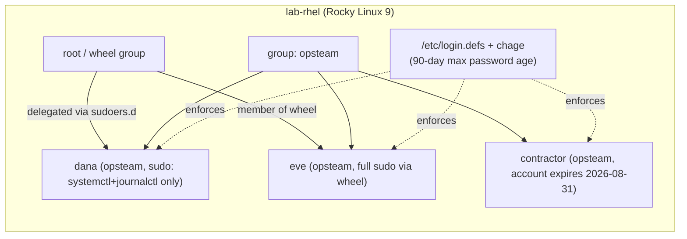

# Lab 02 — User Administration

## Objective

In this lab you will provision a small team of Linux accounts the way a real sysadmin would: creating users and groups, enforcing a password-aging policy with `chage`, granting scoped `sudo` access instead of blanket root, and setting a hard account expiry date for a contractor account. This exercises the account-management half of [Users, Groups & Permissions](../Users-Groups-and-Permissions/Readme.md) — the identity and access-control layer that everything else in that module (permissions, ACLs, SUID) sits on top of. By the end you will be able to explain the difference between password expiry (`chage -M`) and account expiry (`usermod -e`), and demonstrate least-privilege `sudo` delegation via `/etc/sudoers.d/`.

## Requirements

| Host | Role | OS | IP | CPU/RAM | Notes |
|---|---|---|---|---|---|
| `lab-rhel` | Primary lab VM (commands shown here) | Rocky Linux 9 / RHEL 9 | 192.168.56.10 | 1 vCPU / 1 GB | `dnf`, `chage`, `visudo` (all in base install) |
| `lab-deb` | Parallel VM for Debian-family divergence notes | Debian 12 / Ubuntu 22.04 | 192.168.56.11 | 1 vCPU / 1 GB | `apt`; `adduser` wraps `useradd` with sane defaults |

> [!NOTE]
> This lab runs on one VM at a time — no networking between the two is required. `lab-deb` exists only so you can test RHEL/Debian command divergence side by side if you have both.

## Topology



## Setup

### 1. Create the group and baseline users

```bash
# RHEL-family and Debian-family: useradd/groupadd are POSIX-standard, identical here
sudo groupadd opsteam
sudo useradd -m -G opsteam -s /bin/bash dana
sudo useradd -m -G wheel,opsteam -s /bin/bash eve      # wheel = full sudo on RHEL-family
sudo useradd -m -G opsteam -s /bin/bash contractor

sudo passwd dana
sudo passwd eve
sudo passwd contractor
```

Debian-family equivalent (no `wheel` group by default — use `sudo` group instead):

```bash
sudo groupadd opsteam
sudo useradd -m -G opsteam -s /bin/bash dana
sudo useradd -m -G sudo,opsteam -s /bin/bash eve
sudo useradd -m -G opsteam -s /bin/bash contractor
```

> [!IMPORTANT]
> Set real passwords for all three accounts so `su - dana` etc. work during Validation. You are not touching your own login shell, so there is no lockout risk yet — the lockout risk arrives in step 3.

### 2. Enforce a password-aging policy with `chage`

Set a 90-day maximum password age, a 7-day minimum age (prevents rapid-cycling to defeat history), and a 14-day warning before expiry — on all three lab accounts:

```bash
for u in dana eve contractor; do
    sudo chage -M 90 -m 7 -W 14 "$u"
done

sudo chage -l dana
```

Expected (`chage -l dana`, dates will reflect today's actual date):

```text
Last password change                                   : Jul 22, 2026
Password expires                                       : Oct 20, 2026
Password inactive                                       : never
Account expires                                        : never
Minimum number of days between password change         : 7
Maximum number of days between password change          : 90
Number of days of warning before password expires       : 14
```

To force a *specific* user to change their password on next login (e.g. after a reset), expire it immediately:

```bash
sudo chage -d 0 dana
```

System-wide defaults for **new** accounts live in `/etc/login.defs` (`PASS_MAX_DAYS`, `PASS_MIN_DAYS`, `PASS_WARN_AGE`) — identical file path and directives on RHEL-family and Debian-family. `chage` only edits `/etc/shadow` retroactively for existing accounts.

### 3. Grant scoped sudo access (least privilege)

`eve` already has full sudo via `wheel`/`sudo` group membership. Give `dana` **narrow** sudo rights — restart/inspect services only, no shell escape — via a dedicated file in `/etc/sudoers.d/`:

```bash
sudo visudo -f /etc/sudoers.d/dana-service-ops
```

Contents to add (visudo validates syntax on save, blocking a broken file):

```conf
# /etc/sudoers.d/dana-service-ops
# dana may manage the nginx service and read its logs, nothing else
dana ALL=(root) NOPASSWD: /usr/bin/systemctl restart nginx, /usr/bin/systemctl status nginx, /usr/bin/journalctl -u nginx
```

```bash
sudo chmod 440 /etc/sudoers.d/dana-service-ops
sudo visudo -c        # re-validate all sudoers files, including the new one
```

> [!WARNING]
> Always edit sudoers with `visudo` (or `visudo -f <file>` for drop-ins), never a plain text editor. `visudo` syntax-checks before saving — a raw `vi /etc/sudoers.d/...` edit with a typo can leave sudo unusable for *every* user on the box, including root's own sudo path if `/etc/sudoers` itself is damaged. If you ever lock out sudo entirely, fix it from a root console/single-user mode, not by re-running sudo.

> [!NOTE]
> **📸 Screenshot**
> _Capture: terminal output of `sudo -l -U dana` showing the exact restricted command list, contrasted with `sudo -l -U eve` showing `(ALL : ALL) ALL`._

### 4. Set a hard account expiry for the contractor

The contractor's engagement ends 2026-08-31. Set that as a hard account-expiry date — distinct from password expiry, this disables login entirely once reached, regardless of password state:

```bash
sudo usermod -e 2026-08-31 contractor
sudo chage -l contractor | grep "Account expires"
```

Expected:

```text
Account expires                                        : Aug 31, 2026
```

## Validation

1. **Group membership is correct:**

   ```bash
   id dana; id eve; id contractor
   ```

   Expected (GIDs will vary by system, group names matter):

   ```text
   uid=1001(dana) gid=1001(dana) groups=1001(dana),1004(opsteam)
   uid=1002(eve) gid=1002(eve) groups=1002(eve),10(wheel),1004(opsteam)
   uid=1003(contractor) gid=1003(contractor) groups=1003(contractor),1004(opsteam)
   ```

2. **Password policy is enforced in `/etc/shadow`** (field 5 = max days, field 4 = min days):

   ```bash
   sudo grep -E '^(dana|eve|contractor):' /etc/shadow | awk -F: '{print $1, "min="$4, "max="$5, "warn="$6}'
   ```

   Expected:

   ```text
   dana min=7 max=90 warn=14
   eve min=7 max=90 warn=14
   contractor min=7 max=90 warn=14
   ```

3. **Dana's sudo is scoped, not full:**

   ```bash
   sudo -l -U dana
   ```

   Expected (only the three whitelisted commands, no `ALL`):

   ```text
   User dana may run the following commands on lab-rhel:
       (root) NOPASSWD: /usr/bin/systemctl restart nginx, /usr/bin/systemctl status nginx, /usr/bin/journalctl -u nginx
   ```

   Confirm the restriction is *live*, not just declared:

   ```bash
   sudo -u dana sudo -n /usr/bin/systemctl reboot   # should be REFUSED
   ```

   Expected:

   ```text
   Sorry, user dana is not allowed to execute '/usr/bin/systemctl reboot' as root on lab-rhel.
   ```

4. **Eve has full sudo:**

   ```bash
   sudo -l -U eve | grep -i "ALL"
   ```

   Expected:

   ```text
   (ALL : ALL) ALL
   ```

5. **Contractor account expiry is set and enforceable:**

   ```bash
   sudo chage -l contractor | grep "Account expires"
   ```

   Expected: `Account expires : Aug 31, 2026`

   Simulate expiry already having passed and confirm login is blocked:

   ```bash
   sudo usermod -e 2020-01-01 contractor
   sudo su - contractor -c whoami
   ```

   Expected:

   ```text
   This account is currently not available.
   ```

   Restore the real expiry date afterward: `sudo usermod -e 2026-08-31 contractor`.

## Cleanup

```bash
sudo rm -f /etc/sudoers.d/dana-service-ops
sudo visudo -c
sudo userdel -r dana
sudo userdel -r eve
sudo userdel -r contractor
sudo groupdel opsteam
```

> [!WARNING]
> `userdel -r` deletes the user's home directory and mail spool — irreversible. Run `id dana` first to confirm you're deleting the lab account (high UID, correct groups) and not a real system/service account with a colliding name.

## Troubleshooting

- **`visudo: >>> /etc/sudoers.d/dana-service-ops: syntax error <<<`** — a stray comma, missing `ALL=`, or mismatched command path. `visudo` refuses to save until fixed; press `e` to re-edit or `Ctrl+C` to abort without saving a broken file.
- **`sudo -l -U dana` shows nothing, or dana still needs a password** — the drop-in file's permissions must be `0440`, owned by `root:root`. Also confirm the exact binary path in the rule matches `which systemctl` on this distro (`/usr/bin/systemctl` vs `/bin/systemctl` on some Debian symlink layouts) — sudoers matches the literal path, not `$PATH`-resolved commands.
- **`chage -M 90` doesn't seem to apply to brand-new users created afterward** — `chage` only edits existing accounts. For all *future* `useradd` accounts to inherit the policy, set `PASS_MAX_DAYS`/`PASS_MIN_DAYS`/`PASS_WARN_AGE` in `/etc/login.defs` before creating them.
- **Contractor can still log in after the expiry date** — check the date format landed correctly: `usermod -e` wants `YYYY-MM-DD`. Verify with `chage -l contractor`; a malformed date silently stores `Account expires : never`.
- **Locked out of sudo entirely** — boot into single-user/rescue mode (RHEL: `rd.break` at GRUB; Debian: `init=/bin/bash`), remount `/` read-write, and fix `/etc/sudoers` or `/etc/sudoers.d/*` directly with `visudo`. Never delete `/etc/sudoers.d/` files as regular files while logged in as an affected user — edit via a still-privileged session or the root console.

## References

- Rocky Linux / RHEL 9 documentation — Managing user accounts and sudo access
- `man chage`, `man usermod`, `man sudoers`, `man login.defs` (local man pages, always current for installed version)
- Debian Administrator's Handbook — User and group management chapter

## Related Notes

- [Users, Groups & Permissions](../Users-Groups-and-Permissions/Readme.md)
- [User Management with useradd and adduser](../Users-Groups-and-Permissions/User-Management-with-useradd-and-adduser.md)
- [Sudo](../Users-Groups-and-Permissions/Sudo.md)
- [Shadow File — Secure User Passwords File](../Users-Groups-and-Permissions/Shadow-File-Secure-User-Passwords-File.md)
- [Linux Administration & Server Hardening](../Readme.md) — course hub and map of content
