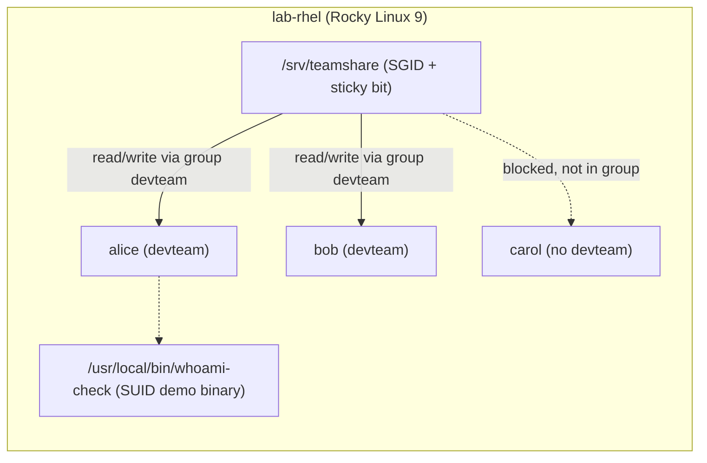

# Lab 03 — Permission Management

## Objective

In this lab you will build a small multi-user file-sharing scenario on a single Linux host and use it to practice the full permission stack covered in [Users, Groups & Permissions](../Users-Groups-and-Permissions/Readme.md): standard `chmod`/`chown`/`chgrp` ownership changes, the three special permission bits (SUID, SGID, sticky), POSIX ACLs for exceptions that the classic owner/group/other model can't express, and `umask` for controlling default permissions on new files. By the end you will be able to explain *why* a shared team directory needs SGID + sticky + ACLs together, and demonstrate a SUID privilege-escalation vector and how to detect it — see [Privilege Escalation Example Using SUID](../Users-Groups-and-Permissions/Privilege-Escalation-Example-Using.md) for the attacker-side follow-up.

## Requirements

| Host | Role | OS | IP | CPU/RAM | Notes |
|---|---|---|---|---|---|
| `lab-rhel` | Primary lab VM (commands shown here) | Rocky Linux 9 / RHEL 9 | 192.168.56.10 | 1 vCPU / 1 GB | `dnf`, SELinux enforcing (optional) |
| `lab-deb` | Parallel VM for Debian-family divergence notes | Debian 12 / Ubuntu 22.04 | 192.168.56.11 | 1 vCPU / 1 GB | `apt`, no ACL support by default on some FS — see Troubleshooting |

> [!NOTE]
> This lab runs entirely on one VM at a time — no networking between the two is required. `lab-deb` is listed only so RHEL/Debian command divergence can be tested side by side if you have both.

## Topology



## Setup

### 1. Create the lab users and group

```bash
# RHEL-family and Debian-family: same commands, useradd/groupadd are POSIX-standard
sudo groupadd devteam
sudo useradd -m -G devteam -s /bin/bash alice
sudo useradd -m -G devteam -s /bin/bash bob
sudo useradd -m -s /bin/bash carol          # NOT in devteam — used to prove ACL/group isolation

sudo passwd alice
sudo passwd bob
sudo passwd carol
```

> [!IMPORTANT]
> Set real passwords (not blank) so you can `su - alice` etc. during Validation. Locking yourself out of `root` is not a risk here since you still have your original login shell.

### 2. Build the shared team directory (chmod, chown, chgrp, SGID, sticky)

```bash
sudo mkdir -p /srv/teamshare
sudo chown root:devteam /srv/teamshare
sudo chmod 2770 /srv/teamshare        # rwxrws--- : SGID set, group has full access, others none
```

Decompose `2770`:
- `2` = SGID bit — new files/dirs created inside inherit the **group** (`devteam`), not the creator's primary group.
- `770` = owner(root) rwx, group(devteam) rwx, other ---.

Now add the sticky bit so members can't delete each other's files (mirrors `/tmp` semantics):

```bash
sudo chmod +t /srv/teamshare
stat -c '%A %a %U:%G %n' /srv/teamshare
```

Expected:

```text
drwxrws--T 2770 root:devteam /srv/teamshare
```

> [!NOTE]
> **📸 Screenshot**
> _Capture: terminal output of `ls -ld /srv/teamshare` showing the `rwxrws--T` permission string with SGID (`s`) and sticky (`T`) bits visible._

### 3. Demonstrate SUID with a small binary

```bash
cat <<'EOF' | sudo tee /usr/local/bin/whoami-check.c >/dev/null
#include <stdio.h>
#include <unistd.h>
int main(void) {
    printf("real uid=%d effective uid=%d\n", getuid(), geteuid());
    return 0;
}
EOF
sudo gcc -o /usr/local/bin/whoami-check /usr/local/bin/whoami-check.c
sudo chown root:root /usr/local/bin/whoami-check
sudo chmod 4755 /usr/local/bin/whoami-check     # 4 = SUID
```

> [!WARNING]
> Never leave a SUID binary owned by `root` writable by non-root users (`chmod 4755`, **not** `4757`/`4775`). A world- or group-writable SUID-root binary is a direct privilege-escalation path — see [Privilege Escalation Example Using SUID](../Users-Groups-and-Permissions/Privilege-Escalation-Example-Using.md).

### 4. Set up ACLs for a one-off exception

Scenario: `carol` is not in `devteam` but needs **read-only** access to one file in the share, without adding her to the group.

RHEL-family (ACL support is enabled by default in `xfs`/`ext4` mount options on Rocky/RHEL 9):

```bash
sudo -u alice touch /srv/teamshare/roadmap.txt
sudo -u alice bash -c 'echo "Q3 roadmap draft" > /srv/teamshare/roadmap.txt'

sudo setfacl -m u:carol:r-- /srv/teamshare/roadmap.txt
getfacl /srv/teamshare/roadmap.txt
```

Debian-family (Ubuntu/Debian, install ACL tools first):

```bash
sudo apt update && sudo apt install -y acl
sudo setfacl -m u:carol:r-- /srv/teamshare/roadmap.txt
getfacl /srv/teamshare/roadmap.txt
```

Expected `getfacl` output:

```text
# file: srv/teamshare/roadmap.txt
# owner: alice
# group: devteam
user::rw-
user:carol:r--
group::rw-
mask::rw-
other::---
```

### 5. Set a safer default umask for the team

```bash
# Per-user: append to ~/.bashrc for alice and bob
sudo -u alice bash -c "echo 'umask 0027' >> ~/.bashrc"
sudo -u bob   bash -c "echo 'umask 0027' >> ~/.bashrc"
```

- `umask 0027` on a `rwx` base yields new files at `640` (rw-r-----) and new dirs at `750` (rwxr-x---) — group-readable but never world-readable, appropriate for a private team share.
- System-wide default umask lives in `/etc/profile` (RHEL and Debian both) or `/etc/login.defs` (`UMASK` directive) — edit there instead of per-user files if this should apply to *every* account.

## Validation

1. **Ownership and mode bits are correct:**

   ```bash
   stat -c '%A %a %U:%G %n' /srv/teamshare
   ```

   Expected:

   ```text
   drwxrws--T 2770 root:devteam /srv/teamshare
   ```

2. **SGID inheritance works** — a file created by `bob` inside the share is group-owned by `devteam`, not `bob`'s primary group:

   ```bash
   sudo -u bob bash -c 'touch /srv/teamshare/bob-file.txt'
   stat -c '%U:%G' /srv/teamshare/bob-file.txt
   ```

   Expected:

   ```text
   bob:devteam
   ```

3. **Sticky bit blocks cross-user deletion** — `bob` cannot delete `alice`'s file even though the directory is group-writable:

   ```bash
   sudo -u bob bash -c 'rm /srv/teamshare/roadmap.txt'
   ```

   Expected:

   ```text
   rm: cannot remove '/srv/teamshare/roadmap.txt': Operation not permitted
   ```

4. **SUID binary shows escalated effective UID** when run by a non-root user:

   ```bash
   sudo -u alice /usr/local/bin/whoami-check
   ```

   Expected:

   ```text
   real uid=1001 effective uid=0
   ```

5. **ACL grants carol read-only access** despite not being in `devteam`:

   ```bash
   sudo -u carol cat /srv/teamshare/roadmap.txt      # succeeds — ACL grants r--
   sudo -u carol bash -c 'echo x >> /srv/teamshare/roadmap.txt'  # fails — no w in ACL entry
   ```

   Expected second command:

   ```text
   bash: /srv/teamshare/roadmap.txt: Permission denied
   ```

6. **umask takes effect for new files:**

   ```bash
   sudo -u alice bash -lc 'umask; touch /srv/teamshare/newfile.txt; stat -c "%a" /srv/teamshare/newfile.txt'
   ```

   Expected:

   ```text
   0027
   640
   ```

## Cleanup

```bash
sudo rm -rf /srv/teamshare
sudo rm -f /usr/local/bin/whoami-check /usr/local/bin/whoami-check.c
sudo userdel -r alice
sudo userdel -r bob
sudo userdel -r carol
sudo groupdel devteam
```

> [!WARNING]
> `userdel -r` deletes the user's home directory and mail spool. Don't run this against real accounts — verify `id alice` shows only the lab UID/GID before deleting.

## Troubleshooting

- **`setfacl: Operation not supported`** — the filesystem was mounted without ACL support. RHEL-family `xfs`/`ext4` enable ACLs by default; on Debian-family, check `mount | grep teamshare` for the `acl` mount option, or add it in `/etc/fstab` and remount: `sudo mount -o remount,acl /srv`.
- **SGID bit "disappears" after `chmod`** — a plain `chmod 770 dir` on top of an existing SGID dir *keeps* it, but `chmod -R 770 dir` recursively strips SGID from subdirectories in some tool versions. Always re-verify with `stat` after recursive chmods, and prefer `chmod g+s` for additive changes.
- **`getfacl` shows a `mask::` entry limiting effective permissions** — the ACL mask caps what named user/group ACL entries can actually do, independent of what you set with `setfacl -m`. Recompute it: `sudo setfacl -m m::rwx /srv/teamshare/roadmap.txt`.
- **SUID bit silently ignored on a script** (`chmod 4755 script.sh`) — Linux ignores SUID/SGID on shebang scripts for security reasons; it only works on compiled ELF binaries. Use a compiled wrapper (as in Setup step 3) or `sudo`/`Sudo.md`-style delegation instead.
- **New files in the share come out `rwxrwxrwx`-ish despite `umask 0027`** — the umask only applies to the *creating process's shell*; check the file was created by a login shell that sourced `~/.bashrc` (use `bash -lc`, not a non-login `bash -c`, when testing).

## References

- Rocky Linux / RHEL 9 documentation — Managing file permissions and ACLs
- `man chmod`, `man chown`, `man setfacl`, `man getfacl`, `man umask` (local man pages, always current for installed version)
- Debian Administrator's Handbook — Access Control Lists chapter

## Related Notes

- [Users, Groups & Permissions](../Users-Groups-and-Permissions/Readme.md)
- [Special Permission Bits (SUID/SGID/Sticky)](../Users-Groups-and-Permissions/Special-Permission.md)
- [Access Control List (ACL)](../Users-Groups-and-Permissions/Access-Control-List(ACL).md)
- [Privilege Escalation Example Using SUID](../Users-Groups-and-Permissions/Privilege-Escalation-Example-Using.md)
- [Linux Administration & Server Hardening](../Readme.md) — course hub and map of content
