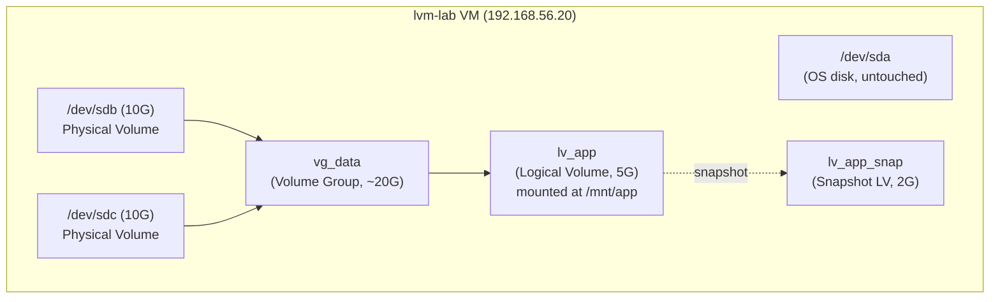

# Lab 04 — LVM Configuration

## Objective

Build a working Logical Volume Manager (LVM) stack from raw block devices — Physical Volumes (PVs) into a Volume Group (VG) into Logical Volumes (LVs) — then perform the two operations that make LVM worth using in production: **growing a mounted, in-use filesystem online** (no downtime) and **taking a Copy-on-Write snapshot** for a safe point-in-time backup before a risky change. This lab is the hands-on companion to [Readme](../File-System-and-Disk-Management/Readme.md) and reinforces the storage-stack concepts from [Readme](../Readme.md).

## Requirements

| Host | Role | OS | IP | CPU/RAM | Disks |
|---|---|---|---|---|---|
| `lvm-lab` | Single lab VM | RHEL 9 / Rocky 9 **or** Debian 12 / Ubuntu 22.04 | `192.168.56.20/24` | 1 vCPU / 1 GB RAM | `/dev/sda` (OS, 20G) + `/dev/sdb` (10G) + `/dev/sdc` (10G) — extra disks added **unformatted** |

Only one VM is needed. Add the two extra virtual disks in your hypervisor (VirtualBox: Settings → Storage → add VDI/VMDK; virt-manager: Add Hardware → Storage) **before** boot. Do not partition or format `sdb`/`sdc` — LVM will consume the raw disks.

Package requirements:

| Distro family | Package | Install command |
|---|---|---|
| RHEL/Rocky/Alma | `lvm2` (usually preinstalled) | `sudo dnf install -y lvm2` |
| Debian/Ubuntu | `lvm2` | `sudo apt update && sudo apt install -y lvm2` |

## Topology



## Setup

> [!IMPORTANT]
> **Confirm disk device names first**
> Device names (`sdb`, `sdc`) can differ by hypervisor/controller (e.g. `vdb`/`vdc` on KVM with virtio, `nvme1n1` on NVMe-backed labs). Run `lsblk` before copy-pasting any command below and substitute the real device names.

### 1. Identify the raw disks

```bash
lsblk -f
```

Expect to see `sdb` and `sdc` (or your hypervisor's equivalents) with **no** `FSTYPE` and **no** partitions — confirming they're untouched.

### 2. Create Physical Volumes (PV)

```bash
sudo pvcreate /dev/sdb /dev/sdc
sudo pvs
sudo pvdisplay /dev/sdb
```

> [!WARNING]
> **pvcreate is destructive**
> `pvcreate` writes an LVM label to the start of the disk and will destroy any existing filesystem/partition table on it. Never point it at `/dev/sda` (the OS disk) in this lab.

### 3. Create the Volume Group (VG)

```bash
sudo vgcreate vg_data /dev/sdb /dev/sdc
sudo vgs
sudo vgdisplay vg_data
```

`vg_data` now pools both 10G disks into ~20G of allocatable space (minus small LVM metadata overhead).

### 4. Create a Logical Volume (LV) and filesystem

```bash
sudo lvcreate -n lv_app -L 5G vg_data
sudo lvs
sudo lvdisplay /dev/vg_data/lv_app

# RHEL-family default filesystem
sudo mkfs.xfs /dev/vg_data/lv_app

# Debian-family (xfsprogs may not be installed by default) — ext4 is the safe default
sudo mkfs.ext4 /dev/vg_data/lv_app
```

### 5. Mount it persistently

```bash
sudo mkdir -p /mnt/app
sudo blkid /dev/vg_data/lv_app   # copy the UUID
```

Add to `/etc/fstab` using the **device-mapper path**, which is stable across reboots:

```conf
/dev/vg_data/lv_app  /mnt/app  xfs  defaults  0  2
```

(Use `ext4` in place of `xfs` if you formatted with `mkfs.ext4`.)

```bash
sudo mount -a
df -hT /mnt/app
```

> [!IMPORTANT]
> **Test fstab before rebooting**
> `mount -a` re-reads `/etc/fstab` and mounts everything in it without a reboot. If it errors, fix the line now — a bad fstab entry can otherwise drop a real server to an emergency shell on next boot.

Generate some data so the later "online" resize and snapshot are demonstrating something real:

```bash
sudo dd if=/dev/urandom of=/mnt/app/testfile.bin bs=1M count=500 status=progress
```

## Commands — Online Extend

The whole point of LVM: grow `lv_app` from 5G to 8G **while it stays mounted and in use**, no unmount, no downtime.

```bash
# 1. Confirm free space remains in the VG
sudo vgs vg_data

# 2. Extend the LV by 3G
sudo lvextend -L +3G /dev/vg_data/lv_app

# 3. Grow the filesystem to fill the new LV space — the filesystem-specific step
#    XFS (RHEL default): can ONLY grow online, never shrink
sudo xfs_growfs /mnt/app

#    ext4 (Debian default): can grow online too
sudo resize2fs /dev/vg_data/lv_app
```

```bash
df -hT /mnt/app
sudo lvs vg_data
```

> [!WARNING]
> **XFS cannot shrink**
> Unlike ext4, an XFS filesystem can only be grown, never reduced in size, even offline. If you expect to need to shrink an LV later, use ext4 or plan capacity conservatively on XFS.

## Commands — Snapshot

Take a Copy-on-Write snapshot of `lv_app` before making a risky change (e.g. before an application upgrade), then prove it's a working point-in-time copy.

```bash
# 1. Create a 2G snapshot (must have enough free VG space to hold changed blocks)
sudo lvcreate -s -n lv_app_snap -L 2G /dev/vg_data/lv_app
sudo lvs vg_data
```

```bash
# 2. Mutate the ORIGINAL after the snapshot was taken
sudo rm /mnt/app/testfile.bin
echo "post-snapshot change" | sudo tee /mnt/app/newfile.txt
```

```bash
# 3. Mount the snapshot read-only elsewhere to prove it froze the earlier state
sudo mkdir -p /mnt/app_snap
sudo mount -o ro /dev/vg_data/lv_app_snap /mnt/app_snap
ls -la /mnt/app_snap
```

The snapshot mount should still show `testfile.bin` and should **not** show `newfile.txt` — it is frozen at the moment `lvcreate -s` ran.

> [!WARNING]
> **Snapshot fills up, then dies**
> A CoW snapshot only reserves space for *changed* blocks. If churn on the origin exceeds the snapshot's allocated size (2G here), the snapshot volume goes to `Invalid` state and is automatically dropped by the kernel — it becomes unusable. Monitor snapshot usage with `lvs -o+snap_percent` and extend it (`lvextend -L +1G .../lv_app_snap`) if usage climbs above ~70-80%.

> [!NOTE]
> **📸 Screenshot**
> _Capture: terminal output of `sudo lvs -a -o+devices vg_data` showing `lv_app`, `lv_app_snap`, and their `Origin`/`Data%` columns together, proving the snapshot relationship._

## Validation

1. **PVs are recognized and allocated to the VG:**
   ```bash
   sudo pvs
   ```
   ```text
   PV         VG      Fmt  Attr PSize   PFree
   /dev/sdb   vg_data lvm2 a--  <10.00g     0
   /dev/sdc   vg_data lvm2 a--  <10.00g  <8.00g
   ```

2. **VG shows the pooled ~20G capacity:**
   ```bash
   sudo vgs
   ```
   ```text
   VG      #PV #LV #SN Attr   VSize   VFree
   vg_data   2   2   1 wz--n- <19.99g <8.00g
   ```

3. **LV extend actually took effect on the filesystem, not just the block device:**
   ```bash
   df -hT /mnt/app
   ```
   ```text
   Filesystem                 Type  Size  Used Avail Use% Mounted on
   /dev/mapper/vg_data-lv_app xfs   8.0G  512M  7.5G   7% /mnt/app
   ```

4. **Snapshot preserves pre-change state (origin/snapshot diverge as expected):**
   ```bash
   ls /mnt/app/testfile.bin      # fails on origin — file was deleted
   ls /mnt/app_snap/testfile.bin # succeeds on snapshot — frozen copy
   ```
   ```text
   ls: cannot access '/mnt/app/testfile.bin': No such file or directory
   /mnt/app_snap/testfile.bin
   ```

5. **Snapshot metadata confirms origin linkage and consumed percentage:**
   ```bash
   sudo lvs -o+origin,snap_percent vg_data
   ```
   ```text
   LV            VG      Attr       LSize Origin  Data%
   lv_app        vg_data owi-aos---  8.00g
   lv_app_snap   vg_data swi-aos--- 2.00g lv_app   24.87
   ```

## Cleanup

Reverse order: snapshot → LV → mount → VG → PV.

```bash
sudo umount /mnt/app_snap
sudo lvremove -y /dev/vg_data/lv_app_snap

sudo umount /mnt/app
sudo sed -i '\|/mnt/app|d' /etc/fstab   # remove the fstab line added in Setup

sudo lvremove -y /dev/vg_data/lv_app
sudo vgremove -y vg_data
sudo pvremove /dev/sdb /dev/sdc

sudo rmdir /mnt/app /mnt/app_snap
```

```bash
# Verify nothing LVM-related remains
sudo pvs; sudo vgs; sudo lvs
lsblk -f
```

## Troubleshooting

- **`lvcreate` fails with "Insufficient free space"** — check `vgs`/`vgdisplay` for `VFree`; you likely oversized an earlier LV. Free space with `lvremove` or reduce the requested `-L` size.
- **`umount: target is busy`** — something has an open file handle or shell `cwd` inside the mount point. Find it with `sudo fuser -vm /mnt/app` or `sudo lsof +D /mnt/app`, then close/kill it.
- **Snapshot shows `Attr` starting with `d` (disabled/invalid)** — the snapshot exceeded its allocated CoW space and was auto-dropped. It cannot be recovered; recreate it with a larger `-L` and reduce origin write activity, or use `lvextend` proactively next time before it fills.
- **`xfs_growfs: /mnt/app is not a mounted XFS filesystem`** — you ran the ext4 command (`resize2fs`) against an XFS volume or vice versa. Check with `df -hT` first and match the tool to the actual filesystem type.
- **fstab typo drops the system to emergency mode on reboot** — boot into rescue/single-user mode (or edit via a live ISO), comment out or fix the bad line in `/etc/fstab`, then reboot normally. Always test with `mount -a` before rebooting, as done in Setup step 5.
- **Device names differ (`vdb`, `nvme1n1p1`, etc.)** — always re-run `lsblk -f` after adding disks; never assume `sdb`/`sdc` carry over from this guide verbatim.

## References

- Red Hat Enterprise Linux 9 — *Configuring and managing logical volumes* (LVM Administrator Guide), `access.redhat.com/documentation`
- `man lvm`, `man pvcreate`, `man vgcreate`, `man lvcreate`, `man lvextend`, `man xfs_growfs`, `man resize2fs`
- CIS Distribution Independent Linux Benchmark — filesystem partitioning recommendations (separate LVs for `/var`, `/tmp`, `/home`)
- Arch Wiki — *LVM* (distro-agnostic conceptual reference, useful even off-Arch)

## Related Notes

- [Readme](../File-System-and-Disk-Management/Readme.md) — parent module: partitioning, filesystems, LVM theory
- [Lab-04-LVM-Configuration](Lab-04-LVM-Configuration.md) — prerequisite lab: raw partitioning/mkfs before LVM abstracts it away
- [Lab-20-Backup-and-Restore](Lab-20-Backup-and-Restore.md) — natural next step: pairing LVM snapshots with a backup pipeline
- [Linux Administration & Server Hardening](../Readme.md) — course hub and map of content
