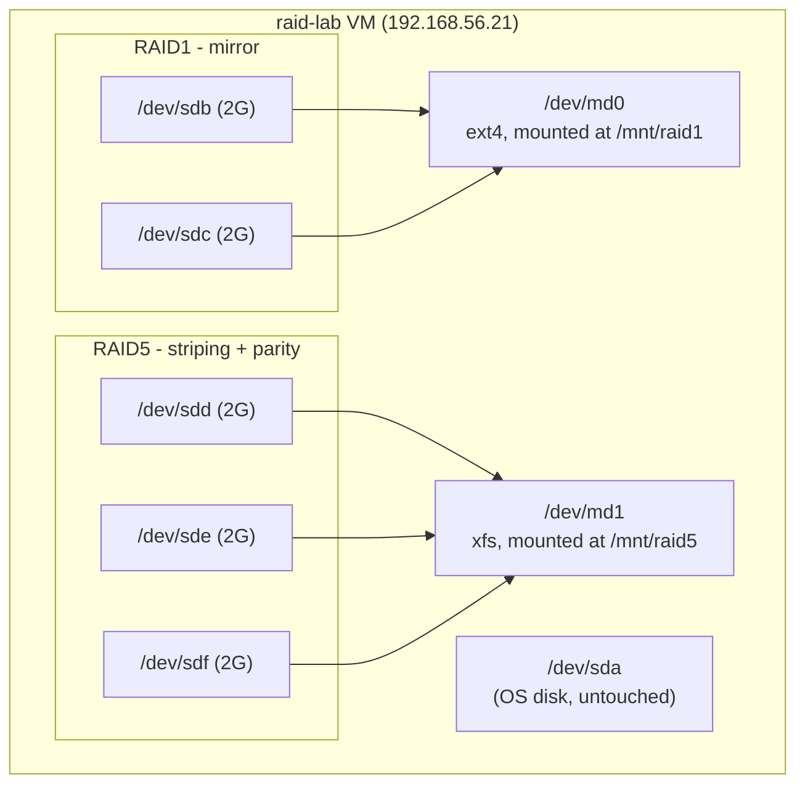

# Lab 05 — Software RAID with mdadm

## Objective

Build two software RAID arrays with `mdadm` — a **RAID1** mirror (fault tolerance, wastes 50% capacity) and a **RAID5** array (striping with distributed parity, tolerates one disk loss) — mount both persistently, then deliberately **fail a disk in each array, watch it run degraded, and rebuild it** with a replacement. This lab is the hands-on companion to [Readme](../File-System-and-Disk-Management/Readme.md) and builds on the concepts in [RAID-in-Linux](../File-System-and-Disk-Management/RAID-in-Linux.md).

## Requirements

| Host | Role | OS | IP | CPU/RAM | Disks |
|---|---|---|---|---|---|
| `raid-lab` | Single lab VM | RHEL 9 / Rocky 9 **or** Debian 12 / Ubuntu 22.04 | `192.168.56.21/24` | 1 vCPU / 1 GB RAM | `/dev/sda` (OS, 20G) + 5 extra disks: `/dev/sdb`–`/dev/sdf` (2G each) — added **unformatted** |

Add five extra virtual disks in your hypervisor before boot (VirtualBox: Settings → Storage → add 5× VDI; virt-manager: Add Hardware → Storage, repeat 5×). Two disks build RAID1, three build RAID5. Do not partition or format them — `mdadm` will consume the raw disks directly.

Package requirements:

| Distro family | Package | Install command |
|---|---|---|
| RHEL/Rocky/Alma | `mdadm` | `sudo dnf install -y mdadm` |
| Debian/Ubuntu | `mdadm` | `sudo apt update && sudo apt install -y mdadm` |

> [!IMPORTANT]
> **Confirm disk device names first**
> Device names (`sdb`–`sdf`) can differ by hypervisor/controller (e.g. `vdb`–`vdf` on KVM with virtio, `nvme1n1`+ on NVMe-backed labs). Run `lsblk` before copy-pasting any command below and substitute the real device names.

## Topology



## Setup

### 1. Identify the raw disks

```bash
lsblk -f
```

Expect `sdb` through `sdf` (or your hypervisor's equivalents) with **no** `FSTYPE` and **no** partitions.

### 2. Install mdadm

```bash
# RHEL/Rocky
sudo dnf install -y mdadm

# Debian/Ubuntu
sudo apt update && sudo apt install -y mdadm
```

### 3. Build the RAID1 mirror

```bash
sudo mdadm --create /dev/md0 --level=1 --raid-devices=2 /dev/sdb /dev/sdc
```

> [!WARNING]
> **mdadm --create is destructive**
> `mdadm --create` writes RAID superblocks to the member disks and destroys any existing data/partition table on them. Never point it at `/dev/sda` (the OS disk) in this lab.

Watch the initial sync (RAID1 mirrors the first disk onto the second in the background — the array is usable immediately, but slower until sync completes):

```bash
cat /proc/mdstat
```

```text
Personalities : [raid1]
md0 : active raid1 sdc[1] sdb[0]
      2094080 blocks super 1.2 [2/2] [UU]
      [=========>...........]  resync = 45.2% (...)
```

### 4. Build the RAID5 array

```bash
sudo mdadm --create /dev/md1 --level=5 --raid-devices=3 /dev/sdd /dev/sde /dev/sdf
```

```bash
cat /proc/mdstat
```

`[UUU]` means all three members are up; RAID5 needs a background parity-consistency sync too — wait for it (or proceed, it's safe to use the array meanwhile).

### 5. Format and mount both arrays

```bash
sudo mkfs.ext4 /dev/md0
sudo mkfs.xfs /dev/md1

sudo mkdir -p /mnt/raid1 /mnt/raid5
sudo blkid /dev/md0 /dev/md1   # copy the UUIDs
```

Add to `/etc/fstab`:

```conf
/dev/md0  /mnt/raid1  ext4  defaults  0  2
/dev/md1  /mnt/raid5  xfs   defaults  0  2
```

```bash
sudo mount -a
df -hT /mnt/raid1 /mnt/raid5
```

> [!IMPORTANT]
> **Test fstab before rebooting**
> `mount -a` re-reads `/etc/fstab` without a reboot. Fix errors now — a bad fstab entry (or an array that fails to reassemble under its expected name) can drop a real server to an emergency shell on next boot.

### 6. Persist the array definitions

Without a saved config, arrays may not reassemble reliably (or under the same `/dev/mdN` name) after reboot.

```bash
# RHEL/Rocky
sudo mdadm --detail --scan | sudo tee -a /etc/mdadm.conf
sudo dracut -f

# Debian/Ubuntu
sudo mdadm --detail --scan | sudo tee -a /etc/mdadm/mdadm.conf
sudo update-initramfs -u
```

Put some data on each array so the rebuild demo later proves something real:

```bash
sudo dd if=/dev/urandom of=/mnt/raid1/testfile.bin bs=1M count=50 status=progress
sudo dd if=/dev/urandom of=/mnt/raid5/testfile.bin bs=1M count=50 status=progress
```

## Commands — Simulate a Disk Failure and Rebuild

### 1. Fail a member of the RAID1 mirror

```bash
sudo mdadm --manage /dev/md0 --fail /dev/sdb
cat /proc/mdstat
```

```text
md0 : active raid1 sdc[1] sdb[0](F)
      2094080 blocks super 1.2 [2/1] [_U]
```

`[_U]` = degraded — one slot missing, the array still serves I/O from `sdc` alone.

```bash
df -hT /mnt/raid1   # still mounted, still readable/writable — that is the whole point of RAID1
```

### 2. Remove the failed disk and add a replacement

```bash
sudo mdadm --manage /dev/md0 --remove /dev/sdb
sudo mdadm --manage /dev/md0 --add /dev/sdb
cat /proc/mdstat
```

```text
md0 : active raid1 sdb[2] sdc[1]
      2094080 blocks super 1.2 [2/1] [_U]
      [=======>.............]  recovery = 38.0% (...)
```

Wait until `[UU]` reappears and `recovery` disappears from `/proc/mdstat`.

### 3. Fail a member of the RAID5 array

```bash
sudo mdadm --manage /dev/md1 --fail /dev/sdd
cat /proc/mdstat
```

```text
md1 : active raid5 sdf[2] sde[1] sdd[0](F)
      4188160 blocks super 1.2 level 5, 512k chunk, algorithm 2 [3/2] [_UU]
```

```bash
df -hT /mnt/raid5   # array still fully readable/writable — parity reconstructs the missing disk on the fly
```

> [!WARNING]
> **RAID5 has no tolerance for a second failure**
> A degraded RAID5 array (one disk down) survives on parity math alone. If a **second** member fails before rebuild completes, the array is unrecoverable and data is lost. Rebuild degraded arrays promptly, and never treat degraded-but-working as "fine" long-term.

### 4. Remove and replace the failed RAID5 disk

```bash
sudo mdadm --manage /dev/md1 --remove /dev/sdd
sudo mdadm --manage /dev/md1 --add /dev/sdd
watch cat /proc/mdstat   # Ctrl+C once it reads [UUU] with no "recovery" line
```

> [!NOTE]
> **📸 Screenshot**
> _Capture: terminal output of `cat /proc/mdstat` mid-rebuild, showing the `recovery = NN.N%` progress line for `/dev/md1`._

## Validation

1. **Both arrays are active with the expected level and member count:**
   ```bash
   sudo mdadm --detail /dev/md0 /dev/md1
   ```
   ```text
   /dev/md0:
           Raid Level : raid1
        Total Devices : 2
                State : clean
          Active Devices : 2
   /dev/md1:
           Raid Level : raid5
        Total Devices : 3
                State : clean
          Active Devices : 3
   ```

2. **`/proc/mdstat` shows both fully synced, no `(F)` or degraded markers:**
   ```bash
   cat /proc/mdstat
   ```
   ```text
   Personalities : [raid1] [raid6] [raid5] [raid4]
   md1 : active raid5 sdd[3] sdf[2] sde[1]
         4188160 blocks super 1.2 level 5, 512k chunk, algorithm 2 [3/3] [UUU]
   md0 : active raid1 sdb[2] sdc[1]
         2094080 blocks super 1.2 [2/2] [UU]
   ```

3. **Data survived the fail/rebuild cycle on both arrays:**
   ```bash
   md5sum /mnt/raid1/testfile.bin /mnt/raid5/testfile.bin
   ```
   Output should match the checksums you would get from a fresh `dd` of the same seed, or simply confirm the files still exist and are non-zero size (RAID rebuild is at the block layer, not the file layer, so pre-existing data is untouched by a well-formed rebuild).

4. **Persistent config is in place for reboot survival:**
   ```bash
   # RHEL/Rocky
   grep ^ARRAY /etc/mdadm.conf
   # Debian/Ubuntu
   grep ^ARRAY /etc/mdadm/mdadm.conf
   ```
   ```text
   ARRAY /dev/md0 metadata=1.2 name=raid-lab:0 UUID=...
   ARRAY /dev/md1 metadata=1.2 name=raid-lab:1 UUID=...
   ```

5. **fstab mounts resolve on a fresh `mount -a` without error:**
   ```bash
   sudo umount /mnt/raid1 /mnt/raid5 && sudo mount -a && df -hT /mnt/raid1 /mnt/raid5
   ```

## Cleanup

Reverse order: unmount → fstab entries → stop arrays → wipe member superblocks.

```bash
sudo umount /mnt/raid1 /mnt/raid5
sudo sed -i '\|/mnt/raid1|d;\|/mnt/raid5|d' /etc/fstab

sudo mdadm --stop /dev/md0 /dev/md1

# Remove the RAID superblock from every former member disk
sudo mdadm --zero-superblock /dev/sdb /dev/sdc /dev/sdd /dev/sde /dev/sdf

# Remove the persisted config lines this lab added
sudo sed -i '/^ARRAY \/dev\/md[01] /d' /etc/mdadm.conf 2>/dev/null            # RHEL/Rocky
sudo sed -i '/^ARRAY \/dev\/md[01] /d' /etc/mdadm/mdadm.conf 2>/dev/null      # Debian/Ubuntu

sudo rmdir /mnt/raid1 /mnt/raid5
```

```bash
# Verify nothing RAID-related remains
cat /proc/mdstat
lsblk -f
```

```text
Personalities :
unused devices: <none>
```

## Troubleshooting

- **`mdadm --create` refuses with "device or resource busy"** — a stale superblock from a previous experiment is on the disk; run `sudo mdadm --zero-superblock /dev/sdX` on each member first, then retry.
- **`/proc/mdstat` shows `(F)` and the array won't accept `--add`** — the disk must be `--remove`d before it can be re-`--add`ed, even if it's the exact same device node; `mdadm` will reject adding a device still marked failed in the array.
- **Rebuild never finishes / `recovery` stalls near 0%** — check `dmesg` for I/O errors on the replacement disk; a genuinely bad virtual disk image needs to be replaced in the hypervisor, not just re-added.
- **Array reassembles under a different name after reboot (`/dev/md127` instead of `/dev/md0`)** — the config wasn't saved before rebuild, or the `name=` field in `mdadm.conf` doesn't match; re-run `mdadm --detail --scan` and overwrite the config, then rebuild initramfs again.
- **`mdadm --stop` reports the device is busy** — unmount the filesystem first and confirm nothing holds it open with `sudo fuser -vm /mnt/raid1`.
- **Second disk fails during a RAID5 rebuild** — this is unrecoverable data loss by design (RAID5 tolerates exactly one failure); restore from backup. It is the reason RAID6 or RAID10 is preferred for arrays where rebuild windows are long.

## References

- `man mdadm`, `man md`
- Linux RAID Wiki (kernel.org) — authoritative reference on `mdadm` internals and recovery procedures
- Red Hat Enterprise Linux 9 — *Managing RAID* (Storage Administration Guide), `access.redhat.com/documentation`
- CIS Distribution Independent Linux Benchmark — storage redundancy and hardened mount option recommendations
- [RAID-in-Linux](../File-System-and-Disk-Management/RAID-in-Linux.md) — conceptual reference for RAID levels, architecture, and best practices used in this lab

## Related Notes

- [Readme](../File-System-and-Disk-Management/Readme.md) — parent module: partitioning, filesystems, LVM, and RAID theory
- [RAID-in-Linux](../File-System-and-Disk-Management/RAID-in-Linux.md) — RAID levels, `mdadm` command reference, and security considerations
- [Lab-04-LVM-Configuration](Lab-04-LVM-Configuration.md) — related storage-stack lab: pooling and resizing volumes (often layered on top of RAID in production)
- [Linux Administration & Server Hardening](../Readme.md) — course hub and map of content
