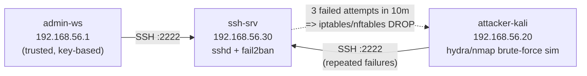

# Lab 06 — SSH Hardening

## Objective

Harden a fresh Linux SSH server end-to-end: switch from password to public-key authentication, disable root login and (eventually) password login entirely, restrict which local users may connect over SSH, move `sshd` off the default port 22, and deploy `fail2ban` to auto-ban brute-force sources. This lab exercises [SSH (Secure Shell) Server](../SSH-Secure-Shell-Server/Readme.md), and specifically [SSH Keygen Usage and SSH Authentication Setup](../SSH-Secure-Shell-Server/SSH-Keygen-Usage-and-SSH-Authentication-Setup.md), [Prevent Root Login via SSH](../SSH-Secure-Shell-Server/Prevent-Root-Login-via-SSH.md), and [Change Default SSH Port](../SSH-Secure-Shell-Server/Change-Default-SSH-Port.md).

> [!WARNING]
> **Lockout risk**
> Every step below can lock you out of the box if done in the wrong order. **Never disable password authentication until you have confirmed key-based login works in a second, still-open session.** Keep that second session open until validation is complete.

## Requirements

| Host | Role | OS (assumed) | IP | Resources |
|---|---|---|---|---|
| `ssh-srv` | SSH server under hardening | RHEL 9 / Rocky 9 (Debian/Ubuntu notes given inline) | `192.168.56.30` | 1 vCPU, 1 GB RAM |
| `attacker-kali` | Attack box — key generation, brute-force simulation | Kali Linux | `192.168.56.20` | 1 vCPU, 1 GB RAM |
| `admin-ws` | Trusted admin workstation (the "second session") | Any Linux/macOS | `192.168.56.1` (host-only) | — |

Both `ssh-srv` and `attacker-kali` must be on the same host-only/NAT network and able to ping each other. You need `sudo` on `ssh-srv` and a non-root local account (`opuser` in examples) to log in as.

## Topology



## Setup

### 1. Generate a key pair on the client (`admin-ws`)

```bash
ssh-keygen -t ed25519 -a 100 -C "opuser@admin-ws" -f ~/.ssh/id_ed25519_sshlab
# Enter a strong passphrase when prompted — do not leave it empty
```

### 2. Copy the public key to the server

```bash
ssh-copy-id -i ~/.ssh/id_ed25519_sshlab.pub -p 22 opuser@192.168.56.30
# If ssh-copy-id is unavailable:
cat ~/.ssh/id_ed25519_sshlab.pub | ssh opuser@192.168.56.30 \
  'mkdir -p ~/.ssh && chmod 700 ~/.ssh && cat >> ~/.ssh/authorized_keys && chmod 600 ~/.ssh/authorized_keys'
```

### 3. Verify key login BEFORE touching sshd_config

```bash
ssh -i ~/.ssh/id_ed25519_sshlab -p 22 opuser@192.168.56.30 'echo key auth OK'
```

Keep this session (or a fresh one using the key) **open** for the rest of the lab.

### 4. Restrict users allowed over SSH

Edit `/etc/ssh/sshd_config` on `ssh-srv` (config path and service name identical on RHEL and Debian families):

```conf
# /etc/ssh/sshd_config
AllowUsers opuser admin
DenyUsers  guest
```

> [!NOTE]
> `AllowUsers`/`AllowGroups` are allow-lists — if present, only listed users/groups may connect at all. Prefer `AllowGroups sshusers` plus `usermod -aG sshusers opuser` at scale instead of naming individual users.

### 5. Disable root login

```conf
# /etc/ssh/sshd_config
PermitRootLogin no
```

See [Prevent Root Login via SSH](../SSH-Secure-Shell-Server/Prevent-Root-Login-via-SSH.md) for the `prohibit-password` middle-ground option.

### 6. Disable password authentication (only after step 3 succeeded)

```conf
# /etc/ssh/sshd_config
PubkeyAuthentication yes
PasswordAuthentication no
KbdInteractiveAuthentication no
PermitEmptyPasswords no
```

### 7. Move sshd off port 22

```conf
# /etc/ssh/sshd_config
Port 2222
```

**RHEL/Rocky (SELinux)** — tell SELinux about the new port before restarting:

```bash
sudo semanage port -a -t ssh_port_t -p tcp 2222
```

**Debian/Ubuntu (AppArmor/no SELinux)** — no SELinux step needed, but check UFW:

```bash
sudo ufw allow 2222/tcp
```

Open the port in the firewall and restart the service:

```bash
# RHEL / Rocky (firewalld)
sudo firewall-cmd --permanent --add-port=2222/tcp
sudo firewall-cmd --reload
sudo systemctl restart sshd

# Debian / Ubuntu
sudo ufw allow 2222/tcp
sudo systemctl restart ssh
```

> [!WARNING]
> **Test the new port from a second session before closing your first one**
> `sudo sshd -t` validates config syntax but not firewall/SELinux reachability. Confirm `ssh -p 2222` connects before logging out.

### 8. Install and configure fail2ban

```bash
# RHEL / Rocky
sudo dnf install -y fail2ban
# Debian / Ubuntu
sudo apt install -y fail2ban
```

```ini
# /etc/fail2ban/jail.local
[sshd]
enabled  = true
port     = 2222
filter   = sshd
logpath  = %(sshd_log)s
backend  = %(sshd_backend)s
maxretry = 3
findtime = 10m
bantime  = 1h
```

```bash
sudo systemctl enable --now fail2ban
sudo systemctl status fail2ban --no-pager
```

> [!IMPORTANT]
> `logpath`/`backend` auto-detect from `/etc/fail2ban/paths-*.conf`. On Debian sshd logs to `/var/log/auth.log`; on RHEL/Rocky, `journald` is used by default (`backend = systemd`). If jail status shows 0 failures during testing, verify `logpath` matches reality with `fail2ban-client get sshd logpath`.

> [!NOTE]
> **📸 Screenshot**
> _Capture: `fail2ban-client status sshd` output showing the banned IP after the brute-force simulation in Validation step 5._

## Validation

**1. Key-based login works, password login is rejected:**

```bash
ssh -i ~/.ssh/id_ed25519_sshlab -p 2222 opuser@192.168.56.30 'whoami'
```

```text
opuser
```

```bash
ssh -p 2222 -o PubkeyAuthentication=no opuser@192.168.56.30
```

```text
opuser@192.168.56.30: Permission denied (publickey).
```

**2. Root login is refused even with a valid password:**

```bash
ssh -p 2222 root@192.168.56.30
```

```text
Permission denied (publickey).
```

**3. Denied/non-allow-listed user is rejected:**

```bash
ssh -p 2222 guest@192.168.56.30
```

```text
Permission denied (publickey).
```

(sshd logs `User guest from ... not allowed because listed in DenyUsers` — check with `sudo journalctl -u sshd -n 20`.)

**4. Port 22 is closed, 2222 is open:**

```bash
nmap -p 22,2222 192.168.56.30
```

```text
PORT     STATE  SERVICE
22/tcp   closed ssh
2222/tcp open   ssh
```

**5. fail2ban bans a brute-force source.** From `attacker-kali`, generate failed attempts:

```bash
for i in {1..5}; do sshd_fail=$(ssh -p 2222 -o BatchMode=yes wronguser@192.168.56.30 2>&1); done
```

Then on `ssh-srv`:

```bash
sudo fail2ban-client status sshd
```

```text
Status for the jail: sshd
|- Filter
|  |- Currently failed: 1
|  |- Total failed:     5
|  `- File list:        /var/log/auth.log
`- Actions
   |- Currently banned:	1
   |- Total banned:	1
   `- Banned IP list:	192.168.56.20
```

## Cleanup

```bash
# Server: revert to lab-safe defaults if handing the box back
sudo systemctl stop fail2ban
sudo systemctl disable fail2ban

# Unban the test IP if fail2ban stays enabled
sudo fail2ban-client set sshd unbanip 192.168.56.20

# Remove the SELinux port label if you reset Port to 22
sudo semanage port -d -t ssh_port_t -p tcp 2222   # RHEL/Rocky only

# Client: remove the lab key pair
rm -f ~/.ssh/id_ed25519_sshlab ~/.ssh/id_ed25519_sshlab.pub
ssh-add -d ~/.ssh/id_ed25519_sshlab 2>/dev/null
```

## Troubleshooting

- **Locked out after `PasswordAuthentication no`**: use the hypervisor/cloud console (out-of-band access), boot into rescue mode, or restore `/etc/ssh/sshd_config` from a backup taken before editing (`sudo cp sshd_config sshd_config.bak` — do this before step 4).
- **`sshd -t` passes but service won't start on the new port**: check for a stale process (`sudo ss -tlnp | grep 2222`) and SELinux denials (`sudo ausearch -m avc -ts recent`).
- **fail2ban jail shows `Currently failed: 0` despite real failures**: `logpath`/`backend` mismatch — confirm with `sudo fail2ban-client get sshd logpath` and that sshd is actually writing to that log (or use `backend = systemd` on RHEL).
- **`AllowUsers` locks out an intended admin**: the directive is space-separated usernames on one line; a second `AllowUsers` line silently overrides (does not append to) the first.
- **UFW/firewalld allows 2222 but connection still times out**: check a cloud provider security group / hypervisor-level ACL in addition to the host firewall.

## References

- `man sshd_config` — authoritative directive list (`PermitRootLogin`, `AllowUsers`, `PubkeyAuthentication`)
- [Red Hat: Configuring SSH](https://access.redhat.com/documentation/en-us/red_hat_enterprise_linux/9/html/configuring_basic_system_settings/assembly_configuring-secure-communication-with-the-ssh-protocol_configuring-basic-system-settings)
- [fail2ban jail.conf documentation](https://github.com/fail2ban/fail2ban/blob/master/config/jail.conf)
- CIS Benchmark — "SSH Server Configuration" section (relevant to whichever distro CIS profile is in scope)

## Related Notes

- [SSH Keygen Usage and SSH Authentication Setup](../SSH-Secure-Shell-Server/SSH-Keygen-Usage-and-SSH-Authentication-Setup.md)
- [Prevent Root Login via SSH](../SSH-Secure-Shell-Server/Prevent-Root-Login-via-SSH.md)
- [Change Default SSH Port](../SSH-Secure-Shell-Server/Change-Default-SSH-Port.md)
- [Managing IP Allow and Deny in SSH](../SSH-Secure-Shell-Server/Managing-IP-Allow-and-Deny-in-SSH.md)
- [Lab 07 — Firewall Configuration](Lab-07-Firewall-Configuration.md)
- [Linux Administration & Server Hardening](../Readme.md) — course hub and map of content
