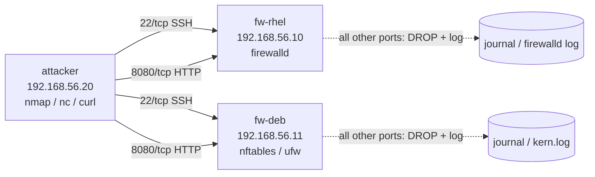

# Lab 07 — Firewall Configuration

## Objective

Build a two-host lab where a hardened server exposes exactly one service (SSH plus a web app) through a host firewall, and everything else is dropped and logged. You will configure the same intent — "allow 22/tcp and 8080/tcp, drop and log the rest" — three ways: **firewalld** zones/rich-rules (RHEL family default), **nftables** (the modern kernel-level backend both families now use), and **ufw** (Debian/Ubuntu-friendly wrapper). This gives you transferable muscle memory regardless of which distro you land on in production. Reinforces [Readme](../Security-Firewall-and-Monitoring/Readme.md), and pairs with [Firewalld](../Security-Firewall-and-Monitoring/Firewalld.md) and [Uncomplicated-Firewall(ufw)](../Security-Firewall-and-Monitoring/Uncomplicated-Firewall(ufw).md).

## Requirements

| Host | Role | OS | IP (lab network) | Resources |
|---|---|---|---|---|
| `fw-rhel` | Firewall target (firewalld) | Rocky Linux 9 / RHEL 9 | 192.168.56.10 | 1 vCPU, 1 GB RAM |
| `fw-deb` | Firewall target (nftables/ufw) | Debian 12 / Ubuntu 22.04 | 192.168.56.11 | 1 vCPU, 1 GB RAM |
| `attacker` | Test/scan client | Kali Linux (or any client) | 192.168.56.20 | 1 vCPU, 1 GB RAM |

All three VMs on a single **host-only / internal** virtual network so scans don't leak to your LAN. `nc`, `nmap`, and `python3` should be installed on `attacker`; a simple web listener (`python3 -m http.server 8080`) stands in for "the web app" on both targets.

> [!WARNING]
> **Isolate the network**
> Use a VirtualBox/libvirt **host-only or internal** network, not bridged, for this lab. You will intentionally open ports and watch drops — don't do that on a network segment with real neighbors.

## Topology



## Setup

### 0. Baseline: confirm current firewall state

```bash
# RHEL family (fw-rhel)
sudo firewall-cmd --state
sudo firewall-cmd --get-active-zones

# Debian family (fw-deb)
sudo systemctl status nftables --no-pager
sudo ufw status verbose
```

### 1. Start a stand-in "web app" on both targets

```bash
# On fw-rhel AND fw-deb — run in background or a separate terminal/tmux pane
python3 -m http.server 8080 --bind 0.0.0.0
```

### 2. firewalld — zones and a rich rule (fw-rhel)

```bash
# Confirm the default zone and interface binding
sudo firewall-cmd --get-default-zone
sudo firewall-cmd --get-zone-of-interface=eth1   # adjust interface name

# Assign the lab NIC to the 'public' zone explicitly
sudo firewall-cmd --zone=public --change-interface=eth1 --permanent

# Open SSH (service) and 8080/tcp (port) permanently
sudo firewall-cmd --zone=public --add-service=ssh --permanent
sudo firewall-cmd --zone=public --add-port=8080/tcp --permanent

# Rich rule: only allow 8080 from the attacker's /24, log everything else that
# hits this zone at "drop" level so denied traffic is visible in the journal
sudo firewall-cmd --zone=public --add-rich-rule=\
'rule family="ipv4" source address="192.168.56.0/24" port port="8080" protocol="tcp" accept' --permanent

sudo firewall-cmd --zone=public --set-target=DROP --permanent
sudo firewall-cmd --zone=public --add-log-denied=all
sudo firewall-cmd --reload
```

> [!IMPORTANT]
> **`--permanent` vs runtime**
> Every `--permanent` change is invisible until `firewall-cmd --reload` (or a runtime-only equivalent without `--permanent` for immediate but non-persistent testing). Forgetting `--reload` is the #1 cause of "I added the rule but it's not working."

> [!WARNING]
> **Don't lock yourself out over SSH**
> If you are connected over SSH and change the default zone's target to `DROP` or `REJECT` before confirming the `ssh` service is allowed **in that same zone**, your session can die mid-command and leave the box unreachable. Add the `ssh` service *before* tightening the target, and keep a console/hypervisor session open as a fallback.

### 3. nftables — native ruleset (fw-deb)

```bash
sudo apt update && sudo apt install -y nftables
sudo systemctl enable --now nftables

sudo tee /etc/nftables.conf > /dev/null <<'EOF'
#!/usr/sbin/nft -f
flush ruleset

table inet filter {
    chain input {
        type filter hook input priority 0; policy drop;

        ct state established,related accept
        iif lo accept
        ip protocol icmp accept

        tcp dport 22 accept
        tcp dport 8080 accept

        # Log everything else before the implicit drop
        log prefix "nft-drop: " counter drop
    }
    chain forward { type filter hook forward priority 0; policy drop; }
    chain output  { type filter hook output priority 0; policy accept; }
}
EOF

sudo nft -c -f /etc/nftables.conf   # syntax check first
sudo systemctl restart nftables
sudo nft list ruleset
```

### 4. ufw — friendlier wrapper over the same kernel tables (fw-deb, alternative)

```bash
sudo apt install -y ufw
sudo ufw default deny incoming
sudo ufw default allow outgoing

sudo ufw allow 22/tcp comment 'SSH mgmt'
sudo ufw allow 8080/tcp comment 'lab web app'

# Enable logging of blocked packets (medium = one line per blocked packet)
sudo ufw logging medium

sudo ufw enable
sudo ufw status verbose
```

> [!WARNING]
> **ufw and nftables/iptables conflict**
> `ufw` manages its own nftables/iptables tables under the hood. Don't run a hand-written `/etc/nftables.conf` **and** `ufw` active at the same time on the same host — pick one backend per host for this lab (Step 3 *or* Step 4 on `fw-deb`, not both).

## Validation

1. **Allowed ports respond from the attacker.**

   ```bash
   nc -zv 192.168.56.10 22 8080
   nc -zv 192.168.56.11 22 8080
   ```

   ```text
   Connection to 192.168.56.10 22 port [tcp/ssh] succeeded!
   Connection to 192.168.56.10 8080 port [tcp/http-alt] succeeded!
   ```

2. **Everything else is closed/filtered, not silently reachable.**

   ```bash
   nmap -p 1-100,443,3306,8081 192.168.56.10
   ```

   ```text
   PORT     STATE    SERVICE
   22/tcp   open     ssh
   443/tcp  filtered https
   3306/tcp filtered mysql
   ```

3. **firewalld rich-rule and zone target are active.**

   ```bash
   sudo firewall-cmd --zone=public --list-all
   ```

   ```text
   public (active)
     target: DROP
     interfaces: eth1
     services: ssh
     ports: 8080/tcp
     rich rules:
     	rule family="ipv4" source address="192.168.56.0/24" port port="8080" protocol="tcp" accept
   ```

4. **Drops are actually logged (firewalld side).**

   ```bash
   sudo journalctl -k | grep -i "FINAL_REJECT\|DROP" | tail -5
   ```

5. **Drops are logged (nftables side)** — trigger one from the attacker first, then check:

   ```bash
   nc -zv 192.168.56.11 9999
   sudo journalctl -k | grep "nft-drop" | tail -5
   ```

   ```text
   kernel: nft-drop: IN=eth1 OUT= MAC=... SRC=192.168.56.20 DST=192.168.56.11 ... DPT=9999 ...
   ```

6. **ufw shows deny in its log** (if using Step 4 instead of Step 3):

   ```bash
   sudo grep "UFW BLOCK" /var/log/ufw.log | tail -5
   ```

> [!NOTE]
> **📸 Screenshot**
> _Capture: side-by-side terminal panes showing `nmap` output against `fw-rhel` (port 8080 open, others filtered) and the matching `firewall-cmd --zone=public --list-all` output confirming the rich rule and DROP target._

## Cleanup

```bash
# fw-rhel — revert to a permissive lab-safe state
sudo firewall-cmd --zone=public --remove-rich-rule=\
'rule family="ipv4" source address="192.168.56.0/24" port port="8080" protocol="tcp" accept' --permanent
sudo firewall-cmd --zone=public --remove-port=8080/tcp --permanent
sudo firewall-cmd --zone=public --set-target=default --permanent
sudo firewall-cmd --reload

# fw-deb (nftables)
sudo nft flush ruleset
sudo systemctl disable --now nftables

# fw-deb (ufw)
sudo ufw disable
sudo ufw reset

# Both — stop the stand-in web app (Ctrl+C, or if backgrounded:)
pkill -f "http.server 8080"
```

## Troubleshooting

| Symptom | Likely cause | Fix |
|---|---|---|
| Rule added but `nmap` still shows port open/closed unchanged | Forgot `--reload` after a `--permanent` firewalld change | `sudo firewall-cmd --reload`, re-verify with `--list-all` |
| SSH session drops after tightening the zone target | `ssh` service wasn't added to the zone before setting `target=DROP` | Reconnect via console/hypervisor, re-add `--add-service=ssh`, re-test |
| `nft -f /etc/nftables.conf` fails silently on boot | Syntax error not caught before restart | Always run `nft -c -f <file>` (check mode) before `systemctl restart nftables` |
| No drop lines in the journal | `add-log-denied` never set (firewalld) or missing `log` statement in the nft chain | firewalld: `firewall-cmd --add-log-denied=all`; nftables: confirm `log prefix "..."` precedes the `drop` |
| `ufw` and hand-written `iptables`/`nft` rules both seem to apply, in confusing order | Both frameworks managing the same tables | Disable one (`ufw disable` or flush the custom nft table) — don't mix backends |
| Attacker's scan hangs instead of returning "filtered" | Default zone/policy is `DROP` (silent) vs `REJECT` (fast icmp-unreachable) — expected, not a bug | Use `nmap -Pn --host-timeout 10s` for faster feedback in the lab, or switch target to `REJECT` while learning |

## References

- Red Hat Enterprise Linux 9 — [Configuring firewalls and packet filters](https://access.redhat.com/documentation/en-us/red_hat_enterprise_linux/9/html/configuring_firewalls_and_packet_filters/index)
- `firewalld.richlanguage(5)`, `firewall-cmd(1)` man pages
- Debian Wiki — [nftables](https://wiki.debian.org/nftables)
- Ubuntu Server Guide — [Security: Firewall (ufw)](https://ubuntu.com/server/docs/security-firewall)
- CIS Benchmarks — RHEL/Ubuntu sections on "Ensure a Firewall Package is Installed" and "Ensure Firewall Logging"

## Related Notes

- [Firewalld](../Security-Firewall-and-Monitoring/Firewalld.md)
- [Uncomplicated-Firewall(ufw)](../Security-Firewall-and-Monitoring/Uncomplicated-Firewall(ufw).md)
- [IPTables-Configuration-and-Management](../Security-Firewall-and-Monitoring/IPTables-Configuration-and-Management.md)
- [Firewall-Network-Security-Barrier](../Security-Firewall-and-Monitoring/Firewall-Network-Security-Barrier.md)
- [Linux Administration & Server Hardening](../Readme.md) — course hub and map of content
