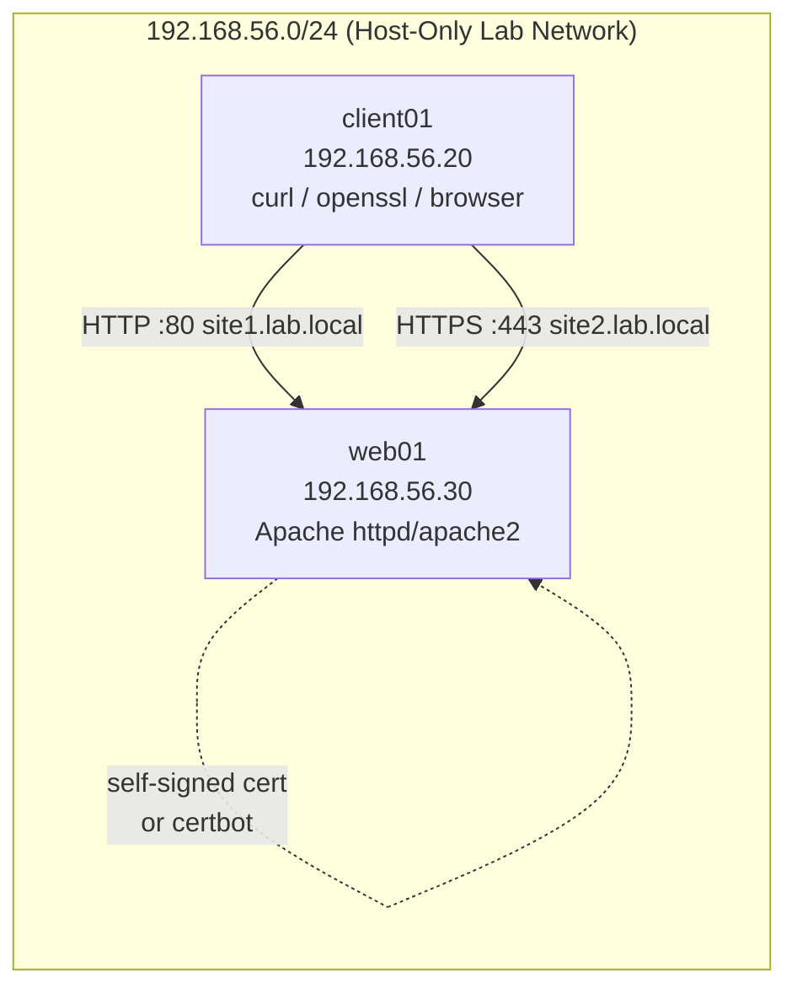

# Lab 08 — Apache Web Server Deployment

## Objective

Deploy an Apache HTTP Server hosting two independent virtual hosts, secure one of them with TLS (self-signed certificate, with a Let's Encrypt/`certbot` variant noted for internet-facing hosts), and apply baseline hardening HTTP response headers plus version-string suppression. This lab builds directly on [Apache Web Server](../Apache-Web-Server/Readme.md), and specifically on [Binding with Type (SSL/TLS)](../Apache-Web-Server/Binding-with-Type(SSL-TLS).md) and [Multiple Web Sites with SSL](../Apache-Web-Server/Multiple-Web-Sites-with-SSL.md). By the end you will have a hardened, name-based multi-site Apache install validated with `curl`, `openssl s_client`, and browser inspection.

## Requirements

| Host | Role | OS | IP | Resources |
|---|---|---|---|---|
| `web01` | Apache HTTP Server (target) | RHEL 9 / Rocky 9 **or** Ubuntu 22.04/Debian 12 | `192.168.56.30` | 1 vCPU, 1 GB RAM, 10 GB disk |
| `client01` | Test workstation (browser, `curl`, `openssl`) | Any (Kali/host OS) | `192.168.56.20` | Existing lab jump box |

> [!NOTE]
> Commands are given for both families. RHEL family uses `httpd` + `firewalld`; Debian family uses `apache2` + `ufw`. Pick the block matching your `web01` distro and stay consistent throughout.

## Topology



## Setup

### 1. Install Apache and mod_ssl

**RHEL/Rocky:**

```bash
sudo dnf install -y httpd mod_ssl openssl
sudo systemctl enable --now httpd
```

**Debian/Ubuntu:**

```bash
sudo apt update
sudo apt install -y apache2 openssl
sudo a2enmod ssl headers
sudo systemctl enable --now apache2
```

### 2. Create document roots and vhost content

```bash
sudo mkdir -p /var/www/site1.lab.local /var/www/site2.lab.local
echo "<h1>site1.lab.local — plain HTTP vhost</h1>" | sudo tee /var/www/site1.lab.local/index.html
echo "<h1>site2.lab.local — TLS vhost</h1>"        | sudo tee /var/www/site2.lab.local/index.html
sudo chown -R apache:apache /var/www/site1.lab.local /var/www/site2.lab.local   # RHEL: apache:apache
# sudo chown -R www-data:www-data /var/www/site1.lab.local /var/www/site2.lab.local  # Debian: www-data
```

### 3. Virtual host 1 — plain HTTP (name-based)

**RHEL** — `/etc/httpd/conf.d/site1.conf`; **Debian** — `/etc/apache2/sites-available/site1.conf`:

```conf
<VirtualHost *:80>
    ServerName  site1.lab.local
    DocumentRoot /var/www/site1.lab.local
    ErrorLog  /var/log/httpd/site1-error.log
    CustomLog /var/log/httpd/site1-access.log combined
    <Directory /var/www/site1.lab.local>
        Require all granted
    </Directory>
</VirtualHost>
```

> [!IMPORTANT]
> On Debian family, `ErrorLog`/`CustomLog` paths use `/var/log/apache2/...` and the vhost must be enabled with `sudo a2ensite site1.conf` before it takes effect — a `.conf` in `sites-available/` alone does nothing.

### 4. Generate a self-signed certificate (or use Let's Encrypt)

**Self-signed (lab-only):**

```bash
sudo mkdir -p /etc/pki/tls/certs /etc/pki/tls/private   # RHEL paths; Debian: /etc/ssl/{certs,private}
sudo openssl req -x509 -nodes -days 365 -newkey rsa:2048 \
  -keyout /etc/pki/tls/private/site2.lab.local.key \
  -out    /etc/pki/tls/certs/site2.lab.local.crt \
  -subj "/C=IN/ST=Lab/L=Lab/O=Lab/CN=site2.lab.local"
```

**Let's Encrypt (production, internet-reachable host only):**

```bash
sudo dnf install -y certbot python3-certbot-apache      # RHEL
# sudo apt install -y certbot python3-certbot-apache     # Debian
sudo certbot --apache -d site2.lab.local --agree-tos -m admin@lab.local
```

> [!WARNING]
> **Common footgun**
> `certbot` needs port 80/443 reachable from the internet for HTTP-01 validation — it will fail silently behind NAT/host-only networking. In an isolated lab, use the self-signed path above.

### 5. Virtual host 2 — HTTPS with hardening headers

**RHEL** — `/etc/httpd/conf.d/site2-ssl.conf`; **Debian** — `/etc/apache2/sites-available/site2-ssl.conf`:

```conf
<VirtualHost *:443>
    ServerName  site2.lab.local
    DocumentRoot /var/www/site2.lab.local

    SSLEngine on
    SSLCertificateFile      /etc/pki/tls/certs/site2.lab.local.crt
    SSLCertificateKeyFile   /etc/pki/tls/private/site2.lab.local.key
    SSLProtocol             all -SSLv3 -TLSv1 -TLSv1.1
    SSLCipherSuite          HIGH:!aNULL:!MD5:!3DES

    # --- Hardening headers ---
    Header always set Strict-Transport-Security "max-age=31536000; includeSubDomains"
    Header always set X-Content-Type-Options "nosniff"
    Header always set X-Frame-Options "DENY"
    Header always set Referrer-Policy "strict-origin-when-cross-origin"
    Header always set Content-Security-Policy "default-src 'self'"

    ErrorLog  /var/log/httpd/site2-error.log
    CustomLog /var/log/httpd/site2-access.log combined
    <Directory /var/www/site2.lab.local>
        Require all granted
    </Directory>
</VirtualHost>
```

Enable `mod_headers` if not already active:

```bash
sudo dnf install -y mod_ssl && sudo systemctl restart httpd     # RHEL: mod_ssl also provides Header directive support
# sudo a2enmod headers && sudo systemctl restart apache2         # Debian
```

### 6. Suppress the Apache version banner

Edit the main config (`/etc/httpd/conf/httpd.conf` on RHEL, `/etc/apache2/conf-available/security.conf` on Debian):

```conf
ServerTokens Prod
ServerSignature Off
```

Debian: enable it with `sudo a2enconf security && sudo systemctl reload apache2`.

### 7. Enable sites and open the firewall

**RHEL:**

```bash
sudo systemctl restart httpd
sudo firewall-cmd --permanent --add-service=http --add-service=https
sudo firewall-cmd --reload
```

**Debian:**

```bash
sudo a2ensite site1.conf site2-ssl.conf
sudo systemctl reload apache2
sudo ufw allow 80/tcp
sudo ufw allow 443/tcp
```

### 8. Resolve hostnames on the client

On `client01`, add to `/etc/hosts` (or configure split-horizon DNS):

```text
192.168.56.30   site1.lab.local
192.168.56.30   site2.lab.local
```

> [!NOTE]
> **📸 Screenshot**
> _Capture: browser padlock/certificate details for `https://site2.lab.local` showing the self-signed CN and the security headers visible in DevTools' Network tab._

## Validation

**1. HTTP vhost serves the correct document root:**

```bash
curl -s http://site1.lab.local/ | head -1
```

```text
<h1>site1.lab.local — plain HTTP vhost</h1>
```

**2. HTTPS vhost negotiates TLS and serves its own content:**

```bash
curl -sk https://site2.lab.local/ | head -1
```

```text
<h1>site2.lab.local — TLS vhost</h1>
```

**3. TLS handshake and protocol version:**

```bash
openssl s_client -connect site2.lab.local:443 -servername site2.lab.local </dev/null 2>/dev/null | grep -E "Protocol|Cipher"
```

```text
Protocol  : TLSv1.3
Cipher    : TLS_AES_256_GCM_SHA384
```

**4. Hardening headers are present:**

```bash
curl -skI https://site2.lab.local/ | grep -iE "strict-transport|x-frame|x-content-type|content-security"
```

```text
strict-transport-security: max-age=31536000; includeSubDomains
x-content-type-options: nosniff
x-frame-options: DENY
content-security-policy: default-src 'self'
```

**5. Server version banner is suppressed:**

```bash
curl -sI http://site1.lab.local/ | grep -i ^Server:
```

```text
Server: Apache
```

(No version number or OS string should appear — compare against the verbose default `Server: Apache/2.4.62 (Rocky Linux) OpenSSL/3.0.7` before applying `ServerTokens Prod`.)

**6. Config syntax is clean:**

```bash
sudo apachectl -t          # RHEL
# sudo apache2ctl -t         # Debian
```

```text
Syntax OK
```

## Cleanup

```bash
# RHEL
sudo systemctl stop httpd
sudo rm -f /etc/httpd/conf.d/site1.conf /etc/httpd/conf.d/site2-ssl.conf
sudo firewall-cmd --permanent --remove-service=http --remove-service=https && sudo firewall-cmd --reload

# Debian
sudo a2dissite site1.conf site2-ssl.conf
sudo systemctl stop apache2
sudo ufw delete allow 80/tcp
sudo ufw delete allow 443/tcp

# Both
sudo rm -rf /var/www/site1.lab.local /var/www/site2.lab.local
sudo rm -f /etc/pki/tls/certs/site2.lab.local.crt /etc/pki/tls/private/site2.lab.local.key
# certbot cleanup, if used:
sudo certbot delete --cert-name site2.lab.local
```

## Troubleshooting

| Symptom | Likely Cause | Fix |
|---|---|---|
| `curl: (7) Failed to connect` | Firewall blocking 80/443, or Apache not listening | `sudo ss -ltnp \| grep -E ':80\|:443'`; recheck `firewall-cmd`/`ufw` rules |
| Browser shows default "It works!" / Rocky test page instead of your vhost | `ServerName` mismatch or vhost not first/most-specific match | Ensure `NameVirtualHost`-style ordering; confirm `apachectl -S` lists your vhost |
| `AH00526: Syntax error … SSLCertificateFile: file does not exist` | Wrong path or key/cert not readable by Apache | Verify paths, `sudo chmod 640` key file, owned by `root:apache`/`root:ssl-cert` |
| Headers not appearing in `curl -I` output | `mod_headers` not enabled | Debian: `sudo a2enmod headers && systemctl reload apache2`; RHEL: confirm `mod_ssl`/base install includes it |
| `403 Forbidden` on new vhost | SELinux context on `/var/www/site*` (RHEL) or missing `Require all granted` | `sudo restorecon -Rv /var/www/site2.lab.local`; check `<Directory>` block |
| `certbot` HTTP-01 challenge fails | Host not reachable on port 80 from the internet (NAT/host-only lab) | Use self-signed cert in isolated labs; certbot requires public reachability |

## References

- [Apache HTTP Server SSL/TLS Configuration How-To](https://httpd.apache.org/docs/2.4/ssl/ssl_howto.html)
- [Mozilla SSL Configuration Generator](https://ssl-config.mozilla.org/)
- [OWASP Secure Headers Project](https://owasp.org/www-project-secure-headers/)
- [Red Hat: Setting up the Apache HTTP web server](https://access.redhat.com/documentation/en-us/red_hat_enterprise_linux/9/html/deploying_web_servers_and_reverse_proxies/setting-up-the-apache-http-web-server_deploying-web-servers-and-reverse-proxies)
- [Ubuntu Server: Apache HTTP Server](https://ubuntu.com/server/docs/web-servers-apache)

## Related Notes

- [Apache Web Server](../Apache-Web-Server/Readme.md)
- [Binding with Type (SSL/TLS)](../Apache-Web-Server/Binding-with-Type(SSL-TLS).md)
- [Multiple Web Sites with SSL](../Apache-Web-Server/Multiple-Web-Sites-with-SSL.md)
- [Apache Directory Listing and Access Control](../Apache-Web-Server/Apache-Directory-Listing-and-Access-Control.md)
- [Linux Administration & Server Hardening](../Readme.md) — course hub and map of content
