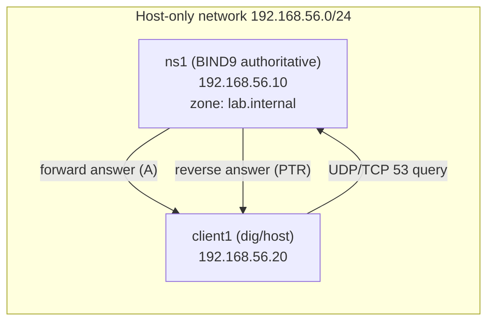

# Lab 09 — Authoritative DNS Server (BIND9)

## Objective

Stand up an authoritative BIND9 nameserver that serves a forward zone and its matching reverse (PTR) zone for a lab domain, then verify resolution end-to-end with `dig` and `host` from a separate client host. Along the way you'll apply baseline hardening (version hiding, recursion restricted to trusted clients, query ACLs) so the server behaves like a real internet-facing authoritative nameserver rather than an open resolver. This lab pairs with [Readme](../Domain-Name-System-DNS/Readme.md) and specifically exercises [Forward-Zone](../Domain-Name-System-DNS/Forward-Zone.md) and [Reverse-Zone](../Domain-Name-System-DNS/Reverse-Zone.md).

## Requirements

| Host | Role | OS | IP | Resources |
|---|---|---|---|---|
| `ns1` | Authoritative DNS server (BIND9/`named`) | RHEL 9 / Rocky 9 **or** Debian 12/Ubuntu 22.04 | `192.168.56.10/24` | 1 vCPU, 1 GB RAM |
| `client1` | Test client (`dig`, `host`, `nslookup`) | Any Linux | `192.168.56.20/24` | 1 vCPU, 512 MB RAM |

- NAT or host-only virtual network shared by both VMs (e.g. VirtualBox host-only adapter, or a libvirt `virbr` isolated network).
- Root/sudo on both VMs.
- Outbound internet access on `ns1` only for package installation (not required at query time).
- This lab assumes **RHEL-family (dnf/firewalld)** as the primary path; Debian-family (apt/ufw) commands are called out wherever they diverge.

> [!NOTE]
> **Lab domain**
> We use `lab.internal` as a private, non-routable domain name for the zone. Never reuse a domain you don't own for a real-world authoritative deployment.

## Topology



## Setup

### 1. Install BIND on `ns1`

```bash
# RHEL / Rocky / AlmaLinux
sudo dnf install -y bind bind-utils

# Debian / Ubuntu
sudo apt update && sudo apt install -y bind9 bind9utils dnsutils
```

### 2. Set a static IP and hostname on `ns1`

```bash
sudo hostnamectl set-hostname ns1.lab.internal
```

Confirm `ns1` has the static address `192.168.56.10` configured on its interface (via `nmcli`, Netplan, or `/etc/network/interfaces` as appropriate for your distro) before continuing.

### 3. Configure global options (`named.conf.options`)

RHEL path: `/etc/named.conf` (options block inline). Debian path: `/etc/bind/named.conf.options`.

```conf
options {
    directory "/var/named";           // RHEL. Debian: "/var/cache/bind";
    listen-on port 53 { 127.0.0.1; 192.168.56.10; };
    listen-on-v6 { none; };

    // Hardening: only answer recursive queries for our own subnet
    allow-query { any; };
    recursion yes;
    allow-recursion { 192.168.56.0/24; localhost; };

    // Hardening: never let strangers use us as an open resolver
    allow-transfer { none; };
    version "not disclosed";

    dnssec-validation auto;
};
```

> [!WARNING]
> **Open resolver risk**
> If `allow-recursion` is left at `any`, this server becomes an open resolver and can be abused for DNS amplification attacks. Always scope `allow-recursion` to trusted networks only.

### 4. Define the forward zone

RHEL: append to `/etc/named.conf`. Debian: append to `/etc/bind/named.conf.local`.

```conf
zone "lab.internal" IN {
    type master;
    file "lab.internal.zone";   // RHEL resolves under /var/named/
    allow-update { none; };
};

zone "56.168.192.in-addr.arpa" IN {
    type master;
    file "192.168.56.rev";
    allow-update { none; };
};
```

### 5. Create the forward zone file

RHEL: `/var/named/lab.internal.zone`. Debian: `/etc/bind/zones/lab.internal.zone` (create the `zones/` dir, and match the `file` path in step 4 accordingly).

```bash
sudo mkdir -p /var/named/  # RHEL already has this; Debian: sudo mkdir -p /etc/bind/zones
```

```conf
$TTL 86400
@   IN  SOA ns1.lab.internal. admin.lab.internal. (
        2026072201  ; serial (YYYYMMDDNN)
        3600        ; refresh
        900         ; retry
        604800      ; expire
        86400 )     ; minimum

@       IN  NS      ns1.lab.internal.
ns1     IN  A       192.168.56.10
www     IN  A       192.168.56.20
```

### 6. Create the reverse zone file

RHEL: `/var/named/192.168.56.rev`. Debian: `/etc/bind/zones/192.168.56.rev`.

```conf
$TTL 86400
@   IN  SOA ns1.lab.internal. admin.lab.internal. (
        2026072201  ; serial
        3600        ; refresh
        900         ; retry
        604800      ; expire
        86400 )     ; minimum

@       IN  NS      ns1.lab.internal.
10      IN  PTR     ns1.lab.internal.
20      IN  PTR     www.lab.internal.
```

### 7. Ownership, permissions, and syntax check

```bash
# RHEL
sudo chown root:named /var/named/lab.internal.zone /var/named/192.168.56.rev
sudo chmod 640 /var/named/lab.internal.zone /var/named/192.168.56.rev
sudo named-checkconf /etc/named.conf
sudo named-checkzone lab.internal /var/named/lab.internal.zone
sudo named-checkzone 56.168.192.in-addr.arpa /var/named/192.168.56.rev

# Debian
sudo chown root:bind /etc/bind/zones/lab.internal.zone /etc/bind/zones/192.168.56.rev
sudo chmod 640 /etc/bind/zones/lab.internal.zone /etc/bind/zones/192.168.56.rev
sudo named-checkconf /etc/bind/named.conf
sudo named-checkzone lab.internal /etc/bind/zones/lab.internal.zone
sudo named-checkzone 56.168.192.in-addr.arpa /etc/bind/zones/192.168.56.rev
```

> [!IMPORTANT]
> **Fix syntax errors before starting the service**
> `named` will refuse to load a zone with a bad serial format, missing trailing dot, or tab/space SOA parenthesis mismatch. Always run `named-checkconf` and `named-checkzone` before `systemctl restart` — a broken zone at boot is a classic self-inflicted outage.

### 8. Open the firewall and start the service

```bash
# RHEL (firewalld)
sudo firewall-cmd --add-service=dns --permanent
sudo firewall-cmd --reload
sudo systemctl enable --now named

# Debian (ufw)
sudo ufw allow 53/tcp
sudo ufw allow 53/udp
sudo systemctl enable --now bind9
```

### 9. Point `client1` at `ns1` for resolution

```bash
# Quick test without touching resolv.conf permanently — use dig @server for all queries below.
# To make it the client's default resolver instead, edit /etc/resolv.conf (or the NetworkManager
# connection's DNS setting) and add: nameserver 192.168.56.10
```

> [!NOTE]
> **📸 Screenshot**
> _Capture: `dig www.lab.internal @192.168.56.10` output on `client1` showing the ANSWER section with the correct A record and status: NOERROR._

## Validation

1. Forward lookup from `client1`:

```bash
dig @192.168.56.10 www.lab.internal +short
```

Expected output:

```text
192.168.56.20
```

2. Full forward query with answer flags:

```bash
dig @192.168.56.10 www.lab.internal A
```

Expected (trimmed):

```text
;; ->>HEADER<<- opcode: QUERY, status: NOERROR, id: 12345
;; ANSWER SECTION:
www.lab.internal.       86400   IN      A       192.168.56.20
```

3. Reverse lookup with `host`:

```bash
host 192.168.56.20 192.168.56.10
```

Expected output:

```text
20.56.168.192.in-addr.arpa domain name pointer www.lab.internal.
```

4. Confirm NS/SOA authority for the zone:

```bash
dig @192.168.56.10 lab.internal SOA +short
```

Expected output (serial will match your zone file):

```text
ns1.lab.internal. admin.lab.internal. 2026072201 3600 900 604800 86400
```

5. Confirm version hiding worked (hardening check):

```bash
dig @192.168.56.10 version.bind chaos txt
```

Expected output:

```text
;; ANSWER SECTION:
version.bind.           0       CH      TXT     "not disclosed"
```

6. Confirm the server is not an open resolver for outside networks — from `ns1` itself, check the running config reflects the ACL:

```bash
sudo named-checkconf -p /etc/named.conf | grep -A2 allow-recursion
```

## Cleanup

```bash
# Stop and disable the service
sudo systemctl disable --now named    # RHEL
sudo systemctl disable --now bind9    # Debian

# Remove zone files (RHEL)
sudo rm -f /var/named/lab.internal.zone /var/named/192.168.56.rev

# Remove zone files (Debian)
sudo rm -rf /etc/bind/zones

# Revert firewall rule
sudo firewall-cmd --remove-service=dns --permanent && sudo firewall-cmd --reload   # RHEL
sudo ufw delete allow 53/tcp && sudo ufw delete allow 53/udp                        # Debian

# If client1's resolv.conf/NetworkManager DNS was changed, revert it to the original resolver
```

## Troubleshooting

| Symptom | Likely cause | Fix |
|---|---|---|
| `dig` returns `connection timed out` | Firewall blocking UDP/TCP 53, or `named`/`bind9` not running | `sudo systemctl status named`; re-check `firewall-cmd --list-services` / `ufw status` |
| `SERVFAIL` on forward query | Zone file syntax error, serial not incremented after edit | `named-checkzone`, then `rndc reload` and check `journalctl -u named` |
| `REFUSED` from client outside 192.168.56.0/24 | `allow-recursion`/`allow-query` ACL correctly scoped (this is expected hardening behavior, not a bug) | Confirm the querying client is in the allowed subnet |
| Reverse lookup (`host`) fails but forward works | PTR zone missing, wrong `in-addr.arpa` zone name, or `56.168.192` octet order wrong | Reverse zones are octet-reversed: `192.168.56.20` → `20.56.168.192.in-addr.arpa` |
| SELinux denies `named` from reading zone file (RHEL) | Zone file created outside `/var/named` or wrong context | `sudo restorecon -Rv /var/named`; check `ausearch -m avc -ts recent` |
| Changes to zone file don't take effect | Forgot to bump the SOA serial, or forgot `rndc reload`/`reconfig` | Increment serial on every edit; run `sudo rndc reload lab.internal` |

## References

- [Readme](../Domain-Name-System-DNS/Readme.md)
- [Forward-Zone](../Domain-Name-System-DNS/Forward-Zone.md)
- [Reverse-Zone](../Domain-Name-System-DNS/Reverse-Zone.md)
- [dig](../Domain-Name-System-DNS/dig.md)
- [host](../Domain-Name-System-DNS/host.md)
- ISC BIND 9 Administrator Reference Manual (ARM)
- CIS Benchmarks — BIND DNS Server, "Restrict recursion and disable version disclosure"

## Related Notes

- [Readme](../Domain-Name-System-DNS/Readme.md)
- [Forward-Zone](../Domain-Name-System-DNS/Forward-Zone.md)
- [Reverse-Zone](../Domain-Name-System-DNS/Reverse-Zone.md)
- [Master-Nameserver](../Domain-Name-System-DNS/Master-Nameserver.md)
- [Linux Administration & Server Hardening](../Readme.md) — course hub and map of content
