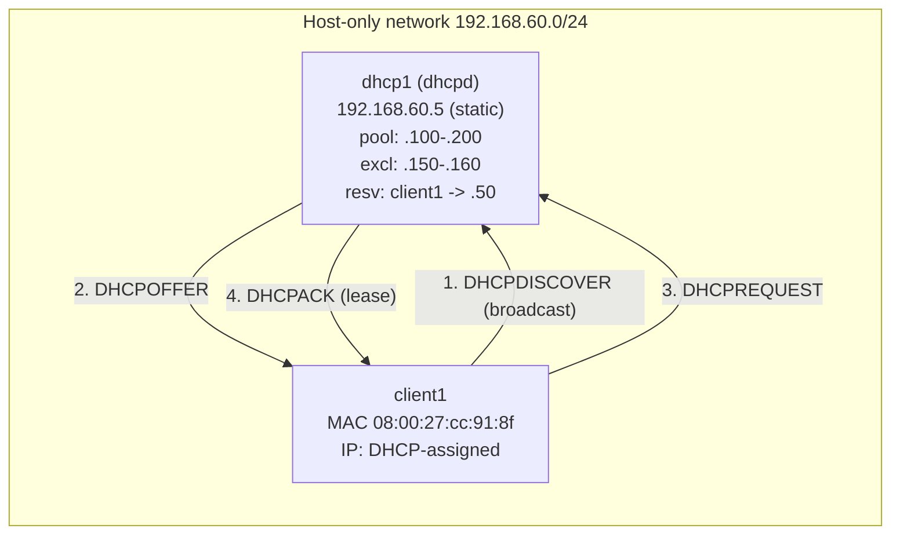

# Lab 10 — DHCP Server

## Objective

Stand up an ISC DHCP server that leases addresses from a defined scope/pool, carves out an exclusion range for infrastructure hosts, and pins a fixed reservation to one client by MAC address — then verify a real client lease end-to-end with `dhclient`, `dhcpd.leases`, and `ip addr`. This lab operationalizes [Readme](../Dynamic-Host-Configuration-Protocol-DHCP/Readme.md), specifically [DHCP-Server](../Dynamic-Host-Configuration-Protocol-DHCP/DHCP-Server.md), [Configure-DHCP-Exclusion-Range](../Dynamic-Host-Configuration-Protocol-DHCP/Configure-DHCP-Exclusion-Range.md), and [Reserve-IP-Address](../Dynamic-Host-Configuration-Protocol-DHCP/Reserve-IP-Address.md).

## Requirements

| Host | Role | OS | IP | Resources |
|---|---|---|---|---|
| `dhcp1` | DHCP server (`dhcpd`) | RHEL 9 / Rocky 9 **or** Debian 12/Ubuntu 22.04 | `192.168.60.5/24` (static) | 1 vCPU, 1 GB RAM |
| `client1` | Test client (DHCP lease target) | Any Linux (or a VM whose vNIC MAC you control) | Assigned by DHCP (`192.168.60.100–200` pool) | 1 vCPU, 512 MB RAM |

- NAT or host-only virtual network shared by both VMs (e.g. VirtualBox host-only adapter, or a libvirt isolated `virbr` network) — `dhcpd` must be the **only** DHCP server on this segment.
- Root/sudo on both VMs.
- `client1`'s vNIC MAC address noted in advance (needed for the reservation step) — e.g. `08:00:27:cc:91:8f`.
- This lab assumes **RHEL-family (dnf/firewalld, package `dhcp-server`, service `dhcpd`)** as the primary path; Debian-family (apt/ufw, package `isc-dhcp-server`, service `isc-dhcp-server`) commands are called out wherever they diverge. `dhcpd.conf` syntax is identical on both.

> [!WARNING]
> **Rogue DHCP server risk**
> Never run this lab on a shared/production LAN segment. A second DHCP server answering `DHCPDISCOVER` on the same broadcast domain is indistinguishable from a rogue server and will race the real one for clients. Use an isolated host-only or NAT network.

## Topology



## Setup

### 1. Install the DHCP server on `dhcp1`

```bash
# RHEL / Rocky / AlmaLinux
sudo dnf install -y dhcp-server

# Debian / Ubuntu
sudo apt update && sudo apt install -y isc-dhcp-server
```

### 2. Set a static IP on `dhcp1`

Confirm `dhcp1` has `192.168.60.5/24` configured on its interface (via `nmcli`, Netplan, or `/etc/network/interfaces`) before continuing — `dhcpd` must bind to an interface with a static, in-subnet address.

```bash
ip -4 addr show dev eth0 | grep inet
```

### 3. Define the scope/pool in `dhcpd.conf`

RHEL: `/etc/dhcp/dhcpd.conf`. Debian: `/etc/dhcp/dhcpd.conf` (same path; the Debian package also reads `/etc/default/isc-dhcp-server` for the listening interface — see step 6).

```conf
authoritative;

default-lease-time 600;
max-lease-time 7200;

subnet 192.168.60.0 netmask 255.255.255.0 {
    # --- Scope: split into two ranges around the exclusion gap ---
    range 192.168.60.100 192.168.60.149;
    range 192.168.60.161 192.168.60.200;

    option routers 192.168.60.1;
    option domain-name-servers 192.168.60.5, 1.1.1.1;
    option broadcast-address 192.168.60.255;
}
```

> [!NOTE]
> **Exclusion range explained**
> ISC DHCP has no literal `exclude` keyword. `192.168.60.150–192.168.60.160` is left **out of both** `range` statements, which is how ISC DHCP implements exclusions — see [Configure-DHCP-Exclusion-Range](../Dynamic-Host-Configuration-Protocol-DHCP/Configure-DHCP-Exclusion-Range.md). That gap is reserved for future static infrastructure (printers, a second DNS host, etc.) that will never be handed out dynamically.

### 4. Add the reservation for `client1`

Append a `host` block, outside the `subnet {}` block, pinning `client1`'s MAC to a fixed address **below** the pool so it never collides with dynamic leases:

```conf
host client1 {
    hardware ethernet 08:00:27:cc:91:8f;   # replace with client1's actual MAC
    fixed-address 192.168.60.50;
}
```

> [!IMPORTANT]
> **Reservations must sit outside every `range`**
> `192.168.60.50` is below both `range` statements (`.100–.149` and `.161–.200`), so `dhcpd` can never lease it dynamically to a different client, which would otherwise cause an IP conflict the moment `client1` also requested it. See [Reserve-IP-Address](../Dynamic-Host-Configuration-Protocol-DHCP/Reserve-IP-Address.md).

### 5. Syntax-check before starting the service

```bash
sudo dhcpd -t -cf /etc/dhcp/dhcpd.conf
```

Expected output ends with no errors (only a version banner and `Config file: ... is correct`, or complete silence depending on version).

> [!WARNING]
> **Never restart on an unchecked config**
> A single missing semicolon or mismatched brace crashes `dhcpd` on start and takes down address assignment for the whole segment. Always run `dhcpd -t -cf <file>` before every `systemctl restart`.

### 6. Debian only — pin the listening interface

```bash
sudo sed -i 's/^INTERFACESv4=.*/INTERFACESv4="eth0"/' /etc/default/isc-dhcp-server
```

### 7. Open the firewall and start the service

```bash
# RHEL (firewalld)
sudo firewall-cmd --add-service=dhcp --permanent
sudo firewall-cmd --reload
sudo systemctl enable --now dhcpd

# Debian (ufw)
sudo ufw allow 67/udp
sudo systemctl enable --now isc-dhcp-server
```

```bash
# Confirm the service came up clean
sudo systemctl status dhcpd            # RHEL
sudo systemctl status isc-dhcp-server  # Debian
```

### 8. Request a lease from `client1`

```bash
# Release any existing address first, then request fresh
sudo dhclient -r eth0
sudo dhclient -v eth0
```

> [!NOTE]
> **📸 Screenshot**
> _Capture: `dhclient -v eth0` output on `client1` showing the DHCPDISCOVER/DHCPOFFER/DHCPREQUEST/DHCPACK exchange and the bound lease address._

## Validation

1. Confirm `client1` received an address from the pool:

```bash
ip -4 addr show dev eth0 | grep inet
```

Expected output (any address in `.100–.149` or `.161–.200`, or `.50` if this is the reserved `client1` MAC):

```text
inet 192.168.60.101/24 brd 192.168.60.255 scope global dynamic eth0
```

2. On `dhcp1`, confirm the lease was recorded with the correct MAC:

```bash
sudo grep -A5 "192.168.60.101" /var/lib/dhcp/dhcpd.leases
```

Expected output (trimmed):

```text
lease 192.168.60.101 {
  starts 3 2026/07/22 10:15:03;
  ends 3 2026/07/22 10:25:03;
  binding state active;
  hardware ethernet 08:00:27:cc:91:8f;
}
```

3. Confirm the exclusion gap is never leased — after the lab has run for a while, no lease should ever appear in `.150–.160`:

```bash
sudo grep -E "lease 192\.168\.60\.(15[0-9]|160) " /var/lib/dhcp/dhcpd.leases
```

Expected output:

```text
(no output — the gap was never leased)
```

4. Confirm `client1`'s reservation binds to the fixed address (renew and re-check):

```bash
sudo dhclient -r eth0 && sudo dhclient -v eth0
ip -4 addr show dev eth0 | grep inet
```

Expected output:

```text
inet 192.168.60.50/24 brd 192.168.60.255 scope global eth0
```

5. Confirm `dhcpd` is only listening on UDP/67, not answering on other segments:

```bash
sudo ss -lunp | grep :67
```

Expected output:

```text
UNCONN 0  0  0.0.0.0:67  0.0.0.0:*  users:(("dhcpd",pid=1234,fd=6))
```

## Cleanup

```bash
# Release the client's lease
sudo dhclient -r eth0

# Stop and disable the service
sudo systemctl disable --now dhcpd            # RHEL
sudo systemctl disable --now isc-dhcp-server  # Debian

# Remove the leases database (optional — resets lease history for a clean re-run)
sudo rm -f /var/lib/dhcp/dhcpd.leases*

# Revert firewall rule
sudo firewall-cmd --remove-service=dhcp --permanent && sudo firewall-cmd --reload   # RHEL
sudo ufw delete allow 67/udp                                                        # Debian

# Restore client1's original network config if it was previously static
```

## Troubleshooting

| Symptom | Likely cause | Fix |
|---|---|---|
| `dhcpd` fails to start | Syntax error, or no `subnet` block matching the interface's directly-connected network | `dhcpd -t -cf /etc/dhcp/dhcpd.conf`; ensure a `subnet` declaration exists for every interface `dhcpd` is bound to |
| `client1` gets no address at all | Firewall blocking `67/udp`, service not running, or two DHCP servers racing on the segment | `systemctl status dhcpd`; `ss -lunp \| grep :67`; confirm no other DHCP server is live on this network |
| `client1` gets a pool address instead of the `.50` reservation | MAC in the `host` block doesn't match, or config wasn't reloaded after adding the reservation | `ip link show eth0` to confirm the MAC; `dhcpd -t` then `systemctl restart dhcpd` |
| Address handed out inside the `.150–.160` exclusion gap | A `range` statement was mistakenly widened to cover the gap | Re-check both `range` lines don't overlap `.150–.160` |
| Lease renews to a *different* dynamic address each time | Expected ISC DHCP behavior unless a reservation exists — the client isn't guaranteed the same pool address without a `host` block | Add a `host {}` reservation if a stable address is required |
| `journalctl` shows repeated `DHCPDISCOVER ... no free leases` | Pool exhausted (too many clients, exclusion gap too large, or short `max-lease-time` not recycling fast enough) | Widen the `range`, shorten `default-lease-time`, or add more subnets |

## References

- [Readme](../Dynamic-Host-Configuration-Protocol-DHCP/Readme.md)
- [DHCP-Server](../Dynamic-Host-Configuration-Protocol-DHCP/DHCP-Server.md)
- [Configure-DHCP-Exclusion-Range](../Dynamic-Host-Configuration-Protocol-DHCP/Configure-DHCP-Exclusion-Range.md)
- [Reserve-IP-Address](../Dynamic-Host-Configuration-Protocol-DHCP/Reserve-IP-Address.md)
- ISC DHCP `dhcpd.conf(5)` and `dhcpd(8)` manual pages
- Bundled reference config: `/usr/share/doc/dhcp-server/dhcpd.conf.example`

## Related Notes

- [Readme](../Dynamic-Host-Configuration-Protocol-DHCP/Readme.md)
- [DHCP-Server](../Dynamic-Host-Configuration-Protocol-DHCP/DHCP-Server.md)
- [Configure-DHCP-Exclusion-Range](../Dynamic-Host-Configuration-Protocol-DHCP/Configure-DHCP-Exclusion-Range.md)
- [Reserve-IP-Address](../Dynamic-Host-Configuration-Protocol-DHCP/Reserve-IP-Address.md)
- [Allow-for-Known-and-Unknown](../Dynamic-Host-Configuration-Protocol-DHCP/Allow-for-Known-and-Unknown.md)
- [Linux Administration & Server Hardening](../Readme.md) — course hub and map of content
