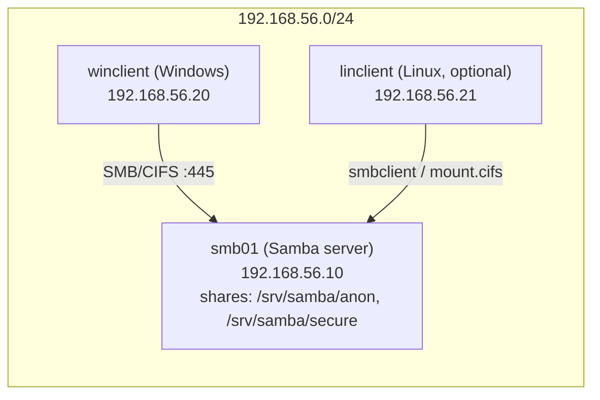

# Lab 11 — Samba File Share

## Objective

Stand up a Samba file server on Linux that serves both an **anonymous (guest) share** and an **authenticated share** restricted to a Samba user, then mount and browse both shares from a Windows client. This lab exercises share-definition syntax, `smbpasswd` user mapping, Linux filesystem permissions vs. Samba share permissions, and the firewall/SELinux plumbing that trips up first-time Samba admins. See [Samba/SMB/CIFS Server](../Samba-SMB-CIFS-Server/Readme.md) for the full module reference.

## Requirements

| Host | Role | OS | IP | Resources |
|---|---|---|---|---|
| `smb01` | Samba file server | Debian 12 (or RHEL 9 — commands noted where they diverge) | 192.168.56.10/24 | 1 vCPU, 1 GB RAM, 10 GB disk |
| `winclient` | Windows test client | Windows 10/11 | 192.168.56.20/24 | 2 vCPU, 4 GB RAM |
| `linclient` | Optional Linux test client | Debian/RHEL | 192.168.56.21/24 | 1 vCPU, 1 GB RAM |

This lab assumes **Debian/Ubuntu** as the primary path; RHEL/CentOS/Rocky equivalents are called out inline. All hosts on the same private/host-only network segment (e.g., VirtualBox Host-Only or a lab bridge).

## Topology



## Setup

### 1. Install Samba on `smb01`

```bash
# Debian/Ubuntu
sudo apt update
sudo apt install -y samba samba-common-bin

# RHEL/CentOS/Rocky
sudo dnf install -y samba samba-client samba-common
```

### 2. Create the share directories and a dedicated Samba user

```bash
sudo mkdir -p /srv/samba/anon /srv/samba/secure
sudo chmod 0777 /srv/samba/anon          # world-writable guest drop folder — lab only
sudo chmod 0770 /srv/samba/secure

sudo groupadd smbusers
sudo useradd -M -s /usr/sbin/nologin -G smbusers alice
sudo chown root:smbusers /srv/samba/secure
```

> [!WARNING]
> **Never mirror this in production**
> `chmod 0777` on the anonymous share is intentional for this lab so guest write works out of the box. On a real server, guest shares should be **read-only** or isolated on dedicated storage — a world-writable anonymous share is a classic ransomware drop point.

### 3. Set the Samba password for `alice` (independent from the Linux login password)

```bash
sudo smbpasswd -a alice
# New SMB password: <set a lab password>
# Retype new SMB password: <confirm>
sudo smbpasswd -e alice        # ensure the account is enabled
```

### 4. Configure `/etc/samba/smb.conf`

Back up the original first, then define the two shares:

```bash
sudo cp /etc/samba/smb.conf /etc/samba/smb.conf.bak
sudo nano /etc/samba/smb.conf
```

```ini
[global]
   workgroup = WORKGROUP
   server string = Lab11 Samba Server
   security = user
   map to guest = Bad User
   log file = /var/log/samba/log.%m
   max log size = 1000

[anon]
   comment = Anonymous drop share
   path = /srv/samba/anon
   browsable = yes
   guest ok = yes
   read only = no
   force user = nobody
   force group = nogroup

[secure]
   comment = Authenticated share for alice
   path = /srv/samba/secure
   browsable = yes
   guest ok = no
   valid users = alice
   read only = no
   create mask = 0660
   directory mask = 0770
```

> [!IMPORTANT]
> **`map to guest = Bad User` is what makes the `[anon]` share truly anonymous — without it, Samba rejects unknown users instead of falling back to guest. Forgetting this is the #1 reason "anonymous" shares still prompt for credentials.**

Validate the config syntax before restarting:

```bash
testparm -s
```

### 5. Restart and enable services

```bash
sudo systemctl restart smbd nmbd
sudo systemctl enable smbd nmbd
sudo systemctl status smbd --no-pager
```

### 6. Open the firewall

```bash
# Debian/Ubuntu (ufw)
sudo ufw allow samba

# RHEL/CentOS/Rocky (firewalld)
sudo firewall-cmd --permanent --add-service=samba
sudo firewall-cmd --reload
```

> [!WARNING]
> **SELinux (RHEL family only)**
> On RHEL/CentOS/Rocky, SELinux will block Samba from reading paths outside its default context even if firewall and `smb.conf` are correct. Label the share directories before testing:
> ```bash
> sudo semanage fcontext -a -t samba_share_t "/srv/samba(/.*)?"
> sudo restorecon -Rv /srv/samba
> ```
> If `semanage` is missing: `sudo dnf install -y policycoreutils-python-utils`.

## Commands — client access

### From `linclient` (Debian/RHEL)

```bash
# List shares anonymously
smbclient -L //192.168.56.10 -N

# Mount the anonymous share
sudo mkdir -p /mnt/anon
sudo mount -t cifs //192.168.56.10/anon /mnt/anon -o guest,vers=3.0

# Mount the authenticated share
sudo mkdir -p /mnt/secure
sudo mount -t cifs //192.168.56.10/secure /mnt/secure \
   -o username=alice,vers=3.0
```

### From `winclient` (PowerShell or Run dialog)

```text
# Browse anonymous share
\\192.168.56.10\anon

# Map the authenticated share as a drive
net use S: \\192.168.56.10\secure /user:alice <lab-password>
```

> [!NOTE]
> **📸 Screenshot**
> _Capture: Windows Explorer address bar showing `\\192.168.56.10\secure` successfully open, plus the credential prompt used to authenticate as `alice`._

## Validation

1. **Server is listening on SMB ports:**
   ```bash
   sudo ss -tlnp | grep -E ':(139|445)'
   ```
   Expected:
   ```text
   LISTEN 0 5 0.0.0.0:445 0.0.0.0:*  users:(("smbd",pid=1234,fd=25))
   LISTEN 0 5 0.0.0.0:139 0.0.0.0:*  users:(("smbd",pid=1234,fd=27))
   ```

2. **Shares are advertised correctly:**
   ```bash
   smbclient -L //192.168.56.10 -N
   ```
   Expected:
   ```text
   Sharename       Type      Comment
   ---------       ----      -------
   anon            Disk      Anonymous drop share
   secure          Disk      Authenticated share for alice
   IPC$            IPC       IPC Service
   ```

3. **Anonymous write works:**
   ```bash
   smbclient //192.168.56.10/anon -N -c "put /etc/hostname test.txt; ls"
   ```
   Expected output includes `test.txt` in the listing with no auth prompt.

4. **Unauthenticated access to `secure` is refused:**
   ```bash
   smbclient //192.168.56.10/secure -N -c "ls"
   ```
   Expected:
   ```text
   tree connect failed: NT_STATUS_ACCESS_DENIED
   ```

5. **Authenticated access to `secure` succeeds:**
   ```bash
   smbclient -U alice //192.168.56.10/secure -c "ls"
   ```
   Expected: directory listing returns without error after the password prompt.

6. **Samba user list matches expectations:**
   ```bash
   sudo pdbedit -L -v | grep -A2 "alice"
   ```

## Cleanup

```bash
# Unmount clients
sudo umount /mnt/anon /mnt/secure 2>/dev/null

# Remove the Samba user
sudo smbpasswd -x alice
sudo pdbedit -x -u alice

# Remove Linux account and group
sudo userdel alice
sudo groupdel smbusers

# Remove share data (lab teardown only — irreversible)
sudo rm -rf /srv/samba

# Restore original config and stop services
sudo cp /etc/samba/smb.conf.bak /etc/samba/smb.conf
sudo systemctl stop smbd nmbd
sudo systemctl disable smbd nmbd

# Close the firewall rule
sudo ufw delete allow samba                 # Debian/Ubuntu
sudo firewall-cmd --permanent --remove-service=samba && sudo firewall-cmd --reload   # RHEL
```

## Troubleshooting

| Symptom | Likely cause | Fix |
|---|---|---|
| `NT_STATUS_ACCESS_DENIED` on the anonymous share | `map to guest` missing or set wrong, or directory perms too tight | Confirm `map to guest = Bad User` in `[global]`; re-check `chmod` on `/srv/samba/anon` |
| Windows prompts for credentials on `\\server\anon` | Windows 10/11 disables guest fallback by default (`AllowInsecureGuestAuth`) | Enable via Group Policy/registry on the client, or treat it as expected hardening and use the authenticated share instead |
| `smbclient -L` hangs or times out | Firewall blocking 139/445, or `nmbd` not running | `sudo ss -tlnp | grep smb`; re-check `ufw`/`firewalld` rules |
| Mount succeeds but writes fail with `Permission denied` | Linux DACL vs. Samba `create mask`/`force user` mismatch | Check `ls -ld` on the share path and compare against `smb.conf` mask directives |
| `testparm` reports no errors but `smbd` fails to start | Port 445 already bound by another service, or SELinux denial | `sudo journalctl -u smbd -n 50`; on RHEL check `sudo ausearch -m avc -ts recent` |
| Authenticated login rejected even with correct password | User exists in `/etc/passwd` but never added via `smbpasswd -a` | Samba maintains its own password database — always run `smbpasswd -a <user>` |

## References

- Samba Project — [Samba HOWTO Collection](https://www.samba.org/samba/docs/) (`smb.conf` share definitions, security modes)
- Red Hat Enterprise Linux 9 — *Managing Samba* (System Administrator's Guide, Ch. "File and Print Servers")
- `man smb.conf`, `man smbpasswd`, `man mount.cifs`
- CIS Distribution Independent Linux Benchmark — network file share hardening controls

## Related Notes

- [Samba/SMB/CIFS Server](../Samba-SMB-CIFS-Server/Readme.md) — module overview
- [Anonymous Samba Share](../Samba-SMB-CIFS-Server/Anonymous-Samba-Share.md)
- [Shared Common Directories With Samba](../Samba-SMB-CIFS-Server/Shared-Common-Directories-With-Samba.md)
- [SMB Client Tools](../Samba-SMB-CIFS-Server/Smb-Client-tools.md)
- [Linux Administration & Server Hardening](../Readme.md) — course hub and map of content
