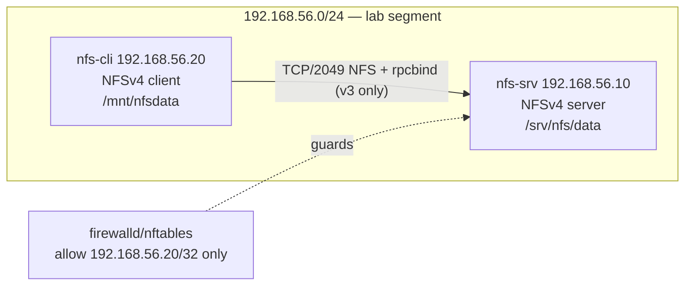

# Lab 12 — NFS Share

## Objective

Stand up an NFSv4 file server that exports a share to a single trusted client, mount it persistently via `/etc/fstab`, and then harden the deployment: enforce `root_squash` so the client's root user cannot write as the server's root, and restrict access with `firewalld`/`nftables` so only the client subnet can reach the NFS ports. This lab is the hands-on companion to [Readme](../NFS-Server/Readme.md) and reinforces the network-service hardening habits from [the course hub](../Readme.md).

> [!WARNING]
> **Lab environment only**
> NFSv3/v4 without Kerberos (`sec=sys`) trusts client-supplied UIDs/GIDs. Never expose these ports to an untrusted network or the internet — this lab assumes an isolated lab subnet.

## Requirements

| Host | Role | OS | IP | Resources |
|---|---|---|---|---|
| `nfs-srv` | NFS server | RHEL/Rocky 9 (or Debian 12) | 192.168.56.10/24 | 1 vCPU, 1 GB RAM, 10 GB disk |
| `nfs-cli` | NFS client | RHEL/Rocky 9 (or Debian/Ubuntu) | 192.168.56.20/24 | 1 vCPU, 1 GB RAM, 8 GB disk |

Both VMs are on the same isolated host-only/NAT-network segment (`192.168.56.0/24`) with root or sudo access. Commands are shown for **RHEL-family** (`dnf`, `firewalld`) first, with **Debian-family** (`apt`, `ufw`/`nftables`) noted where it diverges.

## Topology



## Setup

### 1. Server — install and configure NFS (nfs-srv)

**RHEL/Rocky:**

```bash
sudo dnf install -y nfs-utils
sudo systemctl enable --now nfs-server
```

**Debian/Ubuntu:**

```bash
sudo apt update
sudo apt install -y nfs-kernel-server
sudo systemctl enable --now nfs-kernel-server
```

Create the export directory and set restrictive ownership — the export will be owned by a dedicated `nfsnobody`-equivalent, not root:

```bash
sudo mkdir -p /srv/nfs/data
sudo chown nobody:nogroup /srv/nfs/data   # Debian; on RHEL use nobody:nobody
sudo chmod 750 /srv/nfs/data
echo "hello from nfs-srv" | sudo tee /srv/nfs/data/welcome.txt
```

> [!NOTE]
> **Ownership groups differ**
> RHEL uses `nobody:nobody`; Debian/Ubuntu use `nobody:nogroup`. Check with `getent group nogroup` if unsure which exists.

### 2. Define the export with `root_squash` (nfs-srv)

Edit `/etc/exports`:

```conf
/srv/nfs/data  192.168.56.20(rw,sync,root_squash,no_subtree_check)
```

> [!IMPORTANT]
> **`root_squash` is the default — verify it, don't assume**
> `root_squash` (map remote root → `nobody`) is the default in most distros, but a prior lab or a copy-pasted `no_root_squash` line is a classic footgun. Always state it explicitly in `/etc/exports` so intent is documented and audit-visible.

Apply the export and confirm:

```bash
sudo exportfs -ra
sudo exportfs -v
```

```text
/srv/nfs/data  192.168.56.20(sync,wdelay,hide,no_subtree_check,sec=sys,rw,secure,root_squash,no_all_squash)
```

### 3. Firewall — restrict to the client subnet only (nfs-srv)

**RHEL/Rocky (firewalld):**

```bash
sudo firewall-cmd --permanent --new-zone=nfslab
sudo firewall-cmd --permanent --zone=nfslab --add-source=192.168.56.20/32
sudo firewall-cmd --permanent --zone=nfslab --add-service=nfs
sudo firewall-cmd --permanent --zone=nfslab --add-service=rpc-bind
sudo firewall-cmd --permanent --zone=nfslab --add-service=mountd
sudo firewall-cmd --reload
sudo firewall-cmd --list-all --zone=nfslab
```

**Debian/Ubuntu (nftables, since `ufw` service aliases for NFS are limited):**

```bash
sudo nft add table inet nfslab
sudo nft add chain inet nfslab input '{ type filter hook input priority 0 ; policy drop ; }'
sudo nft add rule inet nfslab input ip saddr 192.168.56.20/32 tcp dport 2049 accept
sudo nft add rule inet nfslab input ip saddr 192.168.56.20/32 tcp dport 111 accept
sudo nft add rule inet nfslab input iif lo accept
sudo nft add rule inet nfslab input ct state established,related accept
sudo nft list ruleset | sudo tee /etc/nftables.conf
sudo systemctl enable --now nftables
```

> [!WARNING]
> **Don't lock yourself out over SSH**
> The Debian nftables policy above is `drop`-by-default on the `input` chain. If you manage `nfs-srv` over SSH, add an explicit `tcp dport 22 accept` rule (scoped to your management subnet) **before** reloading, or you will sever your own session.

### 4. Client — mount on demand, then persist via fstab (nfs-cli)

**RHEL/Rocky:**

```bash
sudo dnf install -y nfs-utils
```

**Debian/Ubuntu:**

```bash
sudo apt install -y nfs-common
```

Test the mount manually first:

```bash
sudo mkdir -p /mnt/nfsdata
sudo mount -t nfs4 192.168.56.10:/srv/nfs/data /mnt/nfsdata
cat /mnt/nfsdata/welcome.txt
sudo umount /mnt/nfsdata
```

Make it persistent in `/etc/fstab`:

```conf
192.168.56.10:/srv/nfs/data  /mnt/nfsdata  nfs4  defaults,_netdev,noexec,nosuid  0  0
```

> [!IMPORTANT]
> **`_netdev` prevents a boot hang**
> Without `_netdev`, systemd may try to mount the share before networking is up, stalling the boot or timing out. `noexec,nosuid` block execution and setuid abuse from a share the server side treats as untrusted input.

Reload systemd's mount-unit generator and mount everything from fstab:

```bash
sudo systemctl daemon-reload
sudo mount -a
```

## Validation

1. Confirm the export is visible from the client:

```bash
showmount -e 192.168.56.10
```

```text
Export list for 192.168.56.10:
/srv/nfs/data 192.168.56.20
```

2. Confirm the mount is active and matches fstab options:

```bash
mount | grep nfsdata
```

```text
192.168.56.10:/srv/nfs/data on /mnt/nfsdata type nfs4 (rw,noexec,nosuid,_netdev,...)
```

3. Confirm `root_squash` is enforced — as **root on the client**, try to write, then check ownership on the server:

```bash
sudo touch /mnt/nfsdata/root-test.txt
```

On `nfs-srv`:

```bash
ls -ln /srv/nfs/data/root-test.txt
```

```text
-rw-r--r-- 1 65534 65534 0 Jul 22 10:15 /srv/nfs/data/root-test.txt
```

UID/GID `65534` is `nobody` — proof the client's root was squashed instead of writing as server-root.

4. Confirm the firewall blocks a third host: from any machine **not** `192.168.56.20`, attempt `showmount -e 192.168.56.10` and expect a timeout/connection refused, not a listing.

> [!NOTE]
> **📸 Screenshot**
> _Capture: the `ls -ln` output on nfs-srv showing `root-test.txt` owned by UID/GID 65534 (nobody), proving root_squash is active._

## Cleanup

```bash
# Client
sudo umount /mnt/nfsdata
sudo sed -i '\|192.168.56.10:/srv/nfs/data|d' /etc/fstab
sudo systemctl daemon-reload

# Server
sudo sed -i '\|/srv/nfs/data|d' /etc/exports
sudo exportfs -ra
sudo rm -rf /srv/nfs/data

# Firewall (RHEL)
sudo firewall-cmd --permanent --delete-zone=nfslab
sudo firewall-cmd --reload

# Firewall (Debian)
sudo nft delete table inet nfslab
sudo rm -f /etc/nftables.conf
```

## Troubleshooting

| Symptom | Likely cause | Fix |
|---|---|---|
| `showmount: clnt_create: RPC: Unable to receive` | `rpcbind`/firewall blocking port 111 or 2049 | Verify firewall zone/nft rules; `systemctl status rpcbind` on RHEL |
| `mount.nfs4: access denied by server` | Client IP not in `/etc/exports`, or export not reloaded | Re-check `192.168.56.20` matches exactly; re-run `exportfs -ra` |
| Boot hangs at "Job running for /mnt/nfsdata" | Missing `_netdev` in fstab | Add `_netdev`, `systemctl daemon-reload`, reboot to confirm |
| Root-owned file appears on server instead of `nobody` | `no_root_squash` set (intentionally or by accident) | Fix `/etc/exports` to `root_squash`, `exportfs -ra` |
| `Stale file handle` on client | Server export path changed/restarted mid-session | `umount -f /mnt/nfsdata` then remount |

## References

- [Readme](../NFS-Server/Readme.md)
- `man exports` — export options including `root_squash`, `no_subtree_check`
- `man nfs` — client-side mount options (`_netdev`, `noexec`, `nosuid`)
- Red Hat: *Managing file systems* — NFS server configuration chapter
- CIS Benchmarks — "Ensure NFS is not enabled" / "Configure NFS export access controls" sections

## Related Notes

- [Readme](../NFS-Server/Readme.md)
- Readme
- [Linux Administration & Server Hardening](../Readme.md) — course hub and map of content
