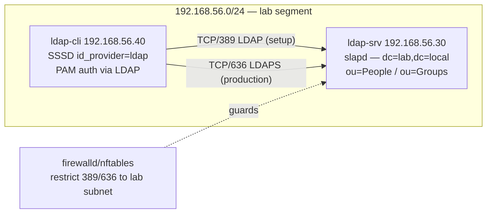

# Lab 13 — Central Auth with OpenLDAP

## Objective

Stand up a centralized directory service with OpenLDAP (`slapd`), populate it with a `People`/`Groups` tree and a real POSIX user via LDIF, then join a second host to that directory using SSSD so a user can `ssh`/`su` in with only their LDAP password — no local `/etc/passwd` entry required. Finally, wrap the directory in TLS (LDAPS) so credentials never cross the wire in plaintext. This lab is the hands-on companion to [Readme](../LDAP-Server/Readme.md) and exercises [LDAP-Directory-Structure](../LDAP-Server/LDAP-Directory-Structure.md), [LDAP-Client-Configuration](../LDAP-Server/LDAP-Client-Configuration.md), and [LDAP-over-TLS](../LDAP-Server/LDAP-over-TLS.md).

> [!IMPORTANT]
> **Package availability differs by distro**
> RHEL 9/Rocky 9 **dropped `openldap-servers`** from the base repos (only `openldap-clients` remains; the modern RHEL directory service is `389-ds-base`). This lab therefore runs the **server** on Debian/Ubuntu (`slapd` ships natively via `apt`) and shows the **client** side on both RHEL-family and Debian-family, since `sssd`/`ldap-utils`/`openldap-clients` are available everywhere.

## Requirements

| Host | Role | OS | IP | Resources |
|---|---|---|---|---|
| `ldap-srv` | OpenLDAP directory server | Debian 12 / Ubuntu 22.04+ | 192.168.56.30/24 | 1 vCPU, 1 GB RAM, 10 GB disk |
| `ldap-cli` | Auth client (SSSD) | RHEL/Rocky 9 (or Debian 12) | 192.168.56.40/24 | 1 vCPU, 1 GB RAM, 8 GB disk |

Both VMs share the isolated `192.168.56.0/24` lab segment with root or sudo access and resolvable hostnames (`/etc/hosts` or lab DNS — see [Master-Nameserver](../Domain-Name-System-DNS/Master-Nameserver.md)).

## Topology



## Setup

### 1. Server — install slapd and set the base DN (ldap-srv)

```bash
# Debian/Ubuntu
sudo debconf-set-selections <<'EOF'
slapd slapd/internal/generated_adminpw password ChangeMe_LDAPAdmin!23
slapd slapd/internal/adminpw password ChangeMe_LDAPAdmin!23
slapd slapd/password2 password ChangeMe_LDAPAdmin!23
slapd slapd/password1 password ChangeMe_LDAPAdmin!23
slapd slapd/domain string lab.local
slapd shared/organization string Lab
EOF
sudo DEBIAN_FRONTEND=noninteractive apt install -y slapd ldap-utils
sudo dpkg-reconfigure -f noninteractive slapd
```

> [!WARNING]
> **Lab password only**
> `ChangeMe_LDAPAdmin!23` is for this isolated lab. Never ship a preseeded/hardcoded admin password to a real environment — set it interactively or via a secrets manager.

### 2. Build the directory tree (ldap-srv)

```bash
cat > /tmp/base.ldif <<'EOF'
dn: ou=People,dc=lab,dc=local
objectClass: organizationalUnit
ou: People

dn: ou=Groups,dc=lab,dc=local
objectClass: organizationalUnit
ou: Groups
EOF

ldapadd -x -D "cn=admin,dc=lab,dc=local" -W -f /tmp/base.ldif
```

### 3. Add a POSIX user and group (ldap-srv)

```bash
HASH=$(slappasswd -s 'UserLab!Pass1')   # generates an SSHA hash, e.g. {SSHA}xxxxx

cat > /tmp/jdoe.ldif <<EOF
dn: cn=devgroup,ou=Groups,dc=lab,dc=local
objectClass: posixGroup
cn: devgroup
gidNumber: 5000

dn: uid=jdoe,ou=People,dc=lab,dc=local
objectClass: inetOrgPerson
objectClass: posixAccount
objectClass: shadowAccount
uid: jdoe
sn: Doe
givenName: Jane
cn: Jane Doe
displayName: Jane Doe
uidNumber: 10001
gidNumber: 5000
userPassword: ${HASH}
loginShell: /bin/bash
homeDirectory: /home/jdoe
EOF

ldapadd -x -D "cn=admin,dc=lab,dc=local" -W -f /tmp/jdoe.ldif
```

### 4. Firewall on ldap-srv

```bash
# Debian/Ubuntu (ufw)
sudo ufw allow from 192.168.56.0/24 to any port 389 proto tcp
sudo ufw allow from 192.168.56.0/24 to any port 636 proto tcp

# RHEL-family, if server were RHEL/389-ds instead (reference only)
sudo firewall-cmd --permanent --add-rich-rule='rule family="ipv4" source address="192.168.56.0/24" port port="389" protocol="tcp" accept'
sudo firewall-cmd --permanent --add-rich-rule='rule family="ipv4" source address="192.168.56.0/24" port port="636" protocol="tcp" accept'
sudo firewall-cmd --reload
```

### 5. Client — install SSSD and point it at the directory (ldap-cli)

```bash
# RHEL/Rocky
sudo dnf install -y sssd sssd-ldap openldap-clients authselect
sudo authselect select sssd --force

# Debian/Ubuntu
sudo apt install -y sssd sssd-ldap ldap-utils
sudo pam-auth-update --enable sss
```

```ini
# /etc/sssd/sssd.conf  (mode 0600, owner root:root — sssd refuses to start otherwise)
[sssd]
services = nss, pam
domains = lab.local

[domain/lab.local]
id_provider = ldap
auth_provider = ldap
ldap_uri = ldap://192.168.56.30/
ldap_search_base = dc=lab,dc=local
ldap_id_use_start_tls = false
cache_credentials = true
enumerate = false
```

```bash
sudo chmod 600 /etc/sssd/sssd.conf
sudo chown root:root /etc/sssd/sssd.conf
sudo systemctl enable --now sssd
sudo mkdir -p /etc/security   # RHEL: authselect already wired pam_mkhomedir if --force above
sudo authselect enable-feature with-mkhomedir   # RHEL-family only
```

### 6. Add LDAPS (TLS) on the server (ldap-srv)

```bash
sudo mkdir -p /etc/ldap/lab-ca
sudo openssl req -x509 -nodes -days 825 -newkey rsa:2048 \
  -keyout /etc/ldap/lab-ca/ldap-srv.key -out /etc/ldap/lab-ca/ldap-srv.crt \
  -subj "/CN=ldap-srv.lab.local"
sudo chown openldap:openldap /etc/ldap/lab-ca/*
sudo chmod 640 /etc/ldap/lab-ca/ldap-srv.key

cat > /tmp/tls.ldif <<'EOF'
dn: cn=config
changetype: modify
add: olcTLSCertificateFile
olcTLSCertificateFile: /etc/ldap/lab-ca/ldap-srv.crt
-
add: olcTLSCertificateKeyFile
olcTLSCertificateKeyFile: /etc/ldap/lab-ca/ldap-srv.key
EOF
sudo ldapmodify -Y EXTERNAL -H ldapi:/// -f /tmp/tls.ldif

sudo sed -i 's/^SLAPD_SERVICES=.*/SLAPD_SERVICES="ldap:\/\/\/ ldaps:\/\/\/ ldapi:\/\/\/"/' /etc/default/slapd
sudo systemctl restart slapd
```

Copy `/etc/ldap/lab-ca/ldap-srv.crt` to `ldap-cli` (e.g. `scp`), then point the client at it:

```bash
sudo cp ldap-srv.crt /etc/pki/ca-trust/source/anchors/ldap-srv.crt   # RHEL
sudo update-ca-trust                                                  # RHEL

sudo cp ldap-srv.crt /usr/local/share/ca-certificates/ldap-srv.crt   # Debian
sudo update-ca-certificates                                           # Debian
```

Update `sssd.conf` to use LDAPS and reload:

```ini
ldap_uri = ldaps://ldap-srv.lab.local/
ldap_tls_reqcert = demand
```

```bash
sudo systemctl restart sssd
sudo sss_cache -E
```

> [!NOTE]
> **📸 Screenshot**
> _Capture: `id jdoe` on `ldap-cli` succeeding right after `sssd` restart, showing the resolved `uidNumber`/`gidNumber` and `devgroup` from LDAP._

## Validation

1. Anonymous root DSE query returns the base DN and confirms `slapd` is listening:

```bash
ldapsearch -x -H ldap://192.168.56.30 -b "" -s base namingContexts
```
```text
namingContexts: dc=lab,dc=local
```

2. Authenticated search finds `jdoe` under `ou=People`:

```bash
ldapsearch -x -D "cn=admin,dc=lab,dc=local" -W -b "ou=People,dc=lab,dc=local" "(uid=jdoe)" cn uidNumber
```
```text
dn: uid=jdoe,ou=People,dc=lab,dc=local
cn: Jane Doe
uidNumber: 10001
```

3. On `ldap-cli`, NSS resolves the LDAP user without a local `/etc/passwd` entry:

```bash
getent passwd jdoe
```
```text
jdoe:*:10001:5000:Jane Doe:/home/jdoe:/bin/bash
```

4. Full login test — password auth via PAM/SSSD:

```bash
su - jdoe
```
```text
Password: (UserLab!Pass1)
Creating home directory for jdoe.
[jdoe@ldap-cli ~]$
```

5. Confirm LDAPS is actually negotiating TLS (not falling back to plaintext):

```bash
openssl s_client -connect 192.168.56.30:636 -showcerts </dev/null 2>/dev/null | grep "CN ="
```
```text
subject=CN = ldap-srv.lab.local
```

## Cleanup

```bash
# ldap-cli — stop using the directory
sudo systemctl disable --now sssd
sudo rm -f /etc/sssd/sssd.conf
sudo authselect select sssd --force ; sudo authselect select minimal --force   # RHEL: revert to local auth
sudo pam-auth-update --disable sss                                             # Debian

# ldap-srv — remove test entries and stop the service
ldapdelete -x -D "cn=admin,dc=lab,dc=local" -W "uid=jdoe,ou=People,dc=lab,dc=local"
ldapdelete -x -D "cn=admin,dc=lab,dc=local" -W "cn=devgroup,ou=Groups,dc=lab,dc=local"
sudo systemctl disable --now slapd
sudo apt purge -y slapd && sudo rm -rf /etc/ldap /var/lib/ldap
```

## Troubleshooting

- **`ldap_bind: Invalid credentials (49)`** — bind DN or password mismatch. Re-check `cn=admin,dc=lab,dc=local` matches the domain set during `dpkg-reconfigure slapd`, or that `slappasswd` hash was pasted into `userPassword` correctly (no trailing whitespace/newline).
- **`sssd` won't start, silent failure** — check permissions: `sssd.conf` must be `0600 root:root`. Verify with `journalctl -u sssd -e`; SSSD refuses to read a world-readable config.
- **`getent passwd jdoe` returns nothing** — confirm `/etc/nsswitch.conf` has `sss` in the `passwd:`/`group:` lines (authselect/pam-auth-update usually does this automatically); then `sudo sss_cache -E && sudo systemctl restart sssd`.
- **LDAPS handshake fails / `TLS: hostname does not match CN`** — the client cert copy must match the CN used in the server cert (`ldap-srv.lab.local`); either fix `/etc/hosts` on the client or reissue the cert with the correct CN/SAN. For quick lab-only debugging you can temporarily set `ldap_tls_reqcert = allow`, but revert before calling the lab "production-representative."
- **Firewall blocks port 389/636** — verify with `sudo ss -ltnp | grep -E '389|636'` on the server and `nc -zv 192.168.56.30 636` from the client.

## References

- OpenLDAP Software 2.x Administrator's Guide — https://www.openldap.org/doc/admin26/
- Red Hat: Configuring authentication and authorization in RHEL (SSSD) — https://access.redhat.com/documentation
- Debian Wiki: LDAP / slapd — https://wiki.debian.org/LDAP
- CIS Benchmark — Directory Services / LDAP authentication controls

## Related Notes

- [Readme](../LDAP-Server/Readme.md) — OpenLDAP module hub
- [LDAP-Directory-Structure](../LDAP-Server/LDAP-Directory-Structure.md) — DIT layout and OU design
- [LDIF-Files-and-Schema](../LDAP-Server/LDIF-Files-and-Schema.md) — LDIF syntax and schema entries
- [LDAP-Client-Configuration](../LDAP-Server/LDAP-Client-Configuration.md) — SSSD/PAM/NSS client setup
- [LDAP-over-TLS](../LDAP-Server/LDAP-over-TLS.md) — LDAPS/StartTLS deep dive
- [LDAP-Security-Hardening](../LDAP-Server/LDAP-Security-Hardening.md) — ACLs, anonymous bind restrictions, password policy
- [Linux Administration & Server Hardening](../Readme.md) — course hub and map of content
