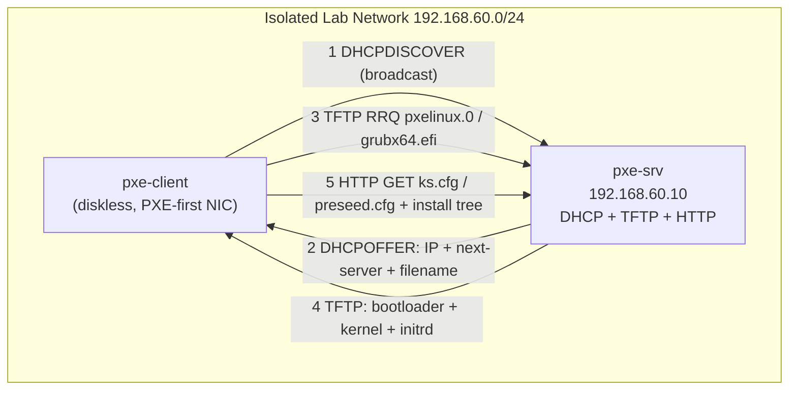

# Lab 15 — PXE Network Boot

## Objective

Build a PXE (Preboot eXecution Environment) network-boot server that hands a diskless client a DHCP lease, a boot loader over TFTP, and an unattended installer (kickstart on RHEL-family, preseed on Debian-family) over HTTP — so the client boots straight into a fully automated OS install with no local media. This exercises [Readme](../TFTP-and-PXE-Boot-Server/Readme.md) and reinforces the DHCP option scoping covered in [DHCP-Server](../Dynamic-Host-Configuration-Protocol-DHCP/DHCP-Server.md).

## Requirements

| Host | Role | OS | IP | vCPU / RAM | Notes |
|---|---|---|---|---|---|
| `pxe-srv` | DHCP + TFTP + HTTP (kickstart/preseed) server | RHEL9/Rocky9 **or** Debian 12 | `192.168.60.10/24` | 2 / 2 GB | Second NIC on isolated lab network |
| `pxe-client` | Diskless target — boots into installer | (none — installs fresh) | DHCP-assigned | 1 / 2 GB, **no ISO attached** | Firmware set to Network boot first |
| `router` (optional) | Only if `pxe-srv` is not also the DHCP authority for a shared segment | — | `192.168.60.1/24` | — | Skip if `pxe-srv` runs DHCP itself |

> [!IMPORTANT]
> Only **one** DHCP server may answer on a given broadcast domain. If this lab network already has a DHCP server (e.g. your hypervisor's NAT/host-only network), either disable it or run this lab on an isolated "internal network" / host-only vswitch so you don't clobber other machines with rogue leases.

## Topology



## Setup

### 0. Assume the RHEL-family path unless noted; Debian-family commands are called out separately.

### 1. Install packages on `pxe-srv`

```bash
# RHEL / Rocky / AlmaLinux
sudo dnf install -y dhcp-server tftp-server syslinux-tftpboot httpd

# Debian / Ubuntu
sudo apt update
sudo apt install -y isc-dhcp-server tftpd-hpa pxelinux syslinux-common apache2
```

### 2. Configure DHCP with PXE options

```conf
# /etc/dhcp/dhcpd.conf  (RHEL: dhcp-server pkg)  |  /etc/dhcp/dhcpd.conf (Debian: isc-dhcp-server)
authoritative;
default-lease-time 600;
max-lease-time 7200;

subnet 192.168.60.0 netmask 255.255.255.0 {
    range 192.168.60.100 192.168.60.150;
    option routers 192.168.60.1;
    option domain-name-servers 8.8.8.8;
    next-server 192.168.60.10;      # TFTP server (this box)
    if exists user-class and option user-class = "iPXE" {
        filename "http://192.168.60.10/boot.ipxe";
    } else {
        filename "pxelinux.0";      # BIOS clients
        # filename "grubx64.efi";   # uncomment for UEFI-only clients
    }
}
```

```bash
# RHEL: bind DHCP to the lab NIC
sudo sed -i 's/^DHCPDARGS=.*/DHCPDARGS=ens224/' /etc/sysconfig/dhcpd
sudo systemctl enable --now dhcpd

# Debian: bind DHCP to the lab NIC
sudo sed -i 's/^INTERFACESv4=.*/INTERFACESv4="ens224"/' /etc/default/isc-dhcp-server
sudo systemctl enable --now isc-dhcp-server
```

### 3. Configure TFTP and stage the boot loader

```bash
# RHEL: syslinux-tftpboot pre-populates /var/lib/tftpboot with pxelinux.0, menu.c32, etc.
sudo systemctl enable --now tftp.socket
sudo mkdir -p /var/lib/tftpboot/pxelinux.cfg

# Debian: tftpd-hpa serves /srv/tftp by default
sudo sed -i 's#TFTP_DIRECTORY=.*#TFTP_DIRECTORY="/srv/tftp"#' /etc/default/tftpd-hpa
sudo mkdir -p /srv/tftp/pxelinux.cfg
sudo cp /usr/lib/PXELINUX/pxelinux.0 /srv/tftp/
sudo cp /usr/lib/syslinux/modules/bios/{ldlinux,libutil,vesamenu}.c32 /srv/tftp/
sudo systemctl enable --now tftpd-hpa
```

Mount the distro ISO and copy the kernel/initrd into the TFTP root (paths shown for RHEL; adjust `TFTP_ROOT` for Debian):

```bash
TFTP_ROOT=/var/lib/tftpboot        # Debian: /srv/tftp
sudo mkdir -p /mnt/iso /var/www/html/install
sudo mount -o loop rhel9.iso /mnt/iso     # or debian-12-netinst.iso
sudo cp /mnt/iso/images/pxeboot/vmlinuz "$TFTP_ROOT/"
sudo cp /mnt/iso/images/pxeboot/initrd.img "$TFTP_ROOT/"
sudo rsync -a /mnt/iso/ /var/www/html/install/     # full tree served over HTTP
```

### 4. Write the PXE boot menu

```conf
# /var/lib/tftpboot/pxelinux.cfg/default  (or /srv/tftp/pxelinux.cfg/default)
DEFAULT rhel9-ks
LABEL rhel9-ks
    KERNEL vmlinuz
    APPEND initrd=initrd.img inst.repo=http://192.168.60.10/install \
           inst.ks=http://192.168.60.10/ks.cfg ip=dhcp
PROMPT 0
TIMEOUT 50
```

### 5. Publish the unattended-install answer file over HTTP

```bash
sudo systemctl enable --now httpd      # Debian: sudo systemctl enable --now apache2
```

RHEL-family — minimal kickstart at `/var/www/html/ks.cfg`:

```conf
lang en_US.UTF-8
keyboard us
timezone UTC --utc
rootpw --plaintext ChangeMe123!
network --bootproto=dhcp --activate
bootloader --location=mbr
zerombr
clearpart --all --initlabel
autopart
reboot
%packages
@core
%end
```

Debian-family — minimal preseed at `/var/www/html/preseed.cfg` (and swap the PXE menu `APPEND` line to `auto url=http://192.168.60.10/preseed.cfg`):

```conf
d-i debian-installer/locale string en_US
d-i netcfg/choose_interface select auto
d-i partman-auto/method string regular
d-i partman-auto/choose_recipe select atomic
d-i partman/confirm_write_new_label boolean true
d-i partman/confirm boolean true
d-i passwd/root-password password ChangeMe123!
d-i passwd/root-password-again password ChangeMe123!
d-i grub-installer/only_debian boolean true
d-i finish-install/reboot_in_progress note
```

> [!WARNING]
> `rootpw --plaintext` / plaintext preseed passwords are for **lab use only**. For anything touching a real network, use `rootpw --iscrypted` with a SHA-512 hash (`openssl passwd -6`) or drop root login entirely in favor of a provisioned SSH key.

### 6. Open the firewall on `pxe-srv`

```bash
# RHEL (firewalld)
sudo firewall-cmd --permanent --add-service=dhcp --add-service=tftp --add-service=http
sudo firewall-cmd --reload

# Debian (ufw)
sudo ufw allow 67/udp    # DHCP
sudo ufw allow 69/udp    # TFTP
sudo ufw allow 80/tcp    # HTTP
```

### 7. Boot the client

Power on `pxe-client` with its NIC boot order set to **Network/PXE first** and no ISO attached. It should broadcast a DHCPDISCOVER, receive an offer, pull `pxelinux.0`, then the kernel/initrd, then the kickstart/preseed, and drop into the unattended installer automatically.

> [!NOTE]
> **📸 Screenshot**
> _Capture: the client's console at the PXE boot menu (`rhel9-ks` label highlighted) immediately before it loads the kernel._

## Validation

1. Confirm the DHCP lease was issued with the PXE options:

```bash
sudo journalctl -u dhcpd -n 20 --no-pager   # Debian: -u isc-dhcp-server
```

```text
DHCPDISCOVER from 08:00:27:aa:bb:cc via ens224
DHCPOFFER on 192.168.60.101 to 08:00:27:aa:bb:cc via ens224
DHCPACK on 192.168.60.101 to 08:00:27:aa:bb:cc via ens224
```

2. Confirm the TFTP transfer happened (bootloader + kernel + initrd):

```bash
sudo journalctl -u tftp -n 20 --no-pager    # or grep tftpd /var/log/syslog on Debian
```

```text
Client 192.168.60.101 finished pxelinux.0
Client 192.168.60.101 finished vmlinuz
Client 192.168.60.101 finished initrd.img
```

3. Confirm the answer file (kickstart/preseed) was fetched over HTTP:

```bash
sudo tail -f /var/log/httpd/access_log      # Debian: /var/log/apache2/access.log
```

```text
192.168.60.101 - - [22/Jul/2026:10:14:02 +0000] "GET /ks.cfg HTTP/1.1" 200 512
192.168.60.101 - - [22/Jul/2026:10:14:03 +0000] "GET /install/repodata/repomd.xml HTTP/1.1" 200 4521
```

4. Watch the client console: it should progress past the boot menu into `anaconda` (RHEL) or `debian-installer` text/graphical UI without any manual input, then reboot into a running OS at the end.

5. Once installed, SSH or console-login to the client and confirm it's the freshly built system:

```bash
hostnamectl
```

```text
Static hostname: localhost.localdomain
   Icon name: computer-vm
     Chassis: vm
  Machine ID: ...
```

## Cleanup

```bash
# Stop and disable the PXE stack on pxe-srv
sudo systemctl disable --now dhcpd tftp.socket httpd            # RHEL
sudo systemctl disable --now isc-dhcp-server tftpd-hpa apache2  # Debian

# Unmount install media and remove staged files
sudo umount /mnt/iso
sudo rm -rf /var/www/html/install /var/www/html/ks.cfg /var/www/html/preseed.cfg
sudo rm -f /var/lib/tftpboot/{vmlinuz,initrd.img} /var/lib/tftpboot/pxelinux.cfg/default   # RHEL
sudo rm -f /srv/tftp/{vmlinuz,initrd.img} /srv/tftp/pxelinux.cfg/default                    # Debian

# Revert firewall rules opened in Setup step 6, and delete/reset pxe-client's disk for reuse
```

## Troubleshooting

| Symptom | Likely cause | Fix |
|---|---|---|
| Client gets no DHCP offer | Rogue/competing DHCP server on the segment, or `dhcpd` bound to the wrong NIC | Isolate the lab network; verify `DHCPDARGS`/`INTERFACESv4` points at the correct interface |
| Offer received but TFTP times out | `tftp.socket`/`tftpd-hpa` not running, or firewall blocking UDP/69 | `systemctl status tftp.socket`; re-check firewall rule from Setup step 6 |
| `PXE-E32: TFTP open timeout` | Wrong `filename` in `dhcpd.conf` or bootloader not present in TFTP root | Confirm `filename "pxelinux.0"` matches an actual file under `/var/lib/tftpboot` (or `/srv/tftp`) |
| Kernel loads, then install fails to fetch packages | `inst.repo=`/`url=` unreachable, HTTP service down, or ISO not fully rsynced | Curl the URL manually from another host: `curl -I http://192.168.60.10/install/` |
| BIOS client boots fine, UEFI client hangs at boot menu | UEFI needs `grubx64.efi`/`bootx64.efi`, not `pxelinux.0` | Add a conditional `filename` block keyed on `option arch` (`00:07` = UEFI x64) in `dhcpd.conf` |
| Kickstart/preseed runs but install loops back to menu | Syntax error in `ks.cfg`/`preseed.cfg` silently aborts | Drop `inst.ks=... console=ttyS0` (RHEL) to see the anaconda traceback, or check `/var/log/syslog` on the installer shell (Alt+F2/F4) |

## References

- [Readme](../TFTP-and-PXE-Boot-Server/Readme.md)
- [DHCP-Server](../Dynamic-Host-Configuration-Protocol-DHCP/DHCP-Server.md)
- Red Hat: *Kickstart Installation Guide* — `man pxelinux.0`, `man dhcpd.conf`
- Debian Installer Manual — Appendix on Preseeding (`man debian-installer`)

## Related Notes

- [Readme](../TFTP-and-PXE-Boot-Server/Readme.md)
- [DHCP-Server](../Dynamic-Host-Configuration-Protocol-DHCP/DHCP-Server.md)
- [Reserve-IP-Address](../Dynamic-Host-Configuration-Protocol-DHCP/Reserve-IP-Address.md)
- [Linux Administration & Server Hardening](../Readme.md) — course hub and map of content
