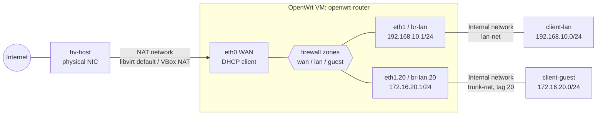

# Lab 16 — OpenWrt Router & VLANs

## Objective

Build a virtualized OpenWrt router from a downloaded image, wire it into a hypervisor with a WAN (NAT) leg and a LAN leg, then segment the LAN with an 802.1Q VLAN so a "guest" network can reach the internet but is firewall-isolated from the trusted LAN. The learner will practice UCI-driven network and firewall configuration end to end — the same model used against real hardware in [Readme](../Router-and-Firewall-OS-OpenWrt/Readme.md) — and validate isolation with concrete `ping`/`nc` tests from two client VMs.

## Requirements

| Host | Role | vCPU / RAM | Interfaces | IP(s) |
| --- | --- | --- | --- | --- |
| `hv-host` | Hypervisor (Debian 12 **or** AlmaLinux 9) | 4 vCPU / 8 GB | Physical NIC (internet) | DHCP from LAN |
| `openwrt-router` | OpenWrt VM, x86_64, 23.05.x | 1 vCPU / 256 MB, 128 MB disk | `eth0`=WAN, `eth1`=LAN trunk | WAN: NAT-assigned; LAN: `192.168.10.1/24`; VLAN20: `172.16.20.1/24` |
| `client-lan` | Debian 12 test client (trusted LAN) | 1 vCPU / 512 MB | 1 NIC on LAN segment | `192.168.10.0/24` via DHCP |
| `client-guest` | Debian 12 test client (guest VLAN) | 1 vCPU / 512 MB | 1 NIC on VLAN 20 segment | `172.16.20.0/24` via DHCP |

> [!IMPORTANT]
> **Disposable lab only**
> `openwrt-router` becomes the default gateway for two virtual networks. Run this entirely inside an isolated hypervisor (internal/host-only networks) — never bridge `eth1`/VLAN20 onto a production LAN.

## Topology



## Setup

### 1. Download and verify the OpenWrt VM image

```bash
mkdir -p ~/labs/lab16 && cd ~/labs/lab16
curl -LO https://downloads.openwrt.org/releases/23.05.4/targets/x86/64/openwrt-23.05.4-x86-64-generic-ext4-combined.img.gz
curl -LO https://downloads.openwrt.org/releases/23.05.4/targets/x86/64/sha256sums
sha256sum -c sha256sums --ignore-missing 2>/dev/null | grep OK
gunzip -k openwrt-23.05.4-x86-64-generic-ext4-combined.img.gz
```

> [!WARNING]
> **Always verify the checksum**
> A tampered router image is a full network compromise. Never boot an OpenWrt image whose `sha256sum` does not match the published `sha256sums` file.

### 2. Create the two isolated virtual networks

**RHEL-family host (AlmaLinux/Rocky/RHEL 9, `libvirt`/KVM):**

```bash
sudo dnf install -y qemu-kvm libvirt virt-install libvirt-client bridge-utils
sudo virsh net-define /dev/stdin <<'EOF'
<network>
  <name>lan-net</name>
  <bridge name='virbr-lan' stp='on' delay='0'/>
</network>
EOF
sudo virsh net-define /dev/stdin <<'EOF'
<network>
  <name>trunk-net</name>
  <bridge name='virbr-trunk' stp='on' delay='0'/>
</network>
EOF
sudo virsh net-start lan-net && sudo virsh net-autostart lan-net
sudo virsh net-start trunk-net && sudo virsh net-autostart trunk-net
```

**Debian-family host (Debian/Ubuntu, `libvirt`/KVM):**

```bash
sudo apt update && sudo apt install -y qemu-kvm libvirt-daemon-system virtinst bridge-utils
sudo virsh net-define /dev/stdin <<'EOF'
<network>
  <name>lan-net</name>
  <bridge name='virbr-lan' stp='on' delay='0'/>
</network>
EOF
sudo virsh net-define /dev/stdin <<'EOF'
<network>
  <name>trunk-net</name>
  <bridge name='virbr-trunk' stp='on' delay='0'/>
</network>
EOF
sudo virsh net-start lan-net && sudo virsh net-autostart lan-net
sudo virsh net-start trunk-net && sudo virsh net-autostart trunk-net
```

### 3. Boot the OpenWrt VM

```bash
qemu-img convert -f raw -O qcow2 openwrt-23.05.4-x86-64-generic-ext4-combined.img openwrt-router.qcow2
sudo virt-install \
  --name openwrt-router --memory 256 --vcpus 1 \
  --disk path=$(pwd)/openwrt-router.qcow2,format=qcow2,bus=virtio \
  --network network=default,model=virtio \
  --network network=lan-net,model=virtio \
  --import --os-variant generic --graphics none --console pty,target_type=serial
```

The serial console drops into the OpenWrt shell. Set a root password immediately — the default install ships with **no password on the console** and Dropbear SSH disabled until one is set:

```bash
passwd
```

### 4. Configure WAN and LAN with UCI

```bash
# WAN: DHCP client on eth0 (the libvirt 'default' NAT network)
uci set network.wan=interface
uci set network.wan.device='eth0'
uci set network.wan.proto='dhcp'

# LAN: static, matches the Requirements table
uci set network.lan.ipaddr='192.168.10.1'
uci set network.lan.netmask='255.255.255.0'
uci commit network
/etc/init.d/network restart
```

```bash
# DHCP pool for LAN clients
uci set dhcp.lan.start='100'
uci set dhcp.lan.limit='100'
uci set dhcp.lan.leasetime='12h'
uci commit dhcp
/etc/init.d/dnsmasq restart
```

### 5. Add VLAN 20 (guest network) on the LAN trunk

OpenWrt 23.05 uses the **DSA** model on most targets; on the `x86-64-generic-ext4-combined` image `eth1` is a plain NIC, so tag with an `8021q` device bound to `eth1`:

```bash
uci set network.vlan20=device
uci set network.vlan20.type='8021q'
uci set network.vlan20.ifname='eth1'
uci set network.vlan20.vid='20'
uci set network.vlan20.name='eth1.20'

uci set network.guest=interface
uci set network.guest.device='eth1.20'
uci set network.guest.proto='static'
uci set network.guest.ipaddr='172.16.20.1'
uci set network.guest.netmask='255.255.255.0'
uci commit network
/etc/init.d/network restart
```

```bash
# Give the guest interface its own DHCP scope
uci set dhcp.guest=dhcp
uci set dhcp.guest.interface='guest'
uci set dhcp.guest.start='100'
uci set dhcp.guest.limit='100'
uci set dhcp.guest.leasetime='12h'
uci commit dhcp
/etc/init.d/dnsmasq restart
```

### 6. Firewall: isolate guest from lan, allow guest → wan

```bash
uci set firewall.guest=zone
uci set firewall.guest.name='guest'
uci set firewall.guest.input='REJECT'
uci set firewall.guest.output='ACCEPT'
uci set firewall.guest.forward='REJECT'
uci add_list firewall.guest.network='guest'

# guest -> wan is allowed (internet access)...
uci set firewall.guest_wan=forwarding
uci set firewall.guest_wan.src='guest'
uci set firewall.guest_wan.dest='wan'

# ...but guest -> lan is NOT added, so the zone's default REJECT forward policy applies
uci commit firewall
/etc/init.d/firewall restart
```

> [!WARNING]
> **Isolation only works if the `guest → lan` forwarding rule is absent**
> Adding a `guest`→`lan` `config forwarding` section (even by accident, e.g. by copy-pasting the `guest_wan` block and forgetting to change `dest`) silently punches a hole between the two networks. Always re-check with `uci show firewall | grep forwarding` after edits.

## Validation

**1. Confirm zones and DHCP scopes are live on the router:**

```bash
uci show network | grep -E 'wan|lan|guest'
uci show dhcp | grep -E 'lan|guest'
```

```text
network.wan.proto='dhcp'
network.lan.ipaddr='192.168.10.1'
network.guest.ipaddr='172.16.20.1'
dhcp.lan.start='100'
dhcp.guest.start='100'
```

**2. WAN got an address (router has internet):**

```bash
ip -4 a show eth0
ping -c2 1.1.1.1
```

```text
inet 192.168.122.42/24 brd 192.168.122.255 scope global eth0
2 packets transmitted, 2 received, 0% packet loss
```

**3. Both clients pull a DHCP lease from the correct scope:**

```bash
# on client-lan
ip -4 a show eth0 | grep inet
# expect: 192.168.10.1xx/24

# on client-guest
ip -4 a show eth0 | grep inet
# expect: 172.16.20.1xx/24
```

**4. Guest reaches the internet through the router:**

```bash
# on client-guest
ping -c2 1.1.1.1
```

```text
2 packets transmitted, 2 received, 0% packet loss
```

**5. Guest CANNOT reach the trusted LAN client (the point of the lab):**

```bash
# on client-guest, replace with client-lan's actual lease
ping -c2 -W2 192.168.10.150
```

```text
2 packets transmitted, 0 received, 100% packet loss
```

**6. Firewall zone forwarding matches the design (no `guest`→`lan` entry):**

```bash
uci show firewall | grep forwarding
```

```text
firewall.guest_wan=forwarding
firewall.guest_wan.src='guest'
firewall.guest_wan.dest='wan'
firewall.lan_wan=forwarding
firewall.lan_wan.src='lan'
firewall.lan_wan.dest='wan'
```

> [!NOTE]
> **📸 Screenshot**
> _Capture: LuCI **Network → Firewall** page showing the three zones (`wan`, `lan`, `guest`) with the `guest` zone's Input/Output/Forward set to Reject/Accept/Reject and no `guest → lan` forwarding entry present._

## Cleanup

```bash
sudo virsh destroy openwrt-router
sudo virsh undefine openwrt-router --remove-all-storage
sudo virsh net-destroy trunk-net && sudo virsh net-undefine trunk-net
sudo virsh net-destroy lan-net && sudo virsh net-undefine lan-net
rm -f ~/labs/lab16/openwrt-router.qcow2 ~/labs/lab16/*.img*
```

## Troubleshooting

| Symptom | Likely cause | Fix |
| --- | --- | --- |
| No console prompt after `virt-install` | Serial console not attached, or image still booting (first boot resizes rootfs) | Wait ~30s; reconnect with `sudo virsh console openwrt-router` |
| `eth1.20` doesn't appear after `network restart` | `8021q` kernel module missing on this OpenWrt build | `opkg update && opkg install kmod-8021q`, then restart networking |
| `client-guest` gets no DHCP lease | VLAN tag mismatch — `trunk-net` bridge isn't passing tagged frames, or client NIC isn't on `trunk-net` | Confirm client VM's virtual NIC is attached to `trunk-net`; VLAN tagging happens on `eth1.20` inside the router, so the client itself must be untagged on the same bridge segment |
| `client-guest` CAN reach `client-lan` | A `guest`→`lan` forwarding rule exists (see the warning in Setup step 6) | `uci show firewall \| grep forwarding` and delete the offending `config forwarding` section, then `uci commit firewall && /etc/init.d/firewall restart` |
| Locked out of LuCI/SSH entirely | A firewall or network edit broke `lan` zone input/reachability | Recover via `virsh console openwrt-router` (serial always works) and re-edit `/etc/config/{network,firewall}` directly |

## References

- [OpenWrt: Install on x86_64](https://openwrt.org/docs/guide-user/installation/openwrt_x86)
- [OpenWrt: Firewall configuration (UCI)](https://openwrt.org/docs/guide-user/firewall/firewall_configuration)
- [OpenWrt: VLAN on generic hardware](https://openwrt.org/docs/guide-user/network/vlan/switch_configuration)
- [libvirt: Network XML format](https://libvirt.org/formatnetwork.html)

## Related Notes

- [Router and Firewall OS (OpenWrt)](../Router-and-Firewall-OS-OpenWrt/Readme.md) — module hub: flashing, firewall model, VLANs, VPN
- [Firewall Rules in OpenWrt](../Router-and-Firewall-OS-OpenWrt/Firewall-Rules-in-OpenWrt.md) — zone/forwarding model used in Setup step 6
- [OpenWrt Commands](../Router-and-Firewall-OS-OpenWrt/OpenWrt-Commands.md) — UCI/opkg/logread CLI reference
- [Linux Administration & Server Hardening](../Readme.md) — course hub and map of content
