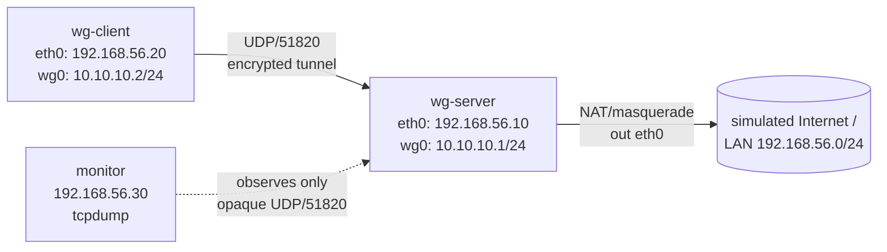

# Lab 17 — WireGuard VPN

## Objective

Stand up a point-to-point WireGuard tunnel between a Linux "server" (the gateway peer, publicly reachable) and a Linux "road-warrior" client, using pure kernel WireGuard (`wg`/`wg-quick`) — no OpenVPN, no external controller. You will generate keypairs, write both peer configs by hand, route the client's traffic through the tunnel (full-tunnel), open the correct firewall/UDP port, and verify the encrypted path with `wg show`, `ping`, and a packet capture that proves the outer traffic is opaque UDP while the inner traffic rides a private `10.x` overlay. This is the same peer/keys/`AllowedIPs` model used by [Router and Firewall OS (OpenWrt)](../Router-and-Firewall-OS-OpenWrt/Readme.md) when WireGuard is deployed on an OpenWrt edge router instead of a Linux host — the config primitives transfer directly.

## Requirements

| Host | Role | OS | IP (lab network) | Resources |
|---|---|---|---|---|
| `wg-server` | WireGuard gateway peer (public-facing) | Rocky Linux 9 **or** Debian 12/Ubuntu 22.04 | 192.168.56.10 (LAN) / `wg0` 10.10.10.1/24 | 1 vCPU, 512 MB RAM |
| `wg-client` | Road-warrior peer | Rocky Linux 9 **or** Debian 12/Ubuntu 22.04 | 192.168.56.20 (LAN) / `wg0` 10.10.10.2/24 | 1 vCPU, 512 MB RAM |
| `monitor` (optional) | Packet capture / attacker vantage point | Kali Linux or any client | 192.168.56.30 | 1 vCPU, 512 MB RAM |

All hosts on a single **host-only / internal** virtual network (192.168.56.0/24 stands in for "LAN/Internet" for this lab). WireGuard listens on UDP/51820 on `wg-server`. `wg-server` also acts as the client's default gateway once the tunnel is up (full-tunnel routing), so it needs IP forwarding and a NAT/masquerade rule out its LAN interface.

> [!WARNING]
> **Isolate the network**
> Use a host-only or internal virtual network, not bridged. You'll be flipping the client's default route through the tunnel — a mistake here on a real network segment can strand the VM.

## Topology



## Setup

This lab assumes **kernel WireGuard** (in-tree since Linux 5.6) plus the `wireguard-tools` userspace utilities (`wg`, `wg-quick`). Commands diverge only at the package-install step.

### 0. Install WireGuard tools (both `wg-server` and `wg-client`)

```bash
# RHEL family (Rocky/RHEL 9) — EPEL provides wireguard-tools; kernel module is in-tree
sudo dnf install -y epel-release
sudo dnf install -y wireguard-tools

# Debian family (Debian 12 / Ubuntu 22.04)
sudo apt update
sudo apt install -y wireguard wireguard-tools
```

```bash
# Confirm the kernel module is available on both
sudo modprobe wireguard
lsmod | grep wireguard
```

### 1. Generate keypairs (both hosts, run locally — never transmit private keys)

```bash
sudo mkdir -p /etc/wireguard
sudo chmod 700 /etc/wireguard
umask 077
wg genkey | sudo tee /etc/wireguard/privatekey | wg pubkey | sudo tee /etc/wireguard/publickey
sudo cat /etc/wireguard/publickey   # note this down — you'll paste it into the PEER's config
```

> [!IMPORTANT]
> **Private keys never leave the host**
> Only the **public** key (`/etc/wireguard/publickey`) is exchanged between peers. `wg genkey` output and `privatekey` files must be `chmod 600`/owned by root — anyone with a peer's private key can impersonate it on the tunnel.

### 2. Server config — `/etc/wireguard/wg0.conf` on `wg-server`

```ini
[Interface]
Address = 10.10.10.1/24
ListenPort = 51820
PrivateKey = <SERVER_PRIVATE_KEY>
# Full-tunnel: NAT client traffic out the LAN interface (adjust eth0 to your NIC)
PostUp = sysctl -w net.ipv4.ip_forward=1; iptables -t nat -A POSTROUTING -o eth0 -j MASQUERADE
PostDown = iptables -t nat -D POSTROUTING -o eth0 -j MASQUERADE

[Peer]
# wg-client
PublicKey = <CLIENT_PUBLIC_KEY>
AllowedIPs = 10.10.10.2/32
```

### 3. Client config — `/etc/wireguard/wg0.conf` on `wg-client`

```ini
[Interface]
Address = 10.10.10.2/24
PrivateKey = <CLIENT_PRIVATE_KEY>

[Peer]
# wg-server
PublicKey = <SERVER_PUBLIC_KEY>
Endpoint = 192.168.56.10:51820
AllowedIPs = 0.0.0.0/0
PersistentKeepalive = 25
```

> [!IMPORTANT]
> **`AllowedIPs` does double duty**
> On the server, `AllowedIPs = 10.10.10.2/32` is a routing/ACL statement — only packets from that peer with that source IP are accepted, and it's the only destination the server will route to that peer. On the client, `AllowedIPs = 0.0.0.0/0` means "send *all* traffic through the tunnel" (full-tunnel). Use `10.10.10.0/24` instead of `0.0.0.0/0` for a split-tunnel that only routes the overlay subnet.

Lock down the config files (they contain private keys):

```bash
sudo chmod 600 /etc/wireguard/wg0.conf
```

### 4. Open the firewall for UDP/51820 (`wg-server` only)

```bash
# RHEL family
sudo firewall-cmd --permanent --add-port=51820/udp
sudo firewall-cmd --permanent --add-masquerade
sudo firewall-cmd --reload

# Debian family (ufw)
sudo ufw allow 51820/udp comment 'WireGuard'
sudo ufw route allow in on wg0 out on eth0
```

> [!WARNING]
> **NAT rule vs firewall rule are two different things**
> The `PostUp`/`PostDown` MASQUERADE lines in `wg0.conf` handle NAT for outbound client traffic; `firewall-cmd`/`ufw` above handle the inbound UDP/51820 handshake port. Forgetting either leaves you with "handshake succeeds but no traffic flows" or "handshake never happens" respectively — see Troubleshooting.

### 5. Bring the tunnel up (both hosts)

```bash
sudo systemctl enable --now wg-quick@wg0
sudo systemctl status wg-quick@wg0 --no-pager
```

> [!NOTE]
> **📸 Screenshot**
> _Capture: `wg show` output on `wg-server` showing the client peer with a recent handshake timestamp and nonzero transfer counters, alongside a successful `ping 10.10.10.1` from `wg-client`._

## Validation

1. **Interface is up with the correct overlay address.**

   ```bash
   ip addr show wg0
   ```

   ```text
   4: wg0: <POINTOPOINT,NOARP,UP,LOWER_UP> mtu 1420 qdisc noqueue state UNKNOWN group default qlen 1000
       inet 10.10.10.1/24 scope global wg0
   ```

2. **Handshake completed and traffic is flowing (`wg-server`).**

   ```bash
   sudo wg show
   ```

   ```text
   interface: wg0
     public key: 8x9zQ2...w= (redacted)
     private key: (hidden)
     listening port: 51820

   peer: cK4mT1...a= (redacted)
     endpoint: 192.168.56.20:53421
     allowed ips: 10.10.10.2/32
     latest handshake: 8 seconds ago
     transfer: 1.44 KiB received, 1.72 KiB sent
   ```

3. **Overlay connectivity works end to end.**

   ```bash
   # From wg-client
   ping -c 3 10.10.10.1
   ```

   ```text
   3 packets transmitted, 3 received, 0% packet loss
   ```

4. **Full-tunnel routing: client's default route now points through `wg0`.**

   ```bash
   # From wg-client
   ip route get 8.8.8.8
   ```

   ```text
   8.8.8.8 via 10.10.10.1 dev wg0 src 10.10.10.2
   ```

5. **NAT/masquerade actually egresses (client reaches something beyond the server).**

   ```bash
   # From wg-client, curl something reachable on wg-server's LAN
   curl -s -o /dev/null -w "%{http_code}\n" http://192.168.56.10/
   ```

6. **Outer traffic is opaque — confirm encryption from `monitor`.**

   ```bash
   sudo tcpdump -i eth0 -n udp port 51820 -c 5
   ```

   ```text
   IP 192.168.56.20.53421 > 192.168.56.10.51820: UDP, length 148
   IP 192.168.56.10.51820 > 192.168.56.20.53421: UDP, length 92
   ```

   No plaintext ICMP/HTTP payload is visible — only opaque UDP datagrams, confirming the tunnel is actually encrypting, not just tagging traffic.

## Cleanup

```bash
# Both hosts
sudo systemctl disable --now wg-quick@wg0
sudo rm -f /etc/wireguard/wg0.conf /etc/wireguard/privatekey /etc/wireguard/publickey

# wg-server — remove firewall exceptions
sudo firewall-cmd --permanent --remove-port=51820/udp
sudo firewall-cmd --permanent --remove-masquerade
sudo firewall-cmd --reload
# or, Debian family:
sudo ufw delete allow 51820/udp
```

## Troubleshooting

| Symptom | Likely cause | Fix |
|---|---|---|
| `wg show` never shows a handshake | UDP/51820 blocked at the firewall, or wrong `Endpoint` IP/port on the client | Verify with `sudo tcpdump -i eth0 udp port 51820` on `wg-server`; confirm `firewall-cmd`/`ufw` rule is applied |
| Handshake succeeds but `ping 10.10.10.1` fails | `AllowedIPs` on the server doesn't include the client's overlay IP, or `Address =` mismatch in configs | Double-check `AllowedIPs = 10.10.10.2/32` on server matches the client's `Address =` exactly |
| Client pings server's `wg0` IP but not the outside world | `net.ipv4.ip_forward` not enabled, or MASQUERADE rule missing/wrong interface | `sudo sysctl net.ipv4.ip_forward` should be `1`; re-check `PostUp` NIC name matches `ip route` default interface |
| `wg-quick up wg0` fails: "Address already in use" | Stale `wg0` interface from a previous manual `ip link add` | `sudo wg-quick down wg0` then `sudo ip link delete wg0` (if it still exists), retry |
| Client loses all connectivity after tunnel comes up | `AllowedIPs = 0.0.0.0/0` full-tunnel but server has no working NAT/forwarding | Confirm Validation step 5 works; temporarily narrow `AllowedIPs` to `10.10.10.0/24` to isolate whether it's routing vs NAT |
| Config file readable by non-root users | Forgot `chmod 600` on `wg0.conf` (contains `PrivateKey`) | `sudo chmod 600 /etc/wireguard/wg0.conf` |

## References

- WireGuard official site — [wireguard.com](https://www.wireguard.com/)
- `wg(8)`, `wg-quick(8)` man pages
- Red Hat — [Configuring a VPN with WireGuard](https://access.redhat.com/documentation/en-us/red_hat_enterprise_linux/9/html/configuring_and_managing_networking/configuring-a-vpn-with-wireguard_configuring-and-managing-networking)
- Debian Wiki — [WireGuard](https://wiki.debian.org/WireGuard)
- CIS-style hardening note: treat `/etc/wireguard/*.conf` as secrets material (600, root-owned)

## Related Notes

- [OpenVPN on OpenWrt](../Router-and-Firewall-OS-OpenWrt/OpenVPN-on-OpenWrt.md) — comparable tunnel setup on an OpenWrt router
- [Router and Firewall OS (OpenWrt)](../Router-and-Firewall-OS-OpenWrt/Readme.md) — module hub covering router/firewall VPN deployments
- [Firewalld](../Security-Firewall-and-Monitoring/Firewalld.md) — firewall backend used to open UDP/51820 on RHEL family
- [Linux Administration & Server Hardening](../Readme.md) — course hub and map of content
