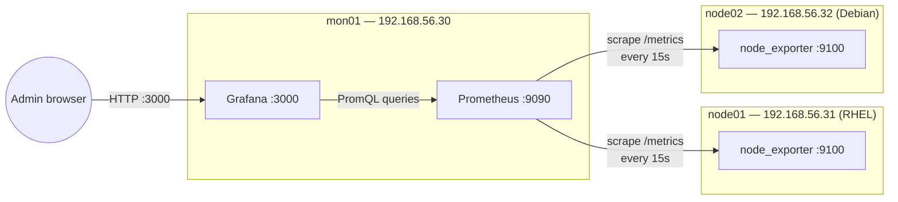

# Lab 18 — Monitoring with Prometheus + Grafana

## Objective

Stand up a minimal but production-shaped metrics pipeline: `node_exporter` on each monitored host exposing host-level metrics, a central Prometheus server that scrapes them on a schedule and stores the time-series, and Grafana on top for dashboards and visual alerting thresholds. The learner will configure a scrape target, verify metric ingestion via PromQL, and build a first dashboard panel from real CPU/memory/disk data. This lab operationalizes [Readme](../Monitoring/Readme.md) and complements the logging/auditing labs in [Readme](../Readme.md).

## Requirements

| Host | Role | OS | IP | Resources |
|---|---|---|---|---|
| `mon01` | Prometheus server + Grafana | RHEL 9 / Rocky 9 (or Debian 12) | `192.168.56.30` | 2 vCPU, 2 GB RAM, 15 GB disk |
| `node01` | Monitored target — `node_exporter` | RHEL 9 / Rocky 9 | `192.168.56.31` | 1 vCPU, 1 GB RAM |
| `node02` | Monitored target — `node_exporter` | Debian 12 / Ubuntu 22.04 | `192.168.56.32` | 1 vCPU, 1 GB RAM |

This lab assumes **RHEL-family (`dnf`, firewalld)** as the primary path, with **Debian-family (`apt`, ufw)** commands called out wherever they diverge. Prometheus and Grafana are installed from upstream release tarballs / repos rather than distro packages, so the binary steps are identical across both families — only firewall and systemd user/group creation differ.

> [!IMPORTANT]
> **No native OS packages**
> Prometheus and Grafana are **not** shipped as current-version packages in RHEL/Debian base repos. This lab installs Prometheus from the official binary tarball and Grafana from its official `.rpm`/`.deb` repo — pin versions deliberately rather than trusting whatever a distro repo happens to carry.

## Topology



## Setup

### 1. Install `node_exporter` on each target (`node01`, `node02`)

```bash
sudo useradd --no-create-home --shell /usr/sbin/nologin node_exporter

curl -LO https://github.com/prometheus/node_exporter/releases/download/v1.8.2/node_exporter-1.8.2.linux-amd64.tar.gz
tar xzf node_exporter-1.8.2.linux-amd64.tar.gz
sudo cp node_exporter-1.8.2.linux-amd64/node_exporter /usr/local/bin/
sudo chown node_exporter:node_exporter /usr/local/bin/node_exporter
```

Create the systemd unit (identical on both families):

```ini
# /etc/systemd/system/node_exporter.service
[Unit]
Description=Prometheus Node Exporter
After=network.target

[Service]
User=node_exporter
Group=node_exporter
Type=simple
ExecStart=/usr/local/bin/node_exporter

[Install]
WantedBy=multi-user.target
```

```bash
sudo systemctl daemon-reload
sudo systemctl enable --now node_exporter
systemctl status node_exporter --no-pager
```

Open the firewall for the scrape port, restricted to the Prometheus host only:

```bash
# RHEL family (firewalld)
sudo firewall-cmd --permanent --add-rich-rule='rule family="ipv4" source address="192.168.56.30/32" port port="9100" protocol="tcp" accept'
sudo firewall-cmd --reload

# Debian family (ufw)
sudo ufw allow from 192.168.56.30 to any port 9100 proto tcp
```

> [!WARNING]
> **Never expose `:9100` broadly**
> `node_exporter` has no built-in authentication. Anyone who can reach port 9100 gets detailed host telemetry (CPU load, mount points, network interfaces). Scope the firewall rule to the Prometheus server's IP only — never `0.0.0.0`/any.

### 2. Install Prometheus on `mon01`

```bash
sudo useradd --no-create-home --shell /usr/sbin/nologin prometheus
sudo mkdir -p /etc/prometheus /var/lib/prometheus

curl -LO https://github.com/prometheus/prometheus/releases/download/v2.54.1/prometheus-2.54.1.linux-amd64.tar.gz
tar xzf prometheus-2.54.1.linux-amd64.tar.gz
cd prometheus-2.54.1.linux-amd64

sudo cp prometheus promtool /usr/local/bin/
sudo cp -r consoles console_libraries /etc/prometheus/
sudo chown -R prometheus:prometheus /etc/prometheus /var/lib/prometheus /usr/local/bin/prometheus /usr/local/bin/promtool
```

### 3. Define the scrape config

```yaml
# /etc/prometheus/prometheus.yml
global:
  scrape_interval: 15s
  evaluation_interval: 15s

scrape_configs:
  - job_name: "prometheus"
    static_configs:
      - targets: ["localhost:9090"]

  - job_name: "node_exporter"
    static_configs:
      - targets:
          - "192.168.56.31:9100"
          - "192.168.56.32:9100"
        labels:
          env: "lab"
```

```bash
sudo chown prometheus:prometheus /etc/prometheus/prometheus.yml
/usr/local/bin/promtool check config /etc/prometheus/prometheus.yml
```

Create the systemd unit:

```ini
# /etc/systemd/system/prometheus.service
[Unit]
Description=Prometheus Server
After=network.target

[Service]
User=prometheus
Group=prometheus
Type=simple
ExecStart=/usr/local/bin/prometheus \
  --config.file=/etc/prometheus/prometheus.yml \
  --storage.tsdb.path=/var/lib/prometheus \
  --web.listen-address=0.0.0.0:9090

[Install]
WantedBy=multi-user.target
```

```bash
sudo systemctl daemon-reload
sudo systemctl enable --now prometheus
systemctl status prometheus --no-pager
```

Open the firewall (Prometheus UI/API on `:9090`, restrict to the admin/management subnet):

```bash
# RHEL family (firewalld)
sudo firewall-cmd --permanent --add-rich-rule='rule family="ipv4" source address="192.168.56.0/24" port port="9090" protocol="tcp" accept'
sudo firewall-cmd --reload

# Debian family (ufw)
sudo ufw allow from 192.168.56.0/24 to any port 9090 proto tcp
```

### 4. Install Grafana on `mon01`

```bash
# RHEL family
sudo tee /etc/yum.repos.d/grafana.repo <<'EOF'
[grafana]
name=grafana
baseurl=https://rpm.grafana.com
repo_gpgcheck=1
enabled=1
gpgcheck=1
gpgkey=https://rpm.grafana.com/gpg.key
EOF
sudo dnf install -y grafana

# Debian family
sudo apt install -y apt-transport-https software-properties-common wget
sudo mkdir -p /etc/apt/keyrings
wget -q -O - https://apt.grafana.com/gpg.key | sudo gpg --dearmor -o /etc/apt/keyrings/grafana.gpg
echo "deb [signed-by=/etc/apt/keyrings/grafana.gpg] https://apt.grafana.com stable main" | sudo tee /etc/apt/sources.list.d/grafana.list
sudo apt update && sudo apt install -y grafana
```

```bash
sudo systemctl enable --now grafana-server
systemctl status grafana-server --no-pager

# RHEL: firewall-cmd --permanent --add-port=3000/tcp && firewall-cmd --reload
# Debian: ufw allow 3000/tcp
```

> [!WARNING]
> **Change the default Grafana credentials immediately**
> Default login is `admin`/`admin` and Grafana forces a password change on first web login — do not skip it or leave the default in a lab you might reuse later.

### 5. Add Prometheus as a Grafana data source and build a panel

Log in at `http://192.168.56.30:3000` (default `admin`/`admin`, set new password when prompted). Then: **Connections → Data sources → Add data source → Prometheus**, set URL to `http://localhost:9090`, click **Save & test**.

Create a dashboard panel using this PromQL expression for per-host CPU usage:

```text
100 - (avg by (instance) (rate(node_cpu_seconds_total{mode="idle"}[5m])) * 100)
```

> [!NOTE]
> **📸 Screenshot**
> _Capture: Grafana dashboard panel showing the CPU-usage graph for both `node01` and `node02`, with the Prometheus data source "Save & test" success banner visible in an adjacent tab._

## Validation

**1. `node_exporter` responds on each target:**

```bash
curl -s http://192.168.56.31:9100/metrics | grep node_uname_info
```
```text
node_uname_info{domainname="(none)",machine="x86_64",nodename="node01",release="5.14.0-427.el9.x86_64",sysname="Linux"} 1
```

**2. Prometheus lists both targets as `UP`:**

```bash
curl -s http://192.168.56.30:9090/api/v1/targets | grep -o '"health":"[a-z]*"'
```
```text
"health":"up"
"health":"up"
"health":"up"
```

**3. A PromQL query against `node01` returns a live sample (via API):**

```bash
curl -s 'http://192.168.56.30:9090/api/v1/query?query=node_memory_MemAvailable_bytes{instance="192.168.56.31:9100"}'
```
```text
{"status":"success","data":{"resultType":"vector","result":[{"metric":{"__name__":"node_memory_MemAvailable_bytes","instance":"192.168.56.31:9100","job":"node_exporter","env":"lab"},"value":[1690000100,"812345344"]}]}}
```

**4. Grafana data source test passes:**

```text
Successfully queried the Prometheus API.
```

**5. Grafana dashboard panel renders non-flat CPU/memory series for both hosts** — confirm visually by generating load on `node01` (`stress-ng --cpu 1 --timeout 60s` or `yes > /dev/null &`) and watching the panel spike within one scrape interval (~15-30s).

## Cleanup

```bash
# On mon01
sudo systemctl disable --now grafana-server prometheus
sudo rm -rf /etc/prometheus /var/lib/prometheus /usr/local/bin/prometheus /usr/local/bin/promtool
sudo apt remove -y grafana || sudo dnf remove -y grafana   # pick per distro
sudo userdel prometheus

# On node01 / node02
sudo systemctl disable --now node_exporter
sudo rm -f /usr/local/bin/node_exporter /etc/systemd/system/node_exporter.service
sudo userdel node_exporter
sudo systemctl daemon-reload

# Firewall rollback (RHEL example)
sudo firewall-cmd --permanent --remove-rich-rule='rule family="ipv4" source address="192.168.56.30/32" port port="9100" protocol="tcp" accept'
sudo firewall-cmd --reload
```

## Troubleshooting

| Symptom | Likely Cause | Fix |
|---|---|---|
| Target shows `DOWN` in Prometheus `/targets` page | Firewall blocking `:9100`, or `node_exporter` not running | `systemctl status node_exporter` on target; confirm firewall rich-rule source IP matches `mon01`'s actual IP |
| Prometheus fails to start, log shows `parsing YAML file` error | Bad indentation or tab characters in `prometheus.yml` | `promtool check config /etc/prometheus/prometheus.yml` before every restart |
| Grafana "Save & test" fails with connection refused | Data source URL uses external IP but Grafana/Prometheus are co-located — use `localhost:9090`, or Prometheus not listening on `0.0.0.0` | Verify `--web.listen-address` flag; `curl localhost:9090` from `mon01` itself |
| Grafana panel is flat/empty despite `UP` targets | Wrong PromQL label filter (`instance` value must match `host:port` exactly, e.g. `192.168.56.31:9100`) | `curl` the Prometheus API directly (Validation step 3) to confirm the label set, then match it in the panel query |
| `node_exporter` binary won't execute — `Permission denied` | Downloaded tarball extracted without exec bit, or wrong owner | `chmod +x /usr/local/bin/node_exporter`; confirm `chown node_exporter:node_exporter` |
| Prometheus disk usage grows unbounded over a long-running lab | No retention flag set | Add `--storage.tsdb.retention.time=15d` to the systemd `ExecStart` and restart |

## References

- Prometheus Documentation — [Getting Started](https://prometheus.io/docs/prometheus/latest/getting_started/) and [Configuration](https://prometheus.io/docs/prometheus/latest/configuration/configuration/)
- `prometheus/node_exporter` GitHub releases — https://github.com/prometheus/node_exporter/releases
- Grafana Documentation — [Install Grafana on RPM/Debian](https://grafana.com/docs/grafana/latest/setup-grafana/installation/)
- `man systemd.service`

## Related Notes

- [Readme](../Monitoring/Readme.md) — monitoring module home
- [Lab 14 — Squid Proxy](Lab-14-Squid-Proxy.md) — pairs for full network visibility (egress control + telemetry)
- [Linux Administration & Server Hardening](../Readme.md) — course hub and map of content
