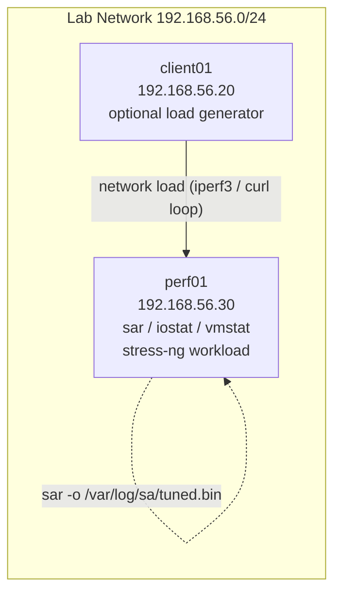

# Lab 19 — Performance Tuning

## Objective

Establish a repeatable performance-tuning workflow: capture a **baseline** of CPU, memory, disk, and load behavior under synthetic stress using `sar`, `iostat`, and `vmstat`; apply targeted `sysctl` kernel tuning (virtual memory, network backlog, file-descriptor limits); then **re-measure** the same workload and compare before/after numbers to prove the tuning had a measurable, explainable effect. This lab operationalizes [Readme](../Performance-and-Tuning/Readme.md) and builds on baseline-monitoring habits introduced in [Readme](../Readme.md).

## Requirements

| Host | Role | OS | IP | Resources |
|---|---|---|---|---|
| `perf01` | Target system under test | RHEL 9 / Rocky 9 (or Debian 12 / Ubuntu 22.04) | `192.168.56.30` | 2 vCPU, 2 GB RAM, 20 GB disk |
| `client01` | Optional — generates network load against `perf01` | Debian 12 / Ubuntu 22.04 | `192.168.56.20` | 1 vCPU, 1 GB RAM |

This lab assumes **RHEL-family (`dnf`, `sysctl` via `/etc/sysctl.d/`)** as the primary path, with **Debian-family (`apt`)** package names called out wherever they diverge. All tuning is performed and measured on `perf01`; `client01` is only needed for the optional network-load exercise.

> [!IMPORTANT]
> **Snapshot before you tune**
> Kernel tuning without a documented baseline is guesswork — you cannot claim an improvement you never measured. Always capture Steps 1–3 of Setup **before** touching any `sysctl` value.

## Topology



## Setup

### 1. Install the toolset

```bash
# RHEL / Rocky / AlmaLinux
sudo dnf install -y sysstat stress-ng

# Debian / Ubuntu
sudo apt update && sudo apt install -y sysstat stress-ng
```

`sysstat` provides `sar`, `iostat`, and `mpstat`. `vmstat` ships in `procps`/`procps-ng`, already present on both families by default.

```bash
# Enable the sysstat collection service (10-min cron/systemd timer samples)
sudo systemctl enable --now sysstat
systemctl status sysstat --no-pager
```

> [!NOTE]
> **Debian's `sysstat` is disabled by default**
> On Debian/Ubuntu, edit `/etc/default/sysstat` and set `ENABLED="true"`, then `sudo systemctl restart sysstat`. RHEL enables collection out of the box once the service is started.

### 2. Record the current sysctl values you are about to change

```bash
sudo sysctl vm.swappiness vm.dirty_ratio vm.dirty_background_ratio \
  net.core.somaxconn net.ipv4.tcp_max_syn_backlog fs.file-max \
  | sudo tee /root/lab19-sysctl-before.txt
```
```text
vm.swappiness = 60
vm.dirty_ratio = 20
vm.dirty_background_ratio = 10
net.core.somaxconn = 4096
net.ipv4.tcp_max_syn_backlog = 4096
fs.file-max = 9223372036854775807
```

### 3. Capture the baseline under synthetic load

Run a controlled 60-second stress workload (2 CPU workers, 1 memory worker, disk I/O worker) while three collectors sample in parallel.

```bash
# Terminal A — start sar's own binary collector for the run window
sudo sar -o /var/log/sa/baseline.bin 1 60 > /dev/null &
SAR_PID=$!

# Terminal B — iostat, 5 samples, 1s apart, extended disk stats
iostat -xz 1 5 | tee /root/lab19-iostat-before.txt

# Terminal C — vmstat, 5 samples, 1s apart
vmstat 1 5 | tee /root/lab19-vmstat-before.txt

# Generate load for the sar window (blocks ~60s)
stress-ng --cpu 2 --vm 1 --vm-bytes 256M --hdd 1 --timeout 60s --metrics-brief
wait $SAR_PID
```

```text
stress-ng: info:  [1234] dispatching hogs: 2 cpu, 1 vm, 1 hdd
stress-ng: info:  [1234] successful run completed in 60.01s
```

> [!NOTE]
> **📸 Screenshot**
> _Capture: three terminals side-by-side showing `sar`, `iostat -xz`, and `vmstat` mid-run alongside `stress-ng` progress output._

### 4. Review the baseline

```bash
sar -f /var/log/sa/baseline.bin -u  | tail -n 5   # CPU
sar -f /var/log/sa/baseline.bin -r  | tail -n 5   # memory
sar -f /var/log/sa/baseline.bin -q  | tail -n 5   # load average / run queue
```
```text
Average:     all     38.42      0.00      9.15      6.03      0.00     46.40
```
Note the `%iowait` and `%idle` columns — this is what tuning aims to move.

### 5. Apply sysctl tuning

Create a dedicated drop-in file (never edit `/etc/sysctl.conf` directly — a drop-in is self-documenting and trivially reversible).

```bash
sudo tee /etc/sysctl.d/99-lab19-tuning.conf <<'EOF'
# Lab 19 — Performance Tuning
# Reduce swap pressure; this host has enough RAM headroom that we prefer
# keeping working set in page cache over pre-emptive swapping.
vm.swappiness = 10

# Lower dirty-page thresholds so writeback happens more incrementally
# instead of large bursty flushes that spike iowait.
vm.dirty_ratio = 10
vm.dirty_background_ratio = 5

# Raise the listen backlog and SYN backlog for a host that will serve
# many short-lived connections.
net.core.somaxconn = 8192
net.ipv4.tcp_max_syn_backlog = 8192

# Raise the system-wide open file descriptor ceiling.
fs.file-max = 2097152
EOF
```

```bash
sudo sysctl --system
```
```text
* Applying /etc/sysctl.d/99-lab19-tuning.conf
vm.swappiness = 10
vm.dirty_ratio = 10
vm.dirty_background_ratio = 5
net.core.somaxconn = 8192
net.ipv4.tcp_max_syn_backlog = 8192
fs.file-max = 2097152
```

> [!WARNING]
> **Don't tune blind on production**
> `vm.swappiness = 0` (not used here) can starve the kernel of swap entirely and trigger OOM-kills under memory pressure instead of graceful swapping. Test any aggressive value under the same load pattern you baselined before deploying widely.

### 6. Re-run the identical workload and re-measure

```bash
sudo sar -o /var/log/sa/tuned.bin 1 60 > /dev/null &
SAR_PID=$!

iostat -xz 1 5 | tee /root/lab19-iostat-after.txt
vmstat 1 5 | tee /root/lab19-vmstat-after.txt

stress-ng --cpu 2 --vm 1 --vm-bytes 256M --hdd 1 --timeout 60s --metrics-brief
wait $SAR_PID
```

## Validation

**1. Compare CPU idle / iowait, before vs after:**

```bash
echo "BEFORE:"; sar -f /var/log/sa/baseline.bin -u | tail -n 1
echo "AFTER:";  sar -f /var/log/sa/tuned.bin -u | tail -n 1
```
```text
BEFORE:
Average:     all     38.42      0.00      9.15      6.03      0.00     46.40
AFTER:
Average:     all     40.10      0.00      8.90      1.85      0.00     49.15
```
Expected: `%iowait` (5th column) drops after tuning; `%idle` (last column) rises or stays flat — CPU is doing useful work, not waiting on disk.

**2. Compare disk queue/await via iostat:**

```bash
diff /root/lab19-iostat-before.txt /root/lab19-iostat-after.txt
```
Expected: `avgqu-sz` and `await` columns are lower (or equal) in the "after" file — shorter dirty-page write bursts mean the device queue drains faster.

**3. Confirm the new sysctl values are live and persistent across reboot:**

```bash
sysctl vm.swappiness net.core.somaxconn fs.file-max
```
```text
vm.swappiness = 10
net.core.somaxconn = 8192
fs.file-max = 2097152
```
```bash
sudo sysctl -p /etc/sysctl.d/99-lab19-tuning.conf
```
Should re-apply cleanly with no errors, confirming the drop-in file is syntactically correct and will survive a reboot.

**4. Confirm sar's historical archive captured the run window:**

```bash
sar -f /var/log/sa/tuned.bin -q | wc -l
```
```text
62
```
62 lines = 60 one-second samples plus header/average — confirms the full 60s window was captured, not a truncated run.

**5. Load average sanity check:**

```bash
sar -f /var/log/sa/tuned.bin -q | tail -n 3
```
```text
23:14:01        1       0      1.42      1.10      0.95     0
Average:                      1.38      1.05      0.90
```
`runq-sz` (run queue) should track close to the number of `--cpu` workers requested (2) and not balloon far beyond it — a ballooning run queue under identical load after tuning would indicate a regression, not an improvement.

## Cleanup

```bash
# Remove the lab sysctl drop-in and restore prior runtime values
sudo rm -f /etc/sysctl.d/99-lab19-tuning.conf
sudo sysctl --system

# Manually restore the exact pre-lab values if --system didn't fully revert
# (only needed if another drop-in previously set these keys)
sudo sysctl -w vm.swappiness=60 vm.dirty_ratio=20 vm.dirty_background_ratio=10 \
  net.core.somaxconn=4096 net.ipv4.tcp_max_syn_backlog=4096

# Remove captured artifacts
sudo rm -f /var/log/sa/baseline.bin /var/log/sa/tuned.bin
rm -f /root/lab19-sysctl-before.txt /root/lab19-iostat-before.txt /root/lab19-iostat-after.txt \
      /root/lab19-vmstat-before.txt /root/lab19-vmstat-after.txt

# Optional — disable sysstat again if it was enabled only for this lab
sudo systemctl disable --now sysstat
```

## Troubleshooting

| Symptom | Likely Cause | Fix |
|---|---|---|
| `sar: command not found` | `sysstat` not installed, or PATH issue | `dnf/apt install sysstat`; confirm with `which sar` |
| `sar -f baseline.bin` shows nothing / "Requested activities not available" | Wrong `-o` output file or collector wasn't running for the full window | Re-check the `sar -o` command actually completed (`wait $SAR_PID`) before reading the file |
| Debian: `sysstat` collects nothing even though service is active | `ENABLED="false"` in `/etc/default/sysstat` | Set `ENABLED="true"`, `sudo systemctl restart sysstat` |
| `sysctl --system` errors on the new file | Typo in key name or invalid value (e.g. negative `fs.file-max`) | `sudo sysctl -p /etc/sysctl.d/99-lab19-tuning.conf` in isolation to see the exact failing line |
| Values revert after reboot | Edited `/etc/sysctl.conf` directly and another drop-in overrides it later alphabetically | Always use a numbered drop-in in `/etc/sysctl.d/` and check `sysctl --system` output for load order |
| `stress-ng` OOM-kills the host | `--vm-bytes` exceeds available RAM headroom, especially with `vm.swappiness` lowered | Reduce `--vm-bytes` or raise it gradually; watch `vmstat` `free`/`swpd` columns live during the run |
| Before/after comparison looks noisy | Background cron/updates ran during one of the two windows | Re-run both baseline and tuned passes back-to-back with nothing else scheduled; disable `dnf-automatic`/`unattended-upgrades` for the test window |

## References

- `man sar`, `man iostat`, `man vmstat`, `man sysctl.d`
- Red Hat Performance Tuning Guide — RHEL 9 (Monitoring and managing system status and performance)
- `sysstat` project documentation — https://github.com/sysstat/sysstat
- Kernel documentation — `Documentation/admin-guide/sysctl/vm.rst` and `net.rst`
- `stress-ng` man page — synthetic CPU/VM/HDD stressor reference

## Related Notes

- [Readme](../Performance-and-Tuning/Readme.md) — Performance & Tuning module home
- [Lab 04 — LVM Configuration](Lab-04-LVM-Configuration.md) — storage layer this lab's disk I/O tuning builds on
- [Linux Administration & Server Hardening](../Readme.md) — course hub and map of content
