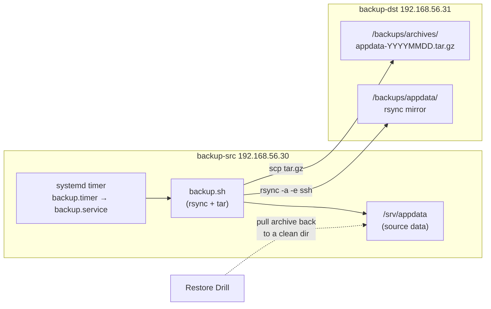

# Lab 20 — Backup and Restore

## Objective

Build a working backup strategy on a Linux server: incremental file-tree sync with `rsync`, compressed full archives with `tar`, both automated on a **systemd timer** (the modern replacement for cron jobs), and — the part most labs skip — a real **restore drill** that proves the backups are actually usable. This lab is the hands-on companion to [Readme](../Automation/Readme.md) and should be run after you're comfortable with basic systemd units and shell scripting.

> [!IMPORTANT]
> **Untested backups are not backups**
> A backup you have never restored from is a hope, not a plan. The Validation section below is not optional — it is the point of the lab.

## Requirements

| Host | Role | OS | IP | Resources |
|---|---|---|---|---|
| `backup-src` | Production server being backed up | RHEL/Rocky 9 or Debian 12 | `192.168.56.30/24` | 1 vCPU, 1 GB RAM, 10 GB disk |
| `backup-dst` | Backup target (simulates offsite/NAS) | Same family as `backup-src` | `192.168.56.31/24` | 1 vCPU, 1 GB RAM, 15 GB disk |

Both VMs need SSH access to each other. This lab assumes **Rocky/RHEL 9** command syntax and calls out **Debian/Ubuntu** package-name differences inline. A non-root sudo user (`labadmin`) is assumed on both hosts.

## Topology



## Setup

### 1. Create sample "production" data on `backup-src`

```bash
sudo mkdir -p /srv/appdata/{config,logs,db}
sudo bash -c 'echo "example.conf v1" > /srv/appdata/config/app.conf'
sudo bash -c 'date > /srv/appdata/logs/app.log'
sudo bash -c 'echo "fake-sqlite-dump" > /srv/appdata/db/app.db'
sudo chown -R labadmin:labadmin /srv/appdata
```

### 2. Set up passwordless SSH from `backup-src` to `backup-dst`

```bash
# on backup-src, as labadmin
ssh-keygen -t ed25519 -f ~/.ssh/id_ed25519 -N ""
ssh-copy-id labadmin@192.168.56.31
ssh labadmin@192.168.56.31 'echo connection ok'
```

> [!WARNING]
> **Dedicated backup key, restricted**
> Don't reuse an admin's personal SSH key for automated backups. Generate a dedicated key pair for the backup job and, on `backup-dst`, prefix the key in `authorized_keys` with `command="rsync --server ..."` restrictions if you want to lock it down further. A leaked backup key should not grant an interactive shell on other hosts.

### 3. Prepare the destination on `backup-dst`

```bash
sudo mkdir -p /backups/appdata /backups/archives
sudo chown labadmin:labadmin /backups/appdata /backups/archives
```

### 4. Write the backup script on `backup-src`

```bash
sudo mkdir -p /opt/backup
sudo tee /opt/backup/backup.sh > /dev/null <<'EOF'
#!/usr/bin/env bash
set -euo pipefail

SRC="/srv/appdata"
REMOTE_USER="labadmin"
REMOTE_HOST="192.168.56.31"
REMOTE_MIRROR="/backups/appdata"
REMOTE_ARCHIVE_DIR="/backups/archives"
DATE="$(date +%Y%m%d-%H%M%S)"
ARCHIVE_NAME="appdata-${DATE}.tar.gz"
LOG="/var/log/backup.log"

echo "[$(date -Iseconds)] Starting rsync mirror" >> "$LOG"
rsync -az --delete -e ssh "$SRC"/ "${REMOTE_USER}@${REMOTE_HOST}:${REMOTE_MIRROR}/" >> "$LOG" 2>&1

echo "[$(date -Iseconds)] Building tar archive" >> "$LOG"
tar -czf "/tmp/${ARCHIVE_NAME}" -C "$(dirname "$SRC")" "$(basename "$SRC")"
scp "/tmp/${ARCHIVE_NAME}" "${REMOTE_USER}@${REMOTE_HOST}:${REMOTE_ARCHIVE_DIR}/" >> "$LOG" 2>&1
rm -f "/tmp/${ARCHIVE_NAME}"

# retain only the 7 newest archives on the remote
ssh "${REMOTE_USER}@${REMOTE_HOST}" \
  "cd ${REMOTE_ARCHIVE_DIR} && ls -1t appdata-*.tar.gz | tail -n +8 | xargs -r rm -f"

echo "[$(date -Iseconds)] Backup complete: ${ARCHIVE_NAME}" >> "$LOG"
EOF
sudo chmod 750 /opt/backup/backup.sh
sudo chown labadmin:labadmin /opt/backup/backup.sh
sudo touch /var/log/backup.log
sudo chown labadmin:labadmin /var/log/backup.log
```

Run it once manually to confirm it works before wiring up the timer:

```bash
/opt/backup/backup.sh
cat /var/log/backup.log
```

### 5. Create the systemd service unit

```bash
sudo tee /etc/systemd/system/backup.service > /dev/null <<'EOF'
[Unit]
Description=Rsync + tar backup of /srv/appdata to backup-dst
Wants=network-online.target
After=network-online.target

[Service]
Type=oneshot
User=labadmin
ExecStart=/opt/backup/backup.sh
Nice=10
IOSchedulingClass=idle
EOF
```

### 6. Create the systemd timer unit

```bash
sudo tee /etc/systemd/system/backup.timer > /dev/null <<'EOF'
[Unit]
Description=Run backup.service nightly at 02:15 with jitter

[Timer]
OnCalendar=*-*-* 02:15:00
RandomizedDelaySec=600
Persistent=true

[Install]
WantedBy=timers.target
EOF
```

`Persistent=true` catches up a missed run (e.g. host was off at 02:15) on next boot — important for laptops/lab VMs that aren't always up.

### 7. Enable and start the timer

```bash
sudo systemctl daemon-reload
sudo systemctl enable --now backup.timer
```

> [!NOTE]
> **Debian/Ubuntu package differences**
> `rsync`, `tar`, and `systemd` ship in the base install on both families, so no extra packages are usually needed. If `rsync` is missing: RHEL/Rocky `sudo dnf install rsync openssh-clients`; Debian/Ubuntu `sudo apt install rsync openssh-client`.

## Validation

**1. Confirm the timer is scheduled and active:**

```bash
systemctl list-timers backup.timer
```

```text
NEXT                        LEFT     LAST                         PASSED  UNIT           ACTIVATES
Wed 2026-07-23 02:15:00 UTC 9h left  Tue 2026-07-22 02:15:00 UTC  8h ago  backup.timer   backup.service
```

**2. Trigger the service manually and check it succeeds:**

```bash
sudo systemctl start backup.service
systemctl status backup.service --no-pager
```

```text
● backup.service - Rsync + tar backup of /srv/appdata to backup-dst
     Loaded: loaded (/etc/systemd/system/backup.service; static)
     Active: inactive (dead) since ...; 2s ago
   Main PID: 4821 (code=exited, status=0/SUCCESS)
```

**3. Verify data landed on `backup-dst` (both the rsync mirror and the tar archive):**

```bash
# on backup-dst
ls -la /backups/appdata/
ls -la /backups/archives/
```

```text
/backups/appdata/:
config/  logs/  db/

/backups/archives/:
appdata-20260722-021500.tar.gz
```

**4. Restore drill — prove the archive is actually usable.** Simulate data loss, then restore from the tar archive:

```bash
# on backup-src: simulate disaster
sudo mv /srv/appdata /srv/appdata.lost

# pull the latest archive back from backup-dst
LATEST=$(ssh labadmin@192.168.56.31 'ls -1t /backups/archives/appdata-*.tar.gz | head -1')
scp "labadmin@192.168.56.31:${LATEST}" /tmp/restore.tar.gz

# restore into place
sudo mkdir -p /srv
sudo tar -xzf /tmp/restore.tar.gz -C /srv
sudo chown -R labadmin:labadmin /srv/appdata

# verify content matches
diff -r /srv/appdata /srv/appdata.lost && echo "RESTORE OK: files match"
```

```text
RESTORE OK: files match
```

**5. Alternate restore path via the rsync mirror** (useful for a single-file recovery instead of a full archive):

```bash
rsync -av labadmin@192.168.56.31:/backups/appdata/config/app.conf /tmp/restored-app.conf
diff /tmp/restored-app.conf /srv/appdata.lost/config/app.conf && echo "single-file restore OK"
```

> [!NOTE]
> **📸 Screenshot**
> _Capture: `systemctl list-timers backup.timer` output alongside the successful restore drill diff output, showing both the schedule and a proven restore in one frame._

## Cleanup

```bash
# backup-src
sudo systemctl disable --now backup.timer
sudo rm -f /etc/systemd/system/backup.service /etc/systemd/system/backup.timer
sudo systemctl daemon-reload
sudo rm -rf /opt/backup /srv/appdata.lost /tmp/restore.tar.gz /tmp/restored-app.conf

# backup-dst
ssh labadmin@192.168.56.31 'rm -rf /backups/appdata/* /backups/archives/*'
```

## Troubleshooting

| Symptom | Likely Cause | Fix |
|---|---|---|
| `backup.service` fails with `Permission denied (publickey)` | SSH key not deployed, or wrong user in `ExecStart` | Re-run `ssh-copy-id`; test `ssh labadmin@192.168.56.31` manually as the `labadmin` user, not root |
| Timer shows in `list-timers` but never fires | `backup.timer` not enabled, only started | `sudo systemctl enable backup.timer` (enable persists across reboot; `start` alone does not) |
| `rsync: command not found` on minimal install | Package not present | RHEL: `sudo dnf install rsync`; Debian: `sudo apt install rsync` |
| Archive on `backup-dst` is 0 bytes or missing | `/tmp` too small, or `scp` step silently failed before `set -e` caught it | Check `/var/log/backup.log`; confirm `set -euo pipefail` is present at the top of the script so failures abort instead of continuing |
| `systemctl status backup.service` shows old run only | Service is `Type=oneshot`, always shows `inactive (dead)` after success — this is normal, not a failure | Check `Main PID: ... (code=exited, status=0/SUCCESS)`; use `journalctl -u backup.service` for full history |
| Restore diff shows mismatches | Backup ran mid-write, or `--delete` on rsync removed files added after last sync | Prefer the tar archive for point-in-time consistency; consider quiescing the app (stop writers) before backup for strict consistency |

## References

- `man rsync` — `-a` (archive mode), `--delete`, `-e ssh`
- `man tar` — `-c/-x/-z/-f`
- `man systemd.timer`, `man systemd.time` — `OnCalendar` syntax
- Red Hat Enterprise Linux 9 System Administrator's Guide — "Managing systemd timer units"
- CIS Distribution Independent Linux Benchmark — data backup and recovery procedures section

## Related Notes

- [Readme](../Automation/Readme.md)
- [Linux Administration & Server Hardening](../Readme.md) — course hub and map of content
