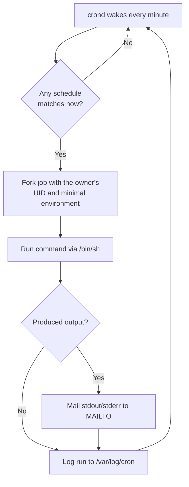

# Cron Jobs in Linux

## Overview

A **cron job** is a scheduled task on Linux and other Unix-like systems that automates commands or scripts to run at fixed intervals or specific times. Scheduling is handled by the **cron daemon** (`crond`), a long-running background service that wakes every minute, reads each user's *crontab* (cron table) plus the system-wide cron files, and executes any job whose schedule matches the current time.

Cron is the backbone of routine automation on a server — backups, log rotation, patching, monitoring, and cleanup all typically run under cron. Because cron jobs run unattended (often as `root`), they are also a well-known persistence and privilege-escalation vector, so they deserve the same review discipline as any other privileged code path.

> [!NOTE]
> On RHEL/CentOS the service and package are named `crond`/`crontabs`; on Debian/Ubuntu they are `cron`/`cron`. The examples below use the RHEL names — substitute as appropriate for your distribution.

## Concepts

### The Five Time Fields

A crontab entry is five time-and-date fields followed by the command to run:

```text
* * * * * command_to_execute
| | | | |
| | | | +----- Day of week   (0 - 7)  (Sunday = 0 or 7)
| | | +------- Month         (1 - 12)
| | +--------- Day of month  (1 - 31)
| +----------- Hour          (0 - 23)
+------------- Minute        (0 - 59)
```

| Field | Allowed values | Meaning |
|-------|----------------|---------|
| Minute | `0–59` | Minute of the hour |
| Hour | `0–23` | Hour of the day (24-hour clock) |
| Day of month | `1–31` | Calendar day |
| Month | `1–12` or `jan`–`dec` | Month |
| Day of week | `0–7` or `sun`–`sat` | Weekday (`0` and `7` both mean Sunday) |

### Operators

| Operator | Example | Meaning |
|----------|---------|---------|
| `*` | `* * * * *` | Every valid value (wildcard) |
| `,` | `1,10,15 * * * *` | A list of specific values |
| `-` | `1-10 * * * *` | An inclusive range |
| `/` | `*/10 * * * *` | Step values (every *n*th) |

### Special Schedule Strings

| String | Equivalent | Runs |
|--------|------------|------|
| `@reboot` | — | Once, at system startup |
| `@yearly` / `@annually` | `0 0 1 1 *` | Once a year |
| `@monthly` | `0 0 1 * *` | First of every month |
| `@weekly` | `0 0 * * 0` | Every Sunday |
| `@daily` / `@midnight` | `0 0 * * *` | Every day at midnight |
| `@hourly` | `0 * * * *` | Top of every hour |

### How Cron Selects and Runs Jobs



## Installation and Service Management

### Checking if Cron is Installed

- Before using cron, ensure it is installed:

```bash
rpm -qa | grep cron
```

```bash
rpm -qa | grep crontabs
```

- If not installed:

```bash
yum install crontabs
```

- Verify the installation and inspect package metadata:

```bash
rpm -qi crontabs
```

```bash
rpm -ql crontabs
```

```bash
rpm -qc crontabs
```

```bash
rpm -qd crontabs
```

### Managing the Cron Service

- Enable and start the cron service:

```bash
systemctl enable crond
```

```bash
systemctl start crond
```

```bash
systemctl status crond
```

> [!TIP]
> Use `systemctl enable --now crond` to enable at boot and start immediately in a single command.

## Cron Directories

Cron configuration is spread across several files and directories under `/etc/`:

```bash
ls -lh /etc/ | grep cron
```

```bash
ls -1 /etc/cron*
```

You'll typically see:

```text
/etc/cron.deny
/etc/crontab
/etc/cron.d/
/etc/cron.hourly/
/etc/cron.daily/
/etc/cron.weekly/
/etc/cron.monthly/
```

### System-Wide Cron Directories

Linux systems provide predefined directories for scheduling jobs at common intervals without manually editing the crontab file. These directories are driven by `run-parts`, which executes every executable script inside a directory.

| Directory | Frequency |
|---------------------|----------------------|
| `/etc/cron.hourly`  | Runs every hour      |
| `/etc/cron.daily`   | Runs once per day    |
| `/etc/cron.weekly`  | Runs once per week   |
| `/etc/cron.monthly` | Runs once per month  |

> [!IMPORTANT]
> Scripts placed in these directories must be **executable** and, on many distributions, must have **no file extension** (e.g. `log_sync`, not `log_sync.sh`) — `run-parts` skips files whose names contain a `.`.

#### `/etc/cron.hourly`

- Contains scripts that run once every hour.
- The execution time is controlled by `/etc/cron.d/0hourly` or system cron settings.
- Any executable script placed here runs automatically each hour.

Example — a script to sync logs every hour:

```bash
mkdir -p /backup/logs/
```

```bash
vim /etc/cron.hourly/log_sync
```

```bash
#!/bin/bash
rsync -av /var/log/ /backup/logs/
```

Save this script as `/etc/cron.hourly/log_sync` and make it executable:

```bash
chmod +x /etc/cron.hourly/log_sync
```

#### `/etc/cron.daily`

- Contains scripts that run once per day.
- The default execution time is usually early morning (e.g. 3:00 AM), but it can vary by system.
- Common tasks include system updates, log rotation, and database backups.

Example — a script to clean temporary files daily:

```bash
vim /etc/cron.daily/clean_tmp
```

```bash
#!/bin/bash
find /tmp -type f -mtime +7 -delete
```

Save this script as `/etc/cron.daily/clean_tmp` and make it executable:

```bash
chmod +x /etc/cron.daily/clean_tmp
```

#### `/etc/cron.weekly`

- Scripts in this directory run once per week.
- The default execution time is usually Sunday at 4:00 AM, but this depends on system settings.
- Weekly tasks may include full system backups, package updates, or maintenance scripts.

Example — a script to create a weekly system backup:

```bash
vim /etc/cron.weekly/system_backup
```

```bash
#!/bin/bash
tar -czf /backup/system_backup_$(date +\%F).tar.gz /home /etc /var
```

Save this script as `/etc/cron.weekly/system_backup` and make it executable:

```bash
chmod +x /etc/cron.weekly/system_backup
```

#### `/etc/cron.monthly`

- Scripts in this directory run once per month.
- The default execution time is usually the first day of the month at 5:00 AM.
- Suitable for long-term maintenance tasks such as database cleanup, report generation, or software updates.

Example — a script to generate a monthly user activity report:

```bash
vim /etc/cron.monthly/user_report
```

```bash
#!/bin/bash
cat /var/log/secure | grep password > /backup/user_activity_$(date +\%Y-%m).log
```

Save this script as `/etc/cron.monthly/user_report` and make it executable:

```bash
chmod +x /etc/cron.monthly/user_report
```

- Inspect all cron directories at once:

```bash
 ls -lh /etc/cron*
```

### Manually Running Cron Scripts

These directories are controlled by `run-parts`, which executes all scripts inside a directory. You can trigger them by hand for testing:

```bash
run-parts /etc/cron.hourly
```

```bash
run-parts /etc/cron.daily
```

```bash
run-parts /etc/cron.weekly
```

```bash
run-parts /etc/cron.monthly
```

To view or edit specific cron jobs, navigate to these directories:

```bash
cd /etc/cron.hourly
```

```bash
cd /etc/cron.daily
```

```bash
cd /etc/cron.weekly
```

```bash
cd /etc/cron.monthly
```

Check execution logs using:

```bash
cat /var/log/cron
```

> [!NOTE]
> Modify the default execution times in `/etc/crontab` (or `/etc/anacrontab`) if the built-in schedule does not fit your maintenance window.

## Configuration

### The System Crontab (`/etc/crontab`)

- List the configuration files owned by the `crontabs` package:

```bash
rpm -qc crontabs
```

- Edit the system-wide crontab file:

```bash
vim /etc/crontab
```

Unlike a user crontab, the system crontab has an extra **user-name** field between the schedule and the command:

```bash
SHELL=/bin/bash
PATH=/sbin:/bin:/usr/sbin:/usr/bin
MAILTO=root

# For details see man 4 crontabs

# Example of job definition:
# .---------------- minute (0 - 59)
# |  .------------- hour (0 - 23)
# |  |  .---------- day of month (1 - 31)
# |  |  |  .------- month (1 - 12) OR jan,feb,mar,apr ...
# |  |  |  |  .---- day of week (0 - 6) (Sunday=0 or 7) OR sun,mon,tue,wed,thu,fri,sat
# |  |  |  |  |
# *  *  *  *  * user-name  command to be executed
*/2 * * * * root rm -rf /tmp/*
```

- For manual reference:

```bash
man crontab
```

- Online crontab scheduling reference: [Crontab Guru](https://crontab.guru/)

### Cron Environment

Cron runs jobs with a minimal, non-interactive environment — **not** your login shell environment. This is the single most common source of "works on the command line but fails in cron" bugs.

- Absolute paths are required (`/usr/bin/php`, not just `php`).
- Set environment variables at the top of the crontab:

```bash
SHELL=/bin/bash
PATH=/sbin:/bin:/usr/sbin:/usr/bin
MAILTO=root
```

## Commands

### Viewing and Editing Crontab

- List the current user's cron jobs:

```bash
crontab -l
```

```bash
crontab -l -u username
```

- Edit the current user's crontab:

```bash
crontab -e
```

- Edit another user's crontab:

```bash
crontab -e -u username
```

- Remove all jobs:

```bash
crontab -r
```

```bash
crontab -r -u username
```

### Managing User Cron Jobs (Examples with `armour`)

- List another user's crontab:

```bash
crontab -l -u armour
```

- Edit another user's crontab:

```bash
crontab -e -u armour
```

- Remove all cron jobs for another user:

```bash
crontab -r -u armour
```

> [!WARNING]
> `crontab -r` immediately deletes the **entire** crontab with no confirmation, and it sits right next to `crontab -e` on the keyboard. Use `crontab -l > backup.cron` before editing, and prefer `crontab -e` over `-r`.

## Examples

### Cron Job Scheduling Reference

| Schedule                | Cron Expression   | Example Command                          |
|--------------------------|------------------|------------------------------------------|
| Every minute             | `* * * * *`      | `echo "Runs every minute" >> /tmp/cron.log` |
| First 10 min of hour     | `1-10 * * * *`   | `echo "Runs 1–10 min of every hour"`     |
| Every 2 hours at :05     | `5 */2 * * *`    | `echo "Every 2 hours at :05"`            |
| Specific minutes         | `1,10,15,35 * * * *` | `echo "Runs at 1,10,15,35 min"`     |
| Daily 2:30 AM            | `30 2 * * *`     | `/path/to/backup.sh`                     |
| Sundays 3:00 AM          | `0 3 * * 0`      | `rm -rf /tmp/*`                          |
| Every 10 min             | `*/10 * * * *`   | `df -h > /var/log/disk_usage.log`        |
| 1st of month midnight    | `0 0 1 * *`      | `php /path/to/script.php`                |
| Weekdays 9 AM            | `0 9 * * 1-5`    | `/path/to/weekday_job.sh`                |

### Common Example Jobs

- Run a script at 2:30 AM every day:

```bash
30 2 * * * /path/to/backup_script.sh
```

- Clear the `/tmp/` folder every Sunday at 3:00 AM:

```bash
0 3 * * 0 rm -rf /tmp/*
```

- Check disk usage every 10 minutes and log it:

```bash
*/10 * * * * df -h > /var/log/disk_usage.log
```

- Run a PHP script on the 1st of every month at midnight:

```bash
0 0 1 * * php /path/to/script.php
```

### System Crontab Job Sets

- Run the hourly jobs from the system crontab:

```bash
SHELL=/bin/bash
PATH=/sbin:/bin:/usr/sbin:/usr/bin
MAILTO=root
01 * * * * root run-parts /etc/cron.hourly
```

- Example of multiple scheduled jobs (note the user-name field):

```bash
SHELL=/bin/bash
PATH=/sbin:/bin:/usr/sbin:/usr/bin
MAILTO=root

10 10 *  *  * root clamscan --remove -r /opt/
20 18 *  *  6 root yum update
*/5 * *  *  * root rm -rf /tmp/*
*/4 * *  *  * armour cp -vr /var/log/* /tmp/
*/10 * * *  * root killall ssh
* * * * * armour tar -cvf /tmp/$(date "+\%d-\%m-\%Y-\%H-\%M").tar /home/armour
@reboot armour tar -cvf /tmp/$(date +"\%F-\%H-\%M").tar /home/armour/
```

### Field-by-Field Explanations

#### 1. Every Minute

```bash
* * * * * command
```

- Runs every minute of every hour, every day.

```bash
* * * * * echo "This runs every minute" >> /tmp/cron_log.txt
```

#### 2. Every Minute from 1 Through 10

```bash
1-10 * * * * command
```

- Runs every minute from `1` through `10` of every hour.

```bash
1-10 * * * * echo "Running during first 10 minutes of every hour" >> /tmp/cron_log.txt
```

#### 3. Every 2nd Hour at Minute 5

```bash
5 0-23/2 * * * command
```

- Runs at minute `5` past every `2nd` hour (i.e., 12:05 AM, 2:05 AM, 4:05 AM, ...).

```bash
5 0-23/2 * * * echo "Running at 5 minutes past every even hour" >> /tmp/cron_log.txt
```

#### 4. At Specific Minutes

```bash
1,10,15,35 * * * * command
```

- Runs at minute `1`, `10`, `15`, and `35` of every hour.

```bash
1,10,15,35 * * * * echo "This runs at specified minutes" >> /tmp/cron_log.txt
```

#### 5. Every Minute (Alternate Syntax)

```bash
*/1 * * * * command
```

- Runs every minute (same as `* * * * *`).

#### 6. Every Minute Past Hour 10

```bash
* 10 * * * command
```

- Runs every minute during the `10th hour` (i.e., 10:00 AM - 10:59 AM).

```bash
* 10 * * * echo "Running every minute from 10:00 AM to 10:59 AM" >> /tmp/cron_log.txt
```

#### 7. Run a Backup Script Daily at 2:30 AM

```bash
30 2 * * * /path/to/backup_script.sh
```

- Executes `/path/to/backup_script.sh` daily at `2:30 AM`.

#### 8. Clear `/tmp/` Folder Every Sunday at 3:00 AM

```bash
0 3 * * 0 rm -rf /tmp/*
```

- Deletes all files inside `/tmp/` every Sunday at `3:00 AM`.

#### 9. Check Disk Usage Every 10 Minutes & Log It

```bash
*/10 * * * * df -h > /var/log/disk_usage.log
```

- Runs `df -h` (disk usage report) every `10` minutes and logs the output to `/var/log/disk_usage.log`.

#### 10. Run a PHP Script on the 1st of Every Month at Midnight

```bash
0 0 1 * * php /path/to/script.php
```

- Executes a PHP script on the `1st` of every month at `12:00 AM`.

## Working with Date and Time in Cron Jobs

Timestamped filenames are a common pattern in cron-driven backups. Build them with the `date` command.

- Fetch the current date and time:

```bash
date
```

- Format date output:

```bash
date "+%F"
```

```bash
date "+%F-%H-%M"
```

```bash
date "+%d-%m-%Y-%H-%M"
```

```bash
date "+%H-%M-%d-%m-%Y"
```

- Create files with timestamped names:

```bash
touch `date "+%d-%m-%Y-%H-%M"`
```

```bash
touch `date "+%d-%m-%Y-%H-%M-%S"`
```

- Archive files with timestamps:

```bash
tar -cvf /tmp/`date "+%d-%m-%Y-%H-%M"`.tar /home/armour
```

```bash
tar -cvf /tmp/`date "+\%d-\%m-\%Y-\%H-\%M"`.tar /home/armour/
```

> [!IMPORTANT]
> Inside a crontab, the percent sign `%` is special — it is interpreted as a newline. Any `%` in a command (such as `date` format specifiers) **must** be escaped as `\%`, which is why the crontab examples above use `\%F`, `\%d`, and so on.

## Monitoring and Debugging

### Monitoring the Cron Service

- Check the status of the cron service:

```bash
systemctl status crond.service
```

- View active cron files in `/etc`:

```bash
ls -lh /etc/ | grep cron
```

### Cron Logs

- View logs:

```bash
cat /var/log/cron
```

- Monitor cron activity in real time:

```bash
tail -f /var/log/cron
```

> [!NOTE]
> **📸 Screenshot**
> _Capture: Terminal running `tail -f /var/log/cron` showing timestamped CROND lines as scheduled jobs start, run their command, and finish_

## Cron vs. Anacron

| Feature | `cron` | `anacron` |
|---------|--------|-----------|
| Granularity | Down to the minute | Daily / weekly / monthly only |
| Missed jobs | **Skipped** if the system was powered off at the scheduled time | **Caught up** on the next boot |
| Best for | Always-on servers | Laptops / desktops that are not on 24×7 |

- **Cron** skips jobs if the system is off at the scheduled time.
- **Anacron** ensures daily/weekly/monthly jobs still run after the system restarts, making it ideal for machines that are not always powered on.

## Best Practices

- Always use **absolute paths** for both commands and files — cron's `PATH` is minimal.
- Redirect output explicitly (`>> /path/log 2>&1`) so failures are captured rather than silently mailed or lost.
- Back up a crontab before editing: `crontab -l > ~/crontab.bak`.
- Test the command interactively first, then schedule it; validate the schedule expression with [Crontab Guru](https://crontab.guru/).
- Keep job scripts small, idempotent, and logged, so a missed or double run does no harm.
- On always-on servers prefer cron; on intermittently powered machines pair it with anacron so maintenance jobs are not skipped.

## Security Considerations

- **Restrict who may schedule jobs** with the allow/deny lists in `/etc/`:
  - `cron.allow` → users **allowed** to use cron. If it exists, only listed users may create jobs.
  - `cron.deny` → users **denied** from using cron (used only when `cron.allow` is absent).
- Cron jobs frequently run as `root`. A **world-writable script** referenced by a root cron job, or a writable `/etc/cron.*` directory, is a classic privilege-escalation path — audit ownership and permissions (`root:root`, non-world-writable) on every scheduled script.
- During incident response, enumerate persistence: `crontab -l` for every user, plus `/etc/crontab`, `/etc/cron.d/`, and all `/etc/cron.*` directories. Attacker-planted `@reboot` or high-frequency jobs are a common re-entry mechanism.
- Beware destructive scheduled commands (`rm -rf /tmp/*`, `killall ssh`): a bad path or an injected variable in a privileged job can wipe data or lock you out.
- Review `/var/log/cron` for jobs you do not recognize, especially those writing to `/tmp` or fetching remote content.

## Troubleshooting

| Symptom | Likely Cause | First Check |
|---------|--------------|-------------|
| Job never runs | `crond` not running / not enabled | `systemctl status crond` |
| Runs manually, fails in cron | Minimal `PATH` / relative paths | Use absolute paths; log `2>&1` |
| `%` in command truncates the job | Unescaped percent sign | Escape as `\%` in the crontab |
| Script in `/etc/cron.daily` ignored | Not executable or has a `.` in name | `chmod +x`; remove extension |
| No output, no error | stdout/stderr mailed to `MAILTO` | Check local mail or add explicit redirection |
| Missed while powered off | Using cron on a non-24×7 host | Use `anacron` for daily/weekly jobs |

## References

- `man crontab`, `man 5 crontab`, `man 8 cron`, `man anacron`, `man run-parts`
- [Crontab Guru](https://crontab.guru/) — interactive schedule-expression tester

## Related

- [Systemd-Timers-in-Linux](Systemd-Timers-in-Linux.md) — modern, dependency-aware alternative to cron scheduling.
- [Running-Custom-Scripts-on-Shutdown-Boot-Login-and-Logout-with-Systemd](Running-Custom-Scripts-on-Shutdown-Boot-Login-and-Logout-with-Systemd.md) — other ways to trigger scripts around lifecycle events.
- [Service-Management-in-Linux](Service-Management-in-Linux.md) — manage the `crond` daemon and other services.
- [Process-Management-in-Linux](Process-Management-in-Linux.md) — inspect and control the processes cron spawns.
- Privilege-Escalation — writable cron jobs and scripts as a root-escalation vector.
- [Linux Administration & Server Hardening](../Readme.md) — Linux administration & server hardening hub.
