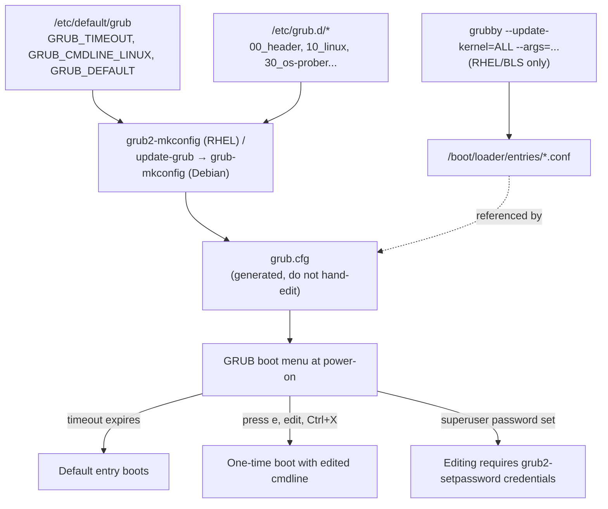

# GRUB2 Bootloader Configuration

GRUB2 (GRand Unified Bootloader, version 2) is the default boot loader on RHEL-family and Debian-family Linux, responsible for presenting the boot menu, loading the kernel and initramfs, and assembling the kernel command line — this note covers its configuration files, how to regenerate them safely across BIOS/UEFI and distributions, and how to edit kernel parameters persistently or for a single boot.

## Overview

| Component | Role |
|---|---|
| `/etc/default/grub` | Human-edited defaults: timeout, default entry, kernel command-line additions. Source of truth for regeneration. |
| `/etc/grub.d/*` | Executable shell fragments (numbered, e.g. `10_linux`, `30_os-prober`) that `grub2-mkconfig`/`grub-mkconfig` runs in order to *build* `grub.cfg`. |
| `grub.cfg` | The generated, machine-read config GRUB actually boots from. **Never hand-edit** — it is overwritten on every regeneration. |
| `grubby` | RHEL-family tool that edits kernel command-line args and the default kernel directly in the Boot Loader Specification (BLS) entries, without needing a full `grub2-mkconfig` run. |
| `grub2-set-default` / `grub-set-default` | Persist which menu entry boots by default. |
| `grub2-reboot` / `grub-reboot` | Boot a specific entry **once**, then revert to the saved default. |

> [!NOTE]
> On CentOS Stream 9/10 and RHEL 8+, GRUB uses **BLS (Boot Loader Specification)**: each kernel gets its own entry file under `/boot/loader/entries/*.conf`, and `grub.cfg` mostly just points GRUB at those entries. This is why `grubby` — which edits BLS entries directly — is the preferred tool for day-to-day kernel-arg changes on these systems, while `grub2-mkconfig` is reserved for bigger changes (timeout, menu layout, new `/etc/default/grub` settings). Debian does not use BLS; `update-grub` remains the single mechanism for every change there.

## How It Works



## Configuration

### Step 1: Edit the Defaults File

`/etc/default/grub` is identical in *format* on both families; only the generated output path differs later.

> Example:

```bash
vim /etc/default/grub
```

```bash
GRUB_TIMEOUT=5
GRUB_DEFAULT=saved
GRUB_CMDLINE_LINUX="crashkernel=auto rhgb quiet net.ifnames=0"
GRUB_DISABLE_RECOVERY="true"
```

| Directive | Meaning |
|---|---|
| `GRUB_TIMEOUT=5` | Seconds the menu waits before auto-booting the default entry. `0` skips the menu entirely (hold Shift/Esc during POST to force it). |
| `GRUB_DEFAULT=saved` | Boot whatever entry was last persisted with `grub2-set-default`/`grub-set-default`, instead of always entry `0`. |
| `GRUB_CMDLINE_LINUX="..."` | Extra parameters appended to **every** kernel's command line when `grub.cfg` is next regenerated. |
| `GRUB_DISABLE_RECOVERY` | RHEL-family only: when `"true"`, suppresses generation of the recovery-mode menu entries. |

### Step 2: Regenerate the Configuration

Editing `/etc/default/grub` or `/etc/grub.d/*` does nothing until you regenerate `grub.cfg`. The **output path is the only thing that differs** between BIOS and UEFI, and between distro families.

> Example — CentOS Stream / RHEL family, BIOS (legacy) boot:

```bash
grub2-mkconfig -o /boot/grub2/grub.cfg
```

> Example — CentOS Stream / RHEL family, UEFI boot:

```bash
grub2-mkconfig -o /boot/efi/EFI/centos/grub.cfg
```

> Example — Debian (BIOS or UEFI, same output file either way):

```bash
update-grub
```

> [!TIP]
> `update-grub` on Debian is a thin wrapper around `grub-mkconfig -o /boot/grub/grub.cfg`; the two are interchangeable, but `update-grub` is the idiomatic form. On RHEL-family systems the symlinks `/etc/grub2.cfg` (BIOS) and `/etc/grub2-efi.cfg` (UEFI) point at the real `grub.cfg`, so `grub2-mkconfig -o /etc/grub2.cfg` also works and avoids hard-coding the boot-mode path.

## Commands

### Persistent Kernel Command-Line Edits with `grubby`

On RHEL-family (BLS) systems, use `grubby` to change boot parameters for one or all installed kernels without a full config regeneration.

```bash
grubby --update-kernel=ALL --args="console=ttyS0,115200"
```

```bash
grubby --update-kernel=ALL --remove-args="rhgb quiet"
```

```bash
grubby --info=ALL
```

| Flag | Effect |
|---|---|
| `--update-kernel=ALL` | Target every installed kernel's BLS entry (or `/boot/vmlinuz-<version>` for one specific kernel). |
| `--args="..."` | Append the given parameters to the kernel command line. |
| `--remove-args="..."` | Strip the given parameters from the kernel command line. |
| `--default-kernel` | Print the path of the kernel that would boot by default. |
| `--info=ALL` | List every BLS entry with its current args — the fastest way to verify a change applied. |

On Debian there is no `grubby`; persist command-line changes by editing `GRUB_CMDLINE_LINUX` in `/etc/default/grub` and running `update-grub` (Step 1–2 above).

### Setting the Default Boot Entry

```bash
grub2-set-default 0
```

```bash
grub2-editenv list
```

Debian's equivalent tool is `grub-set-default`, which writes the same kind of environment block to `/boot/grub/grubenv`:

```bash
grub-set-default 0
```

`grub2-editenv list` (Debian: `grub-editenv /boot/grub/grubenv list`) prints the currently saved entry — useful to confirm a change took effect, especially when `GRUB_DEFAULT=saved` is set in `/etc/default/grub`.

### One-Time Boot Without Changing the Default

To boot a non-default kernel or recovery entry **once**, without permanently altering `GRUB_DEFAULT`:

```bash
grub2-reboot 1
```

```bash
reboot
```

Debian: `grub-reboot 1` followed by `reboot`. The saved-default mechanism automatically reverts to the previous default after that single boot completes.

### Editing an Entry Interactively at the GRUB Menu

For a truly ad-hoc, non-persisted change (e.g. testing a kernel argument, or emergency recovery):

1. At the GRUB menu, use the arrow keys to highlight the entry, then press `e` to edit it.
2. Locate the `linux`/`linux16`/`linuxefi` line and append or modify parameters directly.
3. Press `Ctrl+X` (or `F10`) to boot with the edited line **once**. Nothing is written to disk — the next reboot uses the unmodified `grub.cfg`.

> [!NOTE]
> **📸 Screenshot**
> _Capture: GRUB menu in edit mode (`e` pressed) showing the `linux` line with a parameter such as `systemd.unit=rescue.target` appended at the end, cursor positioned after it_

## Examples

Verifying that a `grubby` change actually landed in the running kernel's `/proc/cmdline`:

```bash
grubby --update-kernel=ALL --args="net.ifnames=0"
```

```bash
cat /proc/cmdline
```

Sample output after reboot:

```text
BOOT_IMAGE=(hd0,gpt2)/vmlinuz-5.14.0-570.el9.x86_64 root=/dev/mapper/cs-root ro crashkernel=auto rhgb quiet net.ifnames=0
```

## GRUB2 File Paths by Distribution

| Distribution / boot mode | `grub.cfg` location | Regenerate with | Defaults file | Symlink helper |
|---|---|---|---|---|
| CentOS Stream 10 / RHEL family — BIOS | `/boot/grub2/grub.cfg` | `grub2-mkconfig -o /boot/grub2/grub.cfg` | `/etc/default/grub` | `/etc/grub2.cfg` |
| CentOS Stream 10 / RHEL family — UEFI | `/boot/efi/EFI/centos/grub.cfg` (RHEL proper: `/boot/efi/EFI/redhat/grub.cfg`) | `grub2-mkconfig -o /boot/efi/EFI/centos/grub.cfg` | `/etc/default/grub` | `/etc/grub2-efi.cfg` |
| Debian 12 — BIOS | `/boot/grub/grub.cfg` | `update-grub` | `/etc/default/grub` | — |
| Debian 12 — UEFI | `/boot/grub/grub.cfg` (chainloaded via `/boot/efi/EFI/debian/grubx64.efi`) | `update-grub` | `/etc/default/grub` | — |

## Best Practices

- **Never hand-edit `grub.cfg`.** Any manual change is silently discarded the next time `grub2-mkconfig`/`update-grub` runs (kernel update, package upgrade). Edit `/etc/default/grub` or add a fragment under `/etc/grub.d/` instead.
- **Prefer `grubby` over regeneration on RHEL-family systems** for simple kernel-argument tweaks — it is faster, targets exactly the kernels you specify, and does not risk mangling other menu content.
- **Always regenerate to the correct output path.** Running the BIOS command on a UEFI system (or vice versa) silently updates the wrong file; the boot menu will not reflect your change.
- **Use `GRUB_DEFAULT=saved` with `grub2-set-default`** rather than hard-coding a numeric index in `GRUB_CMDLINE_LINUX`/`GRUB_DEFAULT` — indices shift as kernels are added and removed.
- **Test risky cmdline changes with a one-time edit (`e` at the menu) or `grub2-reboot`** before persisting them with `grubby --args` or `/etc/default/grub`, so a bad parameter doesn't cost you a full recovery cycle.
- **Keep a serial/rescue entry available** (`console=ttyS0` or similar) on headless/remote servers before you experiment with the default kernel command line.

## Security Considerations

> [!WARNING]
> By default, anyone with physical or console access to the GRUB menu can press `e`, edit the kernel command line (e.g. append `init=/bin/bash` or `rd.break`), and obtain a root shell with no authentication — the exact technique used for legitimate password recovery. If GRUB is not password-protected, boot-time access is equivalent to root access.

- **Password-protect menu editing** with `grub2-setpassword` (RHEL-family) so kernel-line edits and non-default boot entries require a superuser credential — see [Reset-Root-Password-and-Protect-GRUB-Boot-Loader](../Security-Firewall-and-Monitoring/Reset-Root-Password-and-Protect-GRUB-Boot-Loader.md) for the full setup, the alternative `grub2-mkpasswd-pbkdf2` + `/etc/grub.d/10_linux` method, and why hand-edited `grub.cfg` passwords don't survive regeneration.
- **Kernel command-line parameters are not secrets.** Never pass credentials or tokens via `GRUB_CMDLINE_LINUX` — they are readable by any local user via `/proc/cmdline` and are logged in `grub.cfg`.
- **`quiet`/`rhgb` hide kernel boot messages but are not a security control** — removing them (for debugging) does not itself weaken the system, but re-add them for production to avoid leaking driver/hardware details on a shared console.
- **Combine with disk and console hardening.** A GRUB password stops menu tampering but not booting from external media or reading the disk directly; pair it with a BIOS/UEFI supervisor password, boot-order lock, and LUKS full-disk encryption.

## Troubleshooting

| Symptom | Likely cause | Resolution |
|---|---|---|
| Edited `/etc/default/grub` but boot behavior unchanged | Config not regenerated | Run `grub2-mkconfig -o <correct-path>` (RHEL) or `update-grub` (Debian) — see the file-path table above |
| Regeneration succeeds but menu is unchanged | Regenerated the wrong path (BIOS vs UEFI) | Confirm boot mode with `[ -d /sys/firmware/efi ] && echo UEFI || echo BIOS`, then target the matching output file |
| `grubby --args` change not visible in `/proc/cmdline` | Edited the wrong kernel, or system isn't BLS-based | Use `grubby --info=ALL` to confirm the entry; on non-BLS systems use `/etc/default/grub` + `grub2-mkconfig` instead |
| Hand edits to `grub.cfg` keep disappearing | `grub.cfg` is regenerated on every kernel install | Move the change into `/etc/default/grub` or a custom `/etc/grub.d/` fragment |
| Menu no longer appears at boot | `GRUB_TIMEOUT=0` with no override | Hold `Shift` (BIOS) or `Esc` (UEFI) during POST to force the menu, then fix `GRUB_TIMEOUT` |
| Cannot edit entries at the menu | GRUB superuser password set via `grub2-setpassword` | Enter the configured GRUB credentials, or see [Reset-Root-Password-and-Protect-GRUB-Boot-Loader](../Security-Firewall-and-Monitoring/Reset-Root-Password-and-Protect-GRUB-Boot-Loader.md) to remove/reset `/boot/grub2/user.cfg` |

## References

- `man grub2-mkconfig`, `man grub-mkconfig`, `man grubby`, `man grub2-set-default`
- [GNU GRUB Manual](https://www.gnu.org/software/grub/manual/grub/grub.html)
- [Red Hat Documentation — Managing, monitoring, and updating the kernel](https://docs.redhat.com/en/documentation/red_hat_enterprise_linux)
- [Debian Wiki — GRUB2](https://wiki.debian.org/GRUB2)
- [Boot Loader Specification](https://uapi-group.org/specifications/specs/boot_loader_specification/)

## Related

- [Reset-Root-Password-and-Protect-GRUB-Boot-Loader](../Security-Firewall-and-Monitoring/Reset-Root-Password-and-Protect-GRUB-Boot-Loader.md) — using GRUB edit access for root recovery, and locking it down with `grub2-setpassword`
- [Linux-Boot-Process](Linux-Boot-Process.md) — where GRUB fits in the overall firmware-to-userspace boot sequence
- [Systemd-Targets-and-Rescue-Mode](Systemd-Targets-and-Rescue-Mode.md) — the `systemd.unit=` targets you can pass via a one-time GRUB edit
- [Process, Service & Job Management](Readme.md) — systemd services and targets started after GRUB hands off to the kernel
- [Linux Administration & Server Hardening](../Readme.md)
