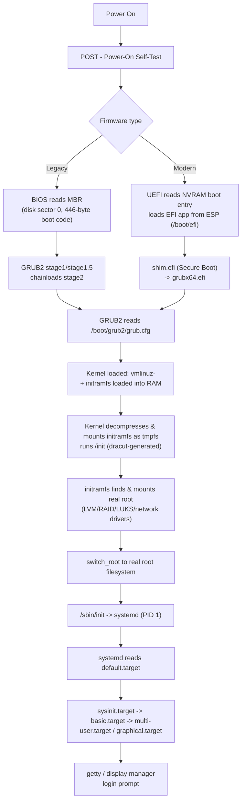

# Linux Boot Process

The Linux boot process is the deterministic chain of hand-offs — firmware, boot loader, kernel, initramfs, and finally `systemd` as PID 1 — that carries a machine from power-on to a running multi-user (or graphical) system; understanding each stage is essential for troubleshooting boot failures, hardening the boot chain, and passing RHCSA/LFCS/LPIC-1 boot-related objectives.

## Overview

| Stage | Component | Lives in | Hands off to |
|---|---|---|---|
| 1 | Firmware (BIOS or UEFI) | Motherboard NVRAM/flash | Boot loader |
| 2 | Boot loader (GRUB2 / systemd-boot) | MBR gap or EFI System Partition | Kernel + initramfs |
| 3 | Kernel + initramfs | `/boot` (compressed image loaded into RAM) | Real root filesystem |
| 4 | `systemd` (PID 1) | Real root filesystem (`/usr/lib/systemd/systemd`) | `default.target` |
| 5 | Target units | `/etc/systemd/system/` and `/usr/lib/systemd/system/` | Login prompt / display manager |

> [!NOTE]
> The boot chain differs at stage 1–2 depending on firmware type: legacy **BIOS** boots from the **MBR** (Master Boot Record) of the disk, while modern **UEFI** boots an EFI application from the **ESP** (EFI System Partition, a FAT32 partition typically mounted at `/boot/efi`). Everything from stage 3 onward is identical on both.

## Architecture



## Boot Stages in Detail

### 1. POST and Firmware

Power-On Self-Test (POST) initializes and checks hardware (CPU, RAM, buses) before handing control to a boot device.

- **BIOS/MBR:** firmware reads the first 446 bytes of the boot disk (the MBR boot code), which contains GRUB2's tiny **stage1**. Stage1 loads **stage1.5** from the unpartitioned space right after the MBR (the "MBR gap"), which in turn is large enough to understand the target filesystem and load full GRUB2 **stage2**.
- **UEFI/GPT:** firmware reads boot entries from NVRAM and executes a signed `.efi` binary directly from the **ESP**, a FAT32 partition (commonly `/boot/efi`, GPT partition type `EF00`). No MBR boot code is involved.

```bash
# Inspect the ESP and current UEFI boot entries (UEFI systems only)
efibootmgr -v
```

> Example:

```bash
lsblk -f | grep -i efi
```

```text
├─sda1 vfat   FAT32 EFI      1234-ABCD  /boot/efi
```

### 2. Boot Loader — GRUB2

GRUB2 (**GRand Unified Bootloader 2**) locates and reads its configuration, then loads the kernel and initramfs into memory and transfers control to the kernel.

| Distro | Config generator | Rendered config | ESP loader path |
|---|---|---|---|
| CentOS Stream 10 (RHEL-family) | `grub2-mkconfig` / `grubby` | `/boot/grub2/grub.cfg` (BIOS) or `/boot/efi/EFI/centos/grub.cfg` (UEFI) | `/boot/efi/EFI/centos/grubx64.efi` |
| Debian 12 | `update-grub` (wrapper for `grub-mkconfig`) | `/boot/grub/grub.cfg` | `/boot/efi/EFI/debian/grubx64.efi` |

```bash
# CentOS Stream 10 — regenerate GRUB2 config after a kernel/menu change
grub2-mkconfig -o /boot/grub2/grub.cfg
```

```bash
# Debian 12 — regenerate GRUB2 config after a kernel/menu change
update-grub
```

Full menu editing, kernel argument injection, and password-protecting the GRUB prompt are covered in [GRUB2-Bootloader-Configuration](GRUB2-Bootloader-Configuration.md) and [Reset-Root-Password-and-Protect-GRUB-Boot-Loader](../Security-Firewall-and-Monitoring/Reset-Root-Password-and-Protect-GRUB-Boot-Loader.md).

### 3. Kernel and initramfs

GRUB2 loads two files into RAM and jumps to the kernel entry point: the compressed kernel image (`vmlinuz-<version>`) and the **initramfs** (initial RAM filesystem, `initramfs-<version>.img` on RHEL-family or `initrd.img-<version>` on Debian).

> [!NOTE]
> **Why initramfs exists:** the kernel by itself doesn't know how to find or mount the real root filesystem if it sits behind LVM, software RAID, LUKS full-disk encryption, or a network share (iSCSI/NFS) — the drivers and userspace tools for those live in the initramfs, not compiled into the kernel image. The kernel mounts the initramfs as a temporary root (`tmpfs`), runs the `/init` script inside it, and that script's job is to assemble and mount the *real* root filesystem, then `switch_root` into it and exec the real `/sbin/init`. Once `switch_root` completes, the initramfs is discarded.

| Distro | initramfs builder | Rebuild command |
|---|---|---|
| CentOS Stream 10 | `dracut` | `dracut --force /boot/initramfs-$(uname -r).img $(uname -r)` |
| Debian 12 | `initramfs-tools` (`mkinitramfs`) | `update-initramfs -u -k $(uname -r)` |

```bash
# CentOS Stream 10 — rebuild the initramfs for the running kernel
dracut --force /boot/initramfs-$(uname -r).img $(uname -r)
```

```bash
# Debian 12 — rebuild the initramfs for the running kernel
update-initramfs -u -k $(uname -r)
```

```bash
# Inspect what dracut baked into an initramfs (both distros ship dracut's lsinitrd on RHEL; Debian uses lsinitramfs)
lsinitrd /boot/initramfs-$(uname -r).img | head -40
```

### 4. systemd as PID 1

After `switch_root`, the real `/sbin/init` (a symlink to `/usr/lib/systemd/systemd` on both distros) executes as **PID 1**. `systemd` mounts remaining filesystems, activates udev for device management, and starts pulling in unit dependency chains beginning at `sysinit.target` and `basic.target`.

### 5. default.target

`systemd` finally activates `default.target`, a symlink that determines the final boot state — typically `multi-user.target` (text/CLI, "runlevel 3" equivalent) or `graphical.target` (GUI, "runlevel 5" equivalent).

```bash
systemctl get-default
```

```bash
systemctl set-default multi-user.target
```

See [Systemd-Targets-and-Rescue-Mode](Systemd-Targets-and-Rescue-Mode.md) for the full target dependency tree, and [Service-Management-in-Linux](Service-Management-in-Linux.md) for managing the units targets pull in.

## UEFI Secure Boot

Secure Boot is a UEFI firmware feature that only executes boot binaries whose digital signature chains to a key trusted by the firmware (stored in the `PK`/`KEK`/`db` NVRAM variables), preventing unsigned or tampered boot code (e.g. bootkits) from running.

- Both CentOS Stream 10 and Debian 12 ship a Microsoft-signed **`shim.efi`** as the first-stage loader; shim then verifies and chainloads the distro-signed `grubx64.efi`, which in turn verifies and loads a signed kernel.
- Third-party kernel modules (DKMS, VirtualBox, Nvidia proprietary) are unsigned by default and will be refused when Secure Boot is enabled unless enrolled via **MOK** (Machine Owner Key).

```bash
# Check current Secure Boot state
mokutil --sb-state
```

```bash
# Enroll a custom signing key for out-of-tree kernel modules
mokutil --import mykey.der
```

## systemd-boot as an Alternative Loader

**systemd-boot** (formerly `gummiboot`) is a minimal UEFI-only boot manager shipped with `systemd`. Unlike GRUB2 it has no scripting language or BIOS/MBR support — it directly reads simple `.conf` loader entries from the ESP, which makes it faster to configure but limited to UEFI systems (common on Arch and some Fedora spins; not the default on RHEL-family or Debian server installs, which standardize on GRUB2).

```bash
# untested — installs systemd-boot to the ESP and registers it as the UEFI default
bootctl install
```

```bash
bootctl status
```

```bash
bootctl list
```

## Diagnostics

`systemd-analyze` breaks down exactly where boot time is spent and which units are on the critical path.

```bash
systemd-analyze
```

> Example output (format only — actual timings vary by hardware and services enabled):

```text
Startup finished in 3.212s (kernel) + 6.442s (initrd) + 8.955s (userspace) = 18.610s
graphical.target reached after 8.940s in userspace.
```

```bash
systemd-analyze blame
```

> Example output:

```text
6.442s initrd.img
5.395s NetworkManager.service
2.113s systemd-udev-settle.service
1.500s sshd.service
0.980s dbus.service
```

```bash
systemd-analyze critical-chain
```

> Example output:

```text
graphical.target @8.940s
└─multi-user.target @8.935s
  └─sshd.service @1.400s +150ms
    └─network.target @1.395s
      └─NetworkManager.service @6.395s +5.395s
        └─dbus.service @0.980s
```

`critical-chain` walks backward from the target and prints, for each unit, the time it was *reached* (`@`) and how long it took to *finish* initializing (`+`) — the longest chain is the actual bottleneck, not necessarily the slowest single unit shown by `blame`.

```bash
# Render a visual SVG timeline of the entire boot
systemd-analyze plot > /tmp/boot.svg
```

## GRUB2 vs systemd-boot

| Feature | GRUB2 | systemd-boot |
|---|---|---|
| Firmware support | BIOS/MBR **and** UEFI | UEFI only |
| Config format | Scripting language (`grub.cfg`) | Plain `.conf` loader entries |
| Filesystem drivers | Built-in (reads ext4/xfs/btrfs directly) | None needed — reads kernel/initrd straight from ESP |
| Default on | CentOS Stream 10, Debian 12, most server distros | Arch Linux, some minimal UEFI setups |
| Rescue/edit menu | Interactive, feature-rich | Minimal |

## Best Practices

- Keep at least one previous kernel + initramfs pair installed so a bad kernel update is recoverable from the GRUB menu.
- Regenerate the initramfs (`dracut` / `update-initramfs`) any time you change LVM, LUKS, or RAID layout under root — a stale initramfs is a common cause of "dracut emergency shell" boot failures.
- Password-protect the GRUB2 menu on physically accessible or multi-tenant hosts (see [Reset-Root-Password-and-Protect-GRUB-Boot-Loader](../Security-Firewall-and-Monitoring/Reset-Root-Password-and-Protect-GRUB-Boot-Loader.md)).
- Set `default.target` deliberately on servers (`multi-user.target`) to avoid pulling in an unneeded display manager.
- Run `systemd-analyze blame`/`critical-chain` after provisioning to catch slow-starting services (e.g. `NetworkManager-wait-online.service`) early.

## Security Considerations

> [!WARNING]
> Anyone with physical or virtual console access to an unprotected GRUB2 prompt can edit boot parameters (e.g. append `rd.break` or `init=/bin/bash`) to obtain a root shell **without credentials**. Treat GRUB2 as part of the trusted computing base, not just a menu.

- Set a GRUB2 superuser password (`grub2-setpassword` on RHEL-family, `grub-mkpasswd-pbkdf2` + `/etc/grub.d/40_custom` on Debian) so editing menu entries requires authentication.
- Leave Secure Boot enabled where the hardware supports it, and enroll MOK keys deliberately rather than disabling Secure Boot to work around a signing failure.
- Encrypt root/`/boot` (LUKS) on devices where physical theft is a realistic threat; recall the initramfs is what prompts for the LUKS passphrase, so it must be present and correctly configured.
- Restrict `/boot` and `/boot/efi` permissions and monitor them for unexpected file changes — a compromised initramfs or GRUB config is a durable, hard-to-detect persistence mechanism.
- Audit boot time regressions (`systemd-analyze blame`) as part of routine hygiene; an unexplained new slow unit can indicate an implanted service pulled in early in the target chain.

## Troubleshooting

| Symptom | Likely cause | Resolution |
|---|---|---|
| Drops to `dracut` emergency shell | initramfs missing driver/module for root device (LVM/LUKS/RAID) | Rebuild initramfs (`dracut --force` / `update-initramfs -u`) with correct modules; check `/etc/fstab` and `/etc/crypttab` |
| GRUB shows "error: no such device" | Stale UUID in `grub.cfg` after disk/partition change | Regenerate config (`grub2-mkconfig -o ...` / `update-grub`) |
| Boots to emergency/rescue target | A required mount (`/etc/fstab`) or service failed | `journalctl -xb`, fix the fstab entry or unit, then `systemctl default` |
| Secure Boot blocks custom kernel module | Module unsigned, no MOK enrolled | Sign module or enroll key with `mokutil --import` |
| Boot noticeably slower after update | New/slow unit on critical path | `systemd-analyze critical-chain` and `blame` to identify, then disable/defer the offending unit |
| Wrong default boot target (GUI on a headless server) | `default.target` misconfigured | `systemctl set-default multi-user.target` |

## References

- [Fedora/RHEL: dracut documentation](https://man7.org/linux/man-pages/man8/dracut.8.html)
- [systemd-analyze(1) man page](https://man7.org/linux/man-pages/man1/systemd-analyze.1.html)
- [systemd-boot(7) man page](https://man7.org/linux/man-pages/man7/systemd-boot.7.html)
- [GNU GRUB manual](https://www.gnu.org/software/grub/manual/grub/grub.html)
- [Debian Wiki: UEFI](https://wiki.debian.org/UEFI)
- [UEFI Secure Boot on RHEL documentation](https://man7.org/linux/man-pages/man8/mokutil.8.html)

## Related
- [GRUB2-Bootloader-Configuration](GRUB2-Bootloader-Configuration.md) — deep dive on GRUB2 menu editing and kernel parameters
- [Systemd-Targets-and-Rescue-Mode](Systemd-Targets-and-Rescue-Mode.md) — the target dependency chain `default.target` resolves into
- [Service-Management-in-Linux](Service-Management-in-Linux.md) — managing the units targets activate
- [Reset-Root-Password-and-Protect-GRUB-Boot-Loader](../Security-Firewall-and-Monitoring/Reset-Root-Password-and-Protect-GRUB-Boot-Loader.md) — securing the GRUB prompt and recovering root access
- [Process, Service & Job Management](Readme.md) — module index
- [Linux Administration & Server Hardening](../Readme.md)
